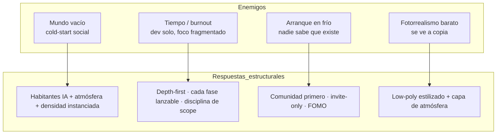
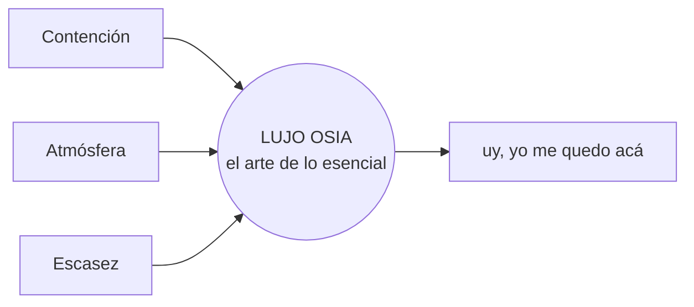
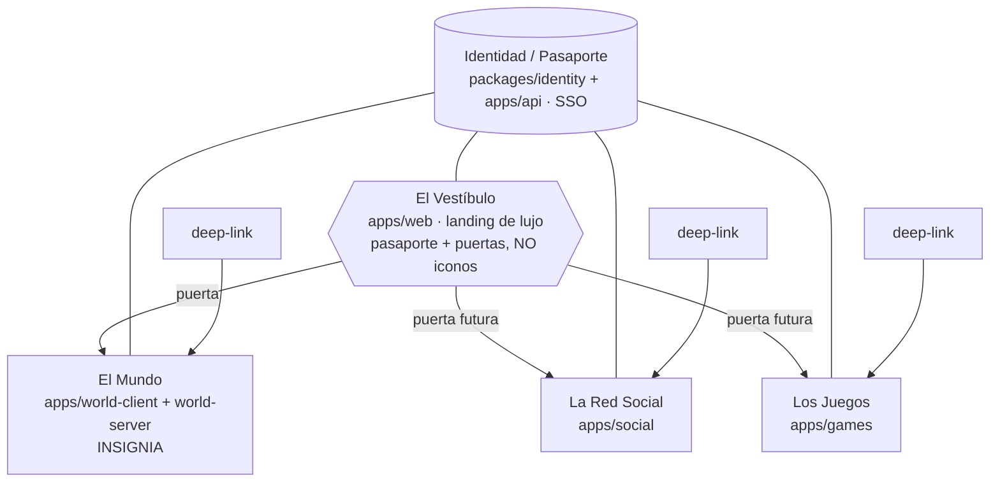
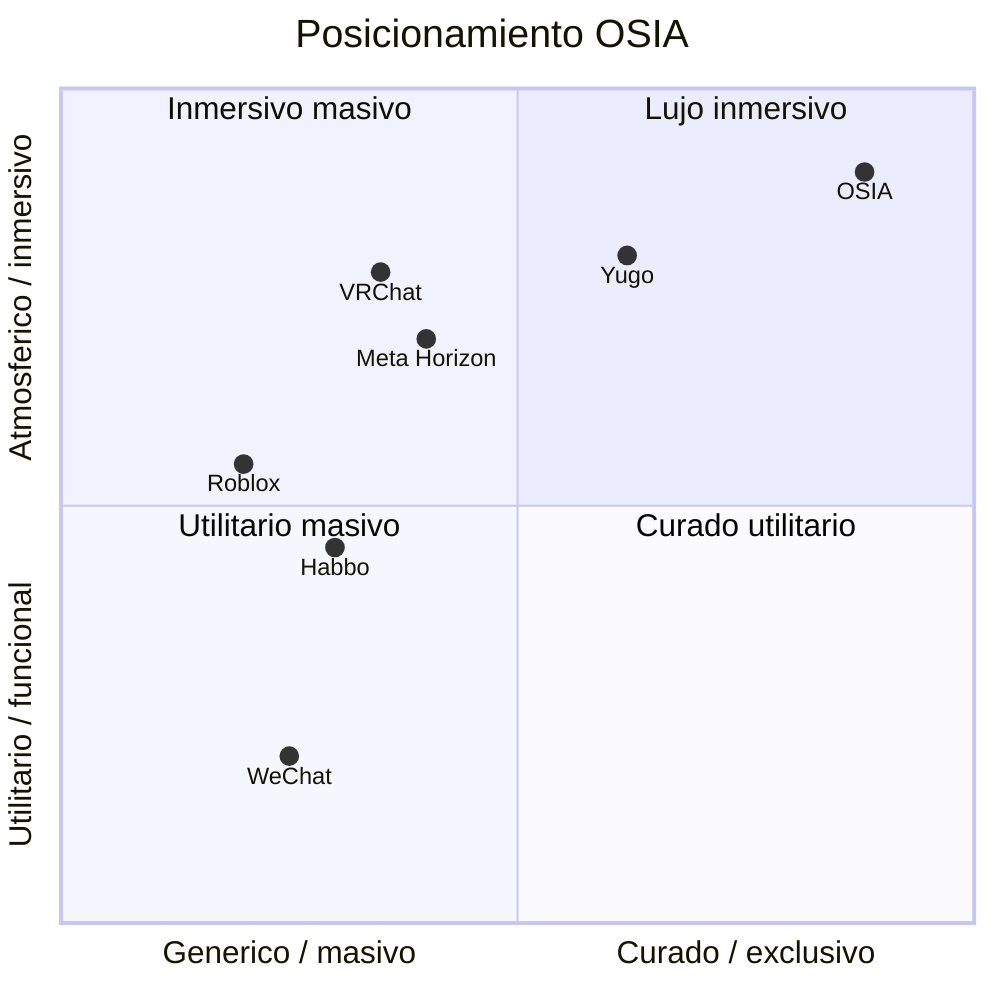
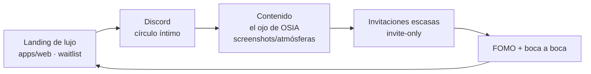
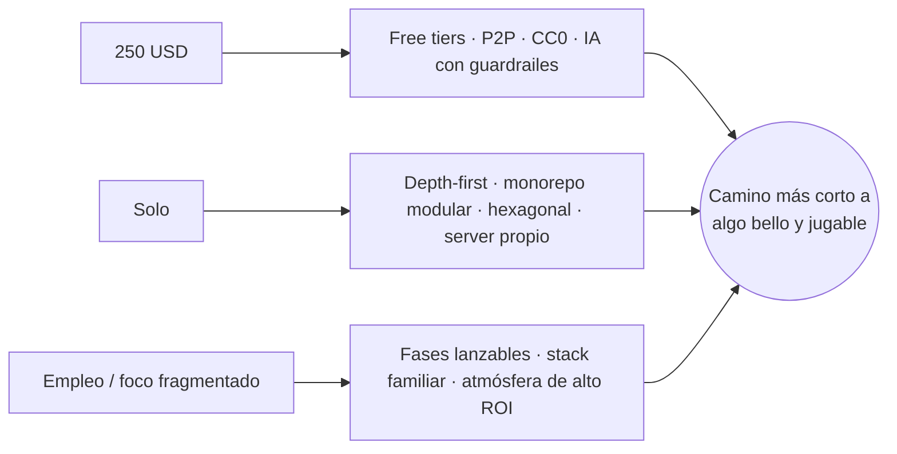

# Visión y Alcance — OSIA

> Propósito: Definir el PORQUÉ y el QUÉ de OSIA (problema y enemigos, north star, modelo de producto como ecosistema, alcance/anti-alcance, posicionamiento, GTM, modelo de negocio, métricas, riesgos y restricciones guía). | Estado: Borrador v1 | Fecha: 2026-06-19 | Parte del paquete de diseño OSIA.

---

## 0. Cómo leer este documento

Este es el documento **fundacional** del paquete de diseño OSIA. No describe *cómo* se construye (eso vive en los docs de arquitectura, datos, red, atmósfera y rendimiento), sino **por qué existe** y **qué es / qué no es**.

Regla de oro: **toda decisión técnica posterior debe poder rastrearse hasta una afirmación de este documento.** Si una decisión de ingeniería contradice la visión, gana la visión —o se actualiza la visión con un ADR explícito (ver [./adr/ADR-000-decisiones-abiertas.md](./adr/ADR-000-decisiones-abiertas.md)).

Estado real al escribir esto (honestidad ante todo): **la carpeta `OSIA/` está vacía salvo `/brand` y `/docs`.** Nada está construido. Esto es diseño, no documentación de algo existente.

Documentos hermanos (paquete de diseño):

| Doc | Tema |
|---|---|
| `00-vision-alcance.md` (este) | Por qué y qué. Norte, alcance, negocio, riesgos. |
| [./01-pilares-experiencia.md](./01-pilares-experiencia.md) | Pilares de experiencia: el sentimiento, el lujo, los pilares de juego. |
| [./02-marca-design-system.md](./02-marca-design-system.md) | Marca OSIA, paleta, tipografías, design system, El Vestíbulo. |
| [./03-arquitectura-sistema.md](./03-arquitectura-sistema.md) | Monorepo modular, apps, world-server, API hexagonal, hosting. |
| [./04-modelo-datos-er.md](./04-modelo-datos-er.md) | Entidades, bounded contexts, diagramas ER. |
| [./05-realtime-mundo-networking.md](./05-realtime-mundo-networking.md) | Protocolo binario, rooms, AOI, predicción/reconciliación, voz. |
| [./06-motor-atmosfera.md](./06-motor-atmosfera.md) | Motor de atmósfera server-authoritative, eventos efímeros. |
| [./07-habitantes-ia.md](./07-habitantes-ia.md) | NPCs de IA: diálogo, memoria (pgvector), guardarrailes de costo. |
| [./08-estrategia-rendimiento.md](./08-estrategia-rendimiento.md) | LOD, distant horizons, instancing, presupuestos. |
| [./09-seguridad-infra-costos.md](./09-seguridad-infra-costos.md) | Auth, RLS, rate-limit, runway de ~250 USD, observabilidad. |
| [./10-contratos-api-eventos.md](./10-contratos-api-eventos.md) | Contratos REST + catálogo de eventos WebSocket. |
| [./11-glosario-dominio.md](./11-glosario-dominio.md) | Lenguaje ubicuo (es-CO) y convenciones de nombres. |
| [./adr/ADR-000-decisiones-abiertas.md](./adr/ADR-000-decisiones-abiertas.md) | Decisiones abiertas/confirmadas con recomendación. |
| [./backlog/00-roadmap-overview.md](./backlog/00-roadmap-overview.md) | Roadmap de 6 fases + índice de los 52 sprints. |
| [./README.md](./README.md) | Índice maestro del paquete de diseño. |

---

## 1. El problema real y los enemigos

OSIA no nace de un hueco de mercado abstracto, sino de un deseo concreto: **que un puñado de amigos tengan un lugar bello, vivo y exclusivo al cual querer volver.** Pero hay enemigos estructurales que matan este tipo de proyectos antes de que respiren. Nombrarlos es la mitad de la batalla.

### 1.1. Enemigo #1 — El mundo vacío (cold-start social)

El fracaso clásico de los mundos sociales: entras, no hay nadie, te vas, y como te fuiste, el siguiente que entre tampoco verá a nadie. Es una espiral de muerte. Con **2-3 usuarios reales** (la audiencia v1: Carlos y sus amigos), el mundo está vacío el 95% del tiempo por pura aritmética.

La industria responde a esto con *crecimiento* (más usuarios = menos vacío). OSIA **no puede** competir por crecimiento: no hay marketing, no hay equipo, no hay runway. Por eso OSIA ataca el vacío de forma **estructural, no por esperanza**:

- **Habitantes de IA** que pueblan el mundo, conversan y reaccionan: el mundo nunca se siente muerto aunque haya una sola persona. Es el diferenciador central, no un adorno. (Ver [./06-motor-atmosfera.md](./06-motor-atmosfera.md) y el contexto de habitantes IA en el ER, [./04-modelo-datos-er.md](./04-modelo-datos-er.md).)
- **Motor de atmósfera** que hace que el espacio *cambie* (atardece, llueve, cae nieve, una vez por semana hay lluvia de meteoros): hay algo que ver y vivir aunque no haya con quién hablar.
- **Instanciación tipo Meta Horizon** (hub + zonas + plots por portales): se concentra a la poca gente que hay en el mismo room, en vez de diluirla en un mapa continuo enorme. Densidad sobre extensión.

> El vacío no se llena con usuarios que no tenemos. Se llena con **vida diseñada**: IA + atmósfera + densidad.

### 1.2. Enemigo #2 — El tiempo y el burnout del dev solo

Carlos trabaja **solo**, con **foco fragmentado** (busca empleo), **~250 USD** de capital y **~2 meses** de runway de servidores. El recurso escaso no es el dinero: es la **atención sostenida** y el **momentum**.

Esto convierte al *scope* en el enemigo. Cualquier feature que no produzca un loop de feedback rápido es deuda emocional. Por eso:

- **Roadmap depth-first**: se construye **una experiencia a la vez, en profundidad**, empezando por El Mundo. No se construye amplitud antes de tener algo bello.
- **Cada fase es lanzable sola** y da un loop de feedback (alguien lo prueba, dice "wow" o no). Si la Fase 0 no produce "uy, yo me quedo acá", nada más importa.
- **Disciplina de atmósferas**: motor + 3-4 atmósferas brutales primero; decenas después (baratas una vez existe el motor). No se persigue completitud.

### 1.3. Enemigo #3 — El arranque en frío (cold-start de producto)

Aunque el mundo se sienta vivo, **nadie sabe que existe** y nadie tiene razón para entrar el día 1. El arranque en frío de producto se ataca con **comunidad primero** (ver §6): landing + waitlist + Discord + contenido con "el ojo de OSIA" **antes** de abrir. La exclusividad (invite-only) convierte la pequeñez en deseo en vez de en debilidad.

### 1.4. Enemigo #4 — La trampa del fotorrealismo barato

Con 0 presupuesto de arte, perseguir fotorrealismo produce una **copia barata** de algo que ya hacen mejor estudios con millones. OSIA elige **low-poly estilizado + capa de atmósfera**: el low-poly es honesto y controlable; la atmósfera (luz champán, niebla marfil, cielos ónix, post-procesado) es lo que lo hace sentir *caro*. (Ver [./02-marca-design-system.md](./02-marca-design-system.md).)

### 1.5. Mapa de enemigos

---

## 2. North Star y propuesta de valor

### 2.1. North Star (la estrella polar)

> **OSIA es un lugar (y un ecosistema de lugares) por invitación que se siente vivo, bello y exclusivo, al que un grupo de amigos quiere volver — no por las funciones, sino por el sentimiento.**

El indicador conductual del norte no es "usuarios registrados" ni "minutos jugados", es:

> **"Uy, yo me quedo acá."** — La primera vez que alguien, al entrar, no quiere salir.

Toda la Fase 0 existe solo para producir esa frase. (Ver métricas en §8.)

### 2.2. La ecuación del lujo

El tagline oficial de marca es **"El arte de lo esencial"**. Lo premium en OSIA **no es ser vasto**: es ser **curado, vivo y bello**. Tres ingredientes, todos baratos para un dev solo si se ejecutan con disciplina:

| Ingrediente | Qué es | Por qué es lujo (y por qué es viable solo) |
|---|---|---|
| **Contención (restraint)** | Pocas cosas, perfectas. Espacio negativo, silencio, un solo peso tipográfico. | El lujo es lo que se quita, no lo que se agrega. Y "menos features" = menos trabajo = posible para uno solo. |
| **Atmósfera** | Luz, clima, hora, eventos; un mundo que respira. | Lo vivo se siente caro. La atmósfera es código compartido reutilizable, no arte por pieza. |
| **Escasez** | Invite-only, eventos efímeros raros, cosméticos limitados, plots finitos. | La escasez crea deseo y FOMO. Es gratis de producir: es una decisión, no un asset. |

### 2.3. Propuesta de valor por audiencia

- **Para los amigos (v1):** "Un lugar nuestro, hermoso, donde estar juntos a pie, hablar por voz, y que sorprende solo (atmósfera + habitantes)."
- **Para la waitlist / futuros invitados:** "Un club celeste por invitación. Si entras, perteneces a algo escaso y bello."
- **Para Carlos (fundador):** "El camino más corto a algo bello y jugable que mantenga el momentum, y que pueda crecer hacia un ecosistema sin reescribirse."

---

## 3. Modelo de producto: OSIA como ECOSISTEMA (no una sola app, no un launcher de teléfono)

Esta es la sección más importante para alinear ingeniería con visión. Hay aquí **dos decisiones bloqueadas por Carlos** que conviven y que es fácil confundir:

1. OSIA **es un ecosistema**, no una sola app monolítica. (Decisión: modular.)
2. Lo que une al ecosistema **no es un launcher tipo "pantalla de inicio de teléfono / grilla de iconos"** (se siente genérico, no exclusivo). (Decisión: se descarta el launcher de iconos.)

> Es decir: **ecosistema sí; metáfora de "OS/super-app con superficies opcionales" como *modelo conceptual* sí; grilla de iconos como *UI literal* NO.** La unión es por **identidad compartida** + **El Vestíbulo**, no por un menú de iconos.

### 3.1. La constelación de experiencias

OSIA es una **constelación de experiencias independientes**. Cada una es **su propia app**, desarrollable, desplegable y accesible **por separado**, con **deep-link directo** (puedes ir a La Red Social sin pasar por El Mundo):

| Experiencia | App | Estado | Una frase |
|---|---|---|---|
| **El Mundo** | `apps/world-client` + `apps/world-server` | Insignia (Fases 0-2) | Mundo low-poly atmosférico que se recorre a pie con amigos, vivo por su motor de atmósfera y habitado por IA. Instanciado (hub+zonas+plots por portales), **no** continuo. |
| **La Red Social** | `apps/social` | Futura (Fase 3) | Feed, seguidores, popularidad, presencia, notificaciones. El estatus se vuelve visible. |
| **Los Juegos** | `apps/games` | Futura (Fase 4) | Minijuegos con ranking global y cosméticos. Prestigio y competencia. |
| **Futuras** | `apps/*` | Emergen | La amplitud emerge; no se construye de golpe. |

Todas son **opcionales e independientes**. El Mundo es la insignia, pero **no es obligatorio**: cada quien entra a lo que quiere.

### 3.2. Lo que une la constelación: identidad + Vestíbulo (NO un launcher)

Dos cosas —y solo dos— hacen de la constelación un ecosistema:

**(1) Identidad / Pasaporte compartido (SSO).** Una sola cuenta OSIA. Tu *pasaporte celeste* viaja entre apps: perfil, estatus/popularidad, amigos, presencia, notificaciones, invitaciones, cosméticos. Vive en `packages/identity` (cliente) + `apps/api` (NestJS hexagonal, autoritativo). (Ver [./03-arquitectura-sistema.md](./03-arquitectura-sistema.md) y [./04-modelo-datos-er.md](./04-modelo-datos-er.md).)

**(2) El Vestíbulo.** Un punto de entrada/landing **de lujo, minimal y cinematográfico** (estilo vestíbulo de club privado / mapa de constelaciones). Presenta tu pasaporte y unas pocas **"puertas" elegantes** a cada experiencia. **No es una grilla de iconos.** Vive en `apps/web` (Next.js). Nace **delgado** en Fase 1 (pasaporte + 1 puerta: El Mundo) y **gana puertas** a medida que aparecen apps.

> Aclaración de la metáfora: pensar OSIA como "un OS/super-app con superficies opcionales sobre una columna vertebral común" es útil **conceptualmente** (módulos opcionales, identidad común, deep-links). Pero la **expresión visual** de esa columna vertebral **no** es un home con iconos: es El Vestíbulo celeste + el pasaporte. La "columna vertebral" técnica son los servicios de identidad de `apps/api` y los paquetes compartidos, **no** un kernel de launcher (no existe tal kernel).

### 3.3. Arquitectura que materializa el modelo

- **Monorepo modular** (pnpm workspaces + Turborepo): apps independientes + paquetes compartidos (`identity`, `shared`, `atmosphere`, `ui`, `assets`).
- **Sin kernel de launcher.** Lo compartido son contratos e identidad, no un shell que orqueste apps.
- **Deep-link directo** a cada app; cada app carga su propio bundle on-demand (el engine 3D de El Mundo solo se descarga si entras a El Mundo).
- A futuro, El Mundo puede tener **portales diegéticos internos** hacia otras experiencias (lobby vivo) — opcional, no requerido.

### 3.4. Por qué este modelo y no las alternativas

| Alternativa descartada | Por qué se descarta |
|---|---|
| **App monolítica única** | No permite construir/lanzar una superficie a la vez; acopla todo; un cambio en juegos arriesga El Mundo. Mata el depth-first. |
| **Launcher tipo teléfono (grilla de iconos)** | Se siente **genérico**, no exclusivo. Contradice el lujo (contención, no menú). **Descartado explícitamente por Carlos.** |
| **Construir las 3 superficies en paralelo** | Imposible para un dev solo con poco runway. Diluye profundidad. |
| **Constelación + identidad + Vestíbulo (ELEGIDO)** | Modular desde el día 1 (barato: solo shell + contratos), pero se construye en profundidad una superficie a la vez. "Todo es opcional" es **verdad por arquitectura**, sin construir amplitud antes que profundidad. |

> La **forma** del Vestíbulo (mapa de constelaciones vs. editorial vs. diegético vs. minimalismo extremo) es una **decisión abierta** con recomendación; ver [./adr/ADR-000-decisiones-abiertas.md](./adr/ADR-000-decisiones-abiertas.md). Lo único **cerrado** es: **no launcher de iconos**.

---

## 4. Qué ES OSIA y qué NO ES (anti-alcance explícito)

El anti-alcance es la herramienta de supervivencia del dev solo. Cada "NO" es runway recuperado.

### 4.1. Qué ES

- Un **ecosistema de lujo por invitación**: constelación de experiencias independientes unidas por identidad compartida + Vestíbulo.
- Un **mundo low-poly atmosférico** (la insignia) que se recorre **a pie** con amigos, vivo por su **motor de atmósfera** y habitado por **agentes de IA**.
- **Instanciado** (hub + zonas + plots conectados por portales), **server-authoritative** en atmósfera y en simulación del mundo.
- **Modular**: cada superficie es una app con deep-link.
- **F2P**: gratis de entrar (por invitación), monetiza por cosméticos/estatus/escasez (ver §7).

### 4.2. Qué NO ES (líneas rojas)

| NO es… | Por qué |
|---|---|
| **No es fotorrealismo** | Con 0$ se ve a copia barata. Low-poly + atmósfera se ve curado. |
| **No es un mundo continuo (open world enorme)** | Nadie hace un planeta continuo solo. Se instancia (hub+zonas+plots por portales) para densidad y costo. |
| **No son 10 juegos** | Profundidad sobre amplitud. Un minijuego con ranking en Fase 4, hecho bien, antes que diez mediocres. |
| **No es "para todos"** | Es invite-only, para Carlos y sus amigos primero. La masividad es enemiga de la exclusividad y del cold-start manejable. |
| **No es una sola app monolítica** | Es un ecosistema modular; las superficies se enchufan, no se fusionan. |
| **No es un launcher de iconos** | Se descarta la grilla tipo teléfono. Une la identidad + el Vestíbulo. |
| **No es un MMO masivo** | Grupos chicos (voz P2P mesh). Densidad, no escala bruta. |
| **No usa Colyseus/Construct3** | World server propio desde cero sobre uWebSockets.js (decisión de Carlos). |
| **No persigue completitud de atmósferas en Fase 0** | Motor + 3-4 atmósferas brutales; decenas después. |

### 4.3. Frontera móvil (lo que hoy es "no", mañana puede ser "sí")

- **Vehículo "modo contemplativo" (estilo Yugo):** no en el núcleo; zona/feature posterior. (Recorrido a pie es el núcleo; ver ADR-000.)
- **SFU (mediasoup) para voz a escala:** futuro; hoy WebRTC P2P mesh para grupos chicos (costo ~0).
- **Apertura más allá de amigos / economía cosmética que paga servidores:** Fase 5+.
- **Más biomas/zonas y plots propios:** Fase 5+.

---

## 5. Público objetivo y posicionamiento

### 5.1. Público

- **v1 (ahora):** Carlos y 2-3 amigos. **Invite-only.** Métrica de éxito = retención emocional, no volumen.
- **v2 (boca a boca):** amigos de amigos, vía invitaciones escasas. Crece por **FOMO**, no por ads.
- **v3 (Fase 5+):** apertura curada más allá del círculo cercano; sigue siendo exclusivo, nunca "masivo abierto".

Perfil: gente que valora la estética, lo íntimo y lo curado; cansada de plataformas genéricas y ruidosas. No gamers hardcore: buscadores de un *lugar bonito donde estar*.

### 5.2. Posicionamiento competitivo

OSIA se ubica en la intersección de **mundo social atmosférico** + **exclusividad/lujo** + **ecosistema modular**. Nadie ocupa exactamente ese punto.

| Producto | Qué hace bien | Dónde OSIA se diferencia |
|---|---|---|
| **Habbo / Club Penguin** | Mundo social 2.5D, identidad, cosméticos, comunidad. | OSIA es 3D low-poly atmosférico, de lujo (no infantil/pixel), invite-only, con habitantes IA y motor de atmósfera vivo. |
| **Meta Horizon** | Mundos VR instanciados (hub/zonas/plots). | OSIA toma la **instanciación** pero sin VR, web-first (R3F), estética curada, IA conversacional, escala íntima (no plataforma corporativa). |
| **Yugo** | Atmósfera, recorrido contemplativo, voz P2P, costo bajo. | OSIA toma **voz P2P** y **modo contemplativo** (como feature posterior) pero suma ecosistema, identidad/pasaporte, social, juegos y habitantes IA. |
| **VRChat** | Mundos sociales UGC, expresión, comunidad enorme. | OSIA es **curado** (no UGC caótico), invite-only, de lujo, web sin VR obligatorio, escala íntima. |
| **Super-apps (WeChat)** | Múltiples servicios bajo una identidad. | OSIA toma el **modelo de identidad compartida + superficies opcionales**, pero con estética de lujo y **sin** launcher de iconos; las superficies son experiencias inmersivas, no mini-programas utilitarios. |
| **Plataformas (Roblox/Fortnite)** | Escala masiva, UGC, economía. | OSIA **no** compite por escala ni UGC; compite por **intimidad, atmósfera y exclusividad curada**. |

### 5.3. Declaración de posicionamiento

> Para **un círculo íntimo que valora la belleza y la exclusividad**, OSIA es **un ecosistema de un mundo atmosférico de lujo por invitación** que se siente vivo aunque haya poca gente. A diferencia de los mundos sociales masivos y genéricos, OSIA es **curado, celestial y escaso**: el arte de lo esencial.

---

## 6. Estrategia Go-To-Market: comunidad primero

Principio: **"Lo enorme siempre empieza diminuto y perfecto."** No se construye todo antes de lanzar; se construye una comunidad y un deseo **antes** de abrir.

### 6.1. Secuencia GTM

1. **Landing + waitlist** (`apps/web`): captura `WaitlistEntry`. Estética de lujo, símbolo OSIA, una promesa. Sin features, solo deseo.
2. **Discord**: hogar de la comunidad temprana; presencia y pertenencia antes del producto.
3. **Contenido con "el ojo de OSIA"**: capturas de atmósferas brutales, transiciones, eventos efímeros. La atmósfera es el material de marketing (y ya existe como subproducto de Fase 0).
4. **Invitaciones escasas** (`Invitation`): se entra por invitación. La escasez es el motor de adquisición.
5. **FOMO + boca a boca**: eventos efímeros raros (lluvia de meteoros 1×/semana a hora random) generan "estuve ahí" y conversación.

### 6.2. Por qué comunidad primero (y no producto primero)

- Con 2-3 usuarios, **no hay** loop de adquisición orgánico dentro del producto: hay que crearlo afuera (Discord/landing).
- La **exclusividad** convierte la pequeñez en activo: "pocos pueden entrar" es deseo, no defecto.
- El contenido de atmósfera **ya se produce** al construir Fase 0: GTM casi gratis.

### 6.3. Entidades que habilita el GTM

`WaitlistEntry`, `Invitation`, `Account`, `EmailVerification`, `Profile`. (Detalle en [./04-modelo-datos-er.md](./04-modelo-datos-er.md).)

---

## 7. Modelo de negocio: F2P con lujo dentro de lo gratis

OSIA es **Free-to-Play por invitación**: gratis de entrar, monetiza sin paywalls que rompan la experiencia. Principio: **"cosas exclusivas dentro de lo gratis"** — la diferencia no es acceso, es **distinción**.

### 7.1. Pilares de monetización

| Pilar | Qué se vende | Por qué encaja con el lujo | Entidades |
|---|---|---|---|
| **Cosméticos** | Apariencias de avatar, atuendos, efectos celestes, items de plot. | El lujo se *muestra*. Cosméticos = expresión de estatus, no ventaja. Nunca pay-to-win. | `Cosmetic`, `InventoryItem`, `Transaction(virtual)` |
| **Estatus / popularidad** | Reputación visible, rankings, distinciones, badges escasos. | El estatus es el producto en una red social de lujo. | `PopularityPoints/Reputation`, `Leaderboard`, `RankingSnapshot`, `Achievement` |
| **Escasez** | Ediciones limitadas, drops por evento efímero, plots finitos, invitaciones. | La escasez crea valor de mercado sin coste de producción. | `Cosmetic` (limitados), `AtmosphereEvent`, `Plot`, `Invitation` |

### 7.2. Reglas del modelo

- **Nunca pay-to-win:** lo que se paga es belleza/estatus, nunca poder funcional.
- **La IA cuesta donde hay engagement:** el costo de habitantes IA escala con el uso = **costo correcto** (solo gastas cuando alguien disfruta). Guardrailes de tokens/cache/rate-limit protegen el runway (ver [./03-arquitectura-sistema.md](./03-arquitectura-sistema.md)).
- **La economía paga los servidores en Fase 5+:** no se monetiza agresivamente antes de tener profundidad; primero el sentimiento, luego el negocio.
- **Moneda/transacciones virtuales** modeladas desde el inicio para no reescribir después.

### 7.3. Curva de monetización por fase

| Fase | Monetización | Racional |
|---|---|---|
| 0-2 | **Ninguna** | Primero el sentimiento. Monetizar un mundo vacío mata la magia. |
| 3 | Estatus/popularidad visible (no pago aún) | Crear el *deseo* de distinción. |
| 4 | Primeros cosméticos + ranking | Vender distinción sobre una base que ya quiere distinguirse. |
| 5+ | Escasez (drops, plots, invitaciones), economía que paga servidores | El negocio sostiene la infra una vez probado el valor. |

---

## 8. Métricas de éxito por fase

**North Star Metric (NSM) del proyecto:** **Retorno emocional** — proporción de sesiones donde un usuario **vuelve por voluntad propia dentro de 7 días** y permanece > X minutos sin tarea obligatoria. Es el proxy medible de *"uy, yo me quedo acá"*.

Con 2-3 usuarios, las métricas son **cualitativas + micro-cuantitativas**, no dashboards de growth. Honestidad estadística: con n=3, una sola frase honesta vale más que un gráfico.

| Fase | Métrica primaria (proxy del NSM) | Secundarias | Señal de "funciona" |
|---|---|---|---|
| **0 — El Sentimiento** | "uy, yo me quedo acá" (sí/no por persona) | minutos de sesión; sesiones espontáneas; fps estable | Alguien se queda sin que se lo pidan. |
| **1 — Identidad + Vestíbulo** | % que crea perfil/avatar y vuelve | retención D7; verificación de email completada; entradas por deep-link | Vuelven con su pasaporte. |
| **2 — Mundo Vivo** | conversaciones con habitantes IA por sesión | turnos por conversación; costo IA por sesión (guardrail); eventos vividos | Hablan con la IA por gusto, no por novedad. |
| **3 — Tejido Social** | interacciones sociales/sesión (follow, post, reacción) | presencia (online/dónde); notificaciones abiertas | El estatus se vuelve visible y deseado. |
| **4 — Juego y Estatus** | partidas jugadas + cambios de ranking | cosméticos equipados; retención por competencia | Compiten y vuelven por el ranking. |
| **5+ — Hacia Gigante** | invitaciones canjeadas / K-factor (viralidad) | ingreso por cosméticos vs. costo de servidores; plots reclamados | El boca a boca y la economía se sostienen. |

> Guardarraíl transversal (todas las fases): **costo de IA por sesión** y **bytes/tick de red** dentro de presupuesto. Una métrica de éxito que quiebra el runway no es éxito. (Presupuestos en [./08-estrategia-rendimiento.md](./08-estrategia-rendimiento.md).)

---

## 9. Riesgos y mitigaciones

| # | Riesgo | Prob. | Impacto | Mitigación | Dueño/Doc |
|---|---|---|---|---|---|
| R1 | **Cold-start social** (mundo vacío) | Alta | Crítico | Habitantes IA + atmósfera viva + instanciación densa. Estructural, no por esperanza. | [./06-motor-atmosfera.md](./06-motor-atmosfera.md), [./04-modelo-datos-er.md](./04-modelo-datos-er.md) |
| R2 | **Burnout del dev solo** / foco fragmentado | Alta | Crítico | Depth-first; cada fase lanzable; loops de feedback cortos; anti-alcance estricto. | §3, §4 |
| R3 | **Costo de IA/servidores supera runway** (~250 USD, ~2 meses) | Media | Alto | Tiering Haiku/Opus; cache; rate-limit; presupuesto de tokens; voz P2P (≈0$); free tiers (Vercel/Supabase). | [./03-arquitectura-sistema.md](./03-arquitectura-sistema.md) |
| R4 | **Scope creep** (amplitud antes que profundidad) | Alta | Alto | Modelo de constelación: modular pero depth-first; "qué NO es" como ley; ADR para abrir scope. | §3, §4, ADR-000 |
| R5 | **El low-poly se ve barato** | Media | Alto | Capa de atmósfera (post-procesado, niebla, luz champán); disciplina de 3-4 atmósferas brutales. | [./02-marca-design-system.md](./02-marca-design-system.md) |
| R6 | **Rendimiento web 3D** (fps, pop-in, memoria) | Media | Alto | LOD/distant horizons, instancing, KTX2/Draco, AOI, presupuestos, adaptive quality. | [./08-estrategia-rendimiento.md](./08-estrategia-rendimiento.md) |
| R7 | **Legal de marca "OSIA"** (colisión de marca) | Baja | Medio | Marca ya registrada; fuentes SIL OFL (uso comercial ok); revisar colisiones por clase/territorio antes de abrir; documentar assets CC0. | §10.4 |
| R8 | **Dependencia de free tiers** (límites/cierre) | Media | Medio | Diseño portable (Hexagonal/adapters); plan de migración a Hetzner self-host; sin lock-in propietario duro. | [./03-arquitectura-sistema.md](./03-arquitectura-sistema.md) |
| R9 | **Moderación/seguridad de IA** (NPC responde indebido) | Media | Medio | Personas acotadas, guardrailes de prompt, presupuesto de tokens, logs (`AuditLog`). | [./04-modelo-datos-er.md](./04-modelo-datos-er.md) |
| R10 | **Ningún "wow" en Fase 0** (la apuesta falla) | Media | Crítico | Es el filtro: si Fase 0 no produce "me quedo acá", se itera la atmósfera antes de seguir. Falla barata y temprana. | §8 |

---

## 10. Restricciones guía y cómo moldean el diseño

Las restricciones no son obstáculos: son el **filtro de diseño**. Cada decisión técnica de OSIA es, en parte, consecuencia de estas tres.

### 10.1. ~250 USD de capital

- → **Free tiers everywhere:** Vercel (cliente), Supabase (Auth/Postgres/Storage/Realtime/pgvector), Cloudflare R2/CDN (assets); Hetzner VPS mínimo solo para world server + Redis.
- → **Voz P2P (WebRTC mesh):** costo de servidor ≈ 0 para grupos chicos.
- → **Assets CC0** (Quaternius, Kenney, Poly Pizza; HDRIs Poly Haven) + fuentes SIL OFL: sin costo de licencia.
- → **IA con guardrailes** (tiering Haiku/Opus, cache, presupuesto de tokens): el costo escala con el disfrute, no con el tiempo.

### 10.2. Trabaja solo

- → **Depth-first**, una superficie a la vez. Nada de amplitud prematura.
- → **Monorepo modular** con contratos claros: el "yo del futuro" entiende el "yo de hoy".
- → **Arquitectura hexagonal** en `apps/api` (alineada con lo que Carlos ya domina en Java, ref. `umas-*-service`): bordes reemplazables, dominio testeable, baja carga cognitiva.
- → **World server propio** sobre uWebSockets.js: control total, sin pelear con frameworks ajenos (Carlos pidió desde cero).
- → **Anti-alcance como ley:** cada "NO" es tiempo que no se gasta.

### 10.3. Busca empleo (foco fragmentado)

- → **Cada fase lanzable sola:** el progreso no depende de bloques largos de tiempo; cualquier sesión corta cierra un loop.
- → **Stack familiar** (Kotlin/Spring → NestJS hexagonal; React/Next; tiempo real; IA Claude/Whisper/n8n): minimiza tiempo de aprendizaje.
- → **Atmósfera como ROI máximo:** poco trabajo (motor + presets) produce mucho "wow" — ideal para foco fragmentado.

### 10.4. Restricción legal/marca (transversal)

- Marca **OSIA registrada**; verificar colisiones por clase/territorio antes de abrir más allá del círculo.
- Fuentes **Italiana** + **Jost** bajo **SIL OFL** (uso comercial permitido). Logos en `brand/logos`; fuentes en `brand/fonts`.
- Assets **CC0** documentados en `packages/assets` (manifiestos) para trazabilidad de licencias.

### 10.5. Cómo cada restricción moldea el stack (resumen)

---

## 11. Resumen de decisiones bloqueadas (referencia rápida)

| Decisión | Estado | Dónde se detalla |
|---|---|---|
| OSIA = ecosistema modular (constelación de apps), no monolito | Bloqueada | §3 |
| **No** launcher tipo teléfono / grilla de iconos | Bloqueada | §3, §4 |
| Unión por identidad/pasaporte (SSO) + El Vestíbulo | Bloqueada | §3 |
| Roadmap depth-first, empezando por El Mundo | Bloqueada | §3, §10 |
| Estética low-poly + capa de atmósfera | Bloqueada | §1, §4, marca |
| Recorrido a pie (núcleo); vehículo contemplativo después | Bloqueada (mood/recorrido fino: abierto en ADR-000) | §4, ADR-000 |
| Mundo instanciado (hub+zonas+plots por portales) | Bloqueada | §3, §4 |
| Voz WebRTC P2P mesh (SFU futuro) | Bloqueada | §4, §10 |
| Habitantes IA como diferenciador central | Bloqueada | §1 |
| Motor de atmósfera server-authoritative + eventos efímeros | Bloqueada | §1, §2 |
| F2P: cosméticos + estatus + escasez, nunca pay-to-win | Bloqueada | §7 |
| Invite-only, comunidad primero | Bloqueada | §6 |
| Mood/atmósfera, avatares y forma del Vestíbulo | **Abiertas** (con recomendación) | [./adr/ADR-000-decisiones-abiertas.md](./adr/ADR-000-decisiones-abiertas.md) |

---

## 12. El mantra del proyecto

> **El arte de lo esencial.**
> Un lugar celeste, por invitación, que respira solo.
> No lo construimos enorme: lo construimos **diminuto y perfecto**, y dejamos que la belleza —no la cantidad de funciones— sea la razón para volver.
> Profundidad antes que amplitud. Atmósfera antes que features. Sentimiento antes que escala.
> Si alguien entra y dice **"uy, yo me quedo acá"**, ya ganamos. Todo lo demás es consecuencia.

---

*Fin de `00-vision-alcance.md` — paquete de diseño OSIA. Cross-links: [pilares](./01-pilares-experiencia.md) · [marca](./02-marca-design-system.md) · [arquitectura](./03-arquitectura-sistema.md) · [datos/ER](./04-modelo-datos-er.md) · [atmósfera](./06-motor-atmosfera.md) · [red](./05-realtime-mundo-networking.md) · [rendimiento](./08-estrategia-rendimiento.md) · [ADR-000](./adr/ADR-000-decisiones-abiertas.md).*
