# Pilares y Diseño de Experiencia — OSIA

> Propósito: Definir QUÉ se siente al estar en OSIA — el marco del ecosistema (Vestíbulo + pasaporte compartido), los 6 pilares de experiencia, los loops que retienen, el viaje del jugador y el guion minuto a minuto de la primera sesión. Es el documento fundacional del que dependen todas las decisiones de producto, técnicas y de marca. | Estado: Borrador v1 | Fecha: 2026-06-19 | Parte del paquete de diseño OSIA.

---

## 0. EL VESTÍBULO — marco del ecosistema (NO un launcher de teléfono)

Antes de hablar de qué se siente *dentro* de una experiencia, hay que fijar **qué es OSIA como ecosistema**, porque esa decisión está bloqueada por Carlos y manda sobre todo lo demás.

### 0.1 Qué ES OSIA: una constelación de apps unidas por un pasaporte

OSIA **no es una app**. Es un **ecosistema de lujo por invitación**: una **constelación de experiencias independientes**, cada una su propia app, desarrollable, desplegable y accesible **por separado**:

- **El Mundo** (`apps/world-client` + `apps/world-server`): un mundo low-poly atmosférico que se recorre **a pie** con amigos, vivo por su **motor de atmósfera** y habitado también por **agentes de IA**. Es la app **insignia** y la primera que se construye (depth-first).
- **La Red Social** (`apps/social`, futura, Fase 3): el tejido social interno como app independiente.
- **Los Juegos** (`apps/games`, futura, Fase 4): juegos con ranking global y cosméticos.
- **Futuras experiencias** que se enchufan al ecosistema cuando existan.

Todas son **opcionales e independientes**. No hay un orden obligatorio, no hay un "menú principal" que tengas que atravesar. Entrás a la que quieras, directo, por **deep-link** (podés ir a la red social sin pasar por el mundo, y al revés).

Lo que las une **NO es un launcher**. Son **dos cosas**:

1. **La IDENTIDAD / PASAPORTE compartido** — una sola cuenta OSIA (SSO). Tu perfil, tu estatus/popularidad, tus amigos, tu presencia, tus notificaciones, tus invitaciones y tus cosméticos **viajan contigo entre apps**. Es tu *pasaporte celeste*. Vive en `packages/identity` (cliente) + `apps/api` (backend hexagonal).
2. **EL VESTÍBULO** — un punto de entrada / landing de lujo, **minimal y cinematográfico**, que te presenta tu pasaporte y unas **pocas "puertas" elegantes** hacia cada experiencia. Vive en `apps/web`.

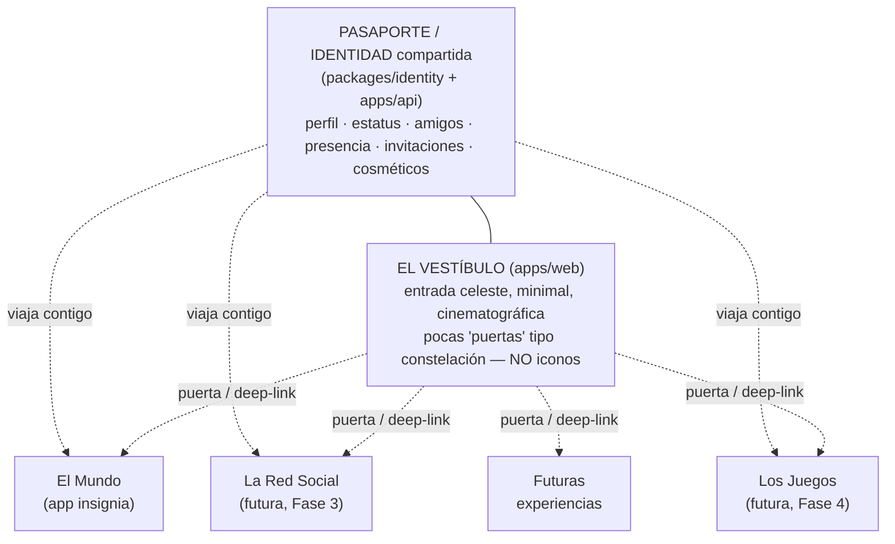

### 0.2 Qué NO es OSIA: se descarta el launcher de teléfono (decisión bloqueada)

**Decisión bloqueada por Carlos:** se **descarta explícitamente** la metáfora de "pantalla de inicio de teléfono / grilla de iconos". Se siente **genérica**, no exclusiva — y la exclusividad es el corazón de la marca.

| Metáfora descartada | Por qué se descarta | Qué hacemos en su lugar |
|---|---|---|
| Grilla de iconos (home de teléfono) | Genérica, fría, la tiene todo el mundo; mata el aura de lujo | Vestíbulo cinematográfico con pocas puertas |
| Launcher con kernel central | Acopla las apps a un shell; rompe la independencia y el deep-link | Apps independientes + identidad compartida como pegamento |
| "Menú principal" obligatorio | Obliga a pasar por un hub para llegar a lo que querés | Deep-link directo a cada experiencia |
| Dashboard cargado de widgets | Ruido visual; contradice *restraint* y espacio negativo | Pasaporte + 2-3 puertas, nada más |

> Principio rector: **"entrás a la experiencia que quieras"**. Todas opcionales, todas con deep-link. El Vestíbulo es un *umbral de lujo*, no un *conmutador de apps*.

### 0.3 Forma del Vestíbulo: mapa de constelaciones / vestíbulo de club privado

La forma recomendada (ADR-000 #4, decisión creativa abierta pero ya descartado el launcher) es un **vestíbulo celeste minimal estilo "mapa de constelaciones / vestíbulo de club privado"**:

- Fondo **ónix** con luz **champán**, niebla **marfil** sutil, tipografía **Italiana** en los títulos.
- Tu **pasaporte** presente y elegante: tu avatar, tu nombre, tu estatus/popularidad, tu presencia y la de tus amigos, tus notificaciones e invitaciones.
- Cada experiencia es una **constelación / puerta** que se ilumina, **no un icono cuadrado**. Pocas, curadas, con espacio negativo entre ellas.
- Motion contenido: las puertas respiran, se encienden al pasar el cursor, hacen fade al cruzarlas. Cruzar una puerta **es** un gesto (no un clic seco a una app más).

Alternativas registradas en [./ADR-000-decisiones-abiertas.md](./adr/ADR-000-decisiones-abiertas.md) #4: (a) vestíbulo editorial tipo revista de lujo; (b) entrada diegética dentro de El Mundo (portales físicos a otras apps); (c) minimalismo extremo (solo pasaporte + conmutador discreto). El **launcher de iconos queda fuera** en todos los casos.

### 0.4 La tensión clave: ecosistema amplio vs. "el arte de lo esencial"

Aquí está la tensión que este documento debe resolver, porque la atraviesa entera:

> Un **ecosistema de muchas apps** suena a *amplitud*. La marca dice **"el arte de lo esencial"** y exige *contención*. ¿Cómo se reconcilia "constelación de experiencias" con "lo esencial"?

**Respuesta (bloqueada): arquitectura modular desde el día 1, pero construir EN PROFUNDIDAD una superficie a la vez. La amplitud EMERGE, no se construye de golpe.**

- Se **diseña modular** desde ya (Vestíbulo delgado + pasaporte/SSO + contratos de módulo). Esto es **barato**: un shell y un contrato de identidad, no diez apps.
- Se **construye en profundidad**: El Mundo (Fases 0–2) primero, completo y bello. La Red Social (Fase 3) y los Juegos (Fase 4) son **superficies hermanas** que se enchufan **después** al Vestíbulo y al pasaporte ya existentes.
- Así, **"todas las funciones son opcionales" es VERDAD por arquitectura**, sin haber construido amplitud antes de tener profundidad. Es la única forma sana para un dev solo con ~2 meses de runway.
- El Vestíbulo **nace delgado** en Fase 1: pasaporte + **una sola puerta** (El Mundo). **Gana puertas** a medida que aparecen apps. La amplitud del ecosistema **emerge**.

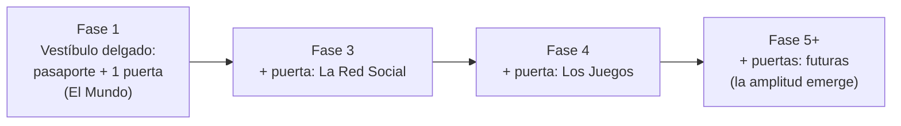

> Tesis de reconciliación: **lo esencial no es lo único; es lo curado**. Un ecosistema donde cada puerta lleva a una experiencia *profunda y bella*, presentada con *restraint*, es más "esencial" que una sola app inflada de features. La amplitud que emerge despacio, una superficie profunda a la vez, **respeta** "el arte de lo esencial". La amplitud que se construye de golpe lo **traiciona**.

Detalle de la arquitectura modular y los contratos en [./03-arquitectura-sistema.md](./03-arquitectura-sistema.md); el modelo de producto/negocio en [./00-vision-alcance.md](./00-vision-alcance.md).

---

## 1. Contexto y cómo leer este documento

Dentro de la constelación, la experiencia **insignia** —y la que define el alma de OSIA— es **El Mundo**: un mundo low-poly atmosférico de lujo, por invitación, que se recorre **a pie** junto a tus amigos. Está vivo por su **motor de atmósfera** (hora / clima / estación / eventos), habitado también por **agentes de IA** para que nunca se sienta vacío. El mundo es **instanciado** (hub + zonas + plots conectados por portales), no continuo. Las superficies hermanas (Red Social, Juegos) cuelgan del mismo pasaporte y del mismo Vestíbulo.

Tagline de marca: **"El arte de lo esencial"**. Esto no es decoración: es una restricción de diseño. Todo lo que se propone aquí debe pasar el filtro de *contención* (¿esto es esencial o es ruido?), *escasez* (¿esto es curado o es relleno?) y *atmósfera* (¿esto hace que el low-poly se sienta caro?).

Este documento responde a una sola pregunta de negocio: **¿por qué alguien — empezando por Carlos y sus 2-3 amigos — diría "uy, yo me quedo acá" y volvería mañana?** Si los siguientes capítulos no construyen esa respuesta, están mal.

Cómo encaja con el resto del paquete:

| Tema | Documento |
|---|---|
| Visión, alcance, negocio, GTM | ver [./00-vision-alcance.md](./00-vision-alcance.md) |
| Arquitectura técnica y stack (monorepo modular, SSO) | ver [./03-arquitectura-sistema.md](./03-arquitectura-sistema.md) |
| Motor de atmósfera (especificación) | ver [./06-motor-atmosfera.md](./06-motor-atmosfera.md) |
| Modelo de datos / ER por bounded context | ver [./04-modelo-datos-er.md](./04-modelo-datos-er.md) |
| Protocolo de red y world server | ver [./05-realtime-mundo-networking.md](./05-realtime-mundo-networking.md) |
| Habitantes de IA (personas, memoria, costos) | ver [./07-habitantes-ia.md](./07-habitantes-ia.md) |
| Rendimiento (LOD, Distant Horizons, presupuestos) | ver [./08-estrategia-rendimiento.md](./08-estrategia-rendimiento.md) |
| Sistema de diseño visual / UI (Vestíbulo, pasaporte) | ver [./02-marca-design-system.md](./02-marca-design-system.md) |
| Backlog por fases / sprints | ver [./backlog/00-roadmap-overview.md](./backlog/00-roadmap-overview.md) |
| Decisiones abiertas (ADR) | ver [./ADR-000-decisiones-abiertas.md](./adr/ADR-000-decisiones-abiertas.md) |

> Nota de honestidad sobre el estado real: **nada de esto está construido**. La carpeta `OSIA/` solo contiene `/brand` y `/docs`. Este documento es diseño, no un reporte de algo existente. Cuando digo "el jugador hace X", léase "el jugador *debe* poder hacer X cuando esté implementado en la fase indicada".

---

## 2. Los 6 pilares de experiencia

Un pilar es una columna que sostiene el techo: si la quitas, el edificio se cae. OSIA tiene seis. No son features sueltas; son las razones emocionales por las que el ecosistema existe. Cada feature del backlog debe poder amarrarse a uno de estos seis pilares — si no puede, probablemente no debería construirse.

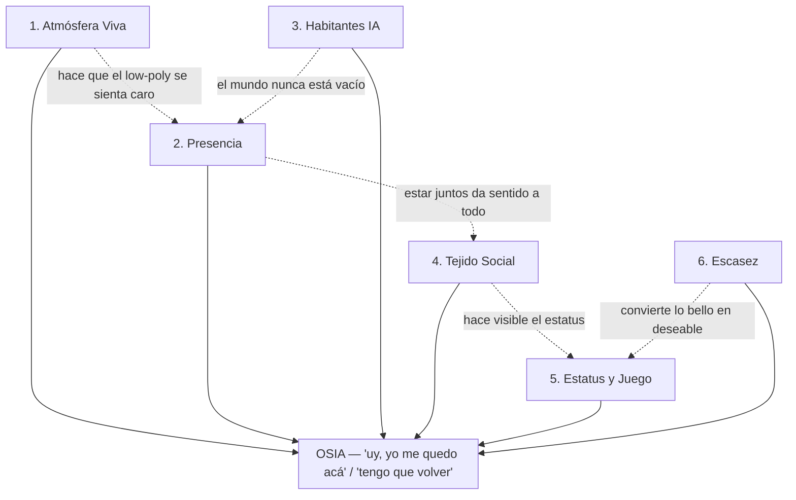

Orden de aparición por fase (no es casual): primero lo que **se siente** (atmósfera + presencia, Fase 0), luego lo que te hace **volver** (identidad + IA, Fases 1-2), luego lo que te hace **competir y presumir** (social + juego, Fases 3-4), y la escasez como capa transversal que se enciende desde el día 1 y se intensifica en Fase 5+.

> El pasaporte compartido (sección 0) es lo que permite que los pilares 4, 5 y 6 funcionen **entre apps**: tu estatus ganado en El Mundo es el mismo estatus que se ve en La Red Social y en Los Juegos. Sin identidad compartida, cada pilar viviría aislado en su app y no habría ecosistema.

---

### Pilar 1 — Atmósfera Viva

**Qué es.** Un motor server-authoritative y compartido que decide la hora del día, el clima, la estación y los eventos efímeros del mundo, y los interpola suavemente. El atardecer y la tormenta son **los mismos para todos** al mismo tiempo. Sobre el low-poly se monta una capa de post-procesado (bloom, tone mapping ACES, vignette, color grading), niebla marfil, HDRIs y ciclo día/noche. La identidad creativa por defecto es **celestial/astral**: blend crepúsculo→noche, cielos ónix, luz champán (decisión abierta, ver [./ADR-000-decisiones-abiertas.md](./adr/ADR-000-decisiones-abiertas.md) #1).

**Por qué importa.** Es el pilar #1 del proyecto y la apuesta estética central. El low-poly puro y gratis se ve a "copia barata"; el fotorrealismo solo + 0 USD también. **La atmósfera es lo que convierte geometría barata en algo que se siente caro.** Además, al ser compartida y autoritativa, crea experiencias colectivas ("¿viste el atardecer?") imposibles de fingir con un ciclo local por cliente.

**Cómo se siente.** Entrás y el cielo está en un crepúsculo profundo, hay niebla baja que oculta el horizonte, la luz champán pega de lado sobre las copas de los árboles low-poly y todo tiene grano cinematográfico. Diez minutos después el cielo migró hacia un ónix estrellado sin que te dieras cuenta del momento exacto. Una vez por semana, a una hora que nadie sabe, cae una lluvia de meteoros. Se siente como estar dentro de una fotografía que respira.

**Riesgo si falla.** Si la atmósfera no es brutal, **todo el proyecto se cae**, porque el low-poly queda desnudo. El fracaso típico: transiciones bruscas (snap entre presets), niebla que solo tapa pop-in en vez de crear mood, post-procesado exagerado (bloom de videojuego de 2010). Mitigación: en Fase 0, disciplina de **3-4 atmósferas brutales** bien tuneadas en vez de muchas mediocres; interpolación continua de ejes, no conmutación de presets. Detalle técnico en [./06-motor-atmosfera.md](./06-motor-atmosfera.md).

---

### Pilar 2 — Presencia

**Qué es.** Estar realmente *con* tus amigos: ver sus avatares moverse en tiempo real (presencia sincronizada por el world server autoritativo), oírlos por voz (WebRTC P2P mesh para grupos chicos), saber quién está online y en qué zona. Recorrido **a pie** como núcleo social tipo plaza (decisión abierta, ver [./ADR-000-decisiones-abiertas.md](./adr/ADR-000-decisiones-abiertas.md) #2).

**Por qué importa.** El Mundo no es un juego para jugar solo; es un *lugar* para estar con gente. La presencia es lo que transforma "una escena 3D bonita" en "un sitio donde quedé con mis panas". El movimiento a pie, a velocidad humana, fuerza la proximidad y la conversación — caminar lento juntos *es* el contenido social. La presencia, además, **viaja en el pasaporte**: el Vestíbulo y la Red Social muestran "quién está online y dónde" usando la misma señal.

**Cómo se siente.** Caminás por la plaza y ves el avatar de tu amigo doblar la esquina; lo escuchás reírse por voz cuando empieza a llover; se acercan los dos a mirar el mismo punto del horizonte. La latencia es baja, el movimiento es suave (client prediction + reconciliation), y la voz cae casi a cero costo porque es P2P.

**Riesgo si falla.** Si la presencia se siente laggy, fantasmal (avatares que se teletransportan) o la voz es complicada de activar, el mundo se siente solitario y roto — exactamente lo que IA y atmósfera intentan evitar. Mitigación: protocolo binario, tick fijo 15-20 Hz, AOI, y un *join de voz de un clic* sin fricción. Detalle en [./05-realtime-mundo-networking.md](./05-realtime-mundo-networking.md).

---

### Pilar 3 — Habitantes IA

**Qué es.** Agentes de IA (NPCs) que habitan el mundo y con los que **hablás de verdad**: Whisper para voz→texto, Claude para diálogo (tiering Haiku/Opus según el momento), TTS para su voz, y memoria persistente vía embeddings + pgvector. Cada habitante tiene una persona y recuerda interacciones.

**Por qué importa.** Es el diferenciador **central** y la solución **estructural** al problema del "mundo vacío". Un mundo social por invitación con 2-3 personas reales está, por definición, casi siempre vacío. Los habitantes IA garantizan que *siempre haya alguien* — no por esperanza de tráfico, sino por diseño. Bonus de modelo de negocio: el costo de IA escala con el engagement, que es el costo *correcto* (solo pagás cuando alguien realmente está disfrutando).

**Cómo se siente.** Llegás solo a las 3am, no hay amigos online, pero en el mirador hay un habitante — un personaje recurrente — que te reconoce ("volviste, justo cuando empezaba la niebla") y conversa. No es un menú de diálogo; le hablás por voz y te responde con voz. Recuerda que la última vez le contaste algo.

**Riesgo si falla.** Dos fracasos: (a) **costo descontrolado** — sin guardrailes, una conversación larga con Opus quema presupuesto; (b) **caída del valle inquietante conversacional** — NPCs que repiten, no recuerdan, o responden lento y rompen la inmersión. Mitigación: tiering de modelos, cache, rate-limit, presupuesto de tokens, throttle, y memoria con pgvector. Detalle en [./07-habitantes-ia.md](./07-habitantes-ia.md). Aparece en **Fase 2**, no antes — atmósfera y presencia deben estar sólidas primero.

---

### Pilar 4 — Tejido Social

**Qué es.** La red social interna: feed de publicaciones, grafo de seguidores, popularidad/reputación, presencia social (quién está online y dónde), reacciones, comentarios y notificaciones. Es la **superficie hermana** "La Red Social" (`apps/social`, Fase 3), enchufada al pasaporte compartido; el Vestíbulo (`apps/web`) muestra una versión condensada (presencia + notificaciones del pasaporte) desde el día 1.

**Por qué importa.** El estatus necesita un sustrato donde hacerse **visible**. Sin tejido social, "ser popular en OSIA" no significa nada porque nadie lo ve. El feed y los seguidores convierten momentos del mundo (un descubrimiento, una foto del atardecer raro) en moneda social. También es el motor de retención fuera de sesión: te llega una notificación, abrís el Vestíbulo, ves qué pasó, querés entrar.

**Cómo se siente.** Capturás el momento de la lluvia de meteoros, lo posteás, y al otro día tenés reacciones de tus amigos y +reputación. Ves que alguien nuevo (invitado) te siguió. Una notificación te avisa que tu amigo entró al mundo *ahora mismo* — y querés entrar también.

**Riesgo si falla.** Que se sienta como una red social genérica más (otro feed muerto) o que esté vacío por falta de masa crítica (2-3 personas no llenan un feed). Mitigación: el feed se alimenta también de **eventos del mundo y de IA** (no solo de posts humanos), y la presencia ("X está en el Mirador") da señal de vida constante. Aparece como app independiente en **Fase 3**. Detalle de entidades en [./04-modelo-datos-er.md](./04-modelo-datos-er.md).

---

### Pilar 5 — Estatus y Juego

**Qué es.** Mecánicas de prestigio y competencia: minijuegos con `MatchSession` y `Score`, leaderboards globales, `RankingSnapshot`, logros (`Achievement`) y cosméticos. Es la **superficie hermana** "Los Juegos" (`apps/games`, Fase 4). El estatus se gana jugando, descubriendo y participando, y se exhibe vía avatar/cosméticos/perfil — **el mismo perfil del pasaporte**, visible en todas las apps.

**Por qué importa.** El lujo es aspiracional: la gente vuelve a los lugares donde puede *ser alguien*. El estatus da una meta de progresión de largo plazo (más allá de "es bonito") y una razón competitiva para volver. Como el estatus viaja en el pasaporte, lo que ganás en Los Juegos se luce en El Mundo y en La Red Social: el ecosistema **comparte prestigio**. Los cosméticos, además, son la futura economía que **paga los servidores** (Fase 5+).

**Cómo se siente.** Subís en un leaderboard tras un buen partido; desbloqueás un cosmético raro que solo se obtiene asistiendo a un evento efímero; tu rank es visible para tus seguidores en el Vestíbulo. El prestigio es escaso y legible — no todos tienen el cosmético de "estuve en la primera lluvia de meteoros".

**Riesgo si falla.** Grind sin alma (competir por números sin belleza) o cosméticos que rompen la contención de marca (skins chillonas que matan el lujo). Mitigación: cosméticos dentro de la paleta (champán/ónix/marfil/taupe), escasez real, y juegos que se sienten parte del ecosistema, no minijuegos pegados. Aparece en **Fase 4**.

---

### Pilar 6 — Escasez

**Qué es.** El pilar transversal de lujo. Invite-only (`Invitation`, `WaitlistEntry`), eventos efímeros raros (lluvia de meteoros 1×/semana a hora random), cosméticos limitados, plots privados finitos (Fase 5+), y *restraint* general (poco contenido pero curado). No es un sistema; es una **disciplina** que atraviesa los otros cinco pilares — y atraviesa también el Vestíbulo (entrar es cruzar un umbral exclusivo, no abrir una app más).

**Por qué importa.** La escasez es lo que convierte "bonito" en "deseable". El FOMO (miedo a perderse algo) y la exclusividad son la estrategia de go-to-market: se escala por boca a boca y deseo, no por construir todo antes de abrir. "Lo enorme siempre empieza diminuto y perfecto." La escasez también es honesta con el runway: no podemos (ni queremos) ser masivos al inicio. Y es coherente con la tensión de la sección 0.4: **construir profundo y poco** es, en sí mismo, un acto de escasez curada.

**Cómo se siente.** Te invitaron — no entró cualquiera. El pasaporte mismo se siente como una credencial de club. Sabés que el evento de meteoros es raro y que si no estás, te lo perdés (y queda registrado quién estuvo). La waitlist tiene gente esperando. Tener una invitación para regalar te da poder social.

**Riesgo si falla.** Dos fracasos opuestos: (a) **escasez que asfixia** — tan cerrado y vacío que nadie tiene con quién jugar (mortal con 2-3 usuarios); (b) **escasez fingida** — FOMO de mentiras que la gente detecta. Mitigación: la escasez se equilibra con habitantes IA (siempre hay con quién estar) y con eventos *de verdad* raros y registrados. Es el contrapeso del Pilar 3.

---

### Tabla resumen de pilares

| # | Pilar | Qué es (1 línea) | Fase / superficie | Riesgo principal | Mitigación |
|---|---|---|---|---|---|
| 1 | Atmósfera Viva | Motor compartido de hora/clima/estación/eventos + post-pro | 0 (El Mundo) | Low-poly desnudo si no es brutal | 3-4 atmósferas tuneadas, interpolación continua |
| 2 | Presencia | Estar con amigos: avatares, voz, online status | 0 (El Mundo) | Lag/fantasmal/voz con fricción | Binario, tick fijo, AOI, voz 1-clic |
| 3 | Habitantes IA | NPCs con los que hablás por voz, con memoria | 2 (El Mundo) | Costo descontrolado / NPCs huecos | Tiering, cache, rate-limit, pgvector |
| 4 | Tejido Social | Feed, seguidores, popularidad, notificaciones | 3 (La Red Social) | Feed vacío / genérico | Feed alimentado por mundo+IA, presencia |
| 5 | Estatus y Juego | Ranking, logros, cosméticos, prestigio | 4 (Los Juegos) | Grind sin alma / cosméticos chillones | Cosméticos en paleta, escasez, juego integrado |
| 6 | Escasez | Invite-only, eventos efímeros, restraint | 0 (transversal) | Asfixia o FOMO falso | Equilibrio con IA, eventos reales registrados |

---

## 3. Loops centrales

Los pilares son el *por qué*; los loops son el *cómo se repite*. Un loop es un ciclo que el jugador atraviesa y que lo deja en una posición de querer volver a empezarlo. OSIA tiene cuatro loops, anidados por escala temporal: el **loop de sesión** (minutos), el **loop social** (horas/días), el **loop de estatus** (semanas) y el **loop de escasez/FOMO** (transversal, dispara los otros tres).

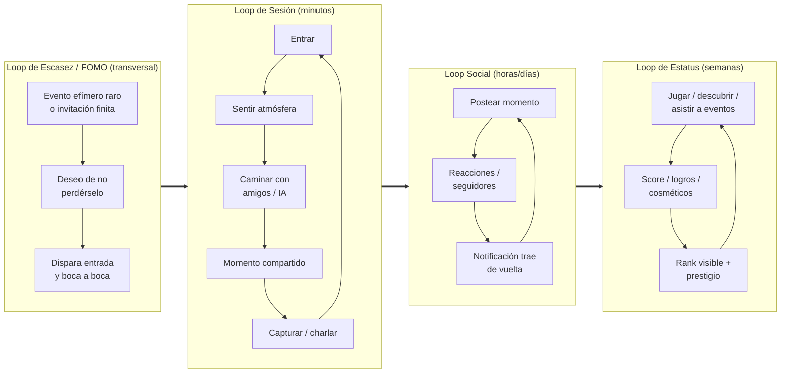

> El pasaporte compartido es el "hilo" que cose los cuatro loops entre apps: el momento se vive en El Mundo (sesión), se postea en La Red Social (social), sube el rank en Los Juegos (estatus), y la presencia/invitación lo amplifica (escasez). Sin identidad compartida, cada loop quedaría atrapado en una sola app.

---

### 3.1 Loop de sesión (minutos) — Fase 0

El loop más importante y el primero que debe existir. Es lo que pasa *dentro* de una sesión de El Mundo.

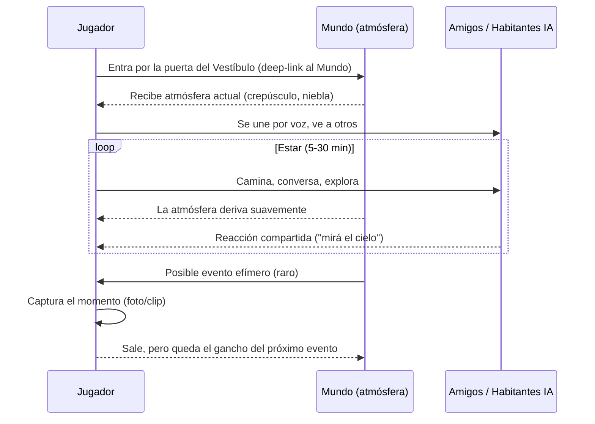

**Diseño clave:** el loop no necesita un "objetivo" tipo misión. El objetivo emocional es *estar*. La atmósfera que deriva y los momentos compartidos son el contenido. Para que esto funcione, la fricción de entrada y de voz debe ser mínima. La entrada ideal es **deep-link directo** desde la puerta del Vestíbulo (o desde una notificación), sin pasar por menús.

---

### 3.2 Loop social (horas/días) — Fase 3

Vive principalmente fuera del mundo 3D, en la superficie hermana **La Red Social** (`apps/social`) y en el Vestíbulo (`apps/web`). Es el que recupera al jugador entre sesiones.

| Paso | Acción | Sistema | Resultado emocional |
|---|---|---|---|
| 1 | Capturás un momento (atardecer raro, evento) | Cliente 3D → Storage | "Quiero que vean esto" |
| 2 | Lo posteás al feed | `Post`, `FeedItem` | Pequeña vulnerabilidad/orgullo |
| 3 | Tus amigos reaccionan/comentan | `Reaction`, `Comment` | Validación social |
| 4 | Sube tu popularidad/reputación (en el pasaporte) | `PopularityPoints` | Sensación de progreso |
| 5 | Te llega notificación (alguien online, reacción) | `Notification` | Gancho de re-entrada |
| 6 | Volvés al mundo (deep-link desde la notificación) | `PresenceSession` | Reinicia loop de sesión |

**Diseño clave:** con 2-3 personas, el feed humano es flaco. Por eso el feed se alimenta también de **eventos del mundo** ("Hubo lluvia de meteoros anoche; estuvieron 2 personas") y de **habitantes IA** que pueden generar señales. La presencia ("Carlos está en el Mirador *ahora*") es la notificación más potente, y vive en el pasaporte (visible desde cualquier app).

---

### 3.3 Loop de estatus (semanas) — Fase 4

El de horizonte más largo. Da razón para volver más allá de la novedad.

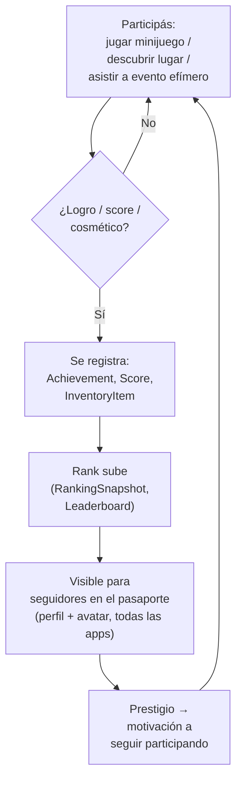

**Diseño clave:** el estatus se gana por **tres vías**, no solo por skill de juego: (1) competencia (leaderboard), (2) descubrimiento (encontrar lugares/secretos), (3) asistencia (estar en eventos efímeros raros). Esto último amarra estatus con escasez: el cosmético de "estuve en la primera lluvia de meteoros" no se puede comprar ni grindear, solo se tuvo que *estar ahí*. Como el estatus es **del pasaporte**, atraviesa todo el ecosistema.

---

### 3.4 Loop de escasez / FOMO (transversal)

No es un loop secuencial sino un *amplificador* que enciende los otros tres. Su mecánica:

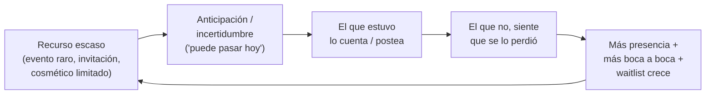

**Diseño clave (palancas concretas):**

| Palanca | Mecánica | Pilar que enciende |
|---|---|---|
| Eventos efímeros raros | 1×/semana, hora aleatoria, no anunciada | Sesión + Estatus |
| Invitaciones finitas | Cada cuenta recibe N invitaciones para regalar | Social + crecimiento |
| Cosméticos de asistencia | Solo se obtienen estando en el evento | Estatus |
| Waitlist visible | Ves cuánta gente espera entrar | Deseo / valor percibido |
| Presencia en vivo | "Tu amigo entró ahora" (en el pasaporte) | Sesión (re-entrada) |
| Acceso por invitación al Vestíbulo | El umbral mismo es exclusivo | Marca / escasez |

> Riesgo recordado: la escasez es un cuchillo. Con 2-3 usuarios, demasiado FOMO + demasiado cierre = vacío. Por eso los **habitantes IA** son el contrapeso permanente que mantiene el mundo habitado entre eventos. Ver Pilar 3 y Pilar 6.

---

## 4. Player journey: invitación → onboarding → primera sesión → retención

El viaje completo, desde que alguien recibe una invitación hasta que se convierte en habitante recurrente (D30). El objetivo de cada etapa está marcado. Nótese que el **Vestíbulo + creación de pasaporte** es la puerta de entrada al ecosistema (Fase 1); en Fase 0 pura, el journey arranca directo en El Mundo con un acceso mínimo.

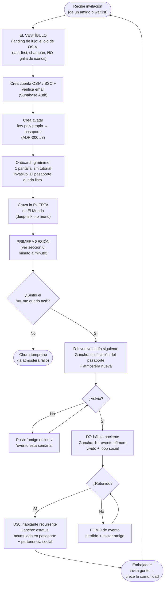

**Métricas / metas por etapa (referencia para el backlog, ver [./backlog/00-roadmap-overview.md](./backlog/00-roadmap-overview.md)):**

| Etapa | Meta de experiencia | Señal de éxito (proxy) | Gancho dominante |
|---|---|---|---|
| Invitación → Vestíbulo | Sentir lujo y exclusividad antes de entrar | Conversión invitación→cuenta | Marca + escasez |
| Onboarding / pasaporte | Cero fricción, máximo 3 pasos | % que llega a primera sesión | Restraint |
| Cruzar la puerta | Deep-link directo, sin menús | % que entra a El Mundo | Vestíbulo limpio |
| Primera sesión | "Uy, yo me quedo acá" | Duración 1ª sesión > 10 min | Atmósfera + presencia |
| D1 | Volver una vez | % retención D1 | Notificación + atmósfera nueva |
| D7 | Vivir 1 evento efímero | % retención D7 | FOMO + loop social |
| D30 | Tener estatus que cuidar | % retención D30 | Estatus + pertenencia |
| D30+ | Invitar a alguien | Invitaciones enviadas/usuario | Escasez (poder de invitar) |

**Por qué el onboarding es mínimo.** En un producto de lujo, el tutorial invasivo mata el aura. La marca es *contención*. El jugador no necesita aprender mecánicas complejas en Fase 0 (solo caminar y hablar); necesita *sentir*. El onboarding ideal es: verificá email → hacé tu avatar (pasaporte) → cruzá la puerta. La belleza enseña sola. El Vestíbulo no es un trámite: es el primer momento de marca.

---

## 5. Diseño emocional y sensorial

OSIA es un producto de *sensación*. Esta sección define cómo se construye esa sensación con motion, sonido, ritmo y silencio. Todo deriva de los principios de lujo de la marca: contención, motion design, espacio negativo/silencio, dark-first. Aplica tanto al **Vestíbulo** (2D, web) como a **El Mundo** (3D); la coherencia entre ambos es lo que hace que el ecosistema se sienta uno solo.

### 5.1 Motion (movimiento e interfaz)

| Principio | Aplicación concreta | Anti-patrón a evitar |
|---|---|---|
| Easing suave, nunca lineal | Transiciones de UI con curvas ease-out/ease-in-out; cámara que acelera/desacelera natural; puertas del Vestíbulo que se encienden con fade | Snaps, movimientos robóticos |
| Lento es lujo | Fades de 400-800ms en UI; la atmósfera deriva en minutos, no segundos | Animaciones rápidas/nerviosas |
| Menos elementos en pantalla | HUD casi inexistente en el mundo; Vestíbulo con pocas puertas y mucho espacio negativo; UI aparece on-demand y desaparece | HUD cargado tipo MMO; grilla de iconos |
| Motion con propósito | Cada animación comunica algo (cruzar la puerta = transición de superficie; entrar a un portal = transición de room) | Animación decorativa por moda |
| Champán sobre ónix | Acentos dorados que aparecen y se desvanecen sobre fondo oscuro | Colores fuera de paleta, alto contraste chillón |

El movimiento del avatar a pie debe sentirse con *peso* y suavidad (la física Rapier ayuda), no flotante. La cámara contemplativa privilegia encuadres bellos del mundo. La transición **Vestíbulo → El Mundo** debe sentirse como *cruzar un umbral* (fade cinematográfico con la marca), no como cargar otra pestaña.

### 5.2 Sonido

El sonido es la mitad de la atmósfera y la más barata de subestimar.

| Capa sonora | Rol | Ejemplo |
|---|---|---|
| Ambiente base (drone) | Sostiene el mood, cambia con la atmósfera | Drone cálido en hora dorada → frío y etéreo de noche |
| Sonido reactivo a clima | Refuerza el evento del motor | Lluvia, viento que sube antes de tormenta |
| Voz humana (WebRTC) | El núcleo social | Conversación P2P de amigos |
| Voz de habitantes IA (TTS) | Da alma a los NPCs | Saludo del habitante del mirador |
| Stingers de evento efímero | Marcan el momento raro | Un acorde sutil al empezar la lluvia de meteoros |
| Sonido del Vestíbulo | Umbral sereno, etéreo | Drone celeste mínimo al presentar el pasaporte |
| UI sounds (mínimos) | Feedback discreto | Tono suave al cruzar una puerta / portal |

Regla de marca: el sonido también obedece *contención*. Nada estridente. El silencio es un instrumento (ver 5.4).

### 5.3 Ritmo

El ritmo de una sesión es deliberadamente lento. El Mundo no es un shooter; es un paseo. El "gameplay" es la conversación y la contemplación. La curva de intensidad de una sesión típica:

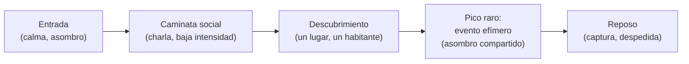

La rareza del pico (D) es lo que lo hace valioso. Si cada sesión tuviera un evento épico, ninguno sería épico. El ritmo plano-con-picos-raros es el patrón de la escasez aplicado al tiempo.

### 5.4 Silencio y espacio negativo

El principio de lujo más difícil de respetar bajo la tentación de "agregar features" (y de "agregar apps"). El silencio en OSIA es:

- **Visual:** cielos amplios, niebla que esconde en vez de mostrar todo, UI que desaparece, Vestíbulo con pocas puertas. El espacio negativo deja respirar al ojo. (Una grilla de iconos es lo contrario del silencio visual: por eso se descarta.)
- **Sonoro:** momentos sin música, solo ambiente, donde la voz de tus amigos es lo único que suena.
- **De contenido:** poco, pero curado. 3-4 atmósferas brutales > 20 mediocres. Una zona perfecta > diez a medias. Una superficie profunda > cinco apps a medias (sección 0.4).

> Decisión de diseño: ante la duda entre agregar o quitar, **quitar**. "El arte de lo esencial" es literal. El lujo no es vasto; es curado, vivo y bello.

---

## 6. El "por qué volver"

La retención no se compra con notificaciones spam; se construye con razones reales para volver. OSIA tiene tres: **rituales**, **eventos efímeros** y **descubrimientos que se acumulan en estatus**.

### 6.1 Rituales (lo predecible que reconforta)

Un ritual es algo que pasa de forma regular y a lo que te gusta volver. OSIA los crea con el motor de atmósfera:

- **El atardecer compartido:** si el ciclo día/noche del mundo está sincronizado con momentos reales, "vernos al atardecer en OSIA" se vuelve un plan recurrente con amigos.
- **La caminata nocturna:** el mundo ónix estrellado invita a sesiones tranquilas de noche.
- **El check-in social:** abrir el Vestíbulo, ver el pasaporte (quién está online, qué pasó), postear el momento.

Los rituales dan la base de retención predecible (vuelvo porque es agradable y conocido).

### 6.2 Eventos efímeros (lo impredecible que engancha)

El contrapeso del ritual. Lo raro e impredecible que no querés perderte:

- **Lluvia de meteoros** (~1×/semana, hora aleatoria, no anunciada).
- **Atmósferas raras** combinatorias que casi nunca se alinean (ej. niebla + cierta estación + cierta hora).
- **Apariciones de habitantes IA especiales** en momentos puntuales.

Cada evento efímero deja un **registro** (quién estuvo) y, opcionalmente, un cosmético de asistencia. Así lo impredecible se convierte en estatus permanente — estatus que vive en el pasaporte y se ve en todo el ecosistema. Entidades: `AtmosphereEvent`, `Achievement`, `Cosmetic`, ver [./04-modelo-datos-er.md](./04-modelo-datos-er.md).

### 6.3 Descubrimientos que se acumulan en estatus

Lo que hiciste *queda*. Cada lugar descubierto, cada evento vivido, cada partida ganada se acumula en tu perfil y tu rank **del pasaporte**. Volver no es empezar de cero: es seguir construyendo un *registro de pertenencia*. Esto es lo que convierte un D7 en un D30: ya tenés algo que cuidar.

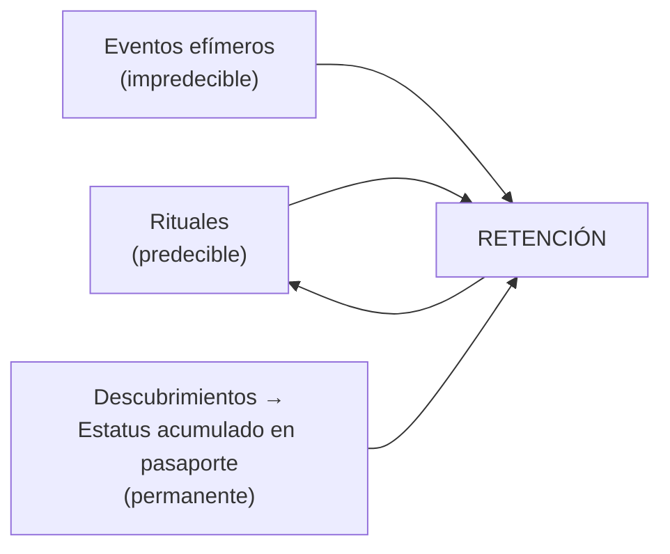

La combinación es deliberada: lo predecible te da confort, lo impredecible te da emoción, lo acumulado te da inversión. Las tres juntas son por qué volvés.

---

## 7. Diseño de la PRIMERA SESIÓN (minuto a minuto)

**La sección más importante del documento.** Si la primera sesión no logra "uy, yo me quedo acá", nada de lo demás importa. Este es el guion de Fase 0, diseñado para el caso real: Carlos invita a un amigo y entran juntos a El Mundo. La meta única: que a los 10 minutos el amigo no se quiera ir.

**Supuestos:** el jugador ya cruzó invitación → cuenta/pasaporte → avatar (sección 4) y cruzó la **puerta de El Mundo** desde el Vestíbulo (o entró por deep-link directo). Esta es la primera vez que *entra al mundo*. Idealmente entra con al menos un amigo (Carlos) ya dentro, o con un habitante IA presente si está solo.

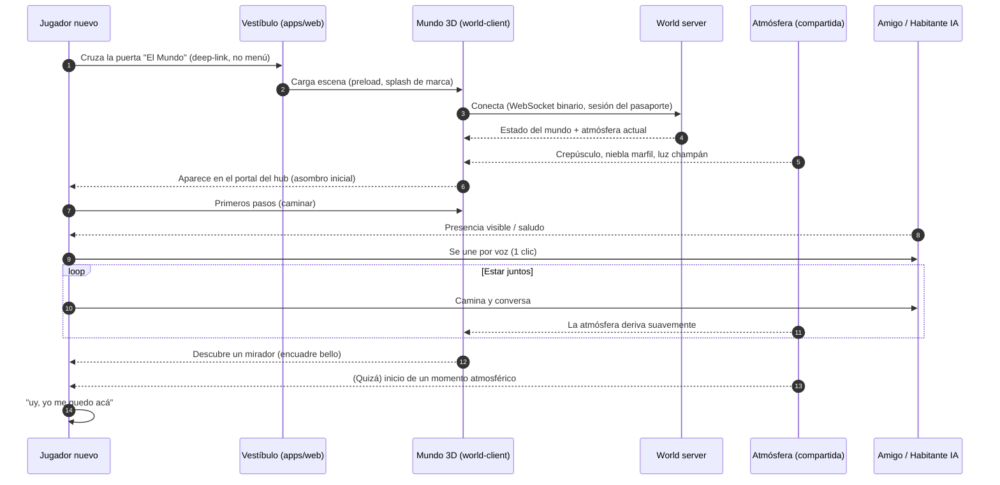

### Guion minuto a minuto

| Minuto | Qué pasa | Objetivo emocional | Qué NO hacer |
|---|---|---|---|
| **0:00–0:30** | Cruzás la puerta de El Mundo desde el Vestíbulo. Splash de marca (logo gold-on-dark sobre ónix, tipografía Italiana). Preload de la escena con barra mínima/elegante. | Anticipación, sensación de cruzar un umbral exclusivo. | No mostrar carga fea, ni logs, ni "Loading 47%". No grilla de iconos en el Vestíbulo. |
| **0:30–1:00** | Fade-in al mundo. Aparecés en el portal del hub. La cámara revela el paisaje low-poly bañado en crepúsculo, niebla baja, luz champán de lado, grano cinematográfico. Ambiente sonoro entra suave. | **El "wow" de atmósfera.** Este es el momento más caro del proyecto. | No tirar UI/HUD encima del primer plano. No tutorial pop-up. |
| **1:00–2:00** | Aprendés a caminar sin que nadie te lo explique (controles obvios). Movimiento con peso, suave. Si hay amigo cerca, lo ves. | Agencia: "puedo moverme por esto". | No bloquear con un tutorial de teclas. Que la belleza invite a explorar. |
| **2:00–3:00** | Prompt mínimo y elegante para unirse por voz (1 clic). Tu amigo te escucha. | Presencia: "no estoy solo, estoy *con* alguien". | No flujo de permisos confuso. El join de voz debe ser un clic. |
| **3:00–6:00** | Caminata social: van juntos hacia un punto de interés (mirador, claro con habitante IA). Conversan. La atmósfera deriva imperceptiblemente. | Conexión + contemplación. El contenido *es* estar juntos. | No empujar objetivos/misiones. No prisa. |
| **6:00–8:00** | Descubrimiento: llegan a un encuadre diseñado para ser bello (mirador sobre el horizonte con niebla). Posibilidad de capturar el momento. | Asombro compartido: "mirá esto". | No saturar de puntos de interés. Uno bueno > cinco mediocres. |
| **8:00–10:00** | (Si toca) un micro-momento atmosférico: la luz cambia hacia la noche ónix estrellada, o un evento sutil. Cierre natural. | El gancho: "quiero ver qué más pasa / cuándo cae el evento raro". | No forzar un evento épico cada vez (mata la escasez). |
| **10:00+** | El jugador decide quedarse o sale con el gancho del próximo evento y de volver con amigos. | "Uy, yo me quedo acá." / "Mañana vuelvo." | No pantalla de "fin de demo". OSIA es un lugar, no un nivel. |

### Principios de diseño de la primera sesión

1. **La belleza enseña, no el tutorial.** Cero pop-ups de instrucciones. Los controles son obvios; el mundo invita a moverse.
2. **El "wow" va en el minuto 1, no en el 10.** El primer plano del mundo en crepúsculo es la inversión de producción más importante de Fase 0.
3. **Voz en un clic.** La presencia social es la mitad del valor; su fricción debe ser casi nula.
4. **Nunca solo.** Si no hay amigos online, un habitante IA debe estar presente para saludar (esto justifica priorizar al menos un habitante simple ya en la transición a Fase 2; en Fase 0 pura, el caso de uso es Carlos + amigo).
5. **Sin objetivos impuestos.** El objetivo es estar. Caminar y conversar es el gameplay.
6. **Cierre sin "fin".** OSIA no termina; te vas con un gancho. Nunca una pantalla de "demo completada".
7. **El umbral es de lujo.** El Vestíbulo y el splash de marca son parte de la primera sesión: cruzar a El Mundo debe sentirse como entrar a un club, no como abrir una app.

### Plan de contingencia: ¿y si entra solo?

Caso real frecuente con 2-3 usuarios. Si el jugador entra sin amigos online:

- **Fase 0:** el mundo bello + atmósfera + un sonido ambiente acogedor deben sostener solos el "wow" por unos minutos. La presencia social queda pendiente para cuando un amigo se conecte (la notificación de presencia del pasaporte ayuda a coordinar).
- **Fase 2+:** un habitante IA en el hub lo recibe y conversa. Aquí el Pilar 3 paga su deuda: el mundo nunca está vacío. Esta es la razón estructural de existir de los habitantes IA, no un adorno.

---

## 8. Resumen de decisiones de experiencia (para coherencia del paquete)

| Decisión | Qué se decidió | Justificación |
|---|---|---|
| Modelo de producto | Constelación de apps independientes + pasaporte compartido + Vestíbulo | Independencia, deep-link y SSO; exclusividad de marca. (Bloqueado por Carlos.) |
| Metáfora de entrada | Vestíbulo de lujo (constelación/club), **NO launcher de iconos** | La grilla de iconos es genérica; mata el aura. (Bloqueado.) |
| Cómo se construye el ecosistema | Modular desde el día 1, profundo una superficie a la vez; amplitud emerge | Único camino sano para dev solo con poco runway; respeta "lo esencial". |
| Vestíbulo en Fase 1 | Delgado: pasaporte + 1 puerta (El Mundo); gana puertas después | Depth-first; no construir amplitud antes de profundidad. |
| Pilar #1 absoluto | Atmósfera Viva | Es lo que hace que el low-poly se sienta caro; si falla, todo cae. |
| Objetivo de Fase 0 | "Uy, yo me quedo acá" en la 1ª sesión | Sin esto, el resto del roadmap es irrelevante. |
| Loop nuclear | Loop de sesión (estar, no cumplir objetivos) | El Mundo es un lugar, no un nivel; el contenido es la presencia. |
| Onboarding | Mínimo (≤3 pasos), sin tutorial invasivo | La contención de marca; la belleza enseña sola. |
| Solución al mundo vacío | Habitantes IA (estructural, no esperanza) | 2-3 usuarios nunca llenan un mundo; la IA garantiza compañía. |
| Estatus / presencia | Viajan en el pasaporte (entre apps) | El ecosistema comparte prestigio; sin SSO no hay ecosistema. |
| Escasez | Transversal, equilibrada con IA | FOMO real (eventos raros registrados), no asfixia. |
| "Por qué volver" | Rituales + eventos efímeros + estatus acumulado | Confort + emoción + inversión = retención D30. |
| Ritmo de sesión | Lento con picos raros | El pico raro es valioso *porque* es raro (escasez en el tiempo). |
| Sensorial | Dark-first, champán sobre ónix, silencio como instrumento | Coherencia total con la marca de lujo, en Vestíbulo y Mundo. |

---

## 9. Decisiones abiertas que afectan la experiencia

Estas no se bloquean aquí; se documentan y recomiendan en [./ADR-000-decisiones-abiertas.md](./adr/ADR-000-decisiones-abiertas.md). Resumen de su impacto en la experiencia:

| # | Decisión abierta | Recomendación | Impacto en experiencia |
|---|---|---|---|
| 1 | Alma/mood de atmósfera | Blend crepúsculo→noche celestial | Define el "wow" del minuto 1 y la coherencia con la marca. |
| 2 | Recorrido | A pie (núcleo social plaza) | Define el ritmo lento y la proximidad que genera conversación. |
| 3 | Avatares | Low-poly propios estilizados | Define coherencia de marca en presencia y la identidad visible (pasaporte) en estatus. |
| 4 | Forma del Vestíbulo | Vestíbulo celeste tipo mapa de constelaciones / club privado | Define cómo se entra al ecosistema. **El launcher de iconos ya está descartado.** |

---

> Próximo paso de lectura sugerido: [./03-arquitectura-sistema.md](./03-arquitectura-sistema.md) (cómo se construye el monorepo modular, SSO y el Vestíbulo), [./06-motor-atmosfera.md](./06-motor-atmosfera.md) (cómo se construye el Pilar 1) y [./backlog/00-roadmap-overview.md](./backlog/00-roadmap-overview.md) (cómo se ejecuta la primera sesión de Fase 0).
