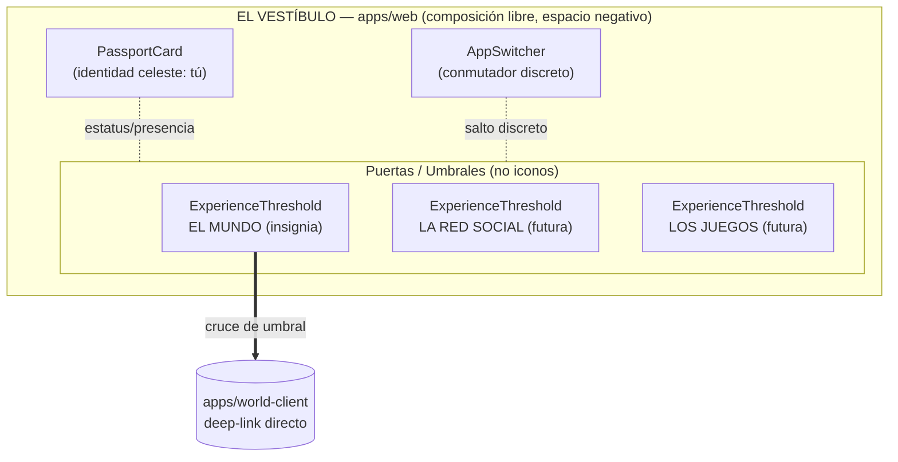
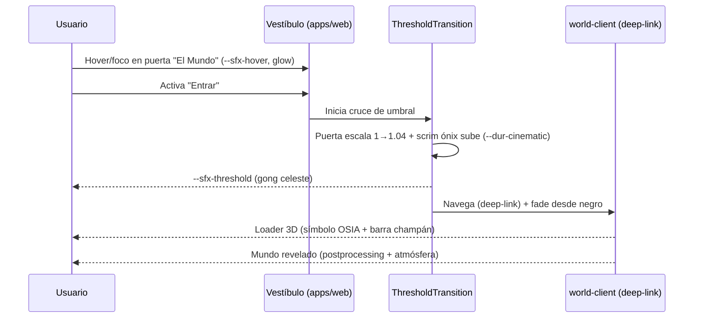

# Marca y Design System — OSIA

> Propósito: Definir el sistema visual y sonoro premium de OSIA (`packages/ui`) — tokens de color, tipografía, espaciado, motion, sonido, inventario de componentes web (incluido EL VESTÍBULO y el PASAPORTE), UI diegética/HUD del Mundo 3D, uso de logo y accesibilidad — de forma que cualquier superficie del ecosistema se sienta de lujo, contenida y coherente. | Estado: Borrador v1 | Fecha: 2026-06-19 | Parte del paquete de diseño OSIA.

---

## 0. Cómo leer este documento

Este es el documento fundacional del **Design System de OSIA**. Todo lo que aquí se define se materializa en `packages/ui` (tokens + componentes con Italiana/Jost) y se consume desde `apps/web` (EL VESTÍBULO), `apps/world-client` (HUD del Mundo) y las futuras `apps/social` y `apps/games`. La promesa de marca —**"El arte de lo esencial"**— no es un eslogan decorativo: es la regla que decide qué entra y qué se descarta. Si una decisión no se puede justificar como *contención, escasez, silencio o belleza vivida*, no pertenece a OSIA.

Tres ideas guían cada token de este documento:

1. **Dark-first, no dark-mode.** OSIA nace en el Ónix. La luz champán es escasa y por eso es preciosa. No hay "tema claro" que sea ciudadano de primera; el Marfil es un acento de reposo, no un fondo de trabajo.
2. **La contención es la feature.** Una paleta de 4 colores, dos tipografías, una curva de motion canónica. Menos decisiones visibles = más lujo percibido. La generosidad va en el *espacio negativo*, no en el ornamento.
3. **El sistema sirve a la atmósfera.** El Mundo 3D es la app insignia; su atmósfera (crepúsculo→noche celestial) define el alma cromática. El Design System web es el *vestíbulo* de esa atmósfera: debe sentirse como la antesala del mismo cielo.

Cross-links principales:
- Visión, GTM y north star: ver [./00-vision-alcance.md](./00-vision-alcance.md)
- Pilares de experiencia y guion de la primera sesión: ver [./01-pilares-experiencia.md](./01-pilares-experiencia.md)
- Decisiones abiertas (alma de atmósfera, recorrido, avatares, modelo del Vestíbulo): ver [./adr/ADR-000-decisiones-abiertas.md](./adr/ADR-000-decisiones-abiertas.md)
- Modelo de datos / ER (entidades que pintan los componentes: Profile, Cosmetic, FeedItem, etc.): ver [./04-modelo-datos-er.md](./04-modelo-datos-er.md)
- Motor de atmósfera (alma cromática del HUD y del Vestíbulo): ver [./06-motor-atmosfera.md](./06-motor-atmosfera.md)
- Rendimiento y presupuestos (impacto del HUD/postprocessing): ver [./08-estrategia-rendimiento.md](./08-estrategia-rendimiento.md)

> **Nota de estado real:** la carpeta `OSIA/` está vacía salvo `/brand` y `/docs`. Esto es **diseño**, no implementación. Los ejemplos de código son *especificaciones objetivo* para `packages/ui`, no código existente.

---

## 1. Activos de marca reales (lo que ya tenemos)

Antes de inventar nada, anclamos en lo que existe en disco. El Design System **no se aparta** de estos activos: los sistematiza.

### 1.1 Tipografías (en `d:/Workspace/OSIA/brand/fonts`)

| Archivo | Familia | Rol | Licencia |
|---|---|---|---|
| `Italiana-Regular.ttf` | **Italiana** | Display / titulares. Un solo peso (Regular 400), trazos finos tipo Didone, alto contraste. | SIL OFL (`Italiana-OFL.txt`) — uso comercial OK |
| `Jost-Variable.ttf` | **Jost** | UI / cuerpo. Variable font (peso 100–900; usamos Light 300 → SemiBold 600). Geométrica, neutra, legible. | SIL OFL (`Jost-OFL.txt`) — uso comercial OK |

Jost es *variable*: cargamos **un solo archivo** y derivamos todos los pesos por `font-variation-settings`/`font-weight`. Esto es presupuesto de red (ver [./08-estrategia-rendimiento.md](./08-estrategia-rendimiento.md)): una familia completa por el costo de un peso.

### 1.2 Logos (en `d:/Workspace/OSIA/brand/logos`)

El símbolo es: **luna creciente + S + círculo solar** con remates de estrella/brújula — celestial, minimal, oscuro, dorado. Hay 5 anatomías × hasta 4 acabados:

| Anatomía | Archivos (SVG + PNG) | Cuándo usarla |
|---|---|---|
| **Símbolo** (`OSIA_symbol_*`) | gold-on-dark, gold, ivory, onyx | Avatares de marca, favicons grandes, sellos, loaders, watermark del HUD |
| **Wordmark** (`OSIA_wordmark_*`) | gold, ivory, onyx | Tipografía "OSIA" sola, en líneas donde el símbolo estorba |
| **Logo primario** (`OSIA_logo_primary_*`) | gold-on-dark, gold, ivory, onyx | Lockup vertical símbolo+wordmark: splash, Vestíbulo, landing hero |
| **Logo horizontal** (`OSIA_logo_horizontal_*`) | gold-on-dark, gold | Headers, navbars, footers, firmas de email |
| **Icon** (`OSIA_icon_gold-on-dark`) | gold-on-dark | App icon / PWA |
| **Favicon** (`OSIA_favicon_32/64/192/512`) | — | `<link rel=icon>`, manifest PWA |

**Variante principal: gold-on-dark.** Es la firma de OSIA (champán sobre ónix). Todo lo demás son fallbacks de contexto (§9).

### 1.3 Paleta de marca (los 4 hex bloqueados)

| Nombre | HEX | RGB | Rol primario |
|---|---|---|---|
| **Champán** | `#CBB89A` | 203, 184, 154 | Luz / acento / marca. El "dorado vivo" de OSIA. Escaso por diseño. |
| **Ónix** | `#0D0D0D` | 13, 13, 13 | Fondo base. El cielo nocturno. Dark-first. |
| **Marfil** | `#F5F1E8` | 245, 241, 232 | Texto de alto contraste / niebla / reposo. Nunca fondo de trabajo. |
| **Taupe** | `#8C7B66` | 140, 123, 102 | Apoyo: texto secundario, bordes, estados deshabilitados, sombra cálida. |

Esto es **todo el color de marca**. Los estados semánticos (§2.4) se derivan con la mínima cantidad de matices nuevos y siempre desaturados hacia el universo cálido/celestial.

---

## 2. Tokens de color

### 2.1 Filosofía: tres capas (primitivo → semántico → componente)

Seguimos arquitectura de tokens en tres capas. **Nunca** un componente referencia un primitivo directamente; referencia un token *semántico*. Esto permite re-temar (p.ej. una variante "Marfil/día" del Vestíbulo, o el tinte de atmósfera del HUD) cambiando una sola capa.

```mermaid
flowchart LR
  subgraph P[Capa 1 — Primitivos]
    P1[champagne-500\n#CBB89A]
    P2[onyx-900\n#0D0D0D]
    P3[ivory-50\n#F5F1E8]
    P4[taupe-500\n#8C7B66]
    P5[escala neutra\nonyx 950..ivory 50]
  end
  subgraph S[Capa 2 — Semánticos]
    S1[bg / surface / overlay]
    S2[text / muted / inverse]
    S3[accent / accent-soft]
    S4[border / focus-ring]
    S5[success / warning / danger / info]
  end
  subgraph C[Capa 3 — Componente]
    C1[button-primary-bg]
    C2[passport-foil]
    C3[hud-text]
    C4[portal-glow]
  end
  P --> S --> C
```



### 2.2 Primitivos: escala de neutros derivada

El Ónix puro (`#0D0D0D`) es el fondo, pero un dark-first creíble necesita una **rampa de superficies** entre el Ónix y el Marfil, todas con una pizca de calidez (no grises azulados, que se sienten "tech frío" — OSIA es cálido/celestial). Construimos la rampa interpolando en el eje Ónix↔Marfil con un sesgo cálido tomado del Taupe.

| Token primitivo | HEX | Uso típico | Contraste sobre Ónix |
|---|---|---|---|
| `--osia-onyx-950` | `#080808` | Vacío absoluto / vignette / pozo del Vestíbulo | — |
| `--osia-onyx-900` | `#0D0D0D` | **Fondo base** (marca) | — |
| `--osia-onyx-850` | `#121212` | Superficie elevada nivel 1 (cards) | — |
| `--osia-onyx-800` | `#181715` | Superficie elevada nivel 2 (modales, popovers) | — |
| `--osia-onyx-700` | `#221F1B` | Superficie hover / inputs | — |
| `--osia-stone-600` | `#3A352E` | Bordes sutiles / divisores | — |
| `--osia-stone-500` | `#5A5247` | Bordes activos / iconografía apagada | — |
| `--osia-taupe-500` | `#8C7B66` | **Taupe marca** — texto secundario, deshabilitado | 4.6:1 ✓ AA |
| `--osia-taupe-300` | `#B3A488` | Texto terciario sobre superficies elevadas | 6.9:1 ✓ |
| `--osia-champagne-600` | `#B8A07E` | Champán presionado / borde de acento | 6.5:1 ✓ |
| `--osia-champagne-500` | `#CBB89A` | **Champán marca** — acento, marca, foil | 8.4:1 ✓ AAA |
| `--osia-champagne-400` | `#DBCBB2` | Champán hover (brillo) | 9.8:1 ✓ |
| `--osia-champagne-200` | `#ECE3D3` | Champán glow / highlight tenue | 12.6:1 ✓ |
| `--osia-ivory-50` | `#F5F1E8` | **Marfil marca** — texto alto contraste, niebla | 16.1:1 ✓ AAA |
| `--osia-ivory-0` | `#FBF9F3` | Texto crítico / hero display | 17.4:1 ✓ |

> Las cifras de contraste son la *ratio* WCAG del color como texto/elemento gráfico sobre `#0D0D0D`. Detalle de accesibilidad en §9.3.

### 2.3 Semánticos dark-first

Esta es la capa que consumen los componentes. Cada token tiene **una sola razón de existir**.

| Token semántico | Resuelve a | Razón |
|---|---|---|
| `--color-bg` | `onyx-900` | Fondo de la app. El cielo. |
| `--color-bg-sunken` | `onyx-950` | Pozos, vignette, detrás de modales |
| `--color-surface` | `onyx-850` | Card / panel nivel 1 |
| `--color-surface-2` | `onyx-800` | Modal / popover / menú nivel 2 |
| `--color-surface-hover` | `onyx-700` | Hover de superficies interactivas |
| `--color-overlay` | `rgba(8,8,8,0.72)` | Scrim de modal (oscurece el mundo detrás) |
| `--color-text` | `ivory-50` | Texto primario |
| `--color-text-strong` | `ivory-0` | Display / números clave (leaderboard, popularidad) |
| `--color-text-muted` | `taupe-300` | Texto secundario, metadatos |
| `--color-text-subtle` | `taupe-500` | Terciario, placeholders, timestamps |
| `--color-text-inverse` | `onyx-900` | Texto sobre fondo champán (botón primario) |
| `--color-accent` | `champagne-500` | Acento de marca: foco, CTA, foil, links |
| `--color-accent-hover` | `champagne-400` | Hover del acento (brillo) |
| `--color-accent-press` | `champagne-600` | Pressed del acento |
| `--color-accent-soft` | `rgba(203,184,154,0.12)` | Fondo tenue de acento (chips, selección) |
| `--color-border` | `stone-600` | Borde/divisor por defecto |
| `--color-border-strong` | `stone-500` | Borde de input enfocado-reposo |
| `--color-focus-ring` | `champagne-400` | Anillo de foco accesible (§9.4) |
| `--color-on-accent` | `onyx-900` | Texto/icono sobre champán |

### 2.4 Estados semánticos (success / warning / danger / info)

OSIA evita el "semáforo SaaS" (verde/amarillo/rojo saturados): rompe la atmósfera de lujo. Derivamos estados **desaturados y entonados** hacia el universo cálido, con suficiente diferencia de matiz para ser legibles sin gritar. Cada uno trae su par `-bg` (fondo tenue) para usos no textuales.

| Token | HEX texto | HEX `-bg` | Contraste sobre Ónix | Uso |
|---|---|---|---|---|
| `--color-success` | `#9DB89A` | `rgba(157,184,154,0.12)` | 7.9:1 ✓ | Verificación de email OK, guardado, "online" |
| `--color-warning` | `#D9B679` | `rgba(217,182,121,0.14)` | 9.6:1 ✓ | Cupo de invitación bajo, presupuesto IA, advertencia suave |
| `--color-danger` | `#C98A7E` | `rgba(201,138,126,0.14)` | 6.4:1 ✓ | Error de auth, acción destructiva, desconexión |
| `--color-info` | `#9AAFC2` | `rgba(154,175,194,0.12)` | 7.6:1 ✓ | Aviso neutro, tip, estado del motor de atmósfera |

> **Justificación:** ninguno alcanza la saturación de un `#2ecc71`/`#e74c3c`. Son *minerales*: salvia, oro pálido, terracota, azul ceniza. Conviven con champán/ónix sin contaminar la atmósfera. El champán **no** es un estado — es la marca; un "success" champán confundiría jerarquía.

### 2.5 Color y atmósfera (el HUD respira el cielo)

El HUD del Mundo 3D (§7) **no** usa `--color-accent` fijo: toma un token derivado `--atmo-tint` que el [motor de atmósfera](./06-motor-atmosfera.md) actualiza en tiempo real (crepúsculo cálido → noche fría). El Design System expone el *contrato* (`--atmo-tint`, `--atmo-glow`, `--atmo-contrast`) y un fallback champán para cuando no hay mundo cargado. Así el HUD del atardecer y el HUD de la noche se sienten distintos sin recompilar nada.

### 2.6 Ejemplo: CSS custom properties (raíz de `packages/ui`)

```css
/* packages/ui/src/tokens/color.css */
:root {
  /* --- Capa 1: primitivos --- */
  --osia-onyx-950: #080808;
  --osia-onyx-900: #0D0D0D;
  --osia-onyx-850: #121212;
  --osia-onyx-800: #181715;
  --osia-onyx-700: #221F1B;
  --osia-stone-600: #3A352E;
  --osia-stone-500: #5A5247;
  --osia-taupe-500: #8C7B66;
  --osia-taupe-300: #B3A488;
  --osia-champagne-600: #B8A07E;
  --osia-champagne-500: #CBB89A;
  --osia-champagne-400: #DBCBB2;
  --osia-champagne-200: #ECE3D3;
  --osia-ivory-50: #F5F1E8;
  --osia-ivory-0: #FBF9F3;

  /* --- Capa 2: semánticos (dark-first es el default, no un override) --- */
  --color-bg: var(--osia-onyx-900);
  --color-bg-sunken: var(--osia-onyx-950);
  --color-surface: var(--osia-onyx-850);
  --color-surface-2: var(--osia-onyx-800);
  --color-surface-hover: var(--osia-onyx-700);
  --color-overlay: rgba(8, 8, 8, 0.72);

  --color-text: var(--osia-ivory-50);
  --color-text-strong: var(--osia-ivory-0);
  --color-text-muted: var(--osia-taupe-300);
  --color-text-subtle: var(--osia-taupe-500);
  --color-text-inverse: var(--osia-onyx-900);

  --color-accent: var(--osia-champagne-500);
  --color-accent-hover: var(--osia-champagne-400);
  --color-accent-press: var(--osia-champagne-600);
  --color-accent-soft: rgba(203, 184, 154, 0.12);
  --color-on-accent: var(--osia-onyx-900);

  --color-border: var(--osia-stone-600);
  --color-border-strong: var(--osia-stone-500);
  --color-focus-ring: var(--osia-champagne-400);

  --color-success: #9DB89A; --color-success-bg: rgba(157,184,154,0.12);
  --color-warning: #D9B679; --color-warning-bg: rgba(217,182,121,0.14);
  --color-danger:  #C98A7E; --color-danger-bg:  rgba(201,138,126,0.14);
  --color-info:    #9AAFC2; --color-info-bg:    rgba(154,175,194,0.12);

  /* --- Contrato de atmósfera (lo actualiza el world-client en runtime) --- */
  --atmo-tint: var(--osia-champagne-500);     /* fallback sin mundo */
  --atmo-glow: rgba(203, 184, 154, 0.35);
  --atmo-contrast: 1;
}
```

> No definimos `[data-theme="light"]` como ciudadano de primera. Si algún día se necesita una superficie clara (p.ej. un email transaccional), se hace como **excepción documentada**, no como modo paralelo. Dark-first significa que el default *es* el destino.

---

## 3. Tipografía

### 3.1 Las dos voces

OSIA habla con dos tipografías y **solo dos**. Mezclarlas es el 80% de la personalidad de marca.

| | **Italiana** | **Jost** |
|---|---|---|
| Rol | Display / titulares / momentos | UI / cuerpo / datos |
| Pesos | Solo Regular (400) | 300, 400, 500, 600 (variable) |
| Carácter | Didone, alto contraste, fina, *editorial de lujo* | Geométrica, neutra, legible, *suiza* |
| Tracking típico | Amplio (+0.02 a +0.08em) | Ajustado (−0.01 a +0.01em) |
| Tamaño mínimo seguro | 24px (se debilita en chico) | 12px |
| Nunca | Texto corrido largo, < 24px, bold | Titulares hero gigantes, all-caps decorativo |

**Regla de oro:** Italiana **nombra** (el nombre de una experiencia, un titular, una cifra ceremonial como tu nivel de popularidad). Jost **explica** (botones, párrafos, labels, tablas, todo lo funcional). Si dudas, es Jost.

### 3.2 Escala tipográfica (type scale)

Escala modular base 16px, razón ~1.25 (cuarta menor) en cuerpo, con saltos mayores en display para drama editorial. `rem` asume root 16px.

| Token | Familia | Tamaño | Line-height | Peso | Tracking | Uso |
|---|---|---|---|---|---|---|
| `--font-display-2xl` | Italiana | 72px / 4.5rem | 1.02 | 400 | +0.01em | Hero del Vestíbulo / landing "OSIA" |
| `--font-display-xl` | Italiana | 56px / 3.5rem | 1.05 | 400 | +0.01em | Título de experiencia ("El Mundo") |
| `--font-display-lg` | Italiana | 40px / 2.5rem | 1.1 | 400 | +0.02em | Título de sección / modal ceremonial |
| `--font-display-md` | Italiana | 30px / 1.875rem | 1.15 | 400 | +0.02em | Nombre en tarjeta de Pasaporte |
| `--font-heading-lg` | Jost | 24px / 1.5rem | 1.25 | 600 | 0 | H2 funcional, encabezado de card |
| `--font-heading-md` | Jost | 20px / 1.25rem | 1.3 | 600 | 0 | H3, título de modal funcional |
| `--font-heading-sm` | Jost | 17px / 1.0625rem | 1.35 | 500 | +0.005em | H4, label fuerte |
| `--font-body-lg` | Jost | 17px / 1.0625rem | 1.6 | 400 | 0 | Párrafo principal / lectura |
| `--font-body` | Jost | 15px / 0.9375rem | 1.55 | 400 | 0 | Cuerpo por defecto UI |
| `--font-body-sm` | Jost | 13px / 0.8125rem | 1.5 | 400 | 0 | Metadatos, ayuda, captions |
| `--font-label` | Jost | 13px / 0.8125rem | 1.2 | 500 | +0.04em | Labels de botón/input, all-caps opcional |
| `--font-overline` | Jost | 11px / 0.6875rem | 1.2 | 600 | +0.14em | Eyebrow / etiquetas all-caps "POR INVITACIÓN" |
| `--font-mono-num` | Jost (tabular) | 15px | 1.4 | 500 | +0.02em | Cifras de ranking/score (`font-variant-numeric: tabular-nums`) |

> **Tracking en all-caps:** todo texto en mayúsculas (overline, labels ceremoniales) lleva tracking generoso (+0.14em). Las mayúsculas sin tracking se ven apretadas y "baratas"; el espaciado es lo que las hace de lujo (técnica editorial de moda/perfumería).

### 3.3 Reglas de composición

- **Italiana nunca en bold ni en cursiva forzada por CSS.** Solo tiene un peso real; sintetizar bold la arruina. Para énfasis dentro de display, se usa *tamaño* o *color* (champán), no peso.
- **Medidas de línea (measure):** cuerpo entre 60–75 caracteres máx. (`max-width: 68ch`). El espacio negativo es la feature; no llenamos el ancho.
- **Números siempre tabulares** en contextos comparativos (leaderboard, popularidad, contadores de waitlist) para que las columnas no "bailen".
- **Jerarquía por contraste, no por cantidad.** Un titular Italiana grande + champán + mucho aire vence a cinco tamaños de Jost compitiendo.
- **`text-wrap: balance`** en titulares display; **`text-wrap: pretty`** en párrafos (evita huérfanas — detalle de lujo).

### 3.4 `@font-face` y CSS de tipografía

```css
/* packages/ui/src/tokens/typography.css */
@font-face {
  font-family: "Italiana";
  src: url("/fonts/Italiana-Regular.woff2") format("woff2"); /* derivado de Italiana-Regular.ttf */
  font-weight: 400; font-style: normal; font-display: swap;
}
@font-face {
  font-family: "Jost";
  src: url("/fonts/Jost-Variable.woff2") format("woff2-variations"); /* Jost-Variable.ttf */
  font-weight: 100 900; font-style: normal; font-display: swap;
}

:root {
  --font-display: "Italiana", Georgia, "Times New Roman", serif;
  --font-ui: "Jost", ui-sans-serif, system-ui, -apple-system, "Segoe UI", sans-serif;

  --tracking-tight: -0.01em;
  --tracking-normal: 0;
  --tracking-wide: 0.04em;
  --tracking-display: 0.02em;
  --tracking-overline: 0.14em;
}

.osia-display-2xl { font-family: var(--font-display); font-size: 4.5rem; line-height: 1.02;
  letter-spacing: var(--tracking-display); font-weight: 400; text-wrap: balance; }
.osia-overline { font-family: var(--font-ui); font-size: 0.6875rem; line-height: 1.2;
  letter-spacing: var(--tracking-overline); font-weight: 600; text-transform: uppercase;
  color: var(--color-text-muted); }
.osia-num { font-variant-numeric: tabular-nums; letter-spacing: 0.02em; }
```

> Convertir los `.ttf` a `.woff2` (subset latín + variable axis para Jost) es tarea de `packages/assets`/build; reduce el peso ~60% (presupuesto de red, [./08-estrategia-rendimiento.md](./08-estrategia-rendimiento.md)).

---

## 4. Espaciado, radios, elevación y grid

### 4.1 Escala de espaciado (base 4px)

Una sola escala geométrica base-4 gobierna padding, gaps y márgenes. Sin valores mágicos fuera de la escala.

| Token | px | rem | Uso |
|---|---|---|---|
| `--space-0` | 0 | 0 | reset |
| `--space-1` | 4 | 0.25rem | gap icono-texto, ajustes finos |
| `--space-2` | 8 | 0.5rem | padding interno chip/badge |
| `--space-3` | 12 | 0.75rem | gap de lista compacta |
| `--space-4` | 16 | 1rem | padding base de componente |
| `--space-5` | 24 | 1.5rem | padding de card, gap de sección |
| `--space-6` | 32 | 2rem | separación entre bloques |
| `--space-7` | 48 | 3rem | aire entre secciones de página |
| `--space-8` | 64 | 4rem | respiración de hero |
| `--space-9` | 96 | 6rem | silencio del Vestíbulo (espacio negativo) |
| `--space-10` | 128 | 8rem | márgenes cinematográficos de landing |

> El lujo vive en `--space-7` a `--space-10`. La densidad SaaS (todo a 8px) es lo que se evita. **Generosidad de espacio = percepción de calma = percepción de valor.**

### 4.2 Radios

OSIA es minimal-celestial, no "bubbly". Radios **discretos**; lo redondo total se reserva para lo orgánico (avatares, puntos de presencia).

| Token | Valor | Uso |
|---|---|---|
| `--radius-none` | 0 | Bordes editoriales, divisores, HUD |
| `--radius-sm` | 4px | Inputs, chips, badges |
| `--radius-md` | 8px | Botones, cards |
| `--radius-lg` | 14px | Modales, paneles del Vestíbulo, tarjeta de Pasaporte |
| `--radius-xl` | 24px | Hero cards / "puertas" del Vestíbulo |
| `--radius-full` | 9999px | Avatares, puntos de presencia, toggles |

### 4.3 Elevación y sombra (sutil, cálida, dark-first)

En dark-first la elevación se comunica **más por luz/borde que por sombra** (las sombras se pierden sobre ónix). Combinamos: (a) escalón de superficie (`onyx-850→800`), (b) un borde superior champán muy tenue ("borde de luz", como reflejo del cielo), (c) sombra cálida profunda para flotación.

| Token | Definición | Uso |
|---|---|---|
| `--elev-0` | sin sombra | Fondo plano |
| `--elev-1` | `0 1px 0 rgba(203,184,154,0.04) inset, 0 2px 8px rgba(0,0,0,0.4)` | Card en reposo |
| `--elev-2` | `0 1px 0 rgba(203,184,154,0.06) inset, 0 8px 24px rgba(0,0,0,0.5)` | Card hover / popover |
| `--elev-3` | `0 1px 0 rgba(203,184,154,0.08) inset, 0 16px 48px rgba(0,0,0,0.6)` | Modal / Pasaporte flotando |
| `--glow-accent` | `0 0 0 1px rgba(203,184,154,0.25), 0 0 24px rgba(203,184,154,0.18)` | Foco champán / "puerta" activa / evento efímero |

> El `inset` champán es el detalle premium: simula que la luz del cielo OSIA roza el borde superior de cada superficie. Es la traducción 2D del *rim-light* del Mundo 3D.

### 4.4 Grid y layout

- **Grid de 12 columnas**, gutter `--space-5` (24px), margen exterior responsivo (`--space-5` mobile → `--space-9` desktop).
- **Breakpoints:** `sm 480` · `md 768` · `lg 1024` · `xl 1280` · `2xl 1536`.
- **Contenedores:** `--container-prose 720px` (lectura), `--container-app 1120px` (UI densa), `--container-full 1440px` (Vestíbulo cinematográfico).
- **El Vestíbulo rompe el grid a propósito:** usa composición libre asimétrica y mucho `--space-9/10`. La grilla rígida es para feed/leaderboard/perfil, no para los momentos ceremoniales.

```css
:root {
  --space-1:4px; --space-2:8px; --space-3:12px; --space-4:16px; --space-5:24px;
  --space-6:32px; --space-7:48px; --space-8:64px; --space-9:96px; --space-10:128px;
  --radius-sm:4px; --radius-md:8px; --radius-lg:14px; --radius-xl:24px; --radius-full:9999px;
  --elev-1: 0 1px 0 rgba(203,184,154,.04) inset, 0 2px 8px rgba(0,0,0,.4);
  --elev-2: 0 1px 0 rgba(203,184,154,.06) inset, 0 8px 24px rgba(0,0,0,.5);
  --elev-3: 0 1px 0 rgba(203,184,154,.08) inset, 0 16px 48px rgba(0,0,0,.6);
  --glow-accent: 0 0 0 1px rgba(203,184,154,.25), 0 0 24px rgba(203,184,154,.18);
}
```

---

## 5. Motion design

### 5.1 Principios de micro-interacción de lujo

El motion es donde un low-poly de $0 se siente caro. Cinco reglas:

1. **Nada es instantáneo, nada es lento.** Lo instantáneo se siente barato/digital; lo lento, pesado. El rango de lujo está en 180–520ms para la mayoría.
2. **Entradas suaves, salidas rápidas.** Las cosas *llegan* con gracia (ease-out, decelerando) y *se van* con eficiencia (ease-in, rápido). Nunca al revés.
3. **Una sola propiedad protagonista.** Anima `opacity` + `transform` (GPU-friendly). Evita animar `width/height/top/left` (layout thrash → costo, [./08-estrategia-rendimiento.md](./08-estrategia-rendimiento.md)).
4. **Movimiento de cámara, no de circo.** Fades, slides cortos (8–24px), escalas mínimas (0.98→1). Nada de bounce, nada de rotaciones lúdicas. OSIA se mueve como una toma cinematográfica, no como una app de juegos casual.
5. **El silencio también es motion.** Las pausas (stagger, delays) son parte de la coreografía. El Vestíbulo *respira* antes de revelar.

### 5.2 Curvas de easing

| Token | `cubic-bezier` | Carácter | Uso |
|---|---|---|---|
| `--ease-out-soft` | `(0.16, 1, 0.3, 1)` | Deceleración elegante, "llegada" | Entradas, reveals, hover-in |
| `--ease-in-soft` | `(0.7, 0, 0.84, 0)` | Aceleración limpia, "salida" | Exits, dismiss |
| `--ease-in-out-cine` | `(0.65, 0, 0.35, 1)` | Simétrica suave, "cámara" | Transiciones de página/Vestíbulo |
| `--ease-emphasis` | `(0.34, 1.4, 0.64, 1)` | Overshoot *mínimo* (1.4, no más) | Confirmaciones puntuales (like, logro). Usar con moderación |
| `linear` | — | Sin easing | Solo loops continuos (shimmer del foil, glow del portal) |

### 5.3 Duraciones (escala de tiempo)

| Token | ms | Uso |
|---|---|---|
| `--dur-instant` | 90 | Feedback de press, cambio de estado de toggle |
| `--dur-fast` | 160 | Hover, tooltip, focus ring |
| `--dur-base` | 240 | Default de la mayoría de transiciones UI |
| `--dur-slow` | 360 | Aparición de modal, card, drawer |
| `--dur-cinematic` | 520 | Transición entre experiencias del Vestíbulo (cruzar el umbral) |
| `--dur-ambient` | 1200+ | Loops de ambiente (shimmer, glow, parallax de fondo) |

### 5.4 Patrones canónicos

- **Reveal de entrada:** `opacity 0→1` + `translateY(12px→0)`, `--dur-slow`, `--ease-out-soft`.
- **Stagger de lista (feed/leaderboard):** delay incremental de 40ms por ítem, máx 6 ítems escalonados (luego instantáneo, para no penalizar listas largas).
- **Cruce de umbral del Vestíbulo (§7.3):** scrim ónix sube (`--dur-cinematic`), la "puerta" elegida escala 1→1.04 y se desvanece, la nueva app entra con fade desde negro. Es el momento de motion más caro y deliberado de todo el sistema.
- **Shimmer del foil del Pasaporte:** gradiente champán que recorre el borde en loop `--dur-ambient`, `linear`, opacidad ≤ 0.15. Apenas perceptible — lujo subliminal.

### 5.5 `prefers-reduced-motion`

Obligatorio. Con `reduce`: se eliminan translates/escalas y loops ambientales; solo quedan fades de `--dur-fast`. El cruce de umbral pasa a un fade simple. **Accesibilidad no es opcional** ni siquiera en lo ceremonial.

```css
:root {
  --ease-out-soft: cubic-bezier(0.16,1,0.3,1);
  --ease-in-soft: cubic-bezier(0.7,0,0.84,0);
  --ease-in-out-cine: cubic-bezier(0.65,0,0.35,1);
  --ease-emphasis: cubic-bezier(0.34,1.4,0.64,1);
  --dur-instant:90ms; --dur-fast:160ms; --dur-base:240ms;
  --dur-slow:360ms; --dur-cinematic:520ms; --dur-ambient:1200ms;
}
@media (prefers-reduced-motion: reduce) {
  *, *::before, *::after {
    animation-duration: .001ms !important; animation-iteration-count: 1 !important;
    transition-duration: var(--dur-fast) !important; scroll-behavior: auto !important;
  }
}
```

---

## 6. Tokens y diseño de sonido

El sonido es la mitad invisible del lujo y casi nadie en proyectos pequeños lo hace. OSIA sí, porque es **barato** (unos pocos samples) y **diferencia enormemente**. Dos capas: **UI sounds** (feedback puntual) y **ambiente** (atmósfera continua, ligada al motor de atmósfera).

### 6.1 Principios sonoros

1. **Cálido, no digital.** Nada de "beeps" sintéticos. Texturas: campana de cristal suave, roce de seda, viento lejano, cuerda pulsada apagada. Coherente con champán/ónix.
2. **Bajo volumen por defecto** (−18 a −24 LUFS), corto (< 400ms los UI), nunca chillón. El sonido *insinúa*, no anuncia.
3. **Opt-in / respetuoso.** Mute persistente, respeta `prefers-reduced-motion` como señal blanda de "modo sobrio", y **silencio total hasta la primera interacción del usuario** (política de autoplay del navegador + cortesía).
4. **El ambiente es el motor de atmósfera hecho sonido.** El crepúsculo suena distinto a la noche; un evento efímero (lluvia de meteoros) tiene su firma sonora. Ver [./06-motor-atmosfera.md](./06-motor-atmosfera.md).

### 6.2 Tokens de UI sounds

| Token | Carácter | Disparador | Duración / vol |
|---|---|---|---|
| `--sfx-tap` | toque de cristal muy suave | press de botón/toggle | ~80ms / −24 LUFS |
| `--sfx-confirm` | campana ascendente de dos notas | acción exitosa (guardar, verificar email) | ~280ms / −20 |
| `--sfx-error` | nota grave apagada (no estridente) | error / acción inválida | ~220ms / −20 |
| `--sfx-reveal` | swell de seda + brillo | apertura de modal / Pasaporte | ~360ms / −22 |
| `--sfx-threshold` | gong celeste profundo + reverb | cruzar el umbral hacia una experiencia | ~700ms / −18 |
| `--sfx-notify` | dos campanitas distantes | notificación social / invitación recibida | ~300ms / −22 |
| `--sfx-prestige` | acorde champán brillante | subir de popularidad / logro / ranking | ~500ms / −18 |
| `--sfx-hover` (desktop) | susurro tonal casi inaudible | hover de "puerta" del Vestíbulo | ~120ms / −28 |

### 6.3 Tokens de ambiente

| Token | Descripción | Ligado a |
|---|---|---|
| `--amb-vestibule` | drone celeste suave, lento, con destellos lejanos de campana | El Vestíbulo (apps/web) |
| `--amb-dusk` | viento cálido + insectos lejanos + drone dorado | atmósfera crepúsculo |
| `--amb-night` | viento frío + grillos esparcidos + drone profundo + ocasional campanilla estelar | atmósfera noche |
| `--amb-event-meteor` | crescendo etéreo raro, "shimmer" coral | AtmosphereEvent efímero (lluvia de meteoros) |

> **Implementación:** capa de audio con Howler.js o WebAudio en `packages/ui` (módulo `sound/`), con bus maestro, ducking (baja ambiente cuando suena un SFX importante o cuando hay voz WebRTC), y cross-fade entre ambientes cuando el motor de atmósfera transiciona. Presupuesto: ≤ 8 samples UI + 4 loops de ambiente para Fase 0–2. Los samples son CC0 (freesound) o sintetizados.

### 6.4 Contrato de sonido (API que consumen las apps)

```ts
// packages/ui/src/sound/index.ts (especificación objetivo)
sound.play("confirm");                      // UI sound puntual
sound.setAmbient("night", { fade: 1200 });  // cross-fade de ambiente
sound.duck(0.4, 600);                       // baja el ambiente durante voz/SFX
sound.muteAll({ persist: true });           // toggle global persistente
// Respeta: gesto de usuario previo, prefers-reduced-motion, preferencia guardada.
```

---

## 7. Inventario de componentes web (`packages/ui`)

Cada componente trae: **anatomía**, **variantes**, **estados** (default/hover/focus/active/disabled/loading), **tokens que consume** y **principio de lujo**. Todos viven en `packages/ui` y se consumen por `apps/web`, `apps/social`, `apps/games`. Render con React (Next.js App Router, RSC-friendly), estilos con CSS variables + (Tailwind opcional mapeado a los tokens). Accesibilidad: roles ARIA, foco visible champán, navegación por teclado.

### 7.1 Componentes base

#### Button
- **Variantes:** `primary` (fondo champán, texto ónix — el único CTA), `secondary` (borde stone, texto marfil, fondo transparente), `ghost` (sin borde, solo texto/hover suave), `danger` (texto terracota). **Solo un botón primary por vista** (escasez = jerarquía).
- **Tamaños:** `sm` (32px alto), `md` (40px, default), `lg` (48px, hero/Vestíbulo).
- **Estados:** hover→`accent-hover` + leve `translateY(-1px)`; press→`accent-press` + `--sfx-tap`; focus→`--glow-accent`; loading→spinner champán + label oculto; disabled→`taupe-500` 40% + `cursor: not-allowed`.
- **Principio:** label en Jost 500, tracking `--tracking-wide`, padding generoso (`--space-4`/`--space-5`). Nada de gradientes ruidosos: champán plano + el `inset` de luz.

#### Card
- **Anatomía:** `surface` (`onyx-850`), `--radius-lg`, `--elev-1`, padding `--space-5`, borde `--color-border` opcional.
- **Variantes:** `static`, `interactive` (hover→`--elev-2` + borde champán tenue), `feature` (la "puerta", §7.3).
- **Principio:** mucho aire interno, un solo punto focal (un titular Italiana o una cifra), nunca abarrotada.

#### Modal / Dialog
- **Anatomía:** scrim `--color-overlay` (oscurece el mundo/página detrás, refuerza foco), panel `surface-2`, `--radius-lg`, `--elev-3`, ancho ≤ `--container-prose`.
- **Motion:** scrim fade `--dur-base`; panel `opacity 0→1` + `scale 0.98→1` + `translateY(8px→0)`, `--dur-slow`, `--ease-out-soft`, `--sfx-reveal`. Exit rápido `--ease-in-soft`.
- **A11y:** `role=dialog`, focus-trap, `Esc` cierra, retorno de foco al disparador, `aria-modal`.
- **Variante ceremonial:** título Italiana, para momentos (invitación aceptada, primer logro).

#### Input / Field
- **Anatomía:** label `--font-label` arriba, campo `surface-hover`/`onyx-700`, borde `--color-border`, `--radius-sm`, alto 40px, texto marfil, placeholder `taupe-500`.
- **Estados:** focus→borde `--color-border-strong` + `--glow-accent`; error→borde terracota + mensaje `--font-body-sm` terracota + `--sfx-error`; success→tilde salvia.
- **Tipos:** text, email (waitlist/auth), password, textarea (post/comentario), select (menú `surface-2`), code-input (verificación de email — 6 celdas Italiana/mono).
- **Principio:** sin sombras internas pesadas; el foco se siente como una *luz que se enciende*, no como un borde azul de formulario.

#### Badge / Chip / Tag
- Usos: estado de presencia, etiqueta "POR INVITACIÓN" (overline), tipo de evento de atmósfera, rango. Fondo `--color-accent-soft` o estado-`-bg`, texto del color correspondiente, `--radius-full` (chip) o `--radius-sm` (tag).

#### Avatar / PresenceDot
- **Avatar:** `--radius-full`, borde champán 1px (online) / stone (offline). Fallback: símbolo OSIA gold-on-dark sobre ónix.
- **PresenceDot:** punto `--radius-full`, salvia (online), taupe (away), apagado (offline); pulso lento `--dur-ambient` cuando online y en una experiencia.

#### Toast / Notification
- Esquina, `surface-2`, `--elev-2`, entra con slide `--space-5` + fade, `--sfx-notify`. Auto-dismiss 5s (pausable al hover). Variantes por estado semántico.

#### Tooltip / Popover / Menu
- `surface-2`, `--radius-md`, `--elev-2`, `--font-body-sm`. Delay de entrada 200ms (no salta de inmediato — sensación calmada).

### 7.2 Componentes de superficie (perfil, feed, juegos, invitaciones)

#### ProfileHeader (Pasaporte expandido)
- Nombre en `--font-display-md` (Italiana), handle `--font-body-sm` taupe, avatar grande, **PopularityMeter** (cifra tabular Italiana + barra champán), badges de logros, botón Follow.
- Consume `Profile`, `PopularityPoints`, `Achievement` (ver [./04-modelo-datos-er.md](./04-modelo-datos-er.md)).

#### FeedItem (Fase 3 — apps/social)
- **Anatomía:** avatar + handle + timestamp (`--font-body-sm` subtle) → contenido (`--font-body-lg`) → media opcional (`--radius-md`) → barra de reacciones/comentarios.
- **Reacción:** tap con `--ease-emphasis` (único uso de overshoot) + `--sfx-prestige` suave.
- **Stagger** al cargar (§5.4). Consume `Post`, `Reaction`, `Comment`, `FeedItem`.
- **Principio editorial:** se lee como una *revista*, no como un timeline ruidoso. Espacio entre ítems `--space-6`, divisores hairline.

#### Leaderboard (Fase 4 — apps/games)
- Tabla densa pero elegante: rank (`--font-mono-num`, top-3 en champán), avatar+nombre, score (tabular, alineado a la derecha), delta. Fila propia resaltada con `--color-accent-soft`.
- Top-1 con un toque de `--glow-accent`. Consume `Leaderboard`, `Score`, `RankingSnapshot`.

#### InvitationCard (la pieza de FOMO/escasez)
- **Anatomía:** tarjeta vertical tipo *invitación física grabada*: borde champán fino, símbolo OSIA centrado, "Has sido invitado a OSIA" en Italiana, código/CTA, eyebrow overline "POR INVITACIÓN · CUPO LIMITADO".
- **Estados:** disponible / canjeada / expirada (taupe, desaturada).
- **Motion:** reveal ceremonial + `--sfx-prestige`. Es de los pocos lugares con foil shimmer.
- **Principio:** debe sentirse como recibir una llave. Consume `Invitation`.

#### WaitlistForm
- Minimal extremo: un input email + un button, sobre fondo ónix con el símbolo y un titular Italiana ("Lo esencial, por invitación"). Tras enviar: estado de éxito con posición en lista (cifra Italiana) + invitación a Discord.
- Consume `WaitlistEntry`. Es la primera impresión pública de la marca (estrategia comunidad-primero, [./00-vision-alcance.md](./00-vision-alcance.md)). Cero ruido, máxima curaduría.

### 7.3 EL VESTÍBULO (el corazón del Design System)

> **Decisión bloqueada (Carlos):** el Vestíbulo **NO es un launcher de teléfono ni una grilla de iconos** (genérico, no exclusivo). Es un acceso celeste minimal, cinematográfico, estilo *mapa de constelaciones / vestíbulo de club privado*, que presenta tu **Pasaporte** y unas pocas **puertas/umbrales** elegantes. Ver recomendación y alternativas en [./adr/ADR-000-decisiones-abiertas.md](./adr/ADR-000-decisiones-abiertas.md) (decisión #4).



#### PassportCard — la tarjeta de Pasaporte/identidad celeste
- **Qué es:** tu identidad que viaja entre apps (`packages/identity`): avatar, nombre (Italiana), handle, estatus/popularidad, presencia (dónde estás), invitaciones disponibles. Es tu *llave celeste*, no una tarjeta de perfil SaaS.
- **Estética:** card vertical `--radius-lg`, fondo ónix profundo con un **degradé de cielo nocturno** muy sutil + micro-estrellas, **foil champán** en el borde con shimmer ambiental (§5.4), símbolo OSIA grabado como watermark. Sensación de pasaporte/credencial de lujo grabada.
- **Datos:** consume `Account`, `Profile`, `Avatar`, `PopularityPoints`, `PresenceSession`, `Invitation` (ver [./04-modelo-datos-er.md](./04-modelo-datos-er.md)).
- **Principio:** una sola pieza, mucho aire, jerarquía clara (rostro → nombre → estatus). Nunca una grilla de stats apretada.

#### ExperienceThreshold — la "puerta"/umbral a cada experiencia
- **Qué NO es:** un icono de app cuadrado. **Qué es:** una pieza editorial/constelación a pantalla ancha que *presenta* la experiencia: un nombre Italiana grande ("El Mundo"), una línea de descripción Jost, una imagen/constelación atmosférica de fondo, un estado vivo (atmósfera actual del Mundo, nº de amigos presentes). Pocas, grandes, espaciadas — no una grilla.
- **Estados:** disponible (CTA "Entrar"), próximamente (futura app: bloqueada, eyebrow "PRÓXIMAMENTE", desaturada), en mantenimiento.
- **Hover/focus:** `--glow-accent` + leve parallax del fondo + `--sfx-hover`. Comunica que *cruzar* esto es un acto, no un clic.
- **Depth-first:** en Fase 1 el Vestíbulo nace con **una sola puerta (El Mundo)** + el Pasaporte. Gana puertas a medida que aparecen apps. La amplitud emerge.

#### AppSwitcher — el conmutador discreto
- **Qué es:** para cuando ya estás *dentro* de una experiencia y quieres saltar a otra sin volver al Vestíbulo completo. Un control mínimo (esquina/borde), tipo "constelación plegada": al activarlo, despliega las puertas en un overlay ligero.
- **Principio:** discreto, diegético-ish, nunca una barra de tabs persistente tipo app móvil. Respeta el deep-link (cada app es independiente; el switcher es cortesía, no estructura obligatoria).

#### Transiciones cinematográficas de entrada/salida (el "cruce de umbral")
- El acto más importante del sistema: pasar del Vestíbulo a una experiencia (o entre experiencias).
- **Coreografía:** (1) la puerta elegida escala 1→1.04 y gana glow; (2) scrim ónix sube cubriendo todo (`--dur-cinematic`, `--ease-in-out-cine`); (3) `--sfx-threshold` (gong celeste); (4) fade-in de la nueva app desde negro; (5) si es El Mundo, encadena con el loader 3D (símbolo OSIA + barra champán de carga de assets, ver [./08-estrategia-rendimiento.md](./08-estrategia-rendimiento.md)).
- **Por qué importa:** convierte la navegación en *ritual*. Es la diferencia entre "abrir una pestaña" y "entrar a un lugar". Con `reduce`, degrada a fade simple.



### 7.4 Estados globales transversales
Loading (skeleton champán-tenue sobre superficies, nunca spinner solitario en página llena), Empty (Italiana + ilustración mínima de constelación + un CTA), Error (sobrio, terracota, con salida clara), Offline/desconexión (banner discreto + reconexión).

---

## 8. UI diegética / HUD del Mundo 3D (`apps/world-client`)

El HUD del Mundo obedece una ley: **no competir con la atmósfera**. Si el motor de atmósfera ([./06-motor-atmosfera.md](./06-motor-atmosfera.md)) creó un atardecer brutal, el HUD debe casi desaparecer. Minimalista, no invasivo, y donde sea posible **diegético** (parte del mundo, no superpuesto).

### 8.1 Principios del HUD
1. **Mínimo permanente.** En reposo, casi nada en pantalla: el mundo es el protagonista. La info aparece *bajo demanda* o *contextual*.
2. **Bordes, no centro.** El centro de la pantalla es sagrado (es donde miras el mundo). El HUD vive en esquinas/bordes con márgenes generosos.
3. **Respira el cielo.** El HUD usa `--atmo-tint`/`--atmo-glow` (§2.5): de día/dorado es cálido, de noche es frío. No es champán fijo.
4. **Legibilidad sin caja.** Texto sobre 3D usa *text-shadow/halo* sutil o un scrim radial tenue, no cajas opacas que rompan la inmersión.
5. **Diegético cuando se pueda.** Nombres flotantes sobre avatares, indicador de voz como un *halo* alrededor del avatar que habla, portales que brillan en el mundo (no en el HUD).

### 8.2 Inventario del HUD

| Elemento | Posición | Diegético? | Notas |
|---|---|---|---|
| **Nameplate** (nombre sobre avatar) | sobre cada avatar | Diegético | Jost 500, halo sutil, fade por distancia (LOD) |
| **VoiceHalo** (quién habla) | alrededor del avatar | Diegético | Anillo champán que pulsa con la voz (WebRTC), no un icono de HUD |
| **Reticle/cursor** | centro, mínimo | Overlay | Punto champán de 2px; crece a anillo si hay interacción posible |
| **InteractionPrompt** ("Hablar con…") | bajo el reticle | Overlay contextual | Aparece solo cerca de un Inhabitant IA / portal; `--font-label` |
| **AtmosphereIndicator** | esquina sup. izq. | Overlay sutil | Hora/fase del cielo como glifo minimal; clave para FOMO de eventos efímeros |
| **PresencePips** (amigos cerca) | esquina sup. der. | Overlay | Avatares chicos de quién está en la instancia |
| **Crosshair de portal / PortalGlow** | en el mundo | Diegético | El portal brilla in-world; al acercarte, prompt de cruce |
| **DialoguePanel** (charla con NPC IA) | inferior, scrim radial | Overlay semi-diegético | Solo al conversar; nombre del Inhabitant en Italiana, turnos en Jost; voz Whisper/TTS |
| **Menú/Pasaporte in-world** | overlay invocado | Overlay | Tecla dedicada; trae el Pasaporte (continuidad con el Vestíbulo) + ajustes/salir |
| **Toast in-world** | inferior centro-bajo | Overlay efímero | "Comienza la lluvia de meteoros" — evento efímero, máx 1, auto-dismiss |

### 8.3 Reglas técnicas del HUD
- **Capa DOM sobre el canvas** (no texturas) para texto UI nítido y accesible; elementos 3D-anclados (nameplates) se proyectan con la cámara (`drei <Html>` o billboards). Presupuesto: el HUD no debe costar draw-calls del mundo ni tirar el frame budget ([./08-estrategia-rendimiento.md](./08-estrategia-rendimiento.md)).
- **Sin postprocessing sobre el HUD:** bloom/ACES/vignette aplican al mundo, no al texto del HUD (se mantiene legible).
- **Mobile (30fps):** HUD aún más reducido; prompts por tap; nameplates solo de cercanos.
- **Mismo lenguaje que el Vestíbulo:** el Pasaporte in-world, las tipografías y el sonido son los mismos. Entrar al Mundo no es "otra app visualmente"; es la misma marca, ahora en 3D.

---

## 9. Uso de logo, accesibilidad y do/don't

### 9.1 Qué variante de logo, cuándo

| Contexto | Variante | Por qué |
|---|---|---|
| Splash / loader / Vestíbulo hero | `logo_primary_gold-on-dark` | Lockup completo sobre ónix = firma OSIA |
| Header / navbar / footer | `logo_horizontal_gold-on-dark` o `gold` | Horizontal cabe en franjas |
| Favicon / PWA / pestaña | `favicon_*` + `icon_gold-on-dark` | Tamaños optimizados |
| Avatar de marca / watermark del Pasaporte / loader 3D | `symbol_gold` o `symbol_gold-on-dark` | El símbolo solo, ceremonial |
| Sobre fondo claro/Marfil (raro: email, impreso) | `*_onyx` | Contraste sobre claro |
| Sobre foto/atmósfera clara | `*_ivory` | Marfil rinde sobre fondos vivos |
| Texto "OSIA" inline sin símbolo | `wordmark_*` | Cuando el símbolo estorba |

**Por defecto: gold-on-dark.** Las demás son fallbacks de contexto.

### 9.2 Zona de protección y mínimos
- **Zona de respeto:** margen libre ≥ la altura de la "S" del símbolo alrededor del logo. Nada invade ese aire (coherente con el principio de espacio negativo).
- **Tamaño mínimo:** símbolo ≥ 24px; logo horizontal ≥ 120px de ancho; bajo eso, usar solo el símbolo/favicon.
- **Nunca:** estirar, recolorear fuera de la paleta, añadir sombras/efectos, rotar, o poner gold-on-dark sobre fondo claro.

### 9.3 Accesibilidad — contraste AA sobre Ónix
Toda combinación texto/fondo cumple **WCAG AA** (4.5:1 texto normal, 3:1 texto grande/UI). De §2.2:

| Texto | Sobre Ónix `#0D0D0D` | Veredicto |
|---|---|---|
| Marfil `#F5F1E8` | 16.1:1 | AAA ✓ (texto primario) |
| Taupe-300 `#B3A488` | 6.9:1 | AA ✓ (secundario) |
| Taupe-500 `#8C7B66` | 4.6:1 | AA ✓ (terciario; **no** usar bajo 4.5:1 para body chico crítico) |
| Champán `#CBB89A` | 8.4:1 | AAA ✓ (acento/links) |
| Texto ónix sobre Champán (botón) | 8.4:1 | AAA ✓ |
| Estados (success/warning/danger/info) | 6.4–9.6:1 | AA ✓ |

> **Regla:** `taupe-500` es el piso. Para texto < 15px o crítico, subir a `taupe-300`/marfil. La belleza no excusa la ilegibilidad.

### 9.4 Otras reglas de accesibilidad
- **Foco siempre visible:** anillo champán `--color-focus-ring` (`--glow-accent`), nunca `outline:none` sin reemplazo. Navegación completa por teclado.
- **No depender solo del color:** estados llevan icono/texto además del matiz (daltonismo).
- **`prefers-reduced-motion`** (§5.5) y **modo sobrio de sonido** (§6.1) respetados.
- **Targets táctiles ≥ 44×44px** en mobile.
- **Texto escalable** (rem/em; respeta zoom del navegador hasta 200%).

### 9.5 Do / Don't

**DO**
- Dark-first: ónix de fondo, champán escaso y precioso, marfil para leer.
- Italiana para nombrar, Jost para todo lo demás.
- Espacio negativo generoso; un punto focal por vista; un solo botón primary.
- Motion de cámara (fades, slides cortos); easing del sistema; `reduce` respetado.
- Sonido cálido, bajo, opt-in; el ambiente sigue la atmósfera.
- El Vestíbulo como puertas/constelación + Pasaporte; cruces de umbral ceremoniales.
- Contraste AA verificado; foco champán visible.

**DON'T**
- ❌ Grilla de iconos / launcher de teléfono (decisión bloqueada).
- ❌ Italiana en bold/itálica sintética, o < 24px, o en texto corrido.
- ❌ Semáforo SaaS saturado; gradientes ruidosos; sombras grises frías.
- ❌ Champán como "color de éxito" (es la marca, no un estado).
- ❌ Animaciones con bounce/rotación lúdica; animar `width/height/top/left`.
- ❌ HUD con cajas opacas en el centro que tapen la atmósfera.
- ❌ Más de dos tipografías, más de cuatro colores de marca, más de una curva canónica.
- ❌ Densidad/abarrotamiento: el lujo es lo que quitas, no lo que añades.

---

## 10. Estructura de `packages/ui` y siguientes pasos

```
packages/ui/
  src/
    tokens/        color.css · typography.css · space.css · motion.css · sound.css · index.ts (export TS)
    primitives/    Button · Card · Modal · Input · Badge · Avatar · Toast · Tooltip · Menu
    surfaces/      ProfileHeader · FeedItem · Leaderboard · InvitationCard · WaitlistForm
    vestibule/     PassportCard · ExperienceThreshold · AppSwitcher · ThresholdTransition
    hud/           Nameplate · VoiceHalo · Reticle · DialoguePanel · AtmosphereIndicator · PortalGlow
    sound/         engine (Howler/WebAudio) · ambient · sfx · index.ts
    theme/         provider (inyecta CSS vars + contrato --atmo-*)
  tokens.json      (single source of truth → genera CSS + TS; futuro Style Dictionary)
```

**Notas para el backlog (ver `./backlog/` y [./00-vision-alcance.md](./00-vision-alcance.md)):**
- Convertir `Italiana-Regular.ttf` y `Jost-Variable.ttf` a `.woff2` subset (build de `packages/assets`).
- `tokens.json` como fuente única → generar `color.css`/`typography.css`/TS (Style Dictionary o script propio).
- Definir contrato `--atmo-*` con `packages/atmosphere` y `apps/world-client` (HUD vivo).
- Fase 0–1 mínima de `packages/ui`: tokens + Button/Card/Modal/Input + PassportCard + 1 ExperienceThreshold (El Mundo) + ThresholdTransition + sound engine con 4–6 SFX y 2 ambientes.
- Conseguir/sintetizar samples de sonido CC0 (≤ 8 UI + 4 ambiente).
- Verificación de contraste automatizada en CI (test de tokens).

> Este Design System es la piel de OSIA. Cada token aquí es una defensa de "El arte de lo esencial": menos, mejor, vivo. La amplitud del ecosistema emergerá; la coherencia visual la garantiza este documento desde el día uno.
