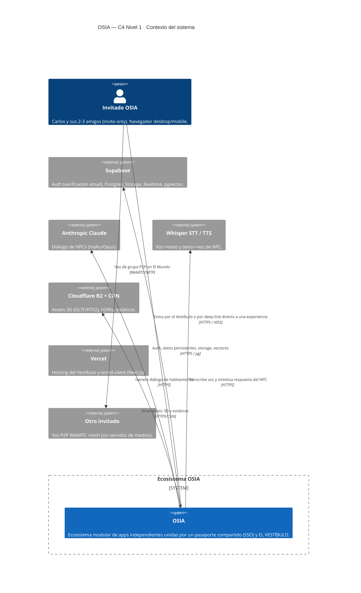
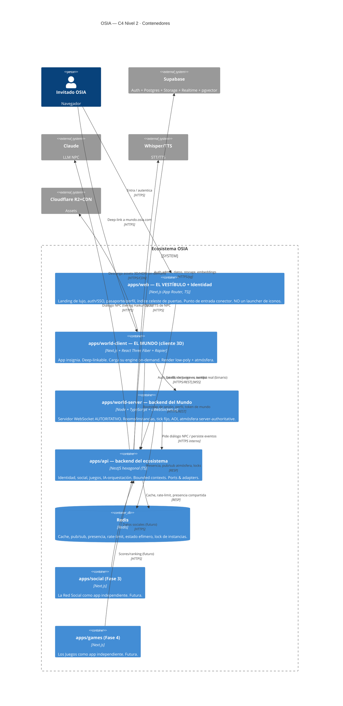
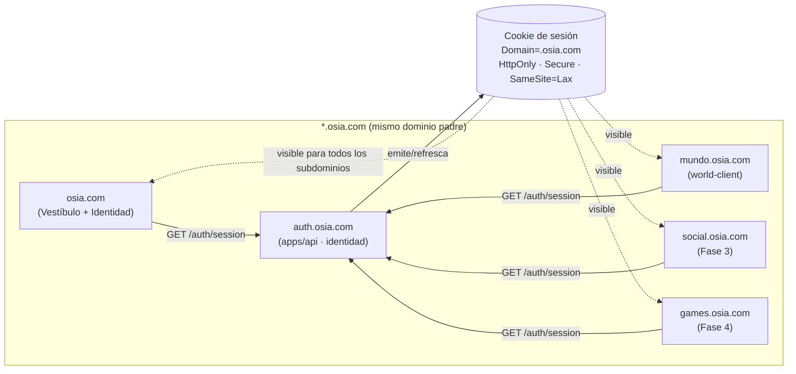
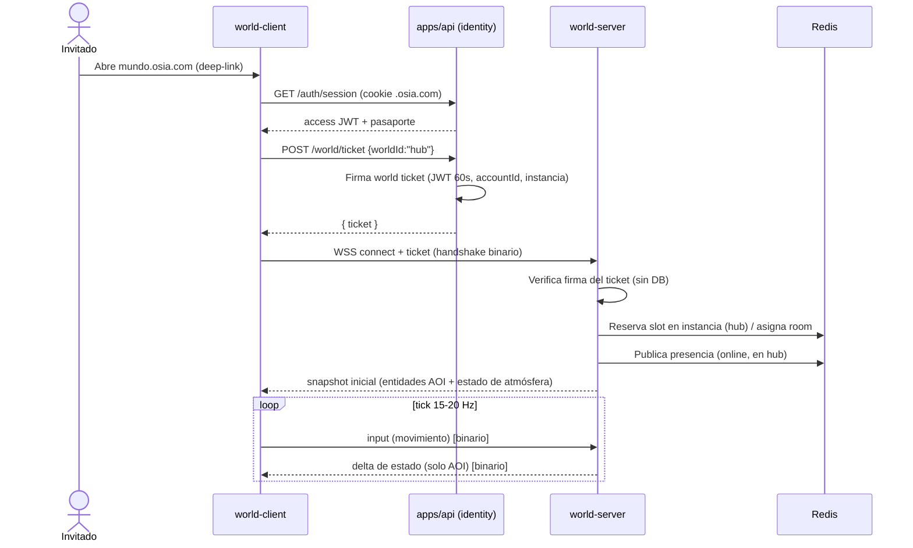
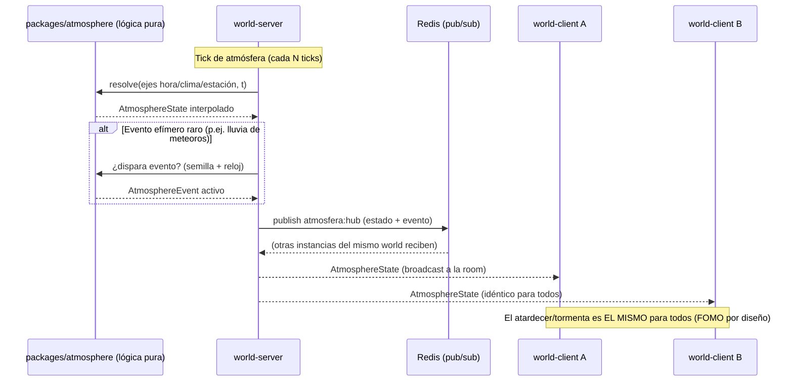
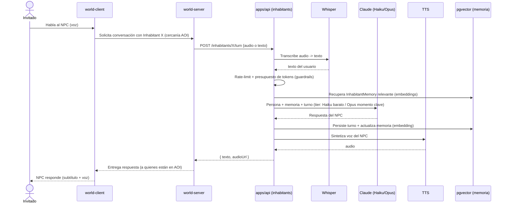
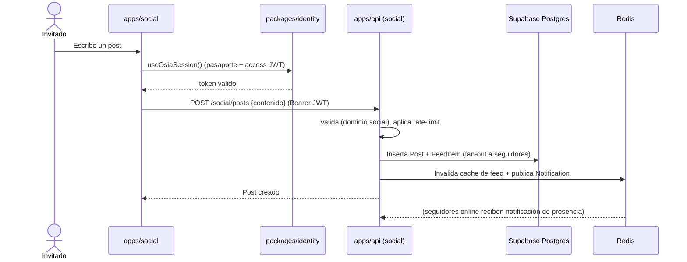
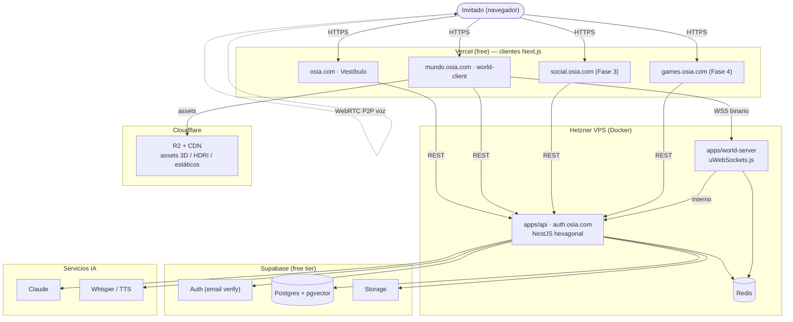
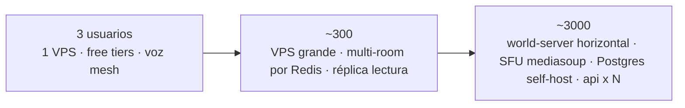

# 03 · Arquitectura del Sistema de OSIA

> Propósito: definir la arquitectura técnica de OSIA como un **ecosistema modular de apps independientes** unidas por una **identidad/pasaporte compartido (SSO)** y por **EL VESTÍBULO** — NO un launcher ni una super-app. Cubre contexto C4, modelo de conexión entre apps, componentes y responsabilidades, layout del monorepo, flujos de datos clave, topología de despliegue, camino de escalado, justificación de cada elección tecnológica y estrategia de entornos/secrets. | Estado: Borrador v1 | Fecha: 2026-06-19 | Parte del paquete de diseño OSIA.

---

## 0. Idea maestra de la arquitectura

Una sola frase: **OSIA no es una app que tiene módulos; es un ecosistema de apps independientes que comparten un pasaporte.**

Esto tiene consecuencias arquitectónicas profundas y bloqueadas por decisión de Carlos:

1. **No hay kernel de launcher.** Se descarta explícitamente la metáfora de "pantalla de inicio de teléfono / grilla de iconos". No existe un proceso central que cargue, monte o orqueste las demás apps. Cada experiencia (El Mundo, La Red Social, Los Juegos) es una **aplicación desplegable por separado**, con su propio ciclo de vida, su propio bundle, su propio dominio y su **deep-link directo**.
2. **Lo que une al ecosistema son DOS cosas, no un launcher:**
   - **(a) La IDENTIDAD/PASAPORTE compartido** — una sola cuenta OSIA (SSO) cuya sesión, perfil, estatus, presencia, amigos y cosméticos **viajan entre apps**. Implementada en `packages/identity` (cliente) + `apps/api` (servidor de identidad).
   - **(b) EL VESTÍBULO** (`apps/web`) — un punto de entrada/landing de lujo, minimal y cinematográfico (estilo vestíbulo de club privado / mapa de constelaciones) que presenta tu pasaporte y unas pocas "puertas" elegantes a cada experiencia. Es un **conector**, no un contenedor: no embebe las otras apps, las **enlaza**.
3. **Roadmap depth-first.** Se diseña modular desde el día 1 (barato: shell + contrato de identidad), pero se **construye en profundidad una superficie a la vez**, empezando por El Mundo (Fases 0–2). El Vestíbulo nace delgado (pasaporte + 1 puerta) y gana puertas a medida que aparecen apps. La amplitud **emerge**, no se construye de golpe.

> Por qué importa para un dev solo con ~250 USD y ~2 meses de runway: esta arquitectura permite **lanzar una superficie completa y bella** sin construir las demás, y **agregar una app nueva sin tocar las existentes**. Es el camino más corto a algo jugable que mantiene el momentum.

Documentos relacionados: visión y alcance en [`./00-vision-alcance.md`](./00-vision-alcance.md); pilares de experiencia en [`./01-pilares-experiencia.md`](./01-pilares-experiencia.md); marca y design system en [`./02-marca-design-system.md`](./02-marca-design-system.md); modelo de datos en [`./04-modelo-datos-er.md`](./04-modelo-datos-er.md); tiempo real en [`./05-realtime-mundo-networking.md`](./05-realtime-mundo-networking.md); rendimiento en [`./08-estrategia-rendimiento.md`](./08-estrategia-rendimiento.md); seguridad en [`./09-seguridad-infra-costos.md`](./09-seguridad-infra-costos.md); decisiones abiertas en [`./adr/ADR-000-decisiones-abiertas.md`](./adr/ADR-000-decisiones-abiertas.md).

---

## 1. Contexto C4

### 1.1 Nivel 1 — Diagrama de contexto del sistema

Quién usa OSIA y con qué sistemas externos habla.



### 1.2 Nivel 2 — Diagrama de contenedores

Las apps y servicios que componen el ecosistema. Nótese que **no hay un contenedor "launcher"**: el Vestíbulo (`web`) enlaza, no orquesta.



**Lectura clave del diagrama:** `web`, `world-client`, `social` y `games` son **clientes hermanos**, no anidados. Todos hablan con `apps/api` por REST para identidad y datos, y `world-client` además abre un canal WSS dedicado al `world-server` para el tiempo real. Si mañana se borra `apps/games`, nada más se rompe. Eso es el ecosistema modular.

---

## 2. Modelo de conexión entre apps (el corazón de la decisión)

### 2.1 Principio: apps independientes deep-linkables + pasaporte compartido

Cada experiencia es una **app independiente** que cumple tres condiciones:

| Condición | Qué significa |
|---|---|
| **Desarrollable por separado** | Su propio paquete en el monorepo, su propio build, sus propios tests. Un cambio en El Mundo no recompila La Red Social. |
| **Desplegable por separado** | Su propio target de deploy (Vercel project o servicio), su propio dominio (`mundo.osia.com`, `social.osia.com`, `games.osia.com`). Se puede tumbar una sin afectar las otras. |
| **Accesible por separado (deep-link)** | Un invitado puede ir **directo** a `social.osia.com` sin pasar por el Vestíbulo ni por El Mundo. El deep-link es ciudadano de primera clase. |

Lo que las une **no** es un launcher, son los dos pilares ya citados: **(a) Identidad/Pasaporte (SSO)** y **(b) El Vestíbulo**.

### 2.2 SSO entre subdominios — cómo viaja el pasaporte

Todas las apps viven bajo el dominio raíz `osia.com` en subdominios. El SSO se ancla en una **cookie de sesión a nivel de dominio padre** + un **endpoint de sesión en `apps/api`** (`auth.osia.com`).



**Mecánica concreta del SSO:**

1. **Login una sola vez.** El usuario verifica email y autentica en el Vestíbulo (`osia.com`) contra Supabase Auth, mediado por `apps/api`. `apps/api` setea una cookie de **sesión** con `Domain=.osia.com` (punto inicial), `HttpOnly`, `Secure`, `SameSite=Lax`. Por ser cookie de dominio padre, **todos los subdominios la reciben automáticamente**.
2. **Token corto + refresh.** La cookie transporta un **refresh token** opaco (rotatorio, guardado/validado server-side en `apps/api` + Redis). Cada app, al cargar, llama `GET auth.osia.com/auth/session`, que valida el refresh y devuelve un **access token JWT de vida corta** (~10 min) + el snapshot del pasaporte (perfil, estatus, presencia, flags). El cliente lo guarda en memoria (Zustand), **nunca en localStorage**.
3. **El pasaporte viaja.** `packages/identity` expone un hook/cliente común (`useOsiaSession()`, `OsiaIdentityClient`) que cada app importa. Así, "estar logueado en OSIA" es un estado único: si te logueas en el Vestíbulo y abres `mundo.osia.com` en otra pestaña, ya estás dentro — el pasaporte ya está ahí.
4. **Tiempo real con el mismo token.** El `world-client` no abre el WebSocket al `world-server` con la cookie; hace un **handshake**: pide a `apps/api` un *world ticket* (JWT firmado de un solo uso, vida ~60s, con `accountId`, `worldId`, instancia objetivo) y lo presenta al `world-server` en el `connect`. El `world-server` valida la firma (clave compartida o JWKS) **sin** consultar la DB en caliente. Detalle en [`./05-realtime-mundo-networking.md`](./05-realtime-mundo-networking.md).
5. **Logout global.** Revocar el refresh token en `apps/api`/Redis invalida la sesión en todas las apps en el siguiente refresh (≤10 min) o de inmediato vía pub/sub de presencia.

> Nota sobre cookies de subdominio: en local usamos `*.osia.localhost` (o `/etc/hosts`) para reproducir el mismo modelo de dominio padre, evitando sorpresas de `SameSite`. Ver §8.

### 2.3 Cómo se agrega una app nueva sin tocar las demás

Agregar `apps/social` (Fase 3) es un procedimiento **aditivo**, no invasivo:

| Paso | Acción | Qué NO se toca |
|---|---|---|
| 1 | Crear `apps/social` (Next.js) en el monorepo. | Ninguna app existente. |
| 2 | Importar `packages/identity` y `packages/ui`. La app obtiene SSO + design system gratis. | `world-client`, `web`. |
| 3 | Desplegar como nuevo Vercel project en `social.osia.com`. | DNS de los otros subdominios. |
| 4 | Agregar el bounded context `social` en `apps/api` (módulo Nest nuevo). | Otros módulos del API (aislados por puertos). |
| 5 | Añadir **una "puerta"** al Vestíbulo (`apps/web`) leyendo un **registro de experiencias** declarativo (no código de orquestación). | El resto del Vestíbulo. |

El paso 5 merece detalle: el Vestíbulo lee un **catálogo de experiencias** (en `packages/shared`, p.ej. `experiences.ts`), una lista de objetos `{ id, nombre, dominio, descripción, estado, requiereInvitación }`. El Vestíbulo renderiza una "puerta" por entrada habilitada. **Agregar una app = agregar un objeto al catálogo + desplegarla.** No hay registro imperativo, no hay plugin loader, no hay kernel.

```ts
// packages/shared/src/experiences.ts (ilustrativo)
export const EXPERIENCES = [
  { id: "world",  nombre: "El Mundo",      dominio: "mundo.osia.com",  estado: "activa",     fase: 0 },
  { id: "social", nombre: "La Red Social", dominio: "social.osia.com", estado: "proximamente", fase: 3 },
  { id: "games",  nombre: "Los Juegos",    dominio: "games.osia.com",  estado: "proximamente", fase: 4 },
] as const;
```

### 2.4 Por qué NO un kernel de launcher (justificación)

| Opción | Por qué se descarta / se elige |
|---|---|
| **Launcher / super-app (grilla de iconos, kernel que monta módulos)** | ❌ **Descartado por Carlos.** Se siente genérico (cada app de teléfono se ve así), no exclusivo. Técnicamente acopla todo a un shell: un bug en el kernel tumba todo, todas las apps comparten bundle/versión, no se pueden desplegar ni escalar por separado, y obliga a construir amplitud antes de profundidad (mortal para un dev solo con poco runway). |
| **Micro-frontends embebidos (Module Federation / iframes en un shell)** | ❌ Complejidad alta, versionado frágil, peor para 3D pesado (el world-client necesita su propio ciclo de vida y memoria). Innecesario para 2-3 usuarios. |
| **Ecosistema de apps independientes + SSO + Vestíbulo conector** ✅ | **Elegido.** Acoplamiento mínimo (solo el contrato de identidad y el catálogo declarativo), despliegue/escala independientes, deep-links nativos, y permite depth-first: lanzar El Mundo completo sin construir lo demás. La amplitud emerge. Coherente con "el arte de lo esencial": el conector es delgado y bello, no un dashboard. |

Decisión de modelo de conexión del Vestíbulo: ver alternativas y recomendación en [`./adr/ADR-000-decisiones-abiertas.md`](./adr/ADR-000-decisiones-abiertas.md) (decisión 4: vestíbulo celeste estilo mapa de constelaciones).

---

## 3. Componentes y responsabilidades

### 3.1 Apps

| App | Stack | Responsabilidad | Fase | Despliegue |
|---|---|---|---|---|
| **`apps/web` (EL VESTÍBULO)** | Next.js App Router, TS, R3F ligero opcional para el fondo celeste | Landing de lujo; auth/SSO (login, verificación email); pasaporte/perfil; índice celeste de puertas (catálogo de experiencias); waitlist/invitaciones. **Conector, no contenedor.** | 1 | Vercel (`osia.com`) |
| **`apps/world-client` (EL MUNDO)** | Next.js + React Three Fiber + drei + Rapier (WASM) + Zustand + TanStack Query | App insignia 3D. Render low-poly + capa de atmósfera (bloom, ACES, vignette, niebla, HDRI). Carga engine on-demand (deep-linkable). Cliente de tiempo real (predicción + reconciliación). Voz WebRTC P2P. | 0–2 | Vercel (`mundo.osia.com`) |
| **`apps/world-server`** | Node + TS + uWebSockets.js | Servidor WebSocket **autoritativo**: rooms/instancias (hub+zonas+plots), tick fijo 15–20 Hz, interest management (AOI), client prediction/reconciliation, **motor de atmósfera server-authoritative compartido**, eventos efímeros. Protocolo binario (msgpack/schema propio). | 0–2 | Hetzner (Docker) |
| **`apps/api`** | NestJS hexagonal (TS) | Backend del ecosistema por bounded contexts: identidad (auth/SSO, perfil, invitaciones, waitlist), social (feed/grafo), juegos (scores/ranking), orquestación IA (NPC), cosméticos/economía, sistema (audit, flags). Ports & adapters. | 1+ | Hetzner (Docker) |
| **`apps/social`** | Next.js | La Red Social como app independiente. | 3 | Vercel (`social.osia.com`) |
| **`apps/games`** | Next.js | Los Juegos como app independiente. | 4 | Vercel (`games.osia.com`) |

### 3.2 Packages compartidos

| Package | Responsabilidad | Consumidores |
|---|---|---|
| **`packages/identity`** | **Cliente SSO/pasaporte compartido.** `OsiaIdentityClient`, `useOsiaSession()`, manejo de access token en memoria, refresh silencioso, snapshot de pasaporte (perfil, estatus/popularidad, presencia, notificaciones), helpers de deep-link autenticado. Es el "enchufe" que toda app importa para estar dentro de OSIA. | web, world-client, social, games |
| **`packages/shared`** | Tipos y **contratos** (DTOs REST, schema de red binario, catálogo de eventos de atmósfera, **catálogo de experiencias**, códigos de error). Fuente de verdad cliente↔servidor. | todas |
| **`packages/atmosphere`** | **Motor de atmósfera: lógica PURA** (sin I/O) compartida cliente↔servidor: interpolación de ejes (hora/clima/estación), presets, resolución de eventos efímeros. Garantiza que cliente y servidor calculen lo mismo. | world-client, world-server, packages/shared |
| **`packages/ui`** | **Design system OSIA**: tokens (Champán/Onix/Marfil/Taupe), componentes con Italiana/Jost, motion. Ver [`./02-marca-design-system.md`](./02-marca-design-system.md). | web, social, games (y HUD del world-client) |
| **`packages/assets`** | Pipeline de assets: GLTF→Draco/Meshopt, KTX2/Basis, manifiestos de LOD. Sube a Cloudflare R2. Ver [`./08-estrategia-rendimiento.md`](./08-estrategia-rendimiento.md). | world-client (consume manifiestos) |
| **`docs`** | Este paquete de diseño. | humanos |
| **`infra`** | Docker, IaC, deploy (Hetzner, Vercel config, Cloudflare). | CI/CD |

---

## 4. Layout del monorepo (detallado)

Monorepo con **pnpm workspaces + Turborepo**. Raíz: `d:/Workspace/OSIA`.

```
OSIA/
├─ pnpm-workspace.yaml         # apps/*, packages/*
├─ turbo.json                  # pipeline: build, dev, lint, test, typecheck
├─ package.json                # scripts raíz, devDeps compartidas
├─ tsconfig.base.json          # paths a packages/*
├─ .env.example                # plantilla de variables (sin secretos)
├─ brand/                      # fonts, logos (existe)
├─ docs/                       # paquete de diseño (existe)
├─ infra/
│  ├─ docker/                  # Dockerfiles: world-server, api
│  ├─ compose/                 # docker-compose.dev.yml (redis, postgres local)
│  └─ deploy/                  # scripts Hetzner, config Cloudflare R2
├─ packages/
│  ├─ identity/                # cliente SSO/pasaporte
│  │  └─ src/{client,session,passport,deeplink}.ts
│  ├─ shared/
│  │  └─ src/{dto,net-schema,events,experiences,errors}.ts
│  ├─ atmosphere/
│  │  └─ src/{axes,interpolation,presets,events,resolve}.ts
│  ├─ ui/
│  │  └─ src/{tokens,components,motion}/
│  └─ assets/
│     └─ src/{pipeline,lod-manifest}.ts
└─ apps/
   ├─ web/                     # EL VESTÍBULO + identidad (Next.js)
   │  └─ app/{(landing),auth,pasaporte,vestibulo}/...
   ├─ world-client/            # EL MUNDO 3D (Next.js + R3F)
   │  └─ app/, src/{engine,net,atmosphere-view,hud,voice}/
   ├─ world-server/            # Node + uWebSockets.js
   │  └─ src/{net,rooms,sim,atmosphere,aoi,protocol}/
   ├─ api/                     # NestJS hexagonal (ver §4.1)
   ├─ social/                  # Fase 3
   └─ games/                   # Fase 4
```

### 4.1 `apps/api` — estructura hexagonal (espejo de `umas-*-service`)

Se replica la convención hexagonal que Carlos ya usa en los microservicios Java de FAC (`umas-resource-service`: `domain` / `application` / `infrastructure` con `web`/`controller`, `persistence`/`repository`, `messaging`, `model/{entity,dto,vo}`, `ports/{in,out}`). En NestJS, **un módulo Nest por bounded context**, cada uno con sus tres capas.

```
apps/api/
└─ src/
   ├─ main.ts
   ├─ app.module.ts                    # importa los módulos de contexto
   └─ contexts/
      ├─ identity/                     # bounded context Identidad
      │  ├─ domain/
      │  │  ├─ model/
      │  │  │  ├─ entity/              # Account, Profile, Invitation, ...
      │  │  │  ├─ vo/                  # Email, InviteCode, Handle, ...
      │  │  │  └─ dto/                 # comandos/consultas del dominio
      │  │  └─ ports/
      │  │     ├─ in/                  # casos de uso (interfaces): RegisterAccount, VerifyEmail
      │  │     └─ out/                 # AccountRepository, MailerPort, TokenPort (interfaces)
      │  ├─ application/
      │  │  └─ service/                # implementación de los puertos in (orquestación)
      │  └─ infrastructure/
      │     ├─ web/
      │     │  ├─ controller/          # REST controllers (adaptan HTTP -> puerto in)
      │     │  └─ exception/           # filtros/mapeo de errores
      │     ├─ persistence/
      │     │  └─ repository/          # adapter Supabase/pg del AccountRepository
      │     ├─ auth/                   # adapter Supabase Auth, emisión JWT/cookie SSO
      │     └─ messaging/              # (futuro) eventos
      │  └─ identity.module.ts
      ├─ social/                       # mismo patrón (Fase 3): Follow, Post, Feed, Notification
      ├─ games/                        # (Fase 4): Game, MatchSession, Score, Leaderboard
      ├─ inhabitants/                  # IA NPC: Persona, Memory(pgvector), Conversation
      │  └─ infrastructure/
      │     ├─ llm/                    # adapter Claude (tiering Haiku/Opus, guardrails)
      │     ├─ stt/ tts/               # adapters Whisper/TTS
      │     └─ web/controller/         # endpoint que el world-server consume
      └─ shared-kernel/               # value objects y utilidades transversales del API
```

**Regla de dependencias (hexagonal):** `domain` no conoce a nadie; `application` depende solo de los puertos del `domain`; `infrastructure` implementa los puertos `out` y expone los `in` vía controllers. Los adapters (Supabase, Claude, Redis) viven **solo** en `infrastructure`. Cambiar de Supabase a Hetzner self-host = reescribir un adapter, no el dominio.

---

## 5. Flujos de datos clave (sequenceDiagram)

### 5.1 Registro + verificación de email

```mermaid
sequenceDiagram
    actor U as Invitado
    participant W as apps/web (Vestíbulo)
    participant API as apps/api (identity)
    participant SB as Supabase Auth
    U->>W: Ingresa email + código de invitación
    W->>API: POST /auth/register {email, inviteCode}
    API->>API: Valida InviteCode (dominio: Invitation no usada)
    API->>SB: signUp(email) — genera verificación
    SB-->>U: Email con enlace de verificación
    U->>SB: Click en enlace (token)
    SB-->>W: Redirect a /auth/callback con token
    W->>API: POST /auth/verify {token}
    API->>SB: verifyOtp(token)
    SB-->>API: OK + user
    API->>API: Crea Account + Profile (estado: activo); marca Invitation usada
    API-->>W: Set-Cookie sesión (Domain=.osia.com) + pasaporte inicial
    W-->>U: Bienvenida al Vestíbulo (pasaporte listo)
```

### 5.2 Unirse al hub de El Mundo



### 5.3 Broadcast de atmósfera (server-authoritative compartido)



> Como `packages/atmosphere` es lógica pura compartida, el cliente puede **interpolar localmente** entre snapshots del servidor sin desincronizarse: ambos corren el mismo código. Detalle en [`./05-realtime-mundo-networking.md`](./05-realtime-mundo-networking.md).

### 5.4 Diálogo con un habitante IA (NPC)



### 5.5 Publicar en el feed (Fase 3)



---

## 6. Topología de despliegue



| Capa | Hosting | Por qué | Costo inicial |
|---|---|---|---|
| Clientes (web, world-client, social, games) | **Vercel** | CI/CD nativo Next.js, edge CDN, deploy por subdominio independiente, gratis. | 0 |
| world-server + Redis | **Hetzner VPS** | WebSocket persistente y CPU para el loop de simulación requieren proceso long-running con control fino (Vercel serverless no sirve para tick de juego). VPS barato y predecible. | ~4–6 €/mes |
| api (NestJS) | **Hetzner** (mismo VPS o vecino, Docker) | Proceso long-running, vecino del world-server (latencia interna baja para diálogo NPC). | incluido |
| Auth/DB/Storage/Vectores | **Supabase free** | Auth con verificación de email lista, Postgres gestionado, Storage, Realtime y pgvector en un solo proveedor gratis. | 0 |
| Assets/CDN | **Cloudflare R2 + CDN** | Egress barato/gratis para GLTF/KTX2/HDRI pesados; CDN global. | ~0 |
| Voz | **P2P WebRTC mesh** | Sin servidor de medios para grupos chicos → costo casi 0. | 0 |

> Con esta topología, los ~250 USD se estiran: lo único que sangra dinero es el VPS de Hetzner (~10 €/mes con Redis incluido) y el uso de IA (que **escala con el engagement** = costo correcto). Vercel/Supabase/Cloudflare arrancan en free tier.

---

## 7. Camino de escalado (de 3 a 3.000 usuarios)

Filosofía: **no escalar antes de tiempo.** Cada salto se hace solo cuando un límite real lo obliga.

| Escala | Síntoma / disparador | Qué cambia | Qué NO cambia |
|---|---|---|---|
| **3 usuarios (Fase 0–1)** | Carlos + amigos. | Todo en un VPS pequeño + free tiers. Voz P2P mesh. Una instancia de world-server, un room/hub. | La arquitectura. |
| **~30 (Fase 2–3)** | Más invitados; más diálogo IA. | Subir tier de IA con guardrails (cache de respuestas comunes, budget de tokens). Redis ya absorbe presencia/cache. Posible 2º room. | Hosting, modelo de apps. |
| **~300 (Fase 4)** | Picos de concurrencia en El Mundo; feed activo. | VPS más grande (vertical). Múltiples **instancias/rooms** del world-server coordinadas por Redis (shard por instancia). Réplica de lectura en Postgres si el feed pesa. CDN ya cubre assets. | SSO, deep-links, contratos. |
| **~3.000 (Fase 5+)** | Concurrencia real, voz de grupos grandes, costo Supabase free excedido. | Voz: **SFU mediasoup** para grupos grandes (mesh deja de escalar > ~6). World-server **horizontal**: varios procesos/VPS, cada uno dueño de N instancias; gateway de matchmaking por Redis. **Migrar DB a Postgres self-host en Hetzner** (deja free tier). `apps/api` escala horizontal detrás de balanceador (es stateless salvo Redis). Sentry + Prometheus/Grafana. | El **modelo de apps independientes + SSO + Vestíbulo**: es justamente lo que permite escalar cada superficie por separado. |



**Puntos de diseño que hacen barato el escalado:**
- `world-server` autoritativo con **rooms/instancias** (no planeta continuo) → escalar = repartir rooms entre procesos.
- `apps/api` **stateless** (estado en Redis/Postgres) → réplicas detrás de un balanceador sin sesión pegajosa.
- **Interest management (AOI)** y protocolo binario → el ancho de banda por usuario es acotado; ver [`./08-estrategia-rendimiento.md`](./08-estrategia-rendimiento.md).
- IA con **guardrails de costo** → el gasto sube con el valor, no con la esperanza.

---

## 8. Entornos, configuración y secrets

### 8.1 Entornos

| Entorno | Dominios | Dónde corre | Datos |
|---|---|---|---|
| **local** | `osia.localhost`, `mundo.osia.localhost`, `auth.osia.localhost` | `pnpm dev` (Turborepo) + `docker-compose` (Redis + Postgres local) | Supabase local o proyecto dev; seeds de prueba. |
| **staging** | `staging.osia.com` y `*.staging.osia.com` | Vercel preview (clientes) + Hetzner staging (api/world-server) | Proyecto Supabase staging; datos desechables. |
| **prod** | `osia.com` y `*.osia.com` | Vercel prod + Hetzner prod | Supabase prod; datos reales (invitados). |

> El SSO de subdominios se prueba **igual** en local gracias a `*.osia.localhost`: misma mecánica de cookie de dominio padre, mismo `SameSite=Lax`, mismas rutas. Esto evita el clásico "funciona en local pero el SSO falla en prod".

### 8.2 Configuración y secrets

- **Plantilla pública:** `.env.example` en la raíz documenta toda variable requerida (sin valores). Cada app tiene su `.env.local` ignorado por git.
- **Frontera cliente/servidor:** en Next.js, solo variables `NEXT_PUBLIC_*` llegan al navegador (URLs públicas, IDs de proyecto). **Service keys, claves de Claude/Whisper, secreto de firma de JWT y refresh tokens viven solo en `apps/api`/`world-server`** (servidor), nunca en bundles de cliente.
- **Dónde se guardan los secretos:**

| Secreto | Dónde | Notas |
|---|---|---|
| Vercel env (clientes) | Vercel project settings | Solo `NEXT_PUBLIC_*` + URLs. |
| Supabase service role key | Hetzner (env del contenedor `api`) | Nunca al cliente. |
| Claude / Whisper / TTS API keys | Hetzner (`api`) | Con guardrails de presupuesto. |
| JWT signing secret / world-ticket key | Hetzner (`api` + `world-server` comparten verificación) | Rotable; clave de firma de access token y world ticket. |
| Redis password | Hetzner | Red interna del VPS. |

- **Gestión:** archivos `.env` cifrados por entorno en `infra/deploy` (p.ej. con SOPS) o variables inyectadas por el panel de cada proveedor. Para un dev solo, lo pragmático: secretos en el panel de Vercel/Hetzner + `.env.example` versionado. Endurecimiento (rotación, vault) se documenta en [`./09-seguridad-infra-costos.md`](./09-seguridad-infra-costos.md).

---

## 9. Justificación de las elecciones tecnológicas

| Decisión | Elegido | Alternativas descartadas | Por qué |
|---|---|---|---|
| **Backend** | **NestJS hexagonal (TS)** | Spring Boot (Java), Express plano | Mismo lenguaje (TS) que clientes y world-server → **un solo runtime mental** para un dev solo, tipos compartidos vía `packages/shared`. La **arquitectura hexagonal** replica las convenciones que Carlos ya domina en Java (`umas-*-service`: domain/application/infrastructure, ports&adapters), así que la curva es cero. Spring obligaría a otra JVM, otro deploy y romper la unidad TS del monorepo. |
| **World server tiempo real** | **uWebSockets.js (desde cero, autoritativo)** | Colyseus, Construct3, Socket.IO | Carlos pidió **desde cero** y control total. uWS es el WebSocket más rápido en Node (C++ core), ideal para tick fijo + AOI + protocolo binario. Colyseus impone su modelo de rooms/serialización y oculta el loop; Construct3 es un engine de juego cerrado. Control fino = poder optimizar ancho de banda y simulación, clave para el rendimiento de "distant horizons". |
| **Cliente 3D** | **React Three Fiber (Three.js)** | Unreal/Unity (nativo), Babylon.js, Three.js imperativo | Web-first y **deep-linkable** (sin instalar): clave para invite-only por enlace. R3F da Three.js declarativo integrado con React/Zustand/TanStack (estado y datos coherentes con el resto). Unreal/Unity no son web-nativos y pesan; Babylon es sólido pero R3F encaja mejor con el stack React del monorepo y con la composición de postprocessing (bloom/ACES/vignette) que define el look "caro" sobre low-poly. |
| **DB/Auth** | **Supabase (Postgres + Auth + Storage + Realtime + pgvector)** | Firebase, Auth0 + RDS, self-host de entrada | Un solo proveedor gratis cubre **auth con verificación de email**, Postgres relacional (ideal para el ER), Storage, Realtime y **pgvector** (memoria de NPCs) — sin pegar 5 servicios. Firebase es NoSQL (peor para el grafo social/ranking). Self-host de entrada gasta runway. Migrable a Hetzner self-host cuando escale (es Postgres estándar). |
| **Monorepo** | **pnpm + Turborepo** | Multi-repo, Nx | El ecosistema **necesita** compartir tipos/contratos (`shared`), identidad (`identity`), atmósfera (`atmosphere`) y UI **sin publicar paquetes**. Monorepo da refactors atómicos y una sola PR para un cambio transversal. Multi-repo multiplicaría la fricción para un dev solo. Turbo cachea builds por app → cada app sigue siendo independiente al desplegar. Nx es más pesado de lo necesario. |
| **Modelo de conexión** | **Apps independientes + SSO + Vestíbulo** | Launcher/super-app, micro-frontends | Ver §2.4. Despliegue/escala independientes, deep-links nativos, depth-first. |
| **Voz** | **WebRTC P2P mesh** (SFU futuro) | SFU desde el día 1, servidor de voz | Costo casi 0 para 2–6 personas (sin servidor de medios), como Yugo. SFU (mediasoup) solo cuando los grupos crezcan. |

---

## 10. Cómo esta arquitectura sirve las fases (mapa)

| Fase | Qué de esta arquitectura se activa |
|---|---|
| **0 — El Sentimiento** | `world-client` + `world-server` (uWS, tick, AOI) + `packages/atmosphere` + voz P2P. Sin auth aún (o sesión efímera). |
| **1 — Identidad + Vestíbulo** | `apps/web` (Vestíbulo delgado) + `apps/api` (identity) + `packages/identity` (SSO). Nace el ecosistema: 1 puerta (El Mundo). |
| **2 — Mundo Vivo** | Contexto `inhabitants` en `apps/api` (Claude/Whisper/TTS/pgvector). Eventos de atmósfera. |
| **3 — Tejido Social** | `apps/social` + contexto `social` en `apps/api`. Se agrega una puerta al Vestíbulo (procedimiento §2.3). |
| **4 — Juego y Estatus** | `apps/games` + contexto `games`. Otra puerta. |
| **5+ — Hacia Gigante** | Escalado §7: world-server horizontal, SFU, Postgres self-host, economía cosmética. |

La arquitectura es la **misma desde el día 1**; lo que cambia es **cuántas superficies están enchufadas**. Eso es lo que hace verdad "todas las funciones son opcionales" sin construir amplitud antes que profundidad.

---

## 11. Referencias cruzadas

- Visión y alcance, fases y modelo de producto: [`./00-vision-alcance.md`](./00-vision-alcance.md)
- Pilares de experiencia (atmósfera, IA, social): [`./01-pilares-experiencia.md`](./01-pilares-experiencia.md)
- Marca y design system (`packages/ui`, tokens, HUD): [`./02-marca-design-system.md`](./02-marca-design-system.md)
- Modelo de datos y ER por bounded context: [`./04-modelo-datos-er.md`](./04-modelo-datos-er.md)
- Tiempo real del Mundo (protocolo, tick, AOI, reconciliación, world ticket): [`./05-realtime-mundo-networking.md`](./05-realtime-mundo-networking.md)
- Rendimiento (LOD, distant horizons, instancing, presupuestos): [`./08-estrategia-rendimiento.md`](./08-estrategia-rendimiento.md)
- Seguridad (SSO, cookies, secrets, guardrails IA, rate-limit): [`./09-seguridad-infra-costos.md`](./09-seguridad-infra-costos.md)
- Decisiones abiertas (mood de atmósfera, recorrido, avatares, modelo de Vestíbulo): [`./adr/ADR-000-decisiones-abiertas.md`](./adr/ADR-000-decisiones-abiertas.md)
