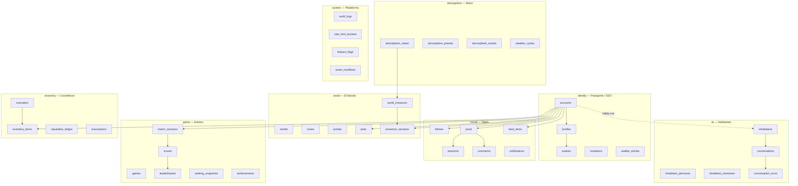
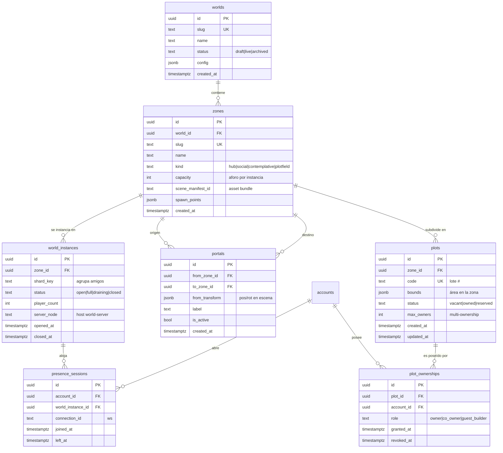
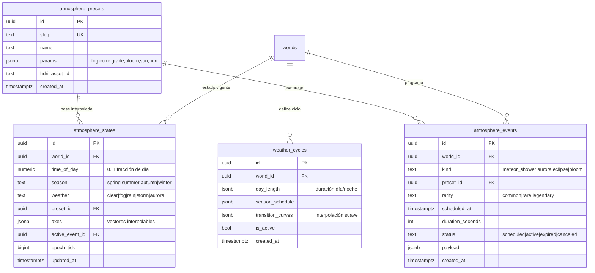
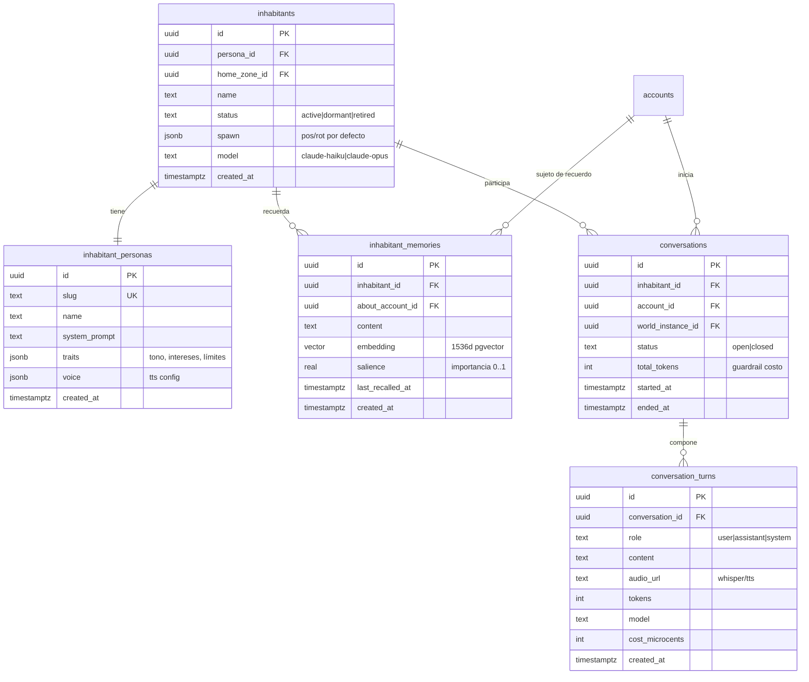
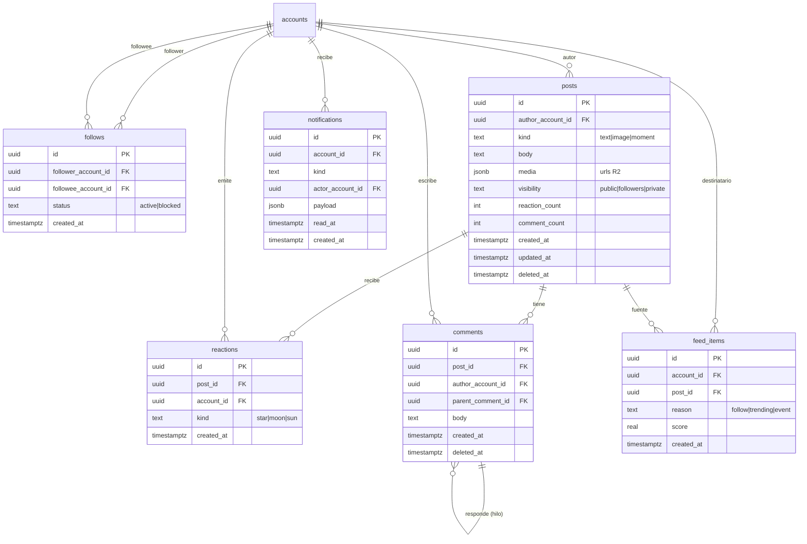
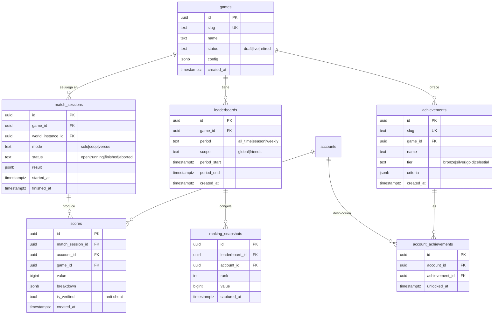
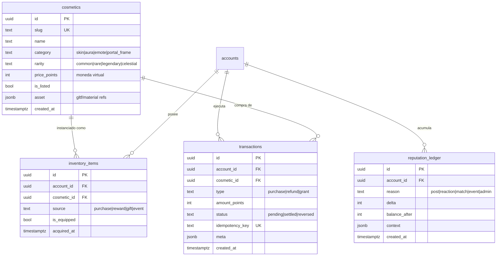
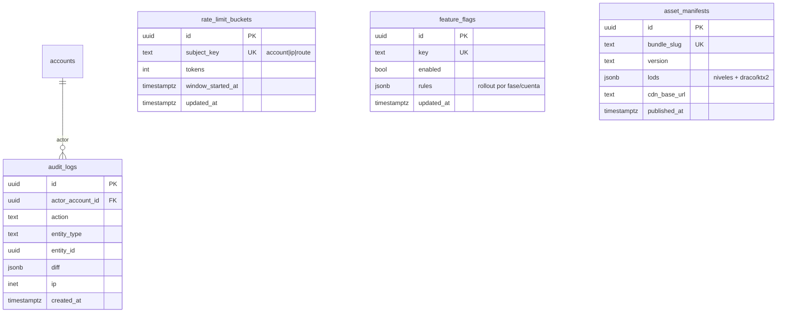

# Modelo de Datos (ER) — OSIA

> Propósito: Definir el MODELO DE DATOS completo y autoritativo de OSIA — entidades por bounded context, diagramas ER (Mermaid), tipos PostgreSQL, claves, índices, particionado, pgvector, RLS y estrategia de migraciones. Es el corazón del backend (`apps/api` NestJS hexagonal + Supabase). | Estado: Borrador v1 | Fecha: 2026-06-19 | Parte del paquete de diseño OSIA.

---

## 0. Cómo leer este documento

Este documento es el **contrato de persistencia** de OSIA. Define qué se guarda, con qué forma, con qué garantías de integridad y bajo qué reglas de acceso. No describe el código de los servicios (eso vive en arquitectura), ni el protocolo binario de red (eso vive en red en tiempo real): describe el **estado durable**.

Principio rector, alineado con la marca ("El arte de lo esencial"): **el esquema es contenido, no vasto**. Modelamos solo lo que una fase necesita y lo extendemos por migración. Pero diseñamos las **claves, los nombres y las relaciones** desde el día 1 para que las fases futuras se enchufen sin reescrituras dolorosas. Modular en la forma, profundo en lo que ya existe.

Cross-links:
- Visión y alcance: ver [./00-vision-alcance.md](./00-vision-alcance.md)
- Pilares de experiencia: ver [./01-pilares-experiencia.md](./01-pilares-experiencia.md)
- Marca y design system: ver [./02-marca-design-system.md](./02-marca-design-system.md)
- Arquitectura del sistema (hexagonal, bounded contexts): ver [./03-arquitectura-sistema.md](./03-arquitectura-sistema.md)
- Red en tiempo real (presencia, AOI, snapshots): ver [./05-realtime-mundo-networking.md](./05-realtime-mundo-networking.md)
- Habitantes IA (memoria, conversación): ver [./07-habitantes-ia.md](./07-habitantes-ia.md)
- Decisiones abiertas: ver [./adr/ADR-000-decisiones-abiertas.md](./adr/ADR-000-decisiones-abiertas.md)

---

## 1. Decisiones de diseño de datos (BLOQUEADAS para v1)

Antes del detalle, las reglas globales que aplican a **todas** las tablas. Cada una con su justificación, porque son load-bearing.

### 1.1. Identificadores: UUID v7 como PK por defecto

- **Decisión:** toda PK de entidad de dominio es `uuid` generado con **UUID v7** (time-ordered), columna `id uuid primary key default uuidv7()`.
- **Por qué v7 y no v4:** UUID v4 es aleatorio puro → inserciones dispersas en el índice B-tree → fragmentación y peor localidad de página en PostgreSQL. UUID v7 **embebe un timestamp en milisegundos en los bits altos**, así que los inserts son casi monotónicos (como `bigserial`) pero siguen siendo globalmente únicos y opacos. Esto da lo mejor de ambos mundos: índices compactos + IDs seguros de exponer en URLs/deep-links (no revelan conteo como un `serial`).
- **Por qué no `bigserial`:** OSIA es un ecosistema de apps independientes (Mundo, Social, Juegos) que comparten identidad. IDs secuenciales filtran volumen de negocio ("¿cuántas cuentas hay?") y complican futura federación/sharding. La marca es "por invitación, exclusiva": no exponemos métricas por accidente.
- **Función `uuidv7()`:** PostgreSQL 18 trae `uuidv7()` nativo. Supabase puede ir por detrás; mientras tanto definimos una función SQL propia (snippet en §13.4) y la usamos como `default`. Cuando el `uuidv7()` nativo esté disponible, se cambia el `default` por migración sin tocar datos.
- **Excepciones (no usan uuid):**
  - Tablas de **catálogo/enum** estables y pequeñas (`atmosphere_presets`, `cosmetics`, `achievements`) usan `slug text` o `code text` como clave natural legible, además de su `id uuid`. El slug es estable y se referencia desde `packages/shared`.
  - Tablas de **estado efímero de alto churn** que viven en **Redis**, no en Postgres (presencia en vivo, rate-limit buckets calientes, snapshots de tick): ver §11. En Postgres solo persiste el agregado durable.

### 1.2. Timestamps y soft-delete

Toda tabla durable lleva las columnas de auditoría temporal:

| Columna | Tipo | Default | Notas |
| --- | --- | --- | --- |
| `created_at` | `timestamptz` | `now()` | inmutable; índice si la tabla se ordena por creación |
| `updated_at` | `timestamptz` | `now()` | actualizado por trigger `set_updated_at` |
| `deleted_at` | `timestamptz` | `null` | soft-delete; `null` = vivo |

- **Por qué `timestamptz` y no `timestamp`:** siempre UTC en la base; la zona horaria es presentación. Un mundo con motor de atmósfera **server-authoritative** (mismo atardecer para todos) no puede permitirse ambigüedad de zona.
- **Soft-delete por defecto, hard-delete por excepción:** para entidades de dominio con valor histórico/social (cuentas, posts, conversaciones) usamos `deleted_at`. Las vistas y consultas de aplicación filtran `where deleted_at is null`. Permite "deshacer", auditoría, y cumplir derecho al olvido con un **purgador** posterior (cron) que hace hard-delete real tras N días. Tablas puramente técnicas (sesiones de presencia cerradas, turnos de conversación viejos) sí se borran duro por retención.
- **Trigger `set_updated_at`:** una sola función reutilizable (§13.5) enganchada con `before update` en cada tabla. Evita olvidar tocar `updated_at` desde el código.

### 1.3. Naming

- **snake_case** en todo: tablas en **plural** (`accounts`, `profiles`, `world_instances`), columnas en singular.
- FKs nombradas `<entidad_singular>_id` (`account_id`, `zone_id`).
- Índices: `idx_<tabla>_<columnas>`; únicos: `uq_<tabla>_<columnas>`; FKs: `fk_<tabla>_<ref>`; checks: `ck_<tabla>_<regla>`.
- Enums de dominio: tipo `text` + `CHECK (... in (...))` **o** `ENUM` nativo según volatilidad (ver §1.4).

### 1.4. Enums: `text + CHECK` vs `ENUM` nativo

- **Regla:** si el conjunto de valores **crece con el producto** (estados de partida, tipos de notificación, tipos de evento de atmósfera) → `text` + `CHECK` + constante en `packages/shared`. Agregar un valor es solo una migración que altera el `CHECK`, sin el dolor de `ALTER TYPE ... ADD VALUE` (que en Postgres viejo no era transaccional).
- Si el conjunto es **cerrado y conceptual** (rol de cuenta, visibilidad de post) → puede ser `ENUM` nativo por compacidad. En v1 preferimos `text + CHECK` casi siempre por flexibilidad de dev solo.

### 1.5. Esquemas (schemas) de Postgres por bounded context

Para mantener orden hexagonal y permitir RLS granular, agrupamos tablas en **schemas** lógicos. (Supabase expone `public` por PostgREST; las tablas que NO deben tener API REST automática viven fuera de `public`.)

| Schema | Bounded context | API REST auto (PostgREST)? |
| --- | --- | --- |
| `public` | tablas con lectura directa de cliente vía Supabase (perfil propio, feed) | sí, con RLS estricto |
| `identity` | Account, EmailVerification, Invitation, Waitlist | no (solo `apps/api`) |
| `world` | World, Zone, Instance, Portal, Plot, Presence | no |
| `atmosphere` | AtmosphereState, Preset, Event, WeatherCycle | lectura sí (estado actual), escritura no |
| `ai` | Inhabitant, Persona, Memory (pgvector), Conversation | no |
| `social` | Follow, Post, Reaction, Comment, FeedItem, Notification | sí, RLS |
| `game` | Game, MatchSession, Score, Leaderboard, Ranking, Achievement | lectura sí (rankings), escritura no |
| `economy` | Cosmetic, InventoryItem, Reputation, Transaction | no |
| `system` | AuditLog, RateLimitBucket, FeatureFlag, AssetManifest | no |

> **Justificación:** el cliente web (`apps/web`, el Vestíbulo) puede leer su propio pasaporte y feeds directo de Supabase con RLS, lo que ahorra endpoints. Pero la **autoridad** (mundo, atmósfera, IA, economía, juego) pasa siempre por `apps/api`/`apps/world-server`, nunca por escritura directa del cliente. El schema decide quién puede tocar qué.

### 1.6. Multi-tenancy / particionado de futuro

OSIA v1 es **single-tenant** (un solo mundo, invite-only, 2-3 personas). NO sobre-ingenierizamos sharding. Pero dos tablas nacen **particionadas** porque su crecimiento es estructural y reparticionar luego es caro: `feed_items` (por hash de `account_id`) y `audit_logs` / `conversation_turns` (por rango de tiempo). Detalle en §6.6 y §10.

---

## 2. Mapa de bounded contexts (visión macro)



> El núcleo que **conecta todo** es `accounts` (el pasaporte). Cada app independiente (Mundo, Social, Juegos) cuelga de `account_id`. Esa es la "identidad compartida" de la constitución, hecha datos.

---

## 3. Bounded context: IDENTIDAD (`identity`)

El pasaporte celeste. Es el contexto más estable y el más protegido: una cuenta vive entre apps.

### 3.1. ER

```mermaid
erDiagram
  accounts ||--|| profiles : "1:1"
  accounts ||--o{ avatars : "tiene"
  profiles ||--o| avatars : "activo"
  accounts ||--o{ email_verifications : "emite"
  accounts ||--o{ invitations : "envía (inviter)"
  invitations |o--|| accounts : "consume (invitee)"
  waitlist_entries |o--o| invitations : "se promueve a"

  accounts {
    uuid id PK
    citext email UK
    text  password_hash "null si solo OAuth"
    text  status "invited|active|suspended"
    text  role "member|admin"
    uuid  invited_by_account_id FK
    timestamptz email_verified_at
    timestamptz last_seen_at
    timestamptz created_at
    timestamptz updated_at
    timestamptz deleted_at
  }
  profiles {
    uuid id PK
    uuid account_id FK,UK
    citext handle UK "@osia"
    text display_name
    text bio
    text avatar_url
    text accent_color "hex champán por defecto"
    int  popularity_points
    int  reputation
    jsonb privacy "visibilidad"
    timestamptz created_at
    timestamptz updated_at
    timestamptz deleted_at
  }
  avatars {
    uuid id PK
    uuid account_id FK
    text kind "lowpoly|rpm"
    jsonb config "partes, colores, cosméticos"
    text gltf_url
    bool is_active
    timestamptz created_at
    timestamptz updated_at
  }
  email_verifications {
    uuid id PK
    uuid account_id FK
    text token_hash UK
    text purpose "signup|email_change"
    timestamptz expires_at
    timestamptz consumed_at
    timestamptz created_at
  }
  invitations {
    uuid id PK
    uuid inviter_account_id FK
    citext invited_email
    text code UK
    text status "pending|accepted|revoked|expired"
    uuid accepted_by_account_id FK
    timestamptz expires_at
    timestamptz accepted_at
    timestamptz created_at
    timestamptz updated_at
  }
  waitlist_entries {
    uuid id PK
    citext email UK
    text source "landing|discord|referral"
    text status "queued|invited|joined|rejected"
    uuid promoted_invitation_id FK
    jsonb meta "utm, referrer"
    timestamptz created_at
    timestamptz updated_at
  }
```



### 3.2. `accounts` — campos

| Columna | Tipo | Constraints | Default | Índice |
| --- | --- | --- | --- | --- |
| `id` | `uuid` | PK | `uuidv7()` | PK |
| `email` | `citext` | `NOT NULL`, `UNIQUE` | — | `uq_accounts_email` |
| `password_hash` | `text` | nullable (cuentas OAuth puro no tienen) | `null` | — |
| `status` | `text` | `NOT NULL`, `CHECK in ('invited','active','suspended')` | `'invited'` | `idx_accounts_status` (parcial) |
| `role` | `text` | `NOT NULL`, `CHECK in ('member','admin')` | `'member'` | — |
| `invited_by_account_id` | `uuid` | `FK accounts(id) ON DELETE SET NULL` | `null` | `idx_accounts_invited_by` |
| `email_verified_at` | `timestamptz` | nullable | `null` | — |
| `last_seen_at` | `timestamptz` | nullable | `null` | `idx_accounts_last_seen` |
| `created_at` | `timestamptz` | `NOT NULL` | `now()` | — |
| `updated_at` | `timestamptz` | `NOT NULL` | `now()` | — |
| `deleted_at` | `timestamptz` | nullable | `null` | — |

- **`citext` para email:** comparación case-insensitive nativa → no hay duplicados por mayúsculas, sin `lower()` en cada query.
- **Relación con Supabase Auth:** Supabase Auth maneja la verificación de email y la sesión JWT. `accounts.id` se mantiene **igual a `auth.users.id`** (sincronizado por trigger `on auth.users insert`), para que el `auth.uid()` del JWT mapee directo a nuestra cuenta y las políticas RLS sean simples. `password_hash` solo se usa si algún día salimos de Supabase Auth; por defecto es `null` y delegamos.

### 3.3. `profiles` — campos

| Columna | Tipo | Constraints | Default | Índice |
| --- | --- | --- | --- | --- |
| `id` | `uuid` | PK | `uuidv7()` | PK |
| `account_id` | `uuid` | `NOT NULL`, `FK accounts(id) ON DELETE CASCADE`, `UNIQUE` | — | `uq_profiles_account` |
| `handle` | `citext` | `NOT NULL`, `UNIQUE`, `CHECK (handle ~ '^[a-z0-9_]{3,20}$')` | — | `uq_profiles_handle` |
| `display_name` | `text` | `NOT NULL`, `CHECK (char_length<=40)` | — | — |
| `bio` | `text` | `CHECK (char_length<=280)` | `null` | — |
| `avatar_url` | `text` | nullable | `null` | — |
| `accent_color` | `text` | `CHECK (~ '^#[0-9A-Fa-f]{6}$')` | `'#CBB89A'` (champán) | — |
| `popularity_points` | `integer` | `NOT NULL`, `CHECK (>=0)` | `0` | `idx_profiles_popularity` |
| `reputation` | `integer` | `NOT NULL` | `0` | — |
| `privacy` | `jsonb` | `NOT NULL` | `'{"profile":"members","presence":"followers"}'` | GIN si se filtra |
| `created_at`/`updated_at`/`deleted_at` | `timestamptz` | — | ver §1.2 | — |

- **`accent_color` default champán `#CBB89A`:** la marca aparece en el dato. El pasaporte por defecto ya es "de lujo".
- **`popularity_points` desnormalizado aquí** (además del ledger en `economy`): el perfil necesita leerlo en un acceso O(1) para el feed y el Vestíbulo. La fuente de verdad es `reputation_ledger` (§9); este campo es un caché actualizado por trigger/servicio.

### 3.4. `invitations` y `waitlist_entries`

La escasez es marca. El flujo: alguien entra a `waitlist_entries` (landing/Discord). Un admin (o automatismo de FOMO) **promueve** una entrada → crea una `invitation` con `code` único y `expires_at`. El invitado canjea el código → se crea `accounts` con `status='invited'` y `invited_by_account_id`, y la invitación pasa a `accepted`.

- `invitations.code`: `text UNIQUE`, corto y bonito (p. ej. `OSIA-XXXX`), generado fuera de la base.
- Índice parcial útil: `idx_invitations_pending ON invitations(expires_at) WHERE status='pending'` para el cron que expira invitaciones.
- `waitlist_entries.status` permite medir el funnel sin tablas extra.

### 3.5. RLS — Identidad

| Tabla | Política |
| --- | --- |
| `accounts` | **Sin RLS de cliente**; solo `apps/api` con service role. El cliente nunca lee `accounts` directo. |
| `profiles` | `SELECT` permitido si `deleted_at is null` y (`privacy.profile='public'` OR el lector es member autenticado OR es el dueño). `UPDATE` solo `account_id = auth.uid()`. |
| `avatars` | `SELECT`/`UPDATE`/`INSERT` solo dueño (`account_id = auth.uid()`). |
| `email_verifications`, `invitations`, `waitlist_entries` | sin acceso de cliente; service role only. |

---

## 4. Bounded context: MUNDO (`world`)

El Mundo es **instanciado** (hub + zonas + plots por portales), no continuo (constitución). El modelo refleja esa jerarquía de rooms.

### 4.1. ER



### 4.2. Notas clave

- **`world_instances` = rooms de Meta-Horizon-style.** Un mismo `zone` (p. ej. el hub) puede tener N instancias vivas. `shard_key` agrupa a un grupo de amigos en la misma instancia (clave: 2-3 personas siempre juntas). El `world-server` (uWebSockets.js) es la **autoridad en vivo**; `world_instances` y `presence_sessions` son su **proyección durable** en Postgres para historial/analytics, no el estado de tick (eso es Redis, §11).
- **`presence_sessions`:** una fila por conexión. La presencia **en vivo** (quién está online ahora, en qué instancia, posición) vive en Redis con TTL; aquí persistimos solo apertura/cierre para "estuviste 3h en el mundo" y para el contexto social ("quién estuvo conmigo"). Se purga por retención.
- **Multi-ownership de plots → `plot_ownerships` (tabla puente).** No metemos `owner_account_id` en `plots`. Un plot puede tener `owner`, `co_owner`(s) y `guest_builder`(s) — esto es Fase 5 (plots/terrenos propios, escasez), pero el modelo ya lo soporta. Constraint: un único `owner` activo por plot vía índice parcial único:
  ```sql
  CREATE UNIQUE INDEX uq_plot_single_owner
    ON world.plot_ownerships (plot_id)
    WHERE role = 'owner' AND revoked_at IS NULL;
  ```
  Esto garantiza "un dueño principal" pero permite varios co-dueños. `plots.max_owners` acota el total.
- **`portals`:** un portal es dirigido (from→to). Dos filas para ida y vuelta. `from_transform` ubica el portal físicamente en la escena de la zona origen.

### 4.3. RLS — Mundo

- `worlds`, `zones`, `portals`: lectura pública (autenticado member); escritura admin/service. Son contenido de mundo.
- `world_instances`: lectura service/admin (analytics); el cliente recibe su instancia por el world-server, no por REST.
- `plots`, `plot_ownerships`: lectura member; `UPDATE`/`INSERT` de ownership solo service (la economía de plots la arbitra `apps/api`). Un member puede leer sus plots: `account_id = auth.uid()`.

---

## 5. Bounded context: ATMÓSFERA (`atmosphere`)

Motor **server-authoritative y compartido**: el atardecer/tormenta son los mismos para todos (constitución). Combinatorio (ejes interpolados) + eventos efímeros raros (FOMO).

### 5.1. ER



### 5.2. Notas clave

- **`atmosphere_states` es la tabla autoritativa**: normalmente **una fila vigente por `world_id`** (la actual). El `world-server` la lee al arrancar, luego la avanza en memoria/Redis por tick y **persiste el estado base** periódicamente (no cada tick). `epoch_tick` permite reanudar tras reinicio: el cielo no "salta".
- **`axes jsonb`:** el motor es combinatorio; los ejes (luz, niebla, color grade, viento, densidad de partículas) son vectores que se **interpolan** entre presets. Guardar como `jsonb` evita 20 columnas y permite evolucionar ejes sin migración. La **lógica de interpolación es PURA y compartida** (`packages/atmosphere`) para que cliente y servidor coincidan — la base solo guarda el punto, no recalcula.
- **`atmosphere_presets`:** disciplina de Fase 0 — "3-4 atmósferas brutales", decenas después (barato). Cada preset es un slug estable (`crepusculo-onix`, `niebla-marfil`, `aurora-champan`) referenciado desde `packages/shared`.
- **`atmosphere_events` = FOMO por diseño.** Eventos efímeros raros (lluvia de meteoros 1×/semana a hora random). Se programan con `scheduled_at` futuro; el `mission-scheduler`/cron los activa, el world-server los emite a las instancias. `rarity` alimenta el estatus ("estuviste en la aurora legendaria"). Índice: `idx_atmo_events_scheduled ON atmosphere_events(scheduled_at) WHERE status='scheduled'`.

### 5.3. RLS — Atmósfera

- `atmosphere_states` (fila vigente) y `atmosphere_presets`: **lectura pública** (incluso el cliente puede leer el estado actual para precargar HDRI/grade). Escritura: solo service (world-server / scheduler).
- `atmosphere_events`: lectura member (para teasing de "viene algo"); escritura service.

---

## 6. Bounded context: HABITANTES IA (`ai`)

Diferenciador central: el mundo nunca se siente vacío (constitución). Memoria con **pgvector**.

### 6.1. ER



### 6.2. Notas clave

- **`inhabitant_memories.embedding vector(1536)`** (pgvector). Memoria semántica: cuando el jugador habla, se embebe la frase, se hace **búsqueda ANN** sobre los recuerdos de ese habitante (filtrando por `about_account_id` para memoria personalizada) y se inyectan los top-k al prompt de Claude. Índice:
  ```sql
  CREATE INDEX idx_inh_mem_embedding
    ON ai.inhabitant_memories
    USING hnsw (embedding vector_cosine_ops);
  ```
  - **HNSW y no IVFFlat:** HNSW da mejor recall sin necesidad de re-`ANALYZE`/entrenamiento; con volúmenes pequeños (2-3 jugadores) el costo de build es trivial y la latencia de query es la que importa para conversación fluida.
  - `salience` + `last_recalled_at`: permiten **olvido** (decae salience, se purgan recuerdos triviales) — barato y necesario para no inflar tokens/almacenamiento.
- **Guardrails de costo en datos:** `conversations.total_tokens` y `conversation_turns.cost_microcents`/`tokens`/`model` hacen el **presupuesto de tokens auditable**. El tiering (Haiku barato / Opus para momentos clave) se ve en `model` por turno. `apps/api` corta la conversación si `total_tokens` supera el presupuesto. Esto es la disciplina "el costo de IA escala con el engagement (costo correcto)" hecha tabla.
- **`conversation_turns` crece rápido** → candidata a particionado por rango de tiempo (mensual) + retención (audio se mueve a R2 y `audio_url` apunta allá; el blob no vive en Postgres).

### 6.3. RLS — IA

- Todo el schema `ai` es **service-only** (la conversación la arbitra `apps/api`/world-server con presupuesto y rate-limit). El cliente nunca consulta memorias ni prompts. Un member podría leer su **propio** historial de `conversations`/`conversation_turns` (`account_id = auth.uid()`) si exponemos "tus charlas", pero `inhabitant_memories` (lo que el NPC piensa de ti) y `system_prompt` jamás se exponen.

---

## 7. Bounded context: SOCIAL (`social`)

Tejido social (Fase 3): feed, seguidores/popularidad, presencia, notificaciones. "El estatus se vuelve visible".

### 7.1. ER



### 7.2. Notas clave

- **`follows` es grafo dirigido.** Constraint clave: no auto-follow ni duplicados.
  ```sql
  ALTER TABLE social.follows
    ADD CONSTRAINT ck_follows_no_self CHECK (follower_account_id <> followee_account_id);
  CREATE UNIQUE INDEX uq_follows_pair
    ON social.follows (follower_account_id, followee_account_id);
  ```
  Índices recíprocos para "a quién sigo" y "quién me sigue": `idx_follows_follower`, `idx_follows_followee`.
- **`posts.reaction_count`/`comment_count` desnormalizados:** se incrementan por trigger al insertar `reactions`/`comments`. El feed necesita estos números sin `COUNT(*)` por post. La fuente de verdad sigue siendo las tablas hijas.
- **`reactions` única por (post, account, kind)** evita doble reacción:
  ```sql
  CREATE UNIQUE INDEX uq_reactions ON social.reactions (post_id, account_id, kind);
  ```
- **`comments` con `parent_comment_id` self-FK** → hilos. Para v1 (pocos usuarios) un árbol simple basta; sin `ltree` todavía.

### 7.3. `feed_items` — feed materializado y particionado

El feed es la consulta más caliente del lado social. Estrategia **fan-out-on-write con tabla materializada particionada por hash de destinatario**:

- Cuando alguien postea, `apps/api` inserta un `feed_item` por cada seguidor (fan-out). Leer el feed de un usuario = `SELECT ... WHERE account_id=$1 ORDER BY score DESC, created_at DESC LIMIT 50`.
- **Particionado:** `feed_items` particionada por `HASH (account_id)` en (p. ej.) 8 particiones. Justificación: aísla el hot-set de cada usuario, mantiene índices más pequeños y prepara escala sin reescritura. Con 2-3 usuarios es overkill funcional pero **gratis de definir ahora y carísimo de retrofittear**.
  ```sql
  CREATE TABLE social.feed_items (
    id uuid DEFAULT uuidv7(),
    account_id uuid NOT NULL,
    post_id uuid NOT NULL,
    reason text NOT NULL,
    score real NOT NULL DEFAULT 0,
    created_at timestamptz NOT NULL DEFAULT now(),
    PRIMARY KEY (account_id, id)
  ) PARTITION BY HASH (account_id);
  -- 8 particiones social.feed_items_p0..p7
  CREATE INDEX idx_feed_acct_score
    ON social.feed_items (account_id, score DESC, created_at DESC);
  ```
  - Retención: un cron poda `feed_items` viejos (>N días) por partición.
  - Alternativa fan-out-on-read se descarta para v1 porque complica el ranking; con poca gente el costo de write es trivial.

### 7.4. RLS — Social

- `posts`: `SELECT` según `visibility` (público / followers-only vía subquery a `follows` / dueño). `INSERT`/`UPDATE`/`DELETE(soft)` solo autor.
- `reactions`, `comments`: `INSERT` member autenticado; `DELETE(soft)` autor.
- `feed_items`, `notifications`: `SELECT`/`UPDATE(read_at)` solo dueño (`account_id = auth.uid()`). Inserción solo service (el fan-out lo hace `apps/api`).

---

## 8. Bounded context: JUEGO Y ESTATUS (`game`)

Fase 4: primer minijuego con ranking global + cosméticos. Prestigio y competencia.

### 8.1. ER



### 8.2. Notas clave

- **`scores.value bigint` + `is_verified`:** el world-server/`apps/api` valida el score antes de marcar `is_verified=true`. **Solo scores verificados entran al leaderboard** (anti-cheat barato).
- **Leaderboard en vivo = Redis Sorted Set; `ranking_snapshots` = congelado durable.** El ranking caliente (top-N en tiempo real) vive en un **ZSET de Redis** (`leaderboard:{game}:{period}`) — O(log N) para insertar y rangos. Periódicamente (fin de semana/temporada) `apps/api` **materializa** el ranking en `ranking_snapshots` para historial inmutable ("fuiste #1 esta semana"). Esto evita escanear/ordenar Postgres en cada lectura de ranking.
  - Índice de consulta de snapshot: `idx_ranking_lb_rank ON ranking_snapshots(leaderboard_id, rank)`.
  - Para "mejor score por jugador" sí indexamos `scores`: `idx_scores_game_value ON game.scores (game_id, value DESC) WHERE is_verified`.
- **`achievements.tier` incluye `celestial`** (el oro de la marca) — el logro máximo es astral, no genérico.

### 8.3. RLS — Juego

- `games`, `leaderboards`, `ranking_snapshots`, `achievements`: **lectura pública** (el ranking es estatus, debe verse). Escritura: service.
- `scores`, `match_sessions`, `account_achievements`: lectura del propio (`account_id = auth.uid()`) + leaderboard agregado público; escritura service (nunca el cliente reporta su propio score directo a la DB).

---

## 9. Bounded context: ECONOMÍA / COSMÉTICOS (`economy`)

Cosméticos y reputación (Fase 4-5). La economía cosmética eventualmente paga servidores.

### 9.1. ER



### 9.2. Notas clave

- **`reputation_ledger` es append-only (event-sourced).** La popularidad/reputación NO se muta en sitio: cada cambio es una fila con `delta` y `balance_after`. `profiles.popularity_points`/`reputation` son cachés derivados (§3.3). Justificación: auditable, reversible, y evita race conditions de `UPDATE ... SET x = x + n` bajo concurrencia. Es la misma disciplina que un libro mayor contable.
- **`transactions.idempotency_key UNIQUE`:** toda compra cosmética lleva clave de idempotencia → reintentos de red no doble-cobran. Es moneda **virtual** (no dinero real en v1), pero se trata con rigor transaccional.
- **`inventory_items.is_equipped`:** lo equipado se refleja en `avatars.config`. Un cosmético se posee una vez (índice único por defecto evitable si hay stackables; en v1, único):
  ```sql
  CREATE UNIQUE INDEX uq_inventory_unique
    ON economy.inventory_items (account_id, cosmetic_id);
  ```

### 9.3. RLS — Economía

- `cosmetics`: lectura pública (la tienda se ve); escritura service.
- `inventory_items`, `reputation_ledger`, `transactions`: lectura del propio (`account_id = auth.uid()`); **escritura siempre service** (la economía la arbitra `apps/api`; el cliente nunca se acredita puntos solo).

---

## 10. Bounded context: SISTEMA / PLATAFORMA (`system`)

Transversal: auditoría, rate-limit durable, flags, manifiestos de assets.

### 10.1. ER



### 10.2. Notas clave

- **`audit_logs` particionada por rango de tiempo (mensual)** + retención. Es append-only; jamás se actualiza. Captura acciones sensibles (cambio de rol, revocar invitación, ajustes de economía).
- **`rate_limit_buckets` es el respaldo durable**; el rate-limit caliente vive en Redis (token bucket). Postgres solo guarda buckets que deben sobrevivir reinicios (p. ej. límites por cuenta de larga ventana, presupuesto diario de IA).
- **`feature_flags.rules jsonb`** habilita el rollout **depth-first por fase**: encender El Mundo, luego Social, luego Juegos por flag — coherente con la construcción modular una superficie a la vez.
- **`asset_manifests`:** espejo durable del pipeline `packages/assets` (gltf→draco, ktx2, manifiestos LOD). El cliente resuelve qué LOD pedir de Cloudflare R2 vía `cdn_base_url` + `lods`. Conecta con los tenets de rendimiento (Distant Horizons / streaming).

---

## 11. Qué va en Postgres vs Redis (frontera clara)

Decisión estructural: **Postgres = verdad durable; Redis = estado caliente/efímero.** No duplicamos responsabilidad.

| Dato | Vive en | Por qué |
| --- | --- | --- |
| Cuenta, perfil, avatar, follows, posts | Postgres | durable, relacional, auditable |
| Presencia en vivo (online/where/pos) | **Redis** (`presence:*`, TTL) | cambia cada segundo; se reconstruye |
| Estado de tick del mundo (posiciones) | **Redis / memoria del world-server** | 15-20 Hz, no se persiste cada tick |
| Atmósfera vigente (interpolada en vivo) | **Redis** + checkpoint a `atmosphere_states` | server-authoritative, persist periódico |
| Leaderboard en vivo (top-N) | **Redis ZSET** + snapshot a Postgres | O(log N) rankings, materializa al cierre |
| Rate-limit caliente | **Redis** (token bucket) + respaldo `rate_limit_buckets` | latencia |
| PubSub de eventos (atmósfera, social) | **Redis Pub/Sub** | fan-out efímero |
| Sesiones JWT | Supabase Auth | delegado |
| Embeddings / memoria IA | Postgres (**pgvector**) | búsqueda ANN durable |

> El world-server (uWebSockets.js) es autoridad en vivo y **persiste agregados**, no estado de cada frame. Detalle del protocolo y AOI: ver [./05-realtime-mundo-networking.md](./05-realtime-mundo-networking.md).

---

## 12. Estrategia de RLS (Row-Level Security) — resumen global

Supabase expone Postgres por PostgREST con JWT; sin RLS, cualquier cliente leería todo. Reglas globales:

1. **RLS ON en TODA tabla del schema `public` y `social`** (lo que el cliente toca directo). Default-deny: sin política, nadie pasa.
2. **`auth.uid()` = `accounts.id`** (sincronizado con `auth.users`). Las políticas de "dueño" son `account_id = auth.uid()`.
3. **Patrón de visibilidad de perfil/post:** combinar dueño + miembro autenticado + relación de follow (subquery a `follows`).
4. **Schemas de autoridad (`world`, `atmosphere`, `ai`, `game`, `economy`, `identity`, `system`) NO se exponen por PostgREST**: solo el **service role** (usado por `apps/api`/`world-server`) los toca. El cliente jamás escribe score, puntos, ownership ni memoria.
5. **Lecturas públicas curadas** (rankings, cosméticos listados, atmósfera vigente, contenido de mundo) tienen política `SELECT` abierta a miembros autenticados, escritura service.
6. **Soft-delete + RLS:** las políticas `SELECT` añaden `AND deleted_at IS NULL`.

| Categoría | Tablas | Cliente lee | Cliente escribe |
| --- | --- | --- | --- |
| Pasaporte propio | `profiles`(propio), `avatars`, `inventory_items`, `notifications`, `feed_items` | sí (dueño) | parcial (perfil/avatar) |
| Contenido social | `posts`, `comments`, `reactions` | según visibilidad | sí (autor) |
| Estatus público | `leaderboards`, `ranking_snapshots`, `cosmetics`, `achievements`, `atmosphere_states` | sí | no |
| Autoridad | `accounts`, `scores`, `reputation_ledger`, `transactions`, `plot_ownerships`, `ai.*`, `world_instances` | no (o solo propio) | no (service only) |

---

## 13. Migraciones (Supabase) + snippets SQL de ejemplo

### 13.1. Estrategia de migraciones

- **Herramienta:** **Supabase CLI** con migraciones SQL versionadas en `supabase/migrations/<timestamp>_<nombre>.sql`. Versionadas en git, aplicadas en CI (GitHub Actions) con `supabase db push`. Una migración por cambio atómico, nunca editar una migración ya aplicada (siempre nueva).
- **Convención de nombre:** `20260619__0001_identity_core.sql`, `..._0002_world.sql`, etc. Prefijo por bounded context.
- **Forward-only:** no dependemos de `down` automático en prod (peligroso). Cada migración debe ser **idempotente donde se pueda** (`CREATE ... IF NOT EXISTS`) y revisable.
- **Seeds:** datos de catálogo (presets de atmósfera, zonas iniciales, cosméticos base) en `supabase/seed.sql`, aplicados tras migrar. Seeds **idempotentes** (`INSERT ... ON CONFLICT DO NOTHING`).
- **Extensiones requeridas** (Fase 0-2): `pgcrypto` (gen UUID / hashing), `citext`, `vector` (pgvector). Habilitadas en la primera migración.
- **Orden por fase:** las migraciones llegan con las fases — Fase 1 trae `identity` + `world` mínimo; Fase 2 trae `ai`; Fase 3 trae `social`; Fase 4 trae `game`+`economy`. No creamos todo el esquema de golpe (depth-first, coherente con la constitución).
- **Drift:** `supabase db diff` para detectar deriva entre local y remoto antes de cada PR.

### 13.2. Migración de extensiones + función `uuidv7()` (primera migración)

```sql
-- 20260619__0000_bootstrap.sql
CREATE EXTENSION IF NOT EXISTS pgcrypto;
CREATE EXTENSION IF NOT EXISTS citext;
CREATE EXTENSION IF NOT EXISTS vector;

-- UUID v7 portable hasta que Supabase traiga uuidv7() nativo.
CREATE OR REPLACE FUNCTION public.uuidv7()
RETURNS uuid AS $$
DECLARE
  unix_ts_ms bytea;
  uuid_bytes bytea;
BEGIN
  unix_ts_ms := substring(int8send((extract(epoch FROM clock_timestamp()) * 1000)::bigint) FROM 3);
  uuid_bytes := unix_ts_ms || gen_random_bytes(10);
  -- versión 7
  uuid_bytes := set_byte(uuid_bytes, 6, (b'0111' || get_byte(uuid_bytes, 6)::bit(4))::bit(8)::int);
  -- variante RFC 4122
  uuid_bytes := set_byte(uuid_bytes, 8, (b'10'   || get_byte(uuid_bytes, 8)::bit(6))::bit(8)::int);
  RETURN encode(uuid_bytes, 'hex')::uuid;
END;
$$ LANGUAGE plpgsql VOLATILE;
```

### 13.3. Migración core: `accounts`, `profiles`, `follows`

```sql
-- 20260619__0001_identity_core.sql
CREATE SCHEMA IF NOT EXISTS identity;
CREATE SCHEMA IF NOT EXISTS social;

-- ============ accounts ============
CREATE TABLE identity.accounts (
  id                    uuid PRIMARY KEY DEFAULT public.uuidv7(),
  email                 citext NOT NULL,
  password_hash         text,
  status                text NOT NULL DEFAULT 'invited'
                          CHECK (status IN ('invited','active','suspended')),
  role                  text NOT NULL DEFAULT 'member'
                          CHECK (role IN ('member','admin')),
  invited_by_account_id uuid REFERENCES identity.accounts(id) ON DELETE SET NULL,
  email_verified_at     timestamptz,
  last_seen_at          timestamptz,
  created_at            timestamptz NOT NULL DEFAULT now(),
  updated_at            timestamptz NOT NULL DEFAULT now(),
  deleted_at            timestamptz
);
CREATE UNIQUE INDEX uq_accounts_email ON identity.accounts (email) WHERE deleted_at IS NULL;
CREATE INDEX idx_accounts_status     ON identity.accounts (status) WHERE deleted_at IS NULL;
CREATE INDEX idx_accounts_invited_by ON identity.accounts (invited_by_account_id);
CREATE INDEX idx_accounts_last_seen  ON identity.accounts (last_seen_at DESC);

-- ============ profiles ============
CREATE TABLE identity.profiles (
  id                uuid PRIMARY KEY DEFAULT public.uuidv7(),
  account_id        uuid NOT NULL UNIQUE
                      REFERENCES identity.accounts(id) ON DELETE CASCADE,
  handle            citext NOT NULL,
  display_name      text NOT NULL CHECK (char_length(display_name) <= 40),
  bio               text CHECK (char_length(bio) <= 280),
  avatar_url        text,
  accent_color      text NOT NULL DEFAULT '#CBB89A'
                      CHECK (accent_color ~ '^#[0-9A-Fa-f]{6}$'),
  popularity_points integer NOT NULL DEFAULT 0 CHECK (popularity_points >= 0),
  reputation        integer NOT NULL DEFAULT 0,
  privacy           jsonb NOT NULL
                      DEFAULT '{"profile":"members","presence":"followers"}'::jsonb,
  created_at        timestamptz NOT NULL DEFAULT now(),
  updated_at        timestamptz NOT NULL DEFAULT now(),
  deleted_at        timestamptz,
  CONSTRAINT ck_profiles_handle CHECK (handle ~ '^[a-z0-9_]{3,20}$')
);
CREATE UNIQUE INDEX uq_profiles_handle     ON identity.profiles (handle) WHERE deleted_at IS NULL;
CREATE INDEX        idx_profiles_popularity ON identity.profiles (popularity_points DESC);

-- ============ follows ============
CREATE TABLE social.follows (
  id                   uuid PRIMARY KEY DEFAULT public.uuidv7(),
  follower_account_id  uuid NOT NULL REFERENCES identity.accounts(id) ON DELETE CASCADE,
  followee_account_id  uuid NOT NULL REFERENCES identity.accounts(id) ON DELETE CASCADE,
  status               text NOT NULL DEFAULT 'active'
                         CHECK (status IN ('active','blocked')),
  created_at           timestamptz NOT NULL DEFAULT now(),
  CONSTRAINT ck_follows_no_self CHECK (follower_account_id <> followee_account_id)
);
CREATE UNIQUE INDEX uq_follows_pair    ON social.follows (follower_account_id, followee_account_id);
CREATE INDEX        idx_follows_follower ON social.follows (follower_account_id);
CREATE INDEX        idx_follows_followee ON social.follows (followee_account_id);
```

### 13.4. Trigger reutilizable `set_updated_at`

```sql
-- 20260619__0002_set_updated_at.sql
CREATE OR REPLACE FUNCTION public.set_updated_at()
RETURNS trigger AS $$
BEGIN
  NEW.updated_at := now();
  RETURN NEW;
END;
$$ LANGUAGE plpgsql;

CREATE TRIGGER trg_accounts_updated BEFORE UPDATE ON identity.accounts
  FOR EACH ROW EXECUTE FUNCTION public.set_updated_at();
CREATE TRIGGER trg_profiles_updated BEFORE UPDATE ON identity.profiles
  FOR EACH ROW EXECUTE FUNCTION public.set_updated_at();
```

### 13.5. RLS de ejemplo sobre `profiles`

```sql
-- 20260619__0003_rls_profiles.sql
ALTER TABLE identity.profiles ENABLE ROW LEVEL SECURITY;

-- Lectura: dueño SIEMPRE; o miembro autenticado si el perfil no es privado; nunca borrados.
CREATE POLICY profiles_select ON identity.profiles
  FOR SELECT USING (
    deleted_at IS NULL AND (
      account_id = auth.uid()
      OR (privacy->>'profile') IN ('public','members')
    )
  );

-- Actualización: solo el dueño.
CREATE POLICY profiles_update ON identity.profiles
  FOR UPDATE USING (account_id = auth.uid())
  WITH CHECK (account_id = auth.uid());
```

### 13.6. Sincronización con Supabase Auth (cuenta = usuario auth)

```sql
-- 20260619__0004_auth_sync.sql
-- Cuando Supabase Auth crea un usuario, creamos su cuenta OSIA con el MISMO id.
CREATE OR REPLACE FUNCTION identity.handle_new_auth_user()
RETURNS trigger AS $$
BEGIN
  INSERT INTO identity.accounts (id, email, status, email_verified_at)
  VALUES (NEW.id, NEW.email, 'invited',
          CASE WHEN NEW.email_confirmed_at IS NOT NULL THEN now() ELSE NULL END)
  ON CONFLICT (id) DO NOTHING;
  RETURN NEW;
END;
$$ LANGUAGE plpgsql SECURITY DEFINER;

CREATE TRIGGER trg_auth_user_created
  AFTER INSERT ON auth.users
  FOR EACH ROW EXECUTE FUNCTION identity.handle_new_auth_user();
```

---

## 14. Índices y rendimiento de datos (resumen)

| Tabla | Índice clave | Para qué consulta |
| --- | --- | --- |
| `accounts` | `uq_accounts_email` (parcial, vivos) | login / lookup |
| `profiles` | `uq_profiles_handle`, `idx_profiles_popularity` | @handle, ranking de popularidad |
| `follows` | `uq_follows_pair`, recíprocos | grafo seguir/seguidores |
| `feed_items` | `idx_feed_acct_score` (particionado HASH) | feed de un usuario |
| `posts` | `idx_posts_author_created` | timeline de autor |
| `inhabitant_memories` | `idx_inh_mem_embedding` (HNSW) | recall semántico IA |
| `conversation_turns` | partición por mes + `(conversation_id, created_at)` | historial conversación |
| `scores` | `idx_scores_game_value` (parcial verificados) | mejores scores |
| `ranking_snapshots` | `idx_ranking_lb_rank` | ranking congelado |
| `atmosphere_events` | parcial `WHERE status='scheduled'` | scheduler de eventos |
| `audit_logs` | partición por mes | auditoría/retención |

**Tablas particionadas en v1:** `social.feed_items` (HASH por `account_id`), `system.audit_logs` y `ai.conversation_turns` (RANGE por mes). Todo lo demás es tabla simple hasta que las métricas pidan otra cosa — disciplina de no sobre-ingenierizar.

---

## 15. Integridad referencial: políticas `ON DELETE`

| Relación | Política | Por qué |
| --- | --- | --- |
| `profiles.account_id → accounts` | `CASCADE` | el perfil no existe sin cuenta |
| `avatars.account_id → accounts` | `CASCADE` | idem |
| `accounts.invited_by_account_id → accounts` | `SET NULL` | borrar al invitador no borra al invitado |
| `follows.*_account_id → accounts` | `CASCADE` | aristas mueren con el nodo |
| `posts.author_account_id → accounts` | `RESTRICT` o soft-delete | preservar contenido / atribución; preferimos soft-delete del autor |
| `plot_ownerships.account_id → accounts` | `SET NULL` (registro histórico) | el plot sobrevive al dueño |
| `inventory_items.account_id → accounts` | `CASCADE` | inventario es personal |
| `reputation_ledger` / `transactions` | `RESTRICT` | libro mayor inmutable, no se borra en cascada |

> Para cuentas, el **borrado real** es excepcional: usamos `deleted_at` + un purgador que respeta dependencias y mueve a `audit_logs`. El derecho al olvido se cumple anonimizando, no rompiendo integridad.

---

## 16. Resumen de decisiones (para no contradecir otros docs)

1. **UUID v7** como PK universal (función propia hasta nativo); catálogos con slug natural.
2. **`timestamptz` + soft-delete (`deleted_at`)** en toda entidad de dominio; trigger `set_updated_at`.
3. **Schemas por bounded context**; `public`/`social` con RLS para cliente, el resto **service-only**.
4. **Postgres = durable, Redis = caliente/efímero**; el world-server persiste agregados, no ticks.
5. **pgvector + HNSW** para memoria de habitantes IA; guardrails de costo auditables en datos.
6. **`reputation_ledger` append-only** (event-sourced); `profiles.popularity_points` es caché.
7. **`feed_items` particionado por HASH** (fan-out-on-write); **leaderboard en Redis ZSET** + `ranking_snapshots` durable.
8. **Multi-ownership de plots** vía `plot_ownerships` con un único `owner` activo por índice parcial.
9. **Supabase CLI, migraciones forward-only por fase**, seeds idempotentes; `auth.uid() = accounts.id`.
10. El esquema **crece por fase** (depth-first), no se construye entero de golpe — coherente con "El arte de lo esencial".
