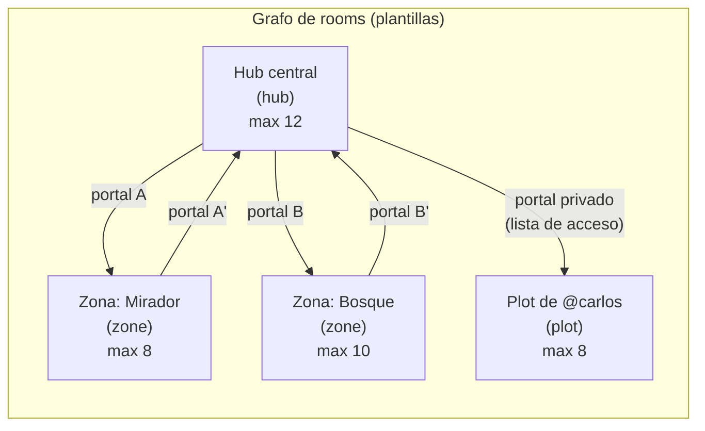
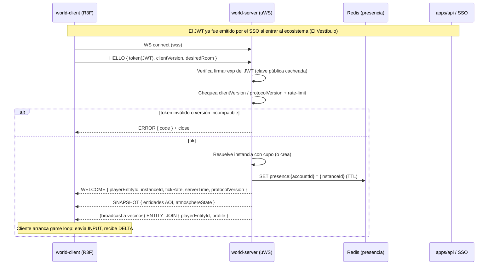
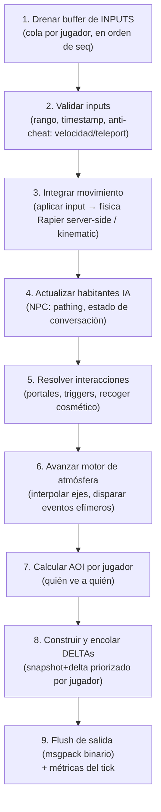
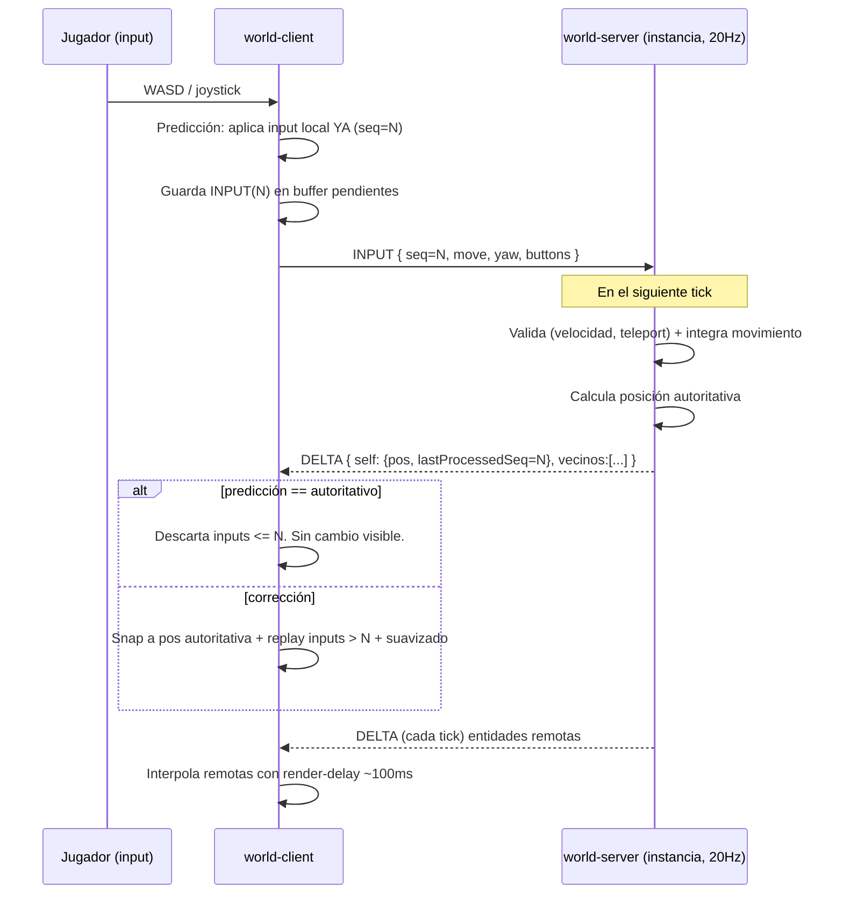
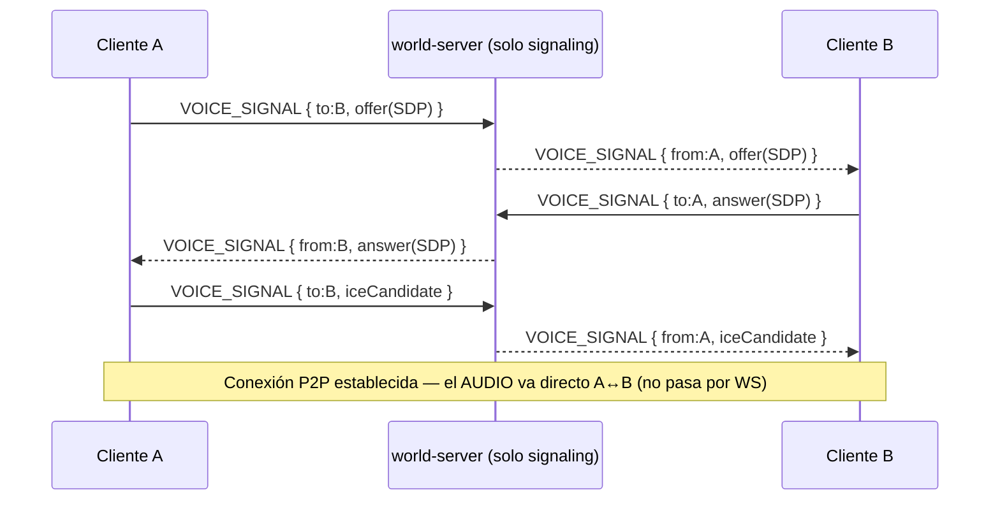

# Tiempo Real, Mundo y Networking — OSIA

> Propósito: definir el **World Server** autoritativo y todo el networking de EL MUNDO (`apps/world-server` + `apps/world-client`): modelo de rooms/instancias, flujo de join/leave, game loop a tick fijo, movimiento a pie con predicción y reconciliación, sincronización por snapshot+delta con interest management, protocolo binario, presencia/chat, voz WebRTC, reconexión/anti-cheat y difusión del motor de atmósfera. | Estado: Borrador v1 | Fecha: 2026-06-19 | Parte del paquete de diseño OSIA.

---

## 0. Cómo leer este documento

Este es el documento **fundacional del área de tiempo real**. Describe el corazón técnico de la app insignia (EL MUNDO): el servidor que decide la verdad y el protocolo por el que viaja esa verdad hacia los clientes. Todo lo que se siente "vivo, sincronizado y sin lag" en OSIA nace de las decisiones de aquí.

Principios que gobiernan cada decisión de este doc (heredados de la constitución):

1. **El servidor es la única fuente de verdad** (server-authoritative). El cliente predice y dibuja bonito, pero nunca decide. Esto es a la vez la base del anti-cheat y la base de que el atardecer/tormenta sean los mismos para todos.
2. **Camino más corto a algo bello y jugable.** Servidor propio sobre `uWebSockets.js` (no Colyseus, no Construct3 — decisión de Carlos), pero con alcance Fase 0 mínimo: 2-3 personas caminando juntas. La sofisticación (AOI agresivo, SFU, lag compensation fina) **emerge** cuando hay carga real, no antes.
3. **Costo casi 0.** Un VPS mínimo de Hetzner + Redis + voz P2P (mesh). El presupuesto de red y CPU se cuida desde el diseño, no se parchea después.
4. **Modular y deep-first.** EL MUNDO es la primera superficie; el world-server se construye en profundidad, pero su contrato de red vive en `packages/shared` para que cliente y servidor nunca diverjan.

Cross-links principales:
- Visión y alcance: ver [./00-vision-alcance.md](./00-vision-alcance.md)
- Pilares y experiencia (loops, primera sesión): ver [./01-pilares-experiencia.md](./01-pilares-experiencia.md)
- Marca y design system (HUD diegético, presencia visual): ver [./02-marca-design-system.md](./02-marca-design-system.md)
- Arquitectura del sistema: ver [./03-arquitectura-sistema.md](./03-arquitectura-sistema.md)
- Modelo de datos / ER (entidades de Mundo, Presencia, Atmósfera): ver [./04-modelo-datos-er.md](./04-modelo-datos-er.md)
- Motor de atmósfera (detalle de estado autoritativo y eventos): ver [./06-motor-atmosfera.md](./06-motor-atmosfera.md)
- Rendimiento y presupuestos (LOD, draw calls, bytes/tick): ver [./08-estrategia-rendimiento.md](./08-estrategia-rendimiento.md)
- Contratos de red (catálogo completo de mensajes, schemas binarios): ver [./10-contratos-api-eventos.md](./10-contratos-api-eventos.md) *(a definir en `packages/shared`)*
- Decisiones abiertas: ver [./adr/ADR-000-decisiones-abiertas.md](./adr/ADR-000-decisiones-abiertas.md)

> **Estado real del proyecto:** esto es DISEÑO. La carpeta `apps/world-server` aún no existe; solo hay `/brand` y `/docs`. Los números (Hz, bytes/tick, jugadores/instancia) son objetivos de diseño justificados, no mediciones.

---

## 1. Modelo de rooms / instancias

### 1.1 Por qué instanciado y no continuo

OSIA **no** es un planeta continuo. Es un mundo **instanciado estilo Meta Horizon**: un grafo de *rooms* conectados por *portales*. Esta es una decisión bloqueada y es la decisión técnica más importante del área, porque convierte el problema "imposible para un dev solo" (sincronizar 200 personas en un terreno infinito) en uno trivial y barato (sincronizar 8-12 personas en una sala acotada).

Ventajas concretas:

| Ventaja | Por qué importa para OSIA |
|---|---|
| **Capacidad acotada y predecible** | Cada instancia tiene un máximo duro de jugadores → presupuesto de CPU/red por instancia es constante y calculable. |
| **Carga horizontal trivial** | Más gente = más instancias del mismo room (sharding por instancia), no un servidor más grande. Cada instancia es un objeto independiente en el mismo proceso (o proceso distinto al escalar). |
| **AOI casi gratis** | Dentro de una instancia pequeña, "lo cercano" suele ser "todo". El interest management arranca simple y se vuelve fino solo en hubs llenos. |
| **Atmósfera coherente** | El estado de atmósfera autoritativo se difunde por instancia (o global), no hay que reconciliar climas a lo largo de un mundo gigante. |
| **Privacidad y escasez** | Los *plots* privados (Fase 5) son literalmente instancias con control de acceso. La exclusividad es arquitectura, no parche. |

### 1.2 Tipos de room

Tres tipos de room, todos comparten el mismo motor de simulación; difieren en política de acceso, capacidad y persistencia.

| Tipo de room | Descripción | Acceso | Capacidad objetivo | Persistencia de estado |
|---|---|---|---|---|
| **Hub** (`hub`) | Plaza social central, punto de aterrizaje. Es donde "te quedas". Es la escena de Fase 0. | Público (a cualquier invitado de OSIA). Auto-instanciado: si el hub llena, se crea `hub#2`. | **8–12** jugadores por instancia (objetivo Fase 0: probar con 2–3; techo de diseño 12). | Efímero (presencia/posiciones). Atmósfera autoritativa global. |
| **Zona** (`zone`) | Biomas/áreas temáticas (mirador, bosque, costa…). Se entra por portal desde el hub o entre zonas. | Público. Auto-instanciado igual que el hub. | **6–12** según densidad de assets (zonas pesadas en GPU → techo más bajo). | Efímero. Atmósfera puede tener *override* local (p.ej. una zona siempre nocturna). |
| **Plot privado** (`plot`) | Terreno/espacio propiedad de una cuenta (Fase 5). Lobby vivo personal. | Privado: solo dueño + invitados explícitos (lista de acceso). | **2–8** (íntimo por diseño). | **Persistente**: layout, props y ownership viven en Postgres; la sesión es efímera. |

> **Nota de capacidad:** el techo de diseño es **12** por instancia. No es un límite de `uWebSockets.js` (aguanta miles de conexiones), es un límite de **calidad de experiencia + presupuesto de red**: con malla de voz P2P (mesh) la cuenta de pares crece O(n²) y 8 personas ya son 28 streams en la red entre todos; con 12+ hay que pasar a SFU. Ver §8.

### 1.3 El grafo de rooms y los portales

El mundo es un grafo dirigido. Los nodos son *room definitions* (plantillas estáticas, definidas en datos/`packages/shared`), las aristas son *portales*.



Una entidad `Portal` (ver [./04-modelo-datos-er.md](./04-modelo-datos-er.md)) define: room destino, punto de spawn en el destino, condición de acceso opcional (lista, item, estatus). En el mundo 3D es un objeto diegético (un arco de luz champán, una bruma marfil) — nunca un menú.

### 1.4 Cambio de room por un Portal (semántica)

Atravesar un portal es **dejar una instancia y unirse a otra**. No es teletransporte dentro de la misma simulación; es un `leave` + `join` orquestado para que se sienta continuo:

1. El cliente colisiona con el volumen del portal (detección en el cliente, **confirmada** por el servidor: el server valida que el jugador esté realmente cerca del portal → anti-cheat).
2. Cliente envía `PORTAL_ENTER { portalId }`.
3. Server valida acceso y resuelve `targetRoom` + `targetInstance` (elige una instancia con cupo o crea una nueva).
4. Server **reserva** el cupo en la instancia destino, remueve al jugador de la instancia origen (broadcast `ENTITY_LEAVE` a los vecinos), y responde `PORTAL_GRANT { targetInstance, spawnPoint, sessionTicket }`.
5. Cliente hace fundido a champán/onix (transición de marca), pre-carga assets del destino (ver [./08-estrategia-rendimiento.md](./08-estrategia-rendimiento.md)), y ejecuta el handshake de join contra la instancia destino (§2) usando el `sessionTicket` (evita re-autenticar contra Postgres en cada salto).
6. Al recibir el `SNAPSHOT` inicial del destino, el cliente termina el fundido. Continuidad percibida intacta.

Spawn points y el `sessionTicket` de corta vida hacen que el salto se sienta instantáneo aunque por debajo sea dos transacciones de red.

---

## 2. Flujo de join / leave

### 2.1 Handshake de conexión y autenticación

Una conexión WebSocket a `world-server` **no** es de confianza hasta completar el handshake. El primer mensaje del cliente **debe** ser `HELLO` con un JWT; si no llega un `HELLO` válido en `HELLO_TIMEOUT = 5 s`, el server cierra el socket.

Autenticación: el JWT lo emite la identidad/SSO (`apps/api` + Supabase Auth, ver [./03-arquitectura-sistema.md](./03-arquitectura-sistema.md)). El world-server **no** habla con Postgres para autenticar en el camino caliente: **verifica la firma del JWT localmente** con la clave pública (JWKS de Supabase cacheada). Claims usados: `sub` (accountId), `profileId`, `exp`, y un claim OSIA `osia.scopes`. Esto mantiene el join barato y desacopla el world-server de la DB de identidad.

Pasos del join:

1. **Conexión** WS (con `wss://`, TLS terminado en Hetzner / reverse proxy).
2. **HELLO** `{ token, clientVersion, desiredRoom, desiredInstance?, sessionTicket? }`.
3. **Validación**: firma + expiración del JWT; compatibilidad de `clientVersion` con la versión del protocolo (ver §6.4); rate-limit de conexiones por IP/cuenta (Redis, ver [./08-estrategia-rendimiento.md](./08-estrategia-rendimiento.md)).
4. **Resolución de instancia**: matchmaking trivial — buscar instancia del `desiredRoom` con cupo (o usar `desiredInstance` si vino por portal, o crear una nueva).
5. **Registro de presencia** en Redis (`presence:{accountId} → {instanceId, ts}`) con TTL; publica en el canal de presencia (§7).
6. **WELCOME** `{ playerEntityId, instanceId, tickRate, serverTime, protocolVersion, atmosphereState }` — el cliente ya sabe quién es y a qué reloj sincronizar.
7. **SNAPSHOT inicial** (full state de la AOI): entidades visibles (otros jugadores, habitantes IA, props dinámicos), su estado, y el `AtmosphereState` autoritativo vigente (§10).
8. El server hace broadcast `ENTITY_JOIN` a los vecinos de la AOI del nuevo jugador.
9. A partir de aquí el cliente entra en el loop de juego: envía `INPUT`, recibe `DELTA` (§3–§5).

### 2.2 Leave

Tres formas de salir, todas convergen en la misma limpieza:

- **Explícito**: `BYE` (cierre limpio desde UI) → flush, broadcast `ENTITY_LEAVE`, liberar cupo, borrar presencia.
- **Por portal**: `leave` orquestado (§1.4) — no se borra la presencia global, se actualiza a la nueva instancia.
- **Abrupto** (socket muerto, crash, túnel): el server detecta por *heartbeat* (ping/pong cada `5 s`, timeout `15 s`). Tras timeout: marca `disconnected` pero **conserva la entidad "fantasma" durante `RECONNECT_GRACE = 30 s`** para permitir reconexión sin perder posición/sesión (§9). Pasado el grace, limpieza completa.

Limpieza siempre incluye: liberar cupo de la instancia, broadcast `ENTITY_LEAVE`, borrar presencia en Redis y notificar a la malla de voz (cada par cierra su `RTCPeerConnection` con el que se fue).

### 2.3 SequenceDiagram — Join



---

## 3. Game loop autoritativo

### 3.1 Fixed tick: 20 Hz

El servidor simula a **tick fijo de 20 Hz (50 ms por tick)**. Justificación de elegir 20 y no 15 ni 30/60:

| Tick rate | Latencia de simulación | Costo CPU/red por jugador | Veredicto para OSIA |
|---|---|---|---|
| 10 Hz (100 ms) | Movimiento "elástico", la reconciliación corrige saltos visibles | Muy barato | Demasiado tosco para caminar juntos; rompe el "uy, me quedo acá". |
| **15 Hz (66 ms)** | Aceptable | Más barato | Válido, pero la interpolación necesita más buffer y los eventos rápidos (gestos, llegar a un portal) se sienten con retraso. |
| **20 Hz (50 ms)** ✅ | Suave para experiencia **social a pie** (no es un shooter) | Equilibrado; cabe de sobra en un VPS mínimo con instancias de ≤12 | **Elegido.** Estándar de facto para mundos sociales (referencia mental: el rango de los MMO sociales). Buen punto entre suavidad y costo. |
| 30–60 Hz | Excelente para shooters competitivos | Caro, sin beneficio perceptible caminando | Sobre-ingeniería para Fase 0; reservado por si algún minijuego (Fase 4) lo exige en su propia sala. |

Decisión: **20 Hz para hub/zonas/plots**. Si un minijuego competitivo lo necesita, esa sala puede correr a 30 Hz de forma aislada (el motor soporta tick configurable por instancia). El **send rate** a clientes puede desacoplarse del tick: simulamos a 20 Hz pero podemos enviar deltas a 20 Hz (1:1 en Fase 0) y bajar a 10–15 Hz de envío bajo presión de banda (adaptive, ver §5.4 y [./08-estrategia-rendimiento.md](./08-estrategia-rendimiento.md)).

### 3.2 Orden de update dentro de un tick

Cada instancia es un objeto con su propio bucle a tick fijo (acumulador de tiempo + `setInterval`/timer monotónico; con *catch-up* limitado para no entrar en espiral de la muerte). Orden determinista por tick `t`:



Notas:
- Pasos 1–3 son el núcleo autoritativo del movimiento. La **física en el servidor** se mantiene **simple**: colisión kinematic contra el collider del terreno/paredes (capsule vs mesh), sin ragdolls ni dinámica pesada. Rapier (`@react-three/rapier`/`rapier` WASM) corre también en cliente para predicción idéntica (§4). El motor de atmósfera (paso 6) usa lógica **pura compartida** de `packages/atmosphere` para que cliente y servidor coincidan bit a bit en la interpolación.
- El presupuesto de tiempo por tick es **50 ms**; objetivo de diseño: cada instancia consume **< 5 ms** de CPU por tick con 12 jugadores, dejando margen amplio para varias instancias por core.

---

## 4. Movimiento a pie: input → predicción → reconciliación

El recorrido es **a pie** (decisión bloqueada; el vehículo contemplativo es feature posterior, ver [ADR-000](./adr/ADR-000-decisiones-abiertas.md)). El movimiento es lo que más se siente, así que usa el patrón clásico **client-side prediction + server reconciliation**, que da respuesta instantánea local manteniendo el servidor autoritativo.

### 4.1 El cliente no manda posiciones, manda inputs

Anti-cheat de base: el cliente **nunca** envía "estoy en (x,y,z)". Envía **comandos de input numerados**:

```
INPUT {
  seq: uint32,        // número de secuencia monotónico
  dtMs: uint16,       // duración del frame que cubre este input
  move: {x, z},       // vector de intención normalizado [-1,1] (plano)
  yaw: float16,       // orientación de cámara/cuerpo
  buttons: bitflags   // saltar(?), interactuar, gesto, sprint...
}
```

### 4.2 Predicción en el cliente

1. El cliente aplica el input **inmediatamente** a su avatar local usando **la misma función de movimiento** que el servidor (código compartido en `packages/shared`/`packages/atmosphere` para constantes; misma integración Rapier kinematic). Cero latencia percibida.
2. Guarda cada `INPUT` en un *buffer de inputs pendientes* (no confirmados), indexado por `seq`.
3. Envía el `INPUT` al servidor.

### 4.3 Reconciliación

1. El servidor procesa los inputs en orden (§3.2), produce la posición autoritativa y, en sus `DELTA`, incluye para el jugador dueño el `lastProcessedSeq` (el último input que aplicó) junto con su posición autoritativa.
2. El cliente compara la posición autoritativa con la que había predicho para ese `seq`.
   - Si coinciden (caso normal, sin desync): descarta del buffer todos los inputs `≤ lastProcessedSeq`. Nada visible.
   - Si difieren (el server corrigió: colisión, anti-cheat, paquete perdido): el cliente hace **snap a la posición autoritativa** y **re-aplica (replay)** los inputs aún pendientes (`> lastProcessedSeq`) encima, suavizando la corrección visual en 1–3 frames para evitar el "tirón". Esto es la reconciliación.

### 4.4 Entidades remotas: interpolación

Para los **otros** jugadores y los habitantes IA, el cliente **no** predice: **interpola** entre los dos últimos snapshots recibidos, con un *render delay* de **~100 ms** (≈2 ticks a 20 Hz). Esto convierte la red discreta y con jitter en movimiento fluido. Si llega tarde el siguiente snapshot, hace **extrapolación** corta (dead reckoning) con la última velocidad conocida, con tope para no "patinar".

### 4.5 SequenceDiagram — Movimiento



---

## 5. Sincronización de estado: snapshot + delta + AOI

### 5.1 Snapshot vs delta

- **Snapshot (full state)**: el estado completo de la AOI del jugador. Se envía **una vez al join** y al **reaparecer una entidad en la AOI** (entró en rango). Es caro pero raro.
- **Delta (cambios)**: solo lo que cambió respecto al último estado **reconocido (ack)** por ese cliente, cada tick. Es el camino caliente; tiene que ser pequeño.

Cada `DELTA` referencia el `baseTick` sobre el que se aplica. El cliente **ackea** el último tick aplicado; el server hace delta contra ese ack (delta confiable sobre transporte que puede reordenar). Si el desfase de ack crece demasiado (cliente lento / paquetes perdidos), el server reenvía un **snapshot fresco** en vez de un delta gigante.

### 5.2 Delta compression

Técnicas aplicadas (detalle numérico en [./08-estrategia-rendimiento.md](./08-estrategia-rendimiento.md)):
- **Campos cambiados por bitmask**: cada entidad lleva un bitmask de qué campos cambiaron; solo esos se serializan.
- **Cuantización**: posiciones a fixed-point (p.ej. 16 bits por eje con resolución de cm dentro del bound de la instancia), `yaw` a `float16`/uint8 (256 direcciones bastan para un cuerpo a pie), velocidades cuantizadas.
- **Baseline por entidad**: el delta es contra el último estado conocido por el cliente, no contra cero.

### 5.3 Interest management (AOI)

**Solo se sincroniza lo cercano.** Aunque las instancias son pequeñas, el AOI evita gastar banda en lo que no se ve y prepara el camino para hubs llenos.

| Parámetro | Valor de diseño | Justificación |
|---|---|---|
| Radio de AOI (jugadores/NPC) | **40 m** (configurable por room) | Más allá la niebla atmosférica ya oculta; coincide con el LOD lejano. |
| Estructura espacial | **Grid de celdas** (uniform grid, p.ej. 10 m) | Trivial de implementar y O(1) para "vecinos"; suficiente para ≤12 entidades. Sin quadtree hasta que duela. |
| Histéresis | enter a 40 m, leave a 45 m | Evita parpadeo de entidades en el borde del AOI. |
| Entidades "globales" | atmósfera, eventos efímeros, anuncios de presencia | Se difunden a toda la instancia ignorando AOI (son baratos y deben verse iguales). |

> Para instancias de ≤12 con radio 40 m, en la práctica **casi todos se ven entre sí**. El AOI aquí es barato y, sobre todo, es el mecanismo que ya está puesto para cuando un hub se llene o una zona tenga muchos NPC.

### 5.4 Priorización y presupuesto de banda

Cuando hay más cambios que banda, se **prioriza** qué entidades entran en el delta de este tick (relevancy scoring):
- Más cerca → más prioridad.
- En el cono de visión / frente al jugador → más prioridad.
- Se movió/habló recientemente → más prioridad.
- Entidades lejanas o quietas → se actualizan a menor frecuencia (cada N ticks).

**Presupuesto de red objetivo (diseño):**

| Métrica | Objetivo Fase 0 | Notas |
|---|---|---|
| Delta por jugador por tick | **≤ 1.5 KB** | Con 12 vecinos cuantizados, realista ~0.3–1 KB. |
| Banda de bajada por jugador | **≤ 30 KB/s** (1.5 KB × 20 Hz) | Cómodo incluso en móvil/4G. |
| Subida por jugador (inputs) | **≤ 4 KB/s** | Inputs son diminutos. |
| Send rate adaptativo | 20 Hz → baja a 10 Hz bajo presión | El movimiento sigue suave gracias a interpolación. |

---

## 6. Protocolo binario

### 6.1 Por qué binario y por qué msgpack (con puerta a schema propio)

JSON es legible pero gordo y lento de parsear; en el camino caliente (20 deltas/s × N jugadores) eso es banda y CPU desperdiciados. Decisión: **protocolo binario**. Arranque pragmático con **MessagePack** (libs maduras en TS, fácil de iterar en Fase 0), con la **puerta abierta a un schema propio bit-packed** (estilo flatbuffers/bitstream) para los mensajes calientes (`DELTA`, `INPUT`) cuando el perfil lo justifique. El catálogo de mensajes y los layouts exactos viven como **contrato compartido** en `packages/shared` (ver [./10-contratos-api-eventos.md](./10-contratos-api-eventos.md)), de modo que cliente y servidor compilan contra la misma definición y no pueden diverger.

### 6.2 Encuadre

- Cada mensaje WS lleva un **opcode** (1 byte) como primer byte + payload binario.
- Mensajes calientes (`INPUT`, `DELTA`) usan layout cuantizado; mensajes fríos (`HELLO`, `CHAT`, etc.) usan msgpack del payload.
- WebSocket ya entrega mensajes encuadrados (no hay que inventar framing TCP).

### 6.3 Catálogo de mensajes (resumen; detalle en contratos)

**Cliente → Servidor**

| Opcode | Mensaje | Caliente | Carga (resumen) |
|---|---|---|---|
| `0x01` | `HELLO` | no | token JWT, clientVersion, desiredRoom, desiredInstance?, sessionTicket? |
| `0x02` | `INPUT` | **sí** | seq, dtMs, move{x,z}, yaw, buttons |
| `0x03` | `ACK` | sí | lastTick aplicado |
| `0x04` | `PING` | sí | clientTime |
| `0x05` | `CHAT_SEND` | no | channel, text |
| `0x06` | `PORTAL_ENTER` | no | portalId |
| `0x07` | `INTERACT` | no | targetEntityId, action |
| `0x08` | `VOICE_SIGNAL` | no | a peerId, sdp/ice (WebRTC, §8) |
| `0x09` | `BYE` | no | reason? |

**Servidor → Cliente**

| Opcode | Mensaje | Caliente | Carga (resumen) |
|---|---|---|---|
| `0x81` | `WELCOME` | no | playerEntityId, instanceId, tickRate, serverTime, protocolVersion |
| `0x82` | `SNAPSHOT` | no | full state AOI + atmosphereState |
| `0x83` | `DELTA` | **sí** | baseTick, self{pos,lastProcessedSeq}, entidades{bitmask,campos} |
| `0x84` | `ENTITY_JOIN` | no | entityId, tipo, profile/persona |
| `0x85` | `ENTITY_LEAVE` | no | entityId, reason |
| `0x86` | `PONG` | sí | clientTime, serverTime |
| `0x87` | `CHAT_MSG` | no | from, channel, text, ts |
| `0x88` | `ATMOSPHERE_UPDATE` | no | nuevos targets de ejes / preset (§10) |
| `0x89` | `ATMOSPHERE_EVENT` | no | eventId, tipo, ventana temporal (§10) |
| `0x8A` | `PORTAL_GRANT` | no | targetInstance, spawnPoint, sessionTicket |
| `0x8B` | `VOICE_SIGNAL` | no | from peerId, sdp/ice |
| `0x8C` | `PRESENCE` | no | quién entró/salió/cambió de instancia |
| `0x8E` | `ERROR` | no | code, message |

### 6.4 Versionado del protocolo

`protocolVersion` (entero) se negocia en `HELLO`/`WELCOME`. Cambios incompatibles incrementan la versión mayor; el server rechaza clientes incompatibles con `ERROR { code: VERSION_MISMATCH }` y el Vestíbulo invita a recargar. El contrato vive versionado en `packages/shared` para que el bump sea atómico cliente↔servidor.

---

## 7. Presencia y chat

### 7.1 Presencia

La **presencia** (quién está online y dónde) es transversal al ecosistema, no solo del Mundo (la Fase 3 social la consume: "quién está online y dónde"). Por eso vive en **Redis**, escrita por el world-server:

- Al join: `presence:{accountId} = { instanceId, room, since }` con TTL refrescado por heartbeat.
- Cambios se publican en un canal Redis Pub/Sub (`presence:events`) que consumen `apps/api` (para feed/notificaciones) y otros world-servers (al escalar a varios procesos).
- Dentro de una instancia, los `PRESENCE` (`0x8C`) notifican a los clientes quién entra/sale para pintar la lista social del HUD (ver [./02-marca-design-system.md](./02-marca-design-system.md)).

Esto desacopla "presencia en el Mundo" de "presencia en el ecosistema": el Vestíbulo y la futura red social leen Redis sin acoplarse al protocolo de tiempo real.

### 7.2 Chat de texto

El chat de texto en el Mundo es **secundario** (la voz es el canal principal, §8), pero existe para accesibilidad y para cuando no quieres hablar:

| Canal | Alcance | Transporte |
|---|---|---|
| `local` | misma instancia (todos los presentes) | `CHAT_SEND` → server valida/rate-limita → `CHAT_MSG` broadcast a la instancia |
| `party` | tu grupo de amigos (cross-instancia) | server → Redis Pub/Sub → entrega a las instancias donde estén |
| `system` | anuncios (eventos de atmósfera, "lluvia de meteoros en 5 min") | server → broadcast |

El server **rate-limita** el chat (Redis token bucket) y aplica un filtro mínimo. Persistencia de chat: efímera por defecto (no se guarda el chat local); solo `party`/DMs persisten vía `apps/api` si la red social (Fase 3) lo decide.

---

## 8. Voz: WebRTC P2P (mesh) con señalización sobre el WS

La voz es el **canal social principal** y debe costar **casi 0** (decisión bloqueada, alineada con la referencia Yugo). Por eso: **WebRTC P2P en malla (mesh)** para grupos chicos, con el world-server actuando **solo como servidor de señalización** (no pasa audio).

### 8.1 Arquitectura mesh

- En una instancia con N personas en voz, cada par mantiene una `RTCPeerConnection` directa con cada otro par → **N·(N-1)/2** conexiones de audio, **punto a punto**. El audio nunca toca el servidor → **ancho de banda de servidor ≈ 0** y latencia mínima (camino directo).
- El world-server solo intermedia el **handshake** (SDP offer/answer + candidatos ICE) reusando el WS ya abierto (`VOICE_SIGNAL`, opcodes `0x08`/`0x8B`). No abrimos un canal de señalización aparte.



### 8.2 NAT, STUN y TURN

- **STUN** (descubrir IP pública / atravesar NAT): se usa un STUN público gratuito (p.ej. el de Google) → costo 0. Resuelve la mayoría de NAT.
- **TURN** (relay cuando NAT simétrico bloquea P2P, ~10–20% de los casos): TURN **sí** cuesta (releva audio). Estrategia: **coturn self-host** en el mismo VPS de Hetzner como *fallback*. Solo se usa cuando STUN falla, así el costo se mantiene marginal. En Fase 0 (Carlos + 2 amigos, redes conocidas) puede incluso diferirse, pero coturn es el plan barato y autosuficiente.

### 8.3 Cuándo pasar a SFU (mediasoup)

El mesh es perfecto y barato hasta cierto punto; el upstream de cada cliente crece linealmente con N (cada uno sube su audio a N-1 pares). Reglas de transición:

| Tamaño de grupo de voz | Solución | Por qué |
|---|---|---|
| **2–6** | **Mesh P2P** ✅ | Costo de servidor 0, latencia mínima, simple. Cubre Fase 0–4 holgadamente. |
| **7–12** | Mesh límite / evaluar SFU | El upstream de móvil empieza a sufrir (subir 6–11 streams). |
| **12+ / eventos** | **SFU (mediasoup)** en Hetzner | Cada cliente sube **un** stream al SFU y este reenvía. Reservado para escala (Fase 5+), zonas masivas o eventos. |

Decisión: **mesh ahora, SFU como contrato futuro**. El cliente abstrae la voz tras una interfaz (`VoiceTransport`) para que cambiar mesh↔SFU no toque la UI. mediasoup correría como servicio aparte en el mismo Hetzner cuando llegue.

---

## 9. Reconexión, lag compensation y anti-cheat

### 9.1 Reconexión con gracia

Las redes móviles cortan. El diseño asume desconexiones como normales, no como error:

1. Al perder el socket, el cliente intenta reconectar con **backoff exponencial** (0.5s, 1s, 2s, 5s… con jitter), reusando un **resume token** corto.
2. El server, al detectar caída, marca la entidad `disconnected` pero la **conserva `RECONNECT_GRACE = 30 s`** en su posición.
3. Si el cliente vuelve dentro del grace con un `HELLO { sessionTicket/resumeToken }` válido: se **re-adopta la entidad existente** (misma posición, misma sesión, mismos vecinos), se manda un `SNAPSHOT` fresco y la experiencia continúa sin perder el lugar.
4. Pasado el grace: limpieza total (§2.2); al volver es un join nuevo.

La voz P2P se renegocia tras reconexión (las `RTCPeerConnection` se reestablecen vía signaling).

### 9.2 Lag compensation

Para un mundo **social a pie** la compensación de lag fina (rewind de hitscan tipo shooter) es **innecesaria en Fase 0** — no hay disparos ni hit detection competitivo. Lo que sí se hace:
- **Render delay + interpolación** (§4.4) absorbe el jitter de la red para que los demás se vean fluidos.
- **Time sync**: `PING/PONG` estima RTT y offset de reloj cliente↔servidor; el cliente usa `serverTime` para alinear interpolación y la línea de tiempo de atmósfera.
- Si la Fase 4 introduce un minijuego con hit detection, esa sala podrá implementar **server-side rewind** (reconstruir el estado del tick en que el cliente disparó) de forma localizada, sin contaminar el mundo social.

### 9.3 Anti-cheat básico (gratis por ser server-authoritative)

La autoridad del servidor da el anti-cheat de base sin esfuerzo extra:

| Vector | Defensa |
|---|---|
| **Speed hack / teleport** | El server integra el movimiento desde inputs; valida que el desplazamiento por tick no supere `maxSpeed·dt` con tolerancia. Excesos → se **clampa** a la posición válida (no se confía en el cliente). |
| **Cliente envía posición** | Imposible: el protocolo solo acepta **inputs**, nunca posiciones (§4.1). |
| **Atravesar paredes / no-clip** | Colisión kinematic en el servidor; el cliente solo predice, el server corrige. |
| **Acceso a portal sin permiso** | El server valida la lista de acceso del portal y la cercanía real antes de conceder (§1.4). |
| **Flood / spam** | Rate-limit por opcode en Redis (token buckets): inputs, chat, signaling, conexiones por IP/cuenta. |
| **Replay / token robado** | JWT con `exp` corto; `sessionTicket`/`resumeToken` de un solo uso y vida corta; presencia única por cuenta (un join nuevo expulsa la sesión anterior). |
| **Suplantar otra entidad** | El server ignora cualquier `entityId` que el cliente intente fijar; la identidad de la entidad la asigna el server en `WELCOME`. |

> Filosofía: en Fase 0 con 2-3 amigos invitados el cheating no es la amenaza real, pero el **modelo server-authoritative no cuesta nada extra** y deja el sistema listo para abrir más allá de amigos (Fase 5) sin rediseñar la seguridad.

---

## 10. Difusión del motor de atmósfera por la red

El motor de atmósfera es **server-authoritative y compartido**: el atardecer y la tormenta son **los mismos para todos** (decisión bloqueada). El detalle del motor (ejes, presets, eventos, interpolación) está en [./06-motor-atmosfera.md](./06-motor-atmosfera.md); aquí se especifica **cómo viaja por la red**.

### 10.1 Estado compacto + lógica pura compartida

La clave para que esto sea barato: **no se transmite el render del cielo**, se transmite un **estado de atmósfera diminuto** (los *targets* de unos pocos ejes + un reloj), y tanto cliente como servidor lo **interpolan con la misma función pura** de `packages/atmosphere`. Así coinciden sin enviar datos a cada tick.

`AtmosphereState` (resumen; ver ER y motor):
```
AtmosphereState {
  baseTime:   serverTime de referencia
  axes: { daylight, fog, wind, cloud, tint, ... }  // valores objetivo
  transitionMs: cuánto tarda la interpolación al nuevo target
  presetId?:  preset nombrado opcional
  seed:       semilla determinista (para variación coherente entre clientes)
}
```

### 10.2 Cómo se difunde

| Momento | Mensaje | Frecuencia |
|---|---|---|
| Al join | dentro de `WELCOME`/`SNAPSHOT` | una vez (estado vigente + reloj) |
| Cambio de atmósfera (nuevo target de ejes / preset) | `ATMOSPHERE_UPDATE` (`0x88`) | **raro**: solo en transiciones (cada varios minutos). El cliente interpola solo el resto del tiempo. |
| Evento efímero (lluvia de meteoros, aurora) | `ATMOSPHERE_EVENT` (`0x89`) + `system` chat | **muy raro** (p.ej. 1×/semana a hora random) → FOMO por diseño |

Como el estado es pequeño y cambia poco, su costo de red es **insignificante** comparado con el movimiento. El reloj autoritativo (`serverTime`, sincronizado por `PING/PONG`, §9.2) garantiza que un cliente que se une a mitad de un atardecer lo vea en el **mismo punto** que todos.

### 10.3 Alcance: global vs por instancia

- Por defecto la atmósfera es **global** (todas las instancias del mismo mundo comparten el ciclo) → coherencia total: si llueve, llueve para todos los que están conectados, refuerza el "evento compartido".
- Una **zona** puede declarar un *override* local (p.ej. una caverna siempre en penumbra) que aplica solo a sus instancias.
- Los **eventos efímeros** son globales por defecto (el momento mágico es para toda la comunidad a la vez → máximo FOMO).

El generador del ciclo/eventos vive en un **proceso autoritativo único** (el world-server o un pequeño *atmosphere ticker* — ver [./06-motor-atmosfera.md](./06-motor-atmosfera.md) y `apps/world-server`) que publica los cambios; al escalar a varios procesos de world-server, el estado de atmósfera se difunde vía **Redis Pub/Sub** para que todas las instancias en todos los procesos compartan exactamente el mismo cielo.

---

## 11. Resumen de decisiones y números (cheat-sheet)

| Decisión | Valor | Justificación corta |
|---|---|---|
| Servidor | `uWebSockets.js` propio, autoritativo | Decisión de Carlos; sin Colyseus/Construct; barato y a la medida. |
| Tick rate | **20 Hz (50 ms)** | Suave para social a pie sin costo de shooter. |
| Send rate | 20 Hz, adaptativo a 10 Hz | Banda bajo presión sin romper suavidad (interpolación). |
| Render delay (remotas) | **~100 ms** | Absorbe jitter; movimiento fluido de otros. |
| Capacidad por instancia | **8–12** (techo de diseño 12) | Calidad social + límite de voz mesh. |
| Modelo de rooms | Hub / Zona / Plot, conectados por Portales | Instanciado estilo Meta Horizon. |
| Movimiento | inputs → predicción cliente → reconciliación server | Respuesta instantánea + server autoritativo. |
| Sync | snapshot al join + delta por tick, AOI 40 m, grid 10 m | Solo lo cercano; deltas cuantizados. |
| Presupuesto de red | ≤ 1.5 KB/jugador/tick, ≤ 30 KB/s bajada | Cómodo en móvil. |
| Protocolo | binario; msgpack ahora + bit-packing futuro para calientes | Banda y CPU; contrato en `packages/shared`. |
| Auth | JWT del SSO, verificado por firma (sin DB en caliente) | Join barato y desacoplado. |
| Voz | WebRTC mesh P2P; signaling sobre el WS; STUN gratis, coturn TURN fallback | Costo ~0; SFU mediasoup reservado a escala. |
| Reconexión | grace 30 s, resume token, backoff | Redes móviles cortan: es normal. |
| Anti-cheat | gratis por server-authoritative (clamp de velocidad, solo inputs, validación de portal) | Listo para abrir más allá de amigos. |
| Atmósfera | estado compacto + lógica pura compartida; `ATMOSPHERE_UPDATE`/`EVENT`; global por defecto | Mismo cielo para todos, costo de red insignificante. |

---

## 12. Pendientes para el backlog (derivados de este doc)

- Definir el **catálogo binario completo** y schemas en `packages/shared` → `./10-contratos-api-eventos.md` (opcodes, layouts, cuantización exacta, versión del protocolo).
- Implementar **bucle de instancia** a tick fijo con acumulador + catch-up limitado y métricas por tick (Pino/Prometheus).
- Implementar **predicción/reconciliación** con función de movimiento compartida cliente↔servidor (constantes en `packages/shared`).
- Implementar **AOI por grid** con histéresis y priorización; medir bytes/tick reales contra el presupuesto.
- Integrar **JWKS de Supabase** cacheado para verificación local de JWT en el world-server.
- Capa de **presencia en Redis** + Pub/Sub consumible por `apps/api` (Fase 3 social).
- **VoiceTransport** abstracto (mesh ahora) + signaling sobre WS; desplegar **coturn** en Hetzner; banco de pruebas de NAT.
- **Reconexión con grace** + resume tokens; pruebas de corte de red móvil.
- Difusión de **atmósfera por Redis Pub/Sub** entre procesos; sincronización de reloj (`PING/PONG`).
- Decidir activación de **SFU mediasoup** (umbral de tamaño de grupo) y dejar el hueco de despliegue.
```