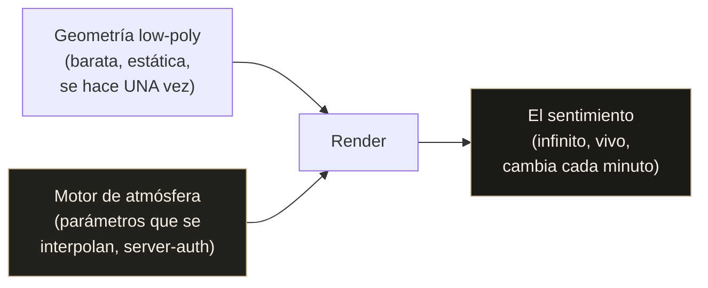
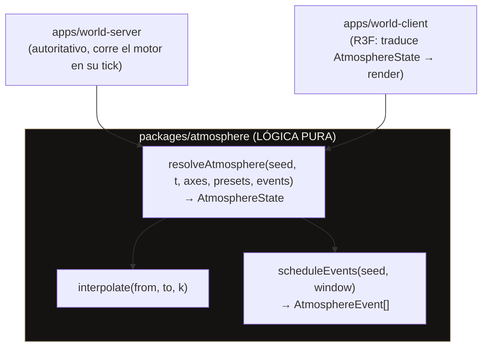
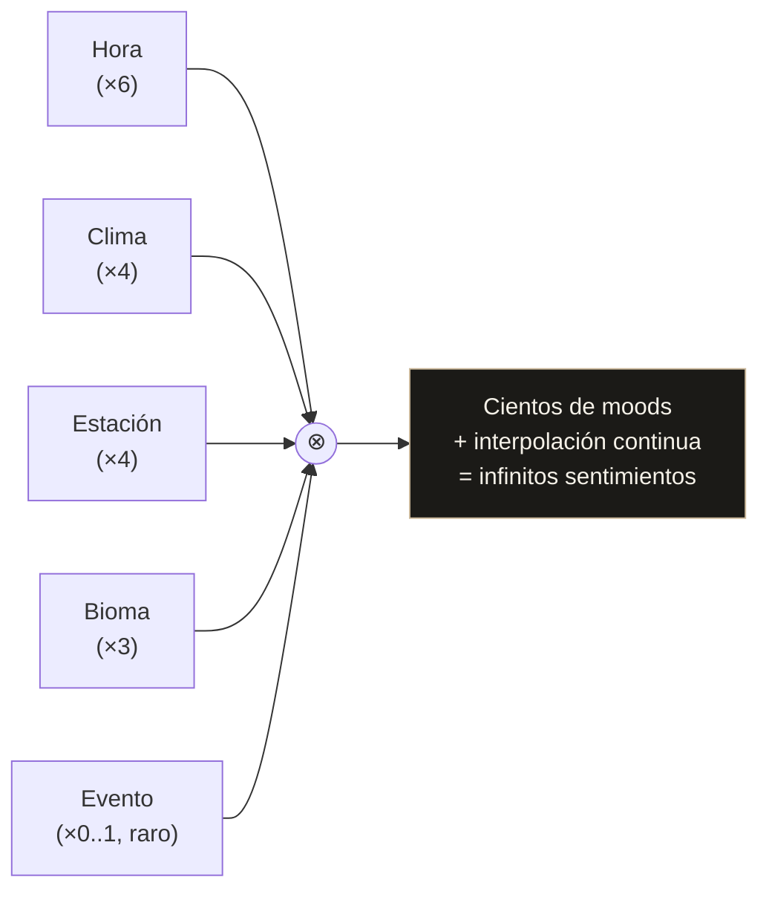
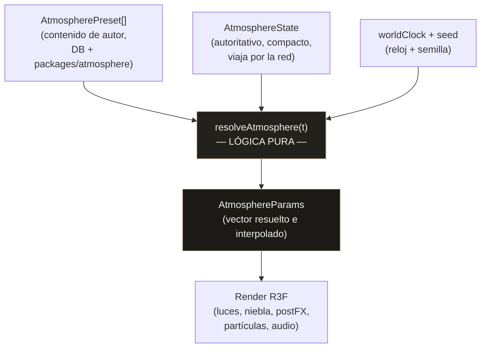
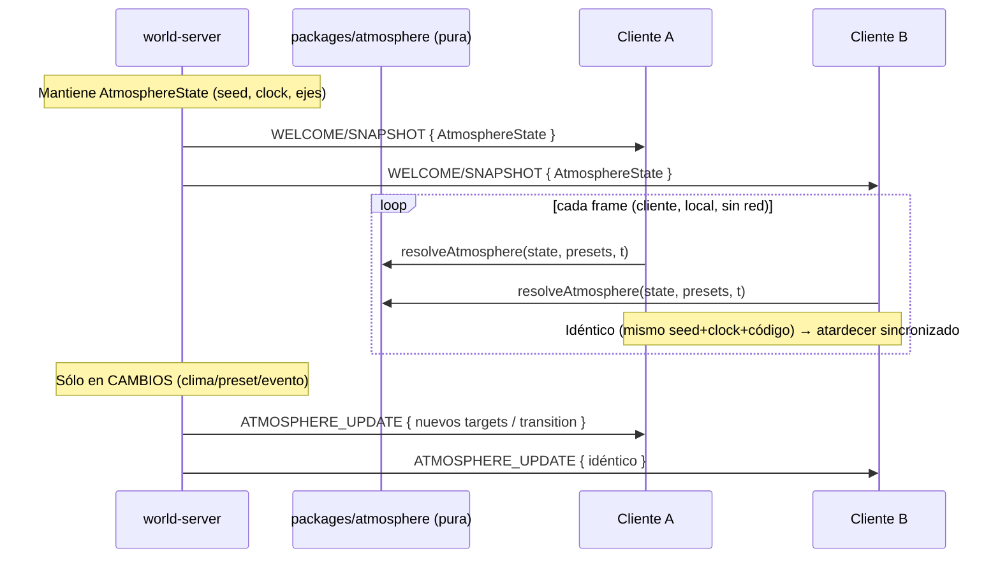
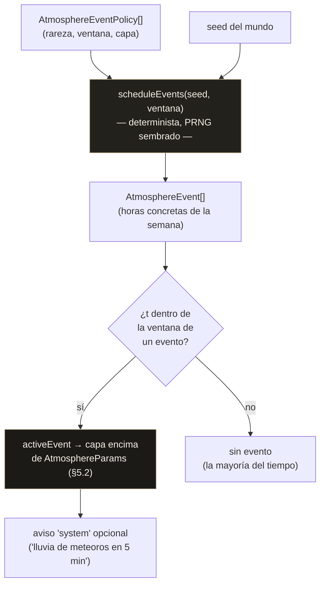
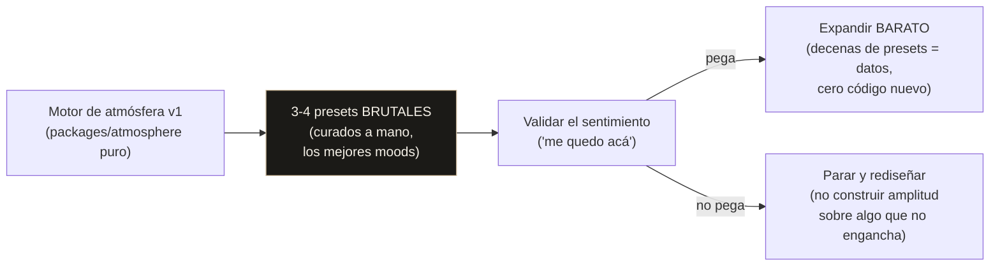
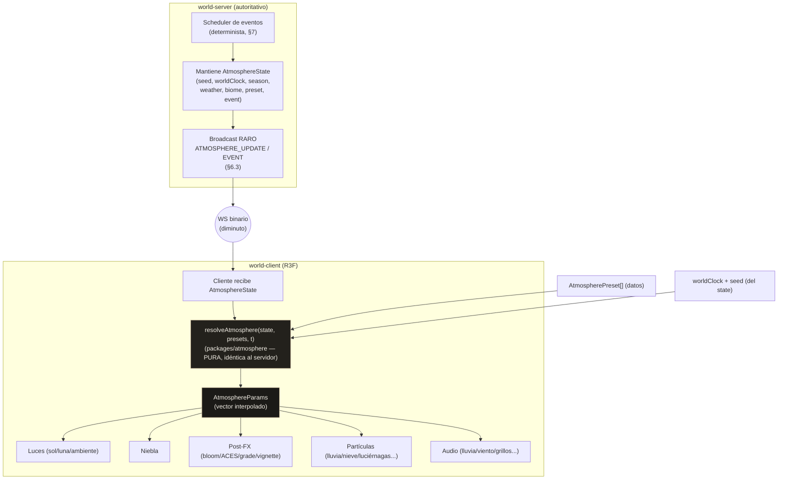

# Motor de Atmósfera — OSIA

> Propósito: definir el **MOTOR DE ATMÓSFERA** de OSIA (`packages/atmosphere`, lógica pura compartida cliente↔servidor): la filosofía de "geometría chiquita, infinitos sentimientos"; los ejes combinatorios que generan decenas de moods; el modelo de parámetros que se **interpolan** (no se modelan); la estructura de datos de `AtmospherePreset` y `AtmosphereState`; el sistema de blend/transición suave; la autoridad del servidor y el determinismo; el scheduler de eventos efímeros raros (FOMO); la "paleta de la casa" para variar sin perder el alma celestial OSIA; y la disciplina anti-pozo. | Estado: Borrador v1 | Fecha: 2026-06-19 | Parte del paquete de diseño OSIA.

---

## 0. Cómo leer este documento

Este es el documento **fundacional del área de atmósfera**. La atmósfera es la decisión de diseño que hace que un mundo **low-poly y barato** se sienta **caro, vivo y curado**. No es un detalle de pulido: es el pilar técnico-artístico que sostiene la promesa de marca "El arte de lo esencial". Sin atmósfera, OSIA es un mundo de polígonos planos; con atmósfera, es un atardecer celeste del que nadie se quiere ir.

Este documento describe **el motor** (la lógica), no el render. El *cómo se dibuja* (postprocessing, niebla, HDRIs, shaders) vive en el cliente R3F y se cruza con [`./08-estrategia-rendimiento.md`](./08-estrategia-rendimiento.md); el *cómo viaja por la red* (broadcast, frecuencia, opcodes) vive en [`./05-realtime-mundo-networking.md`](./05-realtime-mundo-networking.md) §10. Aquí definimos **qué es** el estado atmosférico, **cómo se calcula de forma determinista** y **cómo se mantiene igual para todos**.

Principios que gobiernan cada decisión de este doc (heredados de la constitución):

1. **Atmósfera = código y sistemas, no modelado.** Es el terreno fuerte de Carlos (backend, tiempo real, sistemas). Generamos sentimiento con **parámetros que se interpolan**, no esculpiendo geometría nueva. Geometría chiquita, infinitos sentimientos.
2. **Server-authoritative y compartido.** El atardecer y la tormenta son **los mismos para todos**. El estado es del servidor; el cliente solo lo dibuja bonito. Esto no es un capricho técnico: es lo que convierte un evento atmosférico en algo **social** ("¿viste la aurora anoche?").
3. **Determinismo.** Cliente y servidor calculan **lo mismo** desde `semilla + tiempo`. Por eso casi no hace falta transmitir nada: ambos corren la misma función pura de `packages/atmosphere`.
4. **Escasez por diseño.** Los **eventos efímeros raros** (lluvia de meteoros, aurora) sólo se cazan **estando dentro** en la ventana correcta. El FOMO es una decisión de producto, no un bug.
5. **Disciplina anti-pozo.** Fase 0 = **motor + 3-4 atmósferas brutales**, no cuarenta a medias. Cuando el motor existe, una atmósfera nueva es **datos baratos**, no código.

Cross-links principales:

- Visión y alcance (por qué la atmósfera es el corazón de la promesa): ver [`./00-vision-alcance.md`](./00-vision-alcance.md)
- Pilares y experiencia (el loop "uy, yo me quedo acá"): ver [`./01-pilares-experiencia.md`](./01-pilares-experiencia.md)
- Marca y design system (paleta, alma celestial, tokens de color): ver [`./02-marca-design-system.md`](./02-marca-design-system.md)
- Arquitectura del sistema (`packages/atmosphere` como lógica pura compartida): ver [`./03-arquitectura-sistema.md`](./03-arquitectura-sistema.md)
- Modelo de datos / ER (`AtmosphereState`, `AtmospherePreset`, `AtmosphereEvent`, `WeatherCycle`): ver [`./04-modelo-datos-er.md`](./04-modelo-datos-er.md)
- Tiempo real y networking (broadcast del estado, opcodes `ATMOSPHERE_UPDATE`/`ATMOSPHERE_EVENT`, reloj autoritativo): ver [`./05-realtime-mundo-networking.md`](./05-realtime-mundo-networking.md) §10
- Rendimiento (cómo se dibuja barato: niebla, LOD, postFX, partículas instanciadas): ver [`./08-estrategia-rendimiento.md`](./08-estrategia-rendimiento.md)
- Decisiones abiertas (alma/mood de atmósfera — decisión 1): ver [`./adr/ADR-000-decisiones-abiertas.md`](./adr/ADR-000-decisiones-abiertas.md)

> **Estado real del proyecto:** esto es DISEÑO. La carpeta `packages/atmosphere` aún no existe; sólo hay `/brand` y `/docs`. Las estructuras, nombres de ejes, presets y probabilidades son **propuestas de diseño justificadas**, no código existente ni valores medidos.

---

## 1. Filosofía: geometría chiquita, infinitos sentimientos

### 1.1 El problema que resuelve la atmósfera

OSIA es **low-poly por decisión bloqueada**. El fotorrealismo con $0 y un dev solo se ve a "copia barata de un AAA"; el low-poly bien hecho se ve **estilizado e intencional**. Pero el low-poly **plano** (sin atmósfera) también se ve barato: una caja de polígonos con luz neutra es un juego de hace 20 años.

La diferencia entre "low-poly barato" y "low-poly de lujo" **no está en la geometría**: está en la **capa de atmósfera encima**. La misma colina de 200 triángulos, iluminada por un atardecer champán con niebla marfil rodando entre los árboles, bloom suave en el sol y grillos de fondo, se siente como un cuadro. Ese es todo el truco de OSIA.



> **Tesis central:** la geometría es **finita y chiquita** (una escena, unos props, unos árboles); el sentimiento es **infinito** porque emerge de combinar y **interpolar** un puñado de parámetros atmosféricos. No modelamos cien escenas: modelamos **una** y la vivimos de mil maneras.

### 1.2 Atmósfera como código, no como modelado

Esta es una decisión **estratégica para un dev solo**: la atmósfera juega al terreno fuerte de Carlos (sistemas, tiempo real, backend determinista) y **evita** su terreno caro (modelado/escultura 3D, que requiere tiempo de artista que no hay).

| Enfoque "barato visual" típico | Enfoque OSIA (atmósfera como sistema) |
|---|---|
| Más polígonos, más detalle, más texturas únicas | Mismos polígonos, **más parámetros interpolados** |
| Cada bioma/mood = nueva geometría modelada (caro, lento) | Cada mood = nuevo **preset de datos** (barato, minutos) |
| El artista produce contenido | El **sistema** produce variación infinita |
| Estado visual fijo (foto) | Estado visual **vivo** (cambia con hora/clima/estación/evento) |
| Difícil de sincronizar entre jugadores | **Determinista**: se sincroniza con `semilla + tiempo` |

La atmósfera, en OSIA, es un **motor de interpolación de parámetros** + un **scheduler de eventos**. Es código puro, testeable, determinista, sin I/O. Eso es exactamente lo que `packages/atmosphere` contiene.

### 1.3 Qué es y qué NO es `packages/atmosphere`

`packages/atmosphere` es **lógica pura compartida** (sin I/O, sin DOM, sin Three.js, sin red, sin DB):

- **SÍ es:** la función que, dado `(seed, tiempo, ejes objetivo, presets, calendario de eventos)`, devuelve un `AtmosphereState` resuelto e interpolado, idéntico en cliente y servidor.
- **NO es:** el render (eso es R3F en `apps/world-client`). **NO es:** el transporte (eso es el world-server/protocolo en [`./05`](./05-realtime-mundo-networking.md)). **NO es:** la persistencia (eso es `apps/api`/Supabase, ver [`./04`](./04-modelo-datos-er.md)).



Que sea **pura y compartida** es la clave del determinismo (§6): el world-server la corre para decidir la verdad; el world-client la corre para interpolar localmente entre snapshots **sin desincronizarse**, porque es **el mismo código**.

---

## 2. Ejes combinatorios: cómo unos pocos ejes explotan en decenas de moods

### 2.1 Los ejes

Un **mood atmosférico** no es un valor único: es la **combinación** de varios ejes semi-independientes. Cada eje aporta una dimensión de variación. Combinarlos es lo que hace que el espacio de sentimientos sea enorme con muy pocos datos.

| Eje | Qué controla | Naturaleza | Quién lo mueve |
|---|---|---|---|
| **Hora del día** (`timeOfDay`) | Posición/color de sol y luna, gradiente de cielo, exposición | Continuo, cíclico (0–24h) | Reloj autoritativo del servidor (avanza solo) |
| **Clima** (`weather`) | Nubes, niebla, lluvia/nieve, viento, saturación | Discreto con transiciones | `WeatherCycle` server-auth (cambia cada X min) |
| **Estación** (`season`) | Paleta base (hojas, hierba), longitud del día, tipo de partícula ambiental | Discreto, lento | Calendario del mundo (cambia cada N días) |
| **Evento especial** (`event`) | Capa efímera encima de todo (meteoros, aurora, eclipse, niebla densa) | Raro, temporal | **Scheduler de eventos** (§7) |
| **Bioma/zona** (`biome`) | Identidad base de la instancia (plaza, bosque, costa, cima) | Fijo por instancia | Definido por la `Zone`/`Instance` (ver [`./04`](./04-modelo-datos-er.md)) |

> Nota: la **hora del día** y la **estación** transcurren en **tiempo del mundo**, no en tiempo real 1:1 (un ciclo día/noche dura, por ejemplo, ~60–90 min reales en Fase 0; afinable). Esto permite que dos amigos que entran en un rato distinto igual compartan atardeceres frecuentes.

### 2.2 La explosión combinatoria

El espacio de moods es el **producto cartesiano** de los ejes. Con números deliberadamente modestos de Fase temprana:

| Eje | Valores distinguibles (Fase temprana) |
|---|---|
| Hora del día | ~6 tramos perceptibles (amanecer, mañana, mediodía, dorada, crepúsculo, noche) |
| Clima | ~4 (despejado, nublado, lluvia, niebla) |
| Estación | ~4 (primavera, verano, otoño, invierno) |
| Bioma | ~3 (plaza/hub, bosque, costa) en Fase 0–2 |
| Evento | ~0–1 activo (la mayoría del tiempo, ninguno) |

`6 × 4 × 4 × 3 = 288` combinaciones base perceptiblemente distintas **sin** contar eventos ni la **interpolación continua** entre ellas (que multiplica los estados intermedios a infinito). Con **una sola escena modelada** y **un puñado de presets**, tenemos cientos de atmósferas. Esa es la economía que hace viable un dev solo con poco runway: **el contenido es combinatorio, no producido a mano**.



### 2.3 Cómo se combinan los ejes (no es simple concatenación)

Los ejes no se "pegan": se **resuelven en capas** con reglas de prioridad y modulación. El orden importa (ver pipeline §4.4 y §5):

1. **Bioma** define la **base** (el preset de identidad de la instancia: una plaza celeste, un bosque champán).
2. **Estación** **modula** la base (tinte de follaje, longitud del día, partícula ambiental por defecto).
3. **Hora del día** **conduce** la mayor parte de la variación visible (es el eje que más se siente: sol/luna, cielo, exposición).
4. **Clima** **superpone** una capa (niebla, lluvia, nubes) que puede **dominar** ciertos parámetros (si llueve, el cielo se apaga sin importar la hora).
5. **Evento** se aplica **encima de todo** como capa efímera (puede tomar control total de ciertos parámetros: una aurora pinta el cielo nocturno, los meteoros añaden partículas y un destello).

> Regla de oro: **ningún eje añade geometría**. Todos mueven los **mismos** parámetros (§3). Un evento de "aurora" no carga un modelo de aurora: empuja los parámetros de cielo/partícula/color-grading hacia un objetivo, y el render existente los pinta.

---

## 3. El modelo de parámetros que se interpolan (no modelos nuevos)

El corazón del motor es un **vector de parámetros numéricos** (con algunos colores y flags). **Todo** lo que cambia entre moods es un valor en este vector, y **todo** valor es **interpolable** (se puede mezclar suavemente de un estado a otro). Cambiar de mediodía a atardecer es **mover el vector**, no cargar una escena.

### 3.1 Grupos de parámetros

| Grupo | Parámetros | Tipo | Quién lo consume en el cliente |
|---|---|---|---|
| **Cielo** | `skyTopColor`, `skyHorizonColor`, `skyGradientBias`, `skyExposure` | color + float | Shader de cielo / gradiente / HDRI tinting |
| **Niebla** | `fogColor`, `fogDensity`, `fogNear`, `fogFar`, `fogHeightFalloff` | color + float | `THREE.FogExp2` / niebla por altura |
| **Sol** | `sunDir` (azimut/altitud), `sunColor`, `sunIntensity`, `sunDiskSize` | vec + color + float | DirectionalLight + disco en el cielo |
| **Luna** | `moonDir`, `moonColor`, `moonIntensity`, `moonPhase` | vec + color + float | Luz secundaria + sprite de luna (fase) |
| **Luz ambiental** | `ambientColor`, `ambientIntensity`, `hemiSky`, `hemiGround` | color + float | AmbientLight / HemisphereLight |
| **Post-FX** | `bloomStrength`, `bloomThreshold`, `exposure` (ACES), `vignette`, `colorGrade{lift,gamma,gain}`, `saturation`, `contrast` | float + curvas | Pipeline de postprocessing (ver [`./07`](./08-estrategia-rendimiento.md)) |
| **Partículas** | `rain`, `snow`, `fireflies`, `leaves`, `dust`, `pollen` → cada uno `{ density, speed, tint }` | floats por sistema | Sistemas de partículas instanciadas |
| **Sonido** | capas `rainLayer`, `windLayer`, `cricketsLayer`, `distantPeakLayer`, `birdsLayer` → cada una `{ gain, lowpass }` | floats por capa | Mezclador de audio (crossfade de loops) |
| **Estrellas/cielo nocturno** | `starsIntensity`, `milkyWayIntensity`, `auroraIntensity` | float | Capa de estrellas / shader de aurora |

> **Nota de marca:** los colores por defecto del alma OSIA tiran a **champán** (#CBB89A), **ónix** (#0D0D0D), **marfil** (#F5F1E8) y **taupe** (#8C7B66) — ver [`./02-marca-design-system.md`](./02-marca-design-system.md). La niebla por defecto es **marfil**, la luz cálida es **champán**, los cielos profundos son **ónix**. La "paleta de la casa" (§8) restringe a qué colores pueden tender estos parámetros para no perder identidad.

### 3.2 Por qué TODO es interpolable

El requisito de diseño "transiciones suaves interpoladas (no un interruptor)" (decisión bloqueada) obliga a que **cada parámetro** sepa mezclarse:

- **Floats** → interpolación lineal o con `easing` (smoothstep): `lerp(a, b, k)`.
- **Colores** → interpolación en espacio **OKLab/OKLCH** (no sRGB), para que el "champán → ónix" pase por tonos bellos y no por un gris muerto. Esto es **clave de lujo**: un crossfade de color mal hecho (en sRGB) atraviesa colores sucios.
- **Direcciones (sol/luna)** → `slerp` sobre la esfera celeste (el sol traza un arco, no salta).
- **Densidades de partícula/sonido** → fade de `density`/`gain`, con histéresis para no parpadear.

> Si un parámetro **no** se puede interpolar suavemente, **no entra** en el vector de atmósfera; se modela como **flag de evento** discreto que el render maneja con su propia transición (p.ej. "encender estrellas" hace fade del shader, no un toggle duro).

### 3.3 Pseudo-estructura del vector de parámetros

```
AtmosphereParams {          // un punto en el espacio de moods (todo interpolable)
  sky:    { topColor, horizonColor, gradientBias, exposure }
  fog:    { color, density, near, far, heightFalloff }
  sun:    { dir(az,alt), color, intensity, diskSize }
  moon:   { dir(az,alt), color, intensity, phase }
  ambient:{ color, intensity, hemiSky, hemiGround }
  post:   { bloomStrength, bloomThreshold, exposure, vignette,
            colorGrade{lift,gamma,gain}, saturation, contrast }
  fx:     { rain{d,s,t}, snow{...}, fireflies{...}, leaves{...}, dust{...}, pollen{...} }
  audio:  { rain{gain,lp}, wind{...}, crickets{...}, distantPeak{...}, birds{...} }
  night:  { starsIntensity, milkyWayIntensity, auroraIntensity }
}
```

Este `AtmosphereParams` es **el resultado renderizable**: lo que el cliente traduce a luces, niebla, postFX, partículas y audio. El cliente **no** decide ninguno de estos valores; sólo los **dibuja**.

---

## 4. Estructura de datos: Preset y AtmosphereState

Hay que distinguir tres cosas que la gente confunde:

- **`AtmospherePreset`** = un mood **nombrado y guardado** (datos de autor: "Crepúsculo Champán"). Es **contenido**.
- **`AtmosphereState`** = el estado **autoritativo vigente y compacto** que el servidor mantiene y transmite (qué presets/ejes están objetivo, desde qué reloj). Es lo que **viaja por la red** y se persiste.
- **`AtmosphereParams`** (§3) = el **vector resuelto e interpolado** en un instante `t`, listo para render. **No** viaja por la red: se **calcula** en ambos lados.

### 4.1 `AtmospherePreset` (contenido de autor)

Un preset es esencialmente un `AtmosphereParams` con metadatos y restricciones para los ejes a los que aplica. Es lo que un diseñador (Carlos) crea en minutos para añadir un mood nuevo.

```
AtmospherePreset {
  id:        "twilight-champagne"           // estable, referenciable
  name:      "Crepúsculo Champán"
  appliesTo: {                              // a qué casillas del espacio aplica
    timeOfDay?: ["dusk"],                   // tramos de hora
    weather?:   ["clear","cloudy"],
    season?:    ["*"],                      // cualquiera
    biome?:     ["hub","forest"]
  }
  params:    AtmosphereParams               // el vector objetivo (§3)
  palette:   "house-celestial"              // paleta de la casa que respeta (§8)
  weight:    1.0                            // prioridad si varios presets matchean
  tags:      ["signature","calm"]           // p.ej. los 3-4 "brutales" de Fase 0
}
```

Los presets viven como **datos** (JSON/TS en `packages/atmosphere/presets/` y/o tabla `AtmospherePreset` en DB, ver [`./04`](./04-modelo-datos-er.md)). Añadir un mood = añadir un archivo de preset. **Cero código.**

### 4.2 `AtmosphereState` (estado autoritativo compacto)

Es el **estado mínimo** que el servidor mantiene por instancia/mundo y transmite. Deliberadamente diminuto: no contiene `AtmosphereParams` (eso se calcula), contiene **a dónde** apunta el sistema y **desde cuándo**.

```
AtmosphereState {
  worldClock:   { epoch, scale }            // tiempo del mundo y su factor vs tiempo real
  seed:         u64                         // semilla determinista del mundo/instancia
  season:       "autumn"                    // eje estación vigente
  weather:      { current:"clear", next?:"rain", changeAtWorldTime }   // WeatherCycle
  biome:        "hub"                        // identidad base de la instancia
  activePreset: "twilight-champagne" | null  // preset nombrado opcional vigente
  axisTargets:  { timeOfDay:auto, fog:0.3, wind:0.4, tint:"warm" }  // overrides puntuales
  transition:   { from:Snapshot|null, to:Snapshot, startedAtWorldTime, durationMs }
  activeEvent:  AtmosphereEvent | null      // evento efímero vigente (§7), si lo hay
}
```

- `worldClock` + `seed` son lo que **garantiza el determinismo** (§6): con ellos, cualquier cliente reconstruye el `timeOfDay`, la fase de luna, etc.
- `transition` describe la **mezcla en curso** (de un snapshot de ejes a otro), para que un cliente que se une a mitad de una transición la pinte en el **mismo punto**.
- `activeEvent` es la capa efímera (si hay aurora ahora mismo).

Comparado con lo que `apps/world-server` transmite (ver [`./05`](./05-realtime-mundo-networking.md) §10), `AtmosphereState` es **diminuto** (decenas de bytes): por eso su costo de red es insignificante frente al movimiento.

### 4.3 `AtmosphereEvent` (evento efímero) — resumen

Detalle completo en §7. Estructura:

```
AtmosphereEvent {
  id:          "meteor-shower-2026w25"      // único, cazable
  type:        "meteorShower"               // meteorShower | aurora | eclipse | superMoon | denseFog | ...
  layer:       AtmosphereParams (parcial)   // qué parámetros empuja y hacia dónde
  startWorldTime, endWorldTime              // ventana exacta
  rarity:      "weekly-random"              // política que lo generó (§7)
  announce:    { leadMs, channel:"system" } // aviso "en 5 min..." (o sin aviso = sorpresa)
}
```

### 4.4 Cómo se relacionan (pipeline de datos)



---

## 5. Sistema de blend/transición suave (interpolación temporal, no interruptor)

Decisión bloqueada: **transiciones suaves interpoladas, no un interruptor**. Cambiar de "despejado mediodía" a "lluvia crepúsculo" **nunca** debe ser un corte: debe **rodar** durante segundos/minutos como la realidad.

### 5.1 Dos tipos de cambio temporal

| Tipo | Ejemplo | Cómo se interpola |
|---|---|---|
| **Continuo (siempre activo)** | La hora del día avanza; el sol cruza el cielo | El `timeOfDay` se deriva del `worldClock` cada frame; el motor evalúa los presets de hora y mezcla entre los tramos vecinos según la fracción del tramo. **Nunca** hay corte: es una curva. |
| **Discreto con transición** | Empieza a llover; cambia la estación; entra un evento | El motor define `transition{from, to, startedAt, durationMs}` y mezcla `k = ease(elapsed/durationMs)` de `from`→`to` sobre **todos** los parámetros simultáneamente. |

### 5.2 La función de blend

```
resolveAtmosphere(state, presets, t):
  # 1. derivar ejes continuos del reloj
  tod      = timeOfDayFromClock(state.worldClock, t)        # 0..24
  moonPh   = moonPhaseFromClock(state.worldClock, state.seed, t)

  # 2. construir el "snapshot objetivo" combinando ejes en capas (§2.3)
  base     = pickBiomePreset(state.biome, presets)
  base     = modulateBySeason(base, state.season)
  target   = blendByTimeOfDay(base, tod, presets)           # mezcla tramos vecinos
  target   = overlayWeather(target, state.weather, t)       # clima domina ciertos params
  if state.activePreset: target = applyPreset(target, presets[state.activePreset])

  # 3. aplicar la transición discreta en curso (si la hay)
  if state.transition:
     k      = ease( (t - state.transition.startedAtWorldTime) / state.transition.durationMs )
     params = lerpParams(state.transition.from, target, clamp01(k))
  else:
     params = target

  # 4. aplicar la capa de evento efímero ENCIMA (§7)
  if state.activeEvent and within(state.activeEvent, t):
     params = applyEventLayer(params, state.activeEvent, t)

  return params   # AtmosphereParams renderizable, idéntico en cliente y servidor
```

Puntos finos:

- **`lerpParams`** respeta el tipo de cada parámetro (§3.2): colores en OKLab, direcciones con `slerp`, floats con `ease`.
- **`ease`** por defecto es `smoothstep` (suave al entrar y salir). Algunos eventos pueden definir su propia curva (un destello de meteoro: subida rápida, caída lenta).
- **Idempotencia/pureza:** `resolveAtmosphere` no muta nada ni hace I/O. Es función de `(estado, presets, t)`. Esto la hace **trivial de testear** y **determinista** (§6).

### 5.3 Histéresis y umbrales (evitar parpadeo)

Para parámetros de partícula/sonido que se encienden/apagan (lluvia, grillos), se usa **histéresis**: encender al cruzar `0.6`, apagar al bajar de `0.4`. Evita el efecto "lluvia titilante" en transiciones de clima cerca del umbral.

### 5.4 Duraciones por tipo de transición (defaults de Fase 0)

| Transición | Duración objetivo | Por qué |
|---|---|---|
| Cambio de tramo de hora (continuo) | sin "duración" (es la curva del día) | El día rueda solo; no es un evento. |
| Cambio de clima (despejado→lluvia) | **45–120 s** | Lo suficiente para sentirlo llegar; no tan lento que aburra. |
| Cambio de estación | **varios minutos** (o instantáneo en cambio de sesión) | Es lento por naturaleza; nadie debe "ver" el corte. |
| Entrada de evento efímero | **5–20 s** (con build-up) | El build-up es parte del FOMO ("algo está pasando…"). |

---

## 6. Autoridad del servidor y determinismo

### 6.1 El estado es del servidor, compartido por todos

Decisión bloqueada: el motor de atmósfera es **server-authoritative y compartido**. Razones:

1. **Social:** que el atardecer/tormenta/aurora sean **los mismos para todos** los presentes es lo que convierte la atmósfera en algo que se **comparte y se comenta**. Si cada cliente tuviera su propio clima, la atmósfera sería decorado solitario, no experiencia común.
2. **Anti-cheat / coherencia:** el cliente no decide la verdad (igual que el movimiento, ver [`./05`](./05-realtime-mundo-networking.md)). No puede "forzarse" una aurora ni saltarse un clima.
3. **Eventos efímeros con escasez real:** si el servidor no fuera la autoridad, no habría forma de garantizar que la lluvia de meteoros pasa **una vez** a una hora **random global** y sólo la cazan los que están dentro (§7).

El `world-server` mantiene el `AtmosphereState` por **mundo/instancia** y lo avanza en su tick (paso 6 del orden de tick, ver [`./05`](./05-realtime-mundo-networking.md) §3.2).

### 6.2 Determinismo: cliente y servidor calculan igual desde semilla + tiempo

Aquí está la elegancia del diseño: **casi no hace falta transmitir nada**. Como `resolveAtmosphere` es **pura y compartida** (mismo código en `packages/atmosphere`), si cliente y servidor tienen el **mismo `seed` y el mismo reloj**, calculan el **mismo `AtmosphereParams`** sin enviar datos cada frame.



Requisitos para que el determinismo se sostenga:

- **Reloj sincronizado:** `worldClock` y `serverTime` se alinean por el `PING/PONG` del protocolo (ver [`./05`](./05-realtime-mundo-networking.md) §9.2). Un cliente que se une a mitad de un atardecer lo ve en el **mismo punto** que todos.
- **Misma versión del código de atmósfera:** `packages/atmosphere` está versionado en el contrato compartido (igual que el protocolo de red, [`./05`](./05-realtime-mundo-networking.md) §6.4). Un cambio en la curva de `timeOfDay` es un cambio de contrato cliente↔servidor; se versiona y se despliega atómico.
- **Aritmética determinista:** la interpolación usa floats normales pero **sin** depender de orden de operaciones no determinista; los RNG usados (para variación de eventos/partículas coherentes) son **PRNG sembrados** (`seed`-based, p.ej. mulberry32/xoshiro), nunca `Math.random()`. Así "la variación aleatoria" también es **idéntica** en ambos lados.

> El servidor sigue siendo la **autoridad**: si por cualquier razón un cliente diverge (versión vieja, reloj desfasado), el `ATMOSPHERE_UPDATE` periódico lo **re-ancla** al estado verdadero. El determinismo es una **optimización de ancho de banda** sobre una base autoritativa, no un reemplazo de ella.

### 6.3 Broadcast eficiente

Resumen (detalle en [`./05`](./05-realtime-mundo-networking.md) §10):

| Momento | Mensaje | Frecuencia | Costo |
|---|---|---|---|
| Al join | `AtmosphereState` dentro de `WELCOME`/`SNAPSHOT` | una vez | decenas de bytes |
| Cambio de ejes/clima/preset | `ATMOSPHERE_UPDATE` (`0x88`) | **raro** (cada varios minutos) | diminuto |
| Evento efímero | `ATMOSPHERE_EVENT` (`0x89`) + aviso `system` | **muy raro** | diminuto |

Entre actualizaciones, **no se transmite nada de atmósfera**: el cliente interpola solo. Esto hace el costo de red de la atmósfera **despreciable** frente al movimiento, lo cual importa con el presupuesto de banda de un VPS mínimo de Hetzner.

---

## 7. Scheduler de eventos efímeros raros (FOMO por diseño)

### 7.1 Qué son y por qué importan

Los **eventos efímeros** (lluvia de meteoros, aurora, eclipse, superluna, niebla densa fantasmal) son **el arma de escasez y exclusividad** de OSIA. Decisión bloqueada: ocurren **rara vez, a hora random**, y **sólo los cazan los que están dentro** en la ventana. Eso genera:

- **FOMO** real ("me perdí la aurora del martes").
- **Conversación** ("¿estuviste anoche? cayeron meteoros como por 8 minutos").
- **Razón para volver / quedarse** que no cuesta contenido nuevo: es el **mismo motor** empujando parámetros a un extremo bello.

> Filosofía: la escasez es **diseño**, no avaricia. El lujo es lo curado y lo que no se puede tener siempre. Un atardecer que pasa todos los días es bello; una lluvia de meteoros que pasa una vez por semana a hora impredecible es **memorable**.

### 7.2 Definición de un evento (política)

Cada tipo de evento se define como una **política de aparición** (datos), que el scheduler usa para **generar instancias** de evento de forma **determinista** a partir del `seed` del mundo + la ventana de tiempo.

```
AtmosphereEventPolicy {
  type:        "meteorShower"
  rarity:      { kind:"perWeek", expected: 1 }     # ~1 vez por semana
  window:      { minDurationMin: 6, maxDurationMin: 12 }
  hourBias:    { preferNight: true }               # tiende a horas nocturnas
  announce:    { mode:"shortLead", leadMin: 5 }    # avisa 5 min antes (o "none" = sorpresa)
  layer:       AtmosphereParams(parcial)           # qué empuja: + fx.meteors, + night.stars, destellos
  cooldownMin: 1440                                # no dos seguidos en <24h
  weight:      1.0
}
```

### 7.3 Cómo se programan (determinista, no "tirar dados cada tick")

El scheduler **no** lanza una moneda cada tick (eso no sería determinista ni reproducible). En su lugar, **deriva** las ocurrencias de una ventana a partir del `seed`:

```
scheduleEvents(seed, policies, windowStart, windowEnd):
  events = []
  for policy in policies:
     # PRNG sembrado por (seed, policy.type, índice de periodo) → reproducible
     for period in periodsIn(windowStart, windowEnd, policy.rarity):
        rng = prng(hash(seed, policy.type, period.index))
        if rng.bernoulli(policy.rarity.probabilityForPeriod):
           start = period.start + rng.range(period.span)        # hora random DENTRO del periodo
           start = applyHourBias(start, policy.hourBias, rng)    # sesgo a noche, etc.
           dur   = rng.range(policy.window.minDuration, policy.window.maxDuration)
           events.push(AtmosphereEvent{ from policy, start, start+dur })
  return resolveCooldowns(events)   # quita solapes/violaciones de cooldown
```

Propiedades:

- **Determinista:** dado el mismo `seed`, los eventos de la semana son los mismos. El servidor los "conoce" y el cliente puede anticiparse a la transición, pero **nadie** puede predecir la hora sin el seed (que es del servidor).
- **Random percibido:** para el jugador, la hora es impredecible (sesgo + rango dentro del periodo).
- **Server-authoritative:** el servidor decide cuándo empieza realmente y emite `ATMOSPHERE_EVENT`; el cliente nunca lo inventa.



### 7.4 "Sólo se cazan estando dentro"

El evento **no se persiste como recompensa reclamable**: si no estás en la instancia durante la ventana, **te lo perdiste**. (Lo que **sí** puede persistir es un rastro social: un logro/`Achievement` "Testigo de la lluvia de meteoros" o un cosmético raro otorgado a quienes estuvieron presentes — ver [`./04`](./04-modelo-datos-er.md) y la Fase 4/5 de la constitución. Eso refuerza el FOMO sin romper la efimeridad del fenómeno).

### 7.5 Aviso vs sorpresa

| Modo de aviso | Cuándo | Efecto |
|---|---|---|
| `shortLead` (p.ej. 5 min antes, canal `system`) | Eventos "espectáculo" (meteoros) | Da tiempo a juntar a los amigos por voz → momento social. |
| `none` (sin aviso, build-up visual) | Eventos "atmosféricos" (niebla densa, aurora tenue) | Recompensa al que **ya** está dentro; pura sorpresa. |

---

## 8. La "paleta de la casa": variar sin perder identidad

### 8.1 El riesgo

Un motor combinatorio puede producir **cualquier** color y mood. Si lo dejamos libre, tarde o temprano sale un cielo verde fosforescente que **rompe la marca**. El lujo exige **consistencia** (principio de marca, [`./02`](./02-marca-design-system.md)). Necesitamos variación **dentro de un alma**.

### 8.2 La solución: paletas restringidas con alma celestial

La **paleta de la casa** es un conjunto de **gamuts permitidos** (rangos de color y de parámetros) que TODO preset y TODO evento deben respetar. Define el "alma celestial/astral OSIA": crepúsculo→noche, cielos ónix, luz champán, niebla marfil.

```
HousePalette "house-celestial" {
  sky:    gamut around { onix #0D0D0D ↔ deep indigo ↔ champagne-dusk }   # nunca verdes ácidos
  light:  warm-champagne primary (#CBB89A), cool moon (marfil-azulado)
  fog:    marfil (#F5F1E8) ↔ taupe (#8C7B66), densidades 0..0.6
  accents: champagne highlights, gold star glints
  forbidden: { neon greens, hot magentas, clipping pure-black/pure-white }
  post:   ACES tonemap, exposure 0.8..1.2, vignette siempre ≥ leve (lujo)
}
```

- Cada `AtmospherePreset.palette` referencia una paleta de la casa; un **linter de presets** (test en CI) valida que los colores caen dentro del gamut y que no se usan colores prohibidos.
- Las **alternativas de mood del ADR-000** (decisión 1: A hora dorada cálida / B neón caribe / C brumoso misterioso) se modelarían como **paletas de la casa alternativas** seleccionables, sin tocar el motor. Por defecto y recomendado: `house-celestial` (alineado a marca). Esto deja la decisión creativa **abierta** sin bloquear el diseño — ver [`./adr/ADR-000-decisiones-abiertas.md`](./adr/ADR-000-decisiones-abiertas.md).

> Resultado: cientos de moods que **siempre se sienten OSIA**. La variación vive **dentro** del alma, no la contradice. Eso es "El arte de lo esencial": muchísima vida, una sola identidad.

### 8.3 Tabla: cómo un mismo parámetro respeta la paleta

| Parámetro | Libre (sin paleta) | Acotado por `house-celestial` |
|---|---|---|
| `skyTopColor` (noche) | cualquier color | ónix → índigo profundo (cálido), nunca azul cyan frío |
| `sunColor` (dorada) | cualquier color | rango champán/ámbar |
| `fogColor` | cualquier color | marfil ↔ taupe |
| `bloom` | 0..∞ | suave, threshold alto (glamour, no videojuego ruidoso) |
| `saturation` | 0..2 | contenida (lujo = desaturado y elegante, no caricatura) |

---

## 9. Disciplina anti-pozo: 3-4 presets brutales en Fase 0, expandir barato

### 9.1 La regla

Decisión bloqueada: **Fase 0 = motor + 3-4 atmósferas brutales**, no cuarenta a medias. El "pozo" del que huimos es construir un motor enorme y un catálogo infinito **antes** de validar que "uy, yo me quedo acá" funciona. La meta de Fase 0 es **una sola**: que tres amigos caminen en una escena tan bella que no se quieran ir.



### 9.2 Los 3-4 presets brutales recomendados (Fase 0)

Curados para mostrar el **rango** del alma celestial con la menor cantidad de presets posible:

| # | Preset | Ejes | Por qué este |
|---|---|---|---|
| 1 | **Crepúsculo Champán** (`twilight-champagne`) | dusk · clear · hub | El mood **insignia**: blend crepúsculo→noche, luz champán, niebla marfil. Es la "foto de portada" de OSIA. |
| 2 | **Noche Estelar** (`starlit-night`) | night · clear · hub | El contraste: cielo ónix, estrellas/Vía Láctea, luna champán fría, grillos. Vende el "quedarse hasta tarde". |
| 3 | **Mañana Brumosa** (`misty-dawn`) | dawn · fog · forest | Demuestra **clima** + **bioma** distinto: niebla marfil densa, sol naciente tenue, calma. |
| 4 | **Lluvia Cálida** (`warm-rain`) | afternoon · rain · hub | Demuestra **clima dinámico** y partículas/audio (lluvia, charcos, lowpass). El mood "acogedor". |

Con estos cuatro, una sola escena modelada **respira** de formas radicalmente distintas a lo largo de una sesión, y se ve el ciclo día/noche transicionar suavemente entre ellos. Más **1-2 eventos efímeros** (recomendado: lluvia de meteoros + aurora tenue) para el primer golpe de FOMO.

### 9.3 Por qué expandir es barato después

Una vez el motor existe:

- Un **preset nuevo** = un archivo de datos (`AtmosphereParams` dentro del gamut de la casa). Minutos, no días.
- Un **evento nuevo** = una `AtmosphereEventPolicy` (datos). Sin tocar el scheduler.
- Un **bioma nuevo** = un preset base + tal vez una escena chica. La atmósfera se reutiliza tal cual.
- Una **paleta alternativa** (mood del ADR-000) = un gamut nuevo, seleccionable, sin tocar el motor.

> La inversión cara es **el motor** (este documento). El **contenido** es combinatorio y barato. Por eso la disciplina es: invertir en el motor + 3-4 joyas, validar, y sólo entonces dejar que la amplitud **emerja** — coherente con el roadmap depth-first de la constitución.

---

## 10. Resumen del pipeline de resolución del estado



El mismo `resolveAtmosphere` corre en el servidor (para decidir la verdad y validar) y en el cliente (para interpolar y dibujar). Esa **dualidad sobre lógica pura compartida** es lo que hace a OSIA simultáneamente **barato en red**, **sincronizado entre amigos** y **vivo cada minuto**.

---

## 11. Mapa de implementación y contratos (para el backlog)

| Artefacto | Dónde vive | Naturaleza |
|---|---|---|
| `resolveAtmosphere`, `interpolate`, `scheduleEvents`, `lerpParams` | `packages/atmosphere/src` | Lógica pura compartida (sin I/O) |
| `AtmosphereParams`, `AtmospherePreset`, `AtmosphereState`, `AtmosphereEvent`, `AtmosphereEventPolicy`, `HousePalette` | `packages/atmosphere/types` (re-export a `packages/shared`) | Tipos/contratos versionados |
| Presets brutales de Fase 0 (4) + 1–2 políticas de evento | `packages/atmosphere/presets`, `.../events` | Datos de autor |
| Linter de presets (gamut de paleta) | `packages/atmosphere` + CI (GitHub Actions) | Test que protege la identidad de marca |
| Persistencia de `AtmosphereState`/`AtmospherePreset`/`AtmosphereEvent` | `apps/api` (NestJS hexagonal) + Supabase Postgres | Ver [`./04-modelo-datos-er.md`](./04-modelo-datos-er.md) |
| Avance del estado en el tick + broadcast | `apps/world-server` | Ver [`./05-realtime-mundo-networking.md`](./05-realtime-mundo-networking.md) §3.2, §10 |
| Traducción `AtmosphereParams` → render | `apps/world-client` (R3F + postprocessing) | Ver [`./08-estrategia-rendimiento.md`](./08-estrategia-rendimiento.md) |

> **Nota de cierre:** todo lo de arriba es **diseño**. `packages/atmosphere` aún no existe. La secuencia de construcción sigue el roadmap: el motor v1 + los 3-4 presets brutales + 1-2 eventos son el alcance **de Fase 0**, lo primero que se construye porque es lo que produce el sentimiento "uy, yo me quedo acá".
