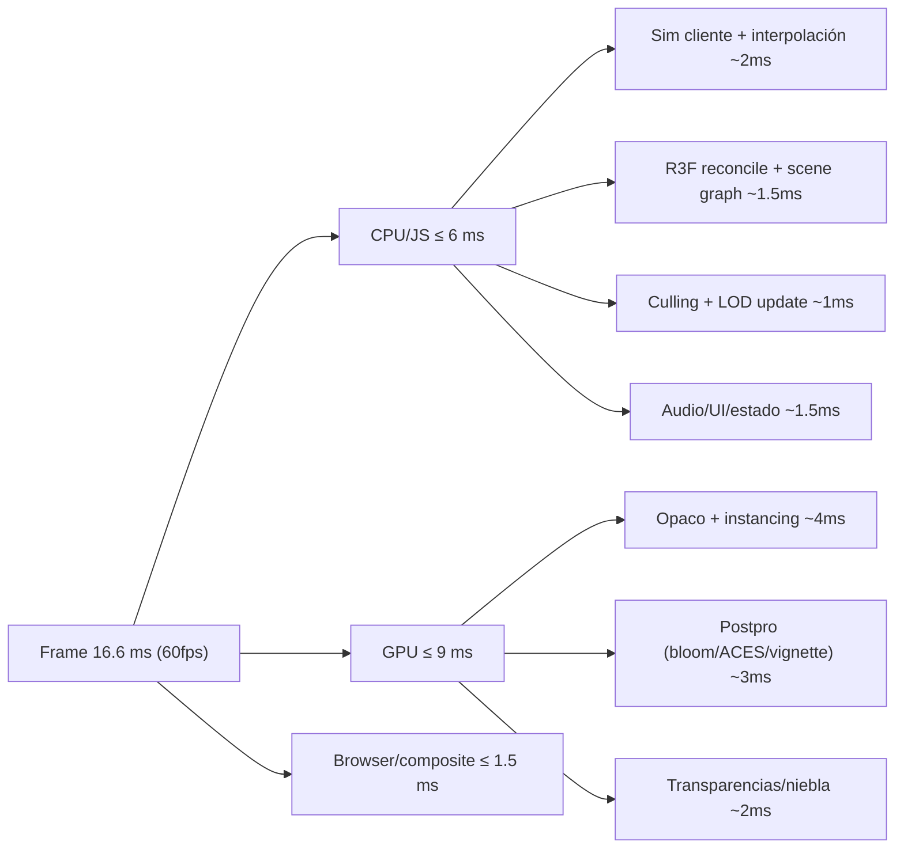
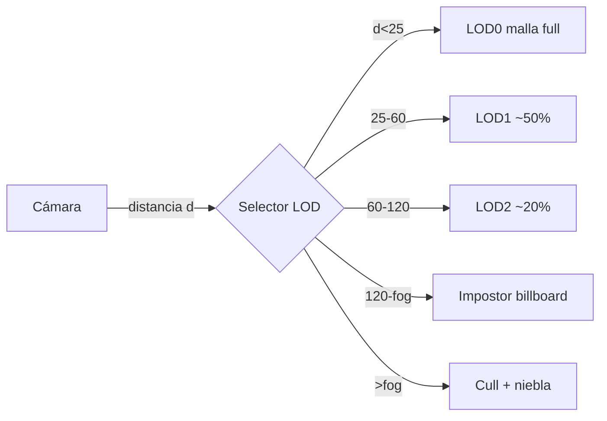
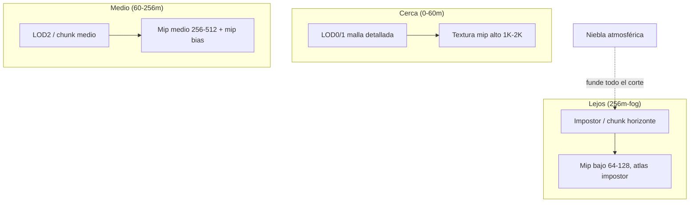
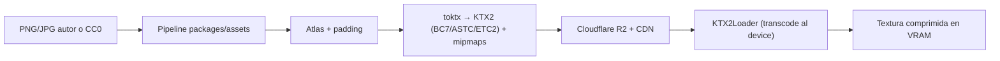
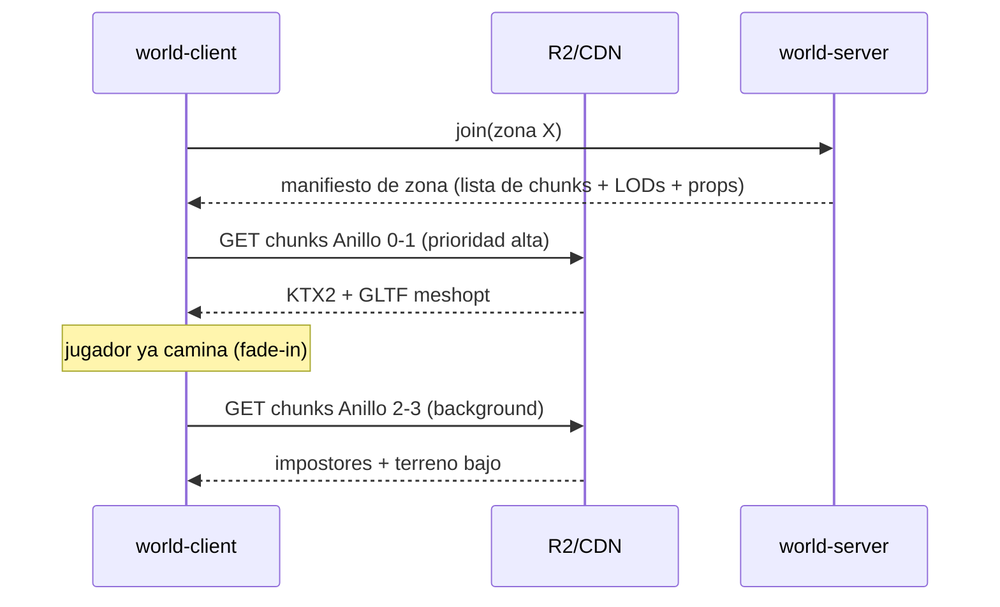
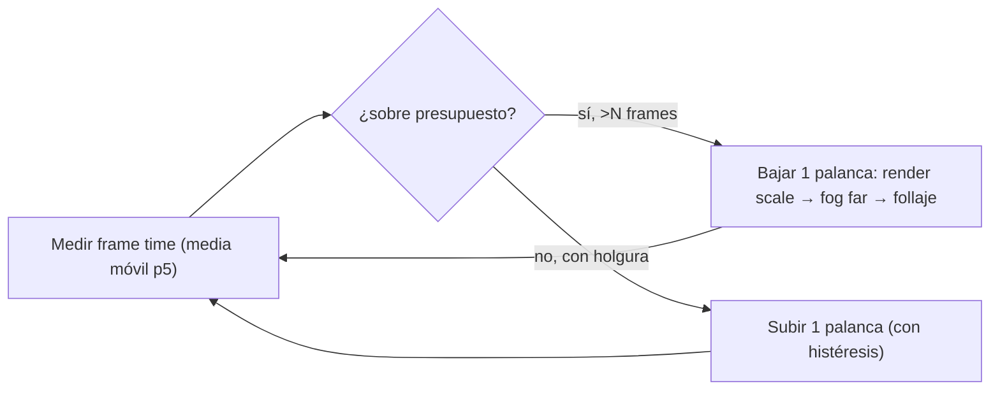
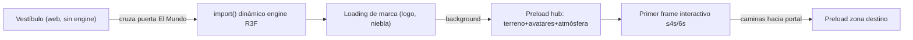

# Estrategia de Rendimiento — OSIA

> Propósito: definir la **estrategia de rendimiento gráfico, de memoria y de carga** de EL MUNDO (`apps/world-client` + `packages/assets`) y, de forma transversal, del resto del ecosistema. Cubre presupuestos objetivo (fps, draw calls, triángulos, VRAM, carga, bytes/tick), el sistema de **LOD** de geometría, la técnica **"DISTANT HORIZONS"** (terreno por chunks con LOD jerárquico + imposters + niebla + texturas que bajan con la distancia), instancing, culling, pipeline de texturas KTX2, compresión Draco/Meshopt y streaming de chunks, object pooling y gestión de memoria GPU, adaptive quality / dynamic resolution, rendimiento de red (resumen), tiempo de carga y herramientas de profiling. Incluye **números concretos** y una **checklist por fase** para no sobre-optimizar en Fase 0. | Estado: Borrador v1 | Fecha: 2026-06-19 | Parte del paquete de diseño OSIA.

---

## 0. Cómo leer este documento

Este es el **documento fundacional del área de rendimiento**. Es, junto con el de tiempo real, el que más le importa al fundador: lo que hace que un mundo low-poly hecho por una persona con ~250 USD se sienta **caro, fluido y enorme** sin serlo realmente. Las palabras clave que Carlos pidió explícitamente — *"distant horizons"* (como el mod de Minecraft) y *"texturas que bajan de resolución con la distancia"* — son ciudadanos de primera clase aquí (§3, §6).

Principios que gobiernan cada decisión (heredados de la constitución):

1. **Lo premium no es ser vasto, es ser curado, vivo y bello.** El rendimiento existe para que la atmósfera respire a 60 fps, no para empujar polígonos. Un horizonte limpio con niebla champán a 60 fps vale más que el doble de geometría a 35 fps con stutter.
2. **El truco caro es barato.** *Distant horizons* + niebla + imposters + LOD agresivo es exactamente el patrón que convierte un presupuesto pobre de geometría en una sensación de mundo grande. Es **diseño**, no fuerza bruta.
3. **No sobre-optimizar antes de tener el sentimiento.** Fase 0 = una escena bella con 2-3 personas. La mayoría de los sistemas de este doc (LOD jerárquico, virtual texturing, occlusion culling) **NO se construyen en Fase 0**. Se diseñan ahora y se encienden cuando hay carga real (ver checklist §14). Optimizar de más en Fase 0 quema runway sin mejorar el loop de feedback.
4. **Presupuestos primero, magia después.** Sin números objetivo (§1) no se puede saber si una optimización ayuda. Cada técnica de este doc se justifica contra un presupuesto.
5. **Server-authoritative, cliente bonito.** El cliente solo dibuja; la verdad vive en el servidor (ver realtime). El rendimiento de red es un resumen aquí y vive en detalle en el doc de realtime.

Cross-links principales:

- Visión y alcance: ver [./00-vision-alcance.md](./00-vision-alcance.md)
- Pilares y experiencia (loops, primera sesión, "uy me quedo acá"): ver [./01-pilares-experiencia.md](./01-pilares-experiencia.md)
- Marca y design system (paleta, niebla marfil, postprocessing de marca): ver [./02-marca-design-system.md](./02-marca-design-system.md)
- Arquitectura del sistema (monorepo, despliegue, CDN de assets): ver [./03-arquitectura-sistema.md](./03-arquitectura-sistema.md)
- Modelo de datos / ER (`AssetManifest`, `FeatureFlag` de calidad): ver [./04-modelo-datos-er.md](./04-modelo-datos-er.md)
- Tiempo real, mundo y networking (tick, AOI, delta, protocolo binario): ver [./05-realtime-mundo-networking.md](./05-realtime-mundo-networking.md)
- Motor de atmósfera (niebla, ciclo día/noche, eventos): ver [./06-motor-atmosfera.md](./06-motor-atmosfera.md) *(a definir)*
- Decisiones abiertas (estética, avatares, recorrido): ver [./adr/ADR-000-decisiones-abiertas.md](./adr/ADR-000-decisiones-abiertas.md)

> **Estado real del proyecto:** esto es DISEÑO. La carpeta `apps/world-client` y `packages/assets` aún no existen; solo hay `/brand` y `/docs`. Todos los números (fps, draw calls, MB de VRAM, ms de carga, distancias de LOD) son **objetivos de diseño justificados**, no mediciones. La primera tarea de la implementación será montar el HUD de profiling (§13) para reemplazar estos objetivos por números reales.

---

## 1. Presupuestos objetivo (performance budgets)

Un presupuesto es una **promesa numérica** que el frame debe cumplir. Si una feature lo rompe, la feature se recorta o se optimiza — no se sube el presupuesto. Esta es la herramienta #1 contra el "muerte por mil cortes" gráfico.

### 1.1 Tabla maestra de presupuestos

Dos perfiles de referencia: **Desktop** (laptop de Carlos / amigos con GPU dedicada o iGPU decente) y **Mobile** (gama media, ~2-3 años de antigüedad). Son objetivos por frame en estado de juego normal (hub con 2-12 jugadores), no en el peor caso absoluto.

| Métrica | Desktop (objetivo) | Mobile (objetivo) | Por qué este número |
|---|---|---|---|
| **FPS** | **60 fps** (16.6 ms/frame) | **30 fps** (33.3 ms/frame) | 60 es el estándar de "se siente vivo"; 30 estable se siente mejor que 45 con stutter en móvil. Estabilidad > pico. |
| **Frame time CPU (JS)** | < 6 ms | < 12 ms | El resto del budget de 16.6/33.3 ms es para GPU + browser. JS no puede comerse el frame. |
| **Draw calls** | **≤ 150** | **≤ 80** | Cada draw call tiene overhead de driver. Con instancing + merge, 150 alcanza para un hub completo. Móvil paga más por draw call. |
| **Triángulos en pantalla** | **≤ 1.0 M** | **≤ 350 k** | Low-poly + LOD. La atmósfera (niebla, postpro) da la riqueza, no el conteo de tris. 1M es holgado para low-poly. |
| **Geometría única (vértices distintos en escena)** | ≤ 1.5 M | ≤ 500 k | Distinto de "tris en pantalla": mide cuánta malla cargada hay (instancing reusa). |
| **VRAM total** | **≤ 1.0 GB** | **≤ 350 MB** | Texturas KTX2 + buffers + render targets. Móvil comparte RAM/VRAM; pasarse = crash o swap brutal. |
| ↳ Texturas | ≤ 600 MB | ≤ 200 MB | Con KTX2 + mipmaps + streaming, el grueso de la VRAM. |
| ↳ Geometría (VBO/IBO) | ≤ 250 MB | ≤ 90 MB | Tras Draco/Meshopt decode en GPU. |
| ↳ Render targets (postpro, bloom, shadows) | ≤ 150 MB | ≤ 60 MB | Bloom a media res, sin sombras dinámicas pesadas en móvil. |
| **Tiempo de carga — primer frame interactivo (TTI escena)** | **≤ 4 s** (red rápida) | **≤ 6 s** | "Entrar al mundo" no puede sentirse como instalar. Loading cinematográfico de marca cubre el resto. |
| ↳ Bundle JS inicial (gzip) del world-client | ≤ 250 KB sin engine | ≤ 250 KB | El engine R3F/Three se carga **on-demand** (code splitting, §12), no en el bundle del vestíbulo. |
| ↳ Peso de assets de la primera escena (descarga) | ≤ 8 MB | ≤ 5 MB | KTX2 + Draco hacen que una escena bella quepa en pocos MB. |
| **Bytes/tick de red (downstream por cliente)** | **≤ 1.5 KB/tick** | ≤ 1.5 KB/tick | Con AOI + delta + binario a 15-20 Hz → ~22-30 KB/s. Detalle en realtime. |
| **Latencia de input→render (responsividad)** | ≤ 50 ms percibido | ≤ 80 ms | Client prediction esconde el RTT; ver realtime. |
| **Stutter (frames > 2× presupuesto)** | < 1 % de frames | < 2 % de frames | Un stutter rompe la inmersión más que un fps medio bajo. GC y carga de chunks son los sospechosos. |

### 1.2 Reglas de oro de los presupuestos

- **El presupuesto es del peor cuadro razonable, no del promedio.** "60 fps de promedio" con caídas a 30 al cruzar un portal es un fracaso. Medimos **p1/p5 de frame time** (los frames más lentos), no la media.
- **Móvil es el techo de diseño, desktop el piso de comodidad.** Si algo no cabe en móvil, vive detrás de un nivel de calidad (§9), nunca se asume.
- **Cada presupuesto tiene un dueño en el HUD de profiling** (§13). Si no se puede medir, no es un presupuesto, es un deseo.
- **El presupuesto de red es transversal pero se decide en realtime.** Aquí solo se resume (§10) para tener la foto completa del "costo por frame".

### 1.3 Reparto del frame budget (desktop, 16.6 ms)

> El postprocessing (bloom + tone mapping ACES + vignette + color grading) es **el alma visual de OSIA** y se lleva ~3 ms. Es caro pero es lo que hace caro al low-poly: no se recorta, se optimiza (bloom a media resolución, un solo pase combinado donde se pueda).

---

## 2. Sistema de LOD de geometría

**LOD (Level of Detail):** mostrar mallas más simples cuanto más lejos está el objeto, porque a 80 m un árbol ocupa 4 px y nadie distingue sus 5.000 tris de sus 200.

### 2.1 Niveles de LOD estándar

Cada asset "grande" (árbol, roca, edificio, prop notable) declara hasta 4 niveles en su manifiesto (§7.3, `packages/assets`). No todo asset necesita los 4; props chicos pueden tener solo LOD0 + cull.

| Nivel | Distancia desktop | Distancia mobile | Reducción de tris (típica) | Generación |
|---|---|---|---|---|
| **LOD0** (alta) | 0 – 25 m | 0 – 15 m | 100 % (malla autora) | Asset original (CC0 Quaternius/Kenney). |
| **LOD1** (media) | 25 – 60 m | 15 – 40 m | ~50 % | Decimación automática (gltf-transform / meshoptimizer simplify). |
| **LOD2** (baja) | 60 – 120 m | 40 – 80 m | ~20 % | Decimación agresiva, normales recalculadas. |
| **LOD3 / impostor** | 120 m – fog | 80 m – fog | Billboard 1-2 quads | Impostor: render del asset a textura (octaedro o single-card). Ver §3.3. |
| **Cull** | > fog distance | > fog distance | 0 (no se dibuja) | Niebla lo oculta; nunca se dibuja más allá del fog far. |

### 2.2 Mecánica de switch (sin pop visible)

El cambio de LOD es el momento donde se ve el "pop". Tres defensas, en orden de costo:

1. **Histéresis de distancia.** El umbral de subir de LOD (acercándose) es ~10 % menor que el de bajar (alejándose). Evita el *flickering* cuando caminas justo sobre la frontera.
2. **Niebla como cómplice.** Las distancias de LOD3→cull se colocan **dentro de la zona de niebla densa** (§3.4) de modo que el objeto ya está mayormente velado cuando hace pop. La niebla no es decoración: es la herramienta de rendimiento #1 de OSIA.
3. **Cross-fade de LOD (solo si hace falta, Fase 2+).** Disolver entre dos niveles con `dithered alpha` durante ~0.2 s. Cuesta dibujar 2 LODs un instante; reservado para los assets más visibles (árboles del hub). No en Fase 0.

`@react-three/drei` ofrece `<Detail>` / `Lod` que envuelve `THREE.LOD`; se usa como base pero el sistema de **terreno** (§3) usa LOD propio por chunks, no `THREE.LOD` por objeto.

### 2.3 Quién paga la generación de LODs

- **Offline, en el pipeline de assets** (`packages/assets`, ver §7). Nunca en runtime. Cada asset entra al pipeline y sale con sus LODs ya horneados en el GLTF (extensión `EXT_mesh_gltf` con primitivas por nivel) + su impostor en KTX2.
- Herramientas: `gltf-transform` (CLI de Don McCurdy) para `simplify` (usa meshoptimizer), `draco`/`meshopt` para compresión, y un script propio (Three.js headless o Blender bake) para hornear impostores.
- El manifiesto LOD (§7.3) declara distancias por **clase de asset** (árbol, roca…) para no afinar cada uno a mano.

---

## 3. "DISTANT HORIZONS" — terreno por chunks, imposters, niebla y texturas por distancia

Esta es **la sección que define la sensación de OSIA**: un horizonte que parece enorme y caro, dibujado casi gratis. Es la técnica que Carlos pidió por nombre (el mod *Distant Horizons* de Minecraft). Se compone de cuatro piezas que trabajan juntas.

### 3.1 Idea central

> El mundo cercano se dibuja con detalle real; el mundo lejano se dibuja como una **maqueta barata** (chunks de baja resolución + billboards) y la **niebla** funde la frontera entre maqueta y detalle para que nunca se note el corte. Resultado: parece que ves kilómetros, pero solo unos pocos metros son geometría real.

OSIA es **instanciado** (rooms acotados, ver realtime), no un mundo continuo infinito. Esto hace *distant horizons* mucho más fácil que en Minecraft: cada zona tiene un horizonte **finito y horneado**, no generado infinitamente. El truco es presentación, no streaming masivo de mundo.

### 3.2 Terreno por chunks con LOD jerárquico (quadtree / clipmap)

El terreno de cada zona se divide en una grilla de **chunks** (p.ej. 32×32 m). Cada chunk tiene su propia cadena de LOD de malla. La selección de LOD del terreno es **jerárquica** (quadtree): cuanto más lejos del jugador, más grande y más simple el chunk visible.

| Anillo | Radio desde el jugador | Tamaño de chunk efectivo | Resolución de malla (terreno) |
|---|---|---|---|
| Anillo 0 (pisas aquí) | 0 – 32 m | 32 m (full) | Alta (heightmap a 1 m/vértice) |
| Anillo 1 | 32 – 96 m | 64 m (merge 2×2) | Media (2 m/vértice) |
| Anillo 2 | 96 – 256 m | 128 m (merge 4×4) | Baja (4 m/vértice) |
| Anillo 3 (horizonte) | 256 m – fog far | 256 m+ (impostor de terreno) | Plano texturizado / billboard de silueta |

Esto es un **geo-clipmap** simplificado: anillos concéntricos de detalle decreciente centrados en el jugador. La transición entre anillos se cose con *skirts* (faldones verticales en el borde del chunk) para evitar **grietas (T-junctions)** entre resoluciones distintas, técnica estándar de terrenos LOD.

> **Decisión de alcance:** en Fase 0 el terreno de la única escena puede ser **una sola malla horneada** (la zona es pequeña, el horizonte es niebla). El quadtree de chunks **emerge en Fase 2** cuando hay zonas grandes/biomas. Se diseña el contrato ahora, no se construye el motor de clipmap todavía. (Ver §14.)

### 3.3 Imposters / billboards para lo lejano

Más allá del Anillo 2, los objetos individuales (árboles, rocas, edificios) ya no son mallas: son **impostores**.

- **Impostor = imagen 2D del objeto** mirando a cámara (billboard). Un árbol lejano es 1-2 quads con una textura del árbol horneada desde varios ángulos.
- **Tipos:**
  - *Single-card billboard:* 1 quad siempre de frente. Más barato, sirve para vegetación densa lejana (un bosque entero es un campo de billboards instanciados).
  - *Octahedral impostor:* atlas de N×N vistas del objeto; se elige la vista según el ángulo cámara-objeto. Más caro de hornear, mejor para objetos lejanos pero notables (un monumento del hub). Solo si hace falta (Fase 2+).
- **Instancing de billboards:** todos los árboles lejanos de una zona se dibujan en **1 draw call** con `InstancedMesh` de un quad + atlas de impostores (§4). Un "bosque al fondo" cuesta ~1 draw call.
- **Horneado offline** en el pipeline (§2.3): cada clase de asset grande genera su impostor a KTX2 junto con sus LODs.

### 3.4 Niebla / fade que oculta el pop-in

La niebla es **central para la marca** (niebla marfil/champán, atmósfera celestial) **y** la herramienta de rendimiento clave: oculta el límite del mundo dibujado.

- **Tipo:** niebla exponencial al cuadrado (`FogExp2`) por defecto — densa cerca del límite, suave cerca del jugador. Alternativa lineal para escenas que quieran ver más lejos. El color de la niebla lo dicta el **motor de atmósfera** (cambia con hora/clima; ver doc atmósfera), no es constante.
- **Acoplamiento LOD↔niebla:** las distancias de `LOD3→cull` y `Anillo3→fog far` se colocan donde la niebla ya alcanza ~70-90 % de opacidad. Así el objeto/terreno que aparece o desaparece **ya está velado**: no hay pop.
- **Fade de chunks:** un chunk que entra por streaming aparece con un `fade-in` de opacidad de ~0.3-0.5 s acoplado a la niebla (no aparece "golpeado").
- **Fog far por perfil:** desktop puede empujar el fog far más lejos (horizonte más grande); móvil lo acerca para recortar geometría. Es una palanca directa de adaptive quality (§9).

| Parámetro de niebla | Desktop | Mobile | Efecto |
|---|---|---|---|
| Fog far (límite visible) | ~300-400 m | ~180-220 m | Tamaño percibido del horizonte vs. geometría dibujada. |
| Inicio de densidad notable | ~60 % del far | ~50 % del far | Dónde empieza a "comerse" el detalle lejano. |
| Densidad (`FogExp2.density`) | menor (más claro) | mayor (oculta antes) | Móvil oculta más temprano para ahorrar. |

### 3.5 Texturas que bajan de resolución con la distancia (lo que Carlos pidió)

Tres mecanismos, de barato a sofisticado. OSIA empieza por los dos primeros; el tercero es futuro.

1. **Mipmaps + filtrado trilineal (gratis, siempre activo).** Toda textura KTX2 se sube con su cadena de mipmaps. La GPU **ya** elige automáticamente un mip más bajo (menor resolución) para superficies lejanas. Esto es lo primero que da "texturas que bajan con la distancia" sin código. Sin mipmaps habría shimmer y desperdicio de banda de memoria.
2. **Mip bias / clamp por LOD (control explícito).** Para superficies muy lejanas (terreno del Anillo 2-3, impostores) se fuerza un **sesgo de mip** positivo (usar un mip aún más bajo del que la GPU pediría) y/o se hace **streaming de mips**: los mips altos (4K/2K) de una textura solo se cargan en VRAM si hay una superficie suficientemente cercana que los necesite; si todo está lejos, solo viven los mips bajos. Esto es lo que **baja VRAM**, no solo banda. Implementación con un budget de textura y `texture.minFilter`/`anisotropy` por material + descarga/recarga de niveles (mip streaming manual sobre `CompressedTexture`).
3. **Virtual texturing simple / texture atlas streaming (Fase 5+, solo si hace falta).** "Megatextura" cortada en tiles, cargando solo los tiles visibles a la resolución necesaria. Es complejo y **probablemente innecesario** para low-poly instanciado. Se documenta como salida de escape para mundos enormes, no como plan. Para OSIA, **atlasing estático + mip streaming (puntos 1-2) cubre el 95 %**.

---

## 4. Instancing (InstancedMesh + merged geometry)

La repetición es la mayor fuente de draw calls en un mundo de vegetación/props. Dos herramientas, según si los objetos comparten malla o no.

| Técnica | Cuándo | Costo | Ejemplo OSIA |
|---|---|---|---|
| **`InstancedMesh`** (GPU instancing) | Muchas copias de **la misma malla** con transform/color distinto. | 1 draw call para N copias. Actualizar matrices instanciadas es barato. | Árboles, rocas, hierba, props de plaza, billboards de horizonte, faroles. |
| **Merged geometry** (`BufferGeometryUtils.mergeGeometries`) | Muchas mallas **estáticas distintas** que nunca se mueven y comparten material. | 1 draw call, pero geometría fija (no se mueve cada pieza). Más VRAM. | El "set dressing" estático de una zona: muros, escalones, decoración fija. |
| **`InstancedMesh` + atlas de material** | Copias que varían de textura → atlas para mantener 1 material. | 1 draw call, requiere atlas (§6.4). | Variedad de árboles con un solo atlas de follaje. |

Reglas:

- **Instancing por clase de asset, no por objeto.** El sistema de mundo agrupa todos los árboles `pine_a` de una instancia en un `InstancedMesh`. El servidor manda *posiciones de props* (o la zona las trae horneadas); el cliente las vuelca en buffers instanciados.
- **`frustumCulled` por instancia** (Fase 2+): drei/three permiten cull por instancia con BVH; en Fase 0 basta cull del `InstancedMesh` completo.
- **Hierba/follaje denso = instancing + viento en shader**, nunca mallas individuales. El viento (ver `assets/vfx/wind`) va en el vertex shader sobre instancias, costo ~0.
- **No instanciar lo que es único** (el monumento del hub): no vale la pena, va como malla normal con sus LODs.

---

## 5. Culling (frustum + occlusion) y cómo medirlo

"El frame más rápido es el que no se dibuja." Culling = no enviar a la GPU lo que no se ve.

### 5.1 Frustum culling (siempre, casi gratis)

- Three.js hace **frustum culling automático** por objeto usando su bounding sphere. Activo por defecto (`object.frustumCulled = true`).
- Para `InstancedMesh` grandes conviene **bounding correcto** y, en Fase 2+, cull por instancia con un BVH (`three-mesh-bvh`) para no dibujar las instancias fuera de cámara.
- **No desactivar frustum culling** salvo en objetos que siempre llenan pantalla (skybox, niebla volumétrica).

### 5.2 Occlusion culling (lo que está tapado por algo más cerca)

Más caro de hacer bien en WebGL. Estrategia escalonada:

1. **Fase 0-1: portales y rooms hacen casi todo el trabajo gratis.** Como el mundo es instanciado (un room a la vez, ver realtime), **nunca se dibuja otra zona**. La oclusión "macro" es arquitectura: estás en el hub, no se renderiza el bosque. Esto es occlusion culling de room sin escribir occlusion culling.
2. **Fase 2+: occlusion por celdas/PVS horneado** si una zona tiene mucha auto-oclusión (edificios). Un PVS (Potentially Visible Set) precalculado por sector dice "desde el sector A no se ve el sector C".
3. **Hardware occlusion queries / Hi-Z:** posible en WebGL2 pero con latencia de 1 frame y complejo. **No planeado** salvo evidencia de necesidad real (un interior denso). Para low-poly al aire libre, frustum + niebla + rooms bastan.

### 5.3 Cómo medirlo

- **r3f-perf** y `renderer.info.render` exponen `calls`, `triangles`, `points`, `lines` por frame → comparar contra el presupuesto §1.
- **Spector.js** captura un frame y lista cada draw call: se ve *qué* se dibuja de más y si algo fuera de cámara se está enviando.
- **Métrica de eficacia de culling:** `(objetos en escena − draw calls efectivos) / objetos en escena`. Si culleas poco, algo tiene `frustumCulled=false` o bounding malo.
- Regla operativa: si `renderer.info.render.calls` sube al girar la cámara hacia una pared, el occlusion no funciona; investigar.

---

## 6. Pipeline de texturas (KTX2/Basis, mipmaps, atlas, compresión)

Las texturas son el mayor consumidor de VRAM (§1). El formato correcto importa más que casi cualquier otra cosa.

### 6.1 Por qué KTX2/Basis y no PNG/JPG

| Formato | VRAM en GPU | Decodifica | Veredicto OSIA |
|---|---|---|---|
| PNG/JPG | **Descomprimida** (RGBA32 → 4 bytes/px; un 2K = 16 MB en VRAM) | CPU al cargar | ❌ Bonito en disco, brutal en VRAM. Prohibido para texturas de escena. |
| **KTX2 + Basis Universal** | **Comprimida en GPU** (BC7/ASTC/ETC2, ~1 byte/px o menos) | GPU, transcode al formato del device | ✅ **Estándar de OSIA.** ~4-8× menos VRAM, mipmaps incluidos, un solo archivo para todos los devices. |

KTX2/Basis transcodifica en runtime al formato nativo del device (BC7 en desktop, ASTC/ETC2 en móvil), así que **un archivo sirve para todos**. Three.js lo carga con `KTX2Loader` (necesita los binarios de Basis transcoder, servidos desde CDN).

### 6.2 Reglas de tamaño y mipmaps

- **Mipmaps obligatorios** en toda textura de superficie 3D (da el "baja con la distancia" del §3.5 + evita shimmer).
- **Potencias de 2** (1024, 512, 256…) para mipmaps completos y mejor empaquetado.
- **Presupuesto de resolución por uso:**

| Uso | Resolución máx desktop | Resolución máx mobile |
|---|---|---|
| Personaje/avatar (cercano) | 1024 | 512 |
| Props de plaza (cercanos) | 512-1024 | 256-512 |
| Terreno (atlas/splat) | 1024-2048 | 512-1024 |
| Impostor de horizonte | 256 | 128 |
| Skybox/HDRI | 2K-4K equirect (a media res en móvil) | 1K-2K |

### 6.3 HDRIs (Poly Haven)

- HDRIs para iluminación de imagen (IBL) y cielo. Se cargan como **EnvMap** prefiltrada; el equirect crudo no vive en VRAM a full res.
- Móvil: HDRI a 1K + prefiltrado más agresivo. El cielo puede ser un **gradiente shader + estrellas** (más barato y más on-brand celestial) en vez de HDRI completa en muchas atmósferas. Decisión del doc de atmósfera.

### 6.4 Atlasing

- **Atlas = empacar muchas texturas chicas en una grande** → menos materiales → menos draw calls (habilita instancing del §4).
- Candidatos: props de plaza, follaje, UI diegética. Se atlasea **offline** en el pipeline.
- Cuidado con el sangrado de mipmaps en bordes del atlas (padding de tiles). El empacador del pipeline añade padding.

### 6.5 Resumen del flujo de textura

---

## 7. Compresión de geometría (Draco/Meshopt) y streaming de chunks

### 7.1 Draco vs. Meshopt

| Criterio | Draco | Meshopt (meshoptimizer) |
|---|---|---|
| Ratio de compresión | Muy alto (mejor para mallas grandes) | Alto |
| Velocidad de decode | Más lento (WASM pesado) | **Muy rápido**, decode casi instantáneo |
| Tamaño del decoder | ~1 MB WASM | Pequeño |
| Soporta animación/morph bien | Limitado | **Sí**, bueno para skins/avatares |

**Decisión OSIA:** **Meshopt por defecto** (decode rápido, soporta avatares animados, integra con `gltf-transform`), **Draco opcional** para assets estáticos enormes donde el ratio gane (terreno horneado grande). Ambos vía extensiones GLTF (`EXT_meshopt_compression`, `KHR_draco_mesh_compression`), cargadas con `DRACOLoader`/`MeshoptDecoder` en `GLTFLoader`. El decoder se sirve desde CDN y se carga una vez.

> Justificación: para un mundo low-poly, el **tiempo de descarga** y el **decode rápido al entrar** importan más que exprimir el último KB. Meshopt da el mejor balance. Draco se reserva para casos donde el peso de descarga domine.

### 7.2 Streaming de chunks on-demand

- **Unidad de streaming = chunk de terreno + su set de props** (no asset por asset; demasiados requests).
- Al entrar a una zona se cargan **primero los chunks del Anillo 0-1** (lo que pisas), luego en background los anillos lejanos. El jugador ya puede caminar mientras el horizonte se rellena (con fade, §3.4).
- **Prioridad por distancia + dirección de mirada:** se cargan antes los chunks hacia donde mira/camina el jugador.
- **Descarga (unload):** chunks lejanos a los que no volverás (otra zona tras un portal) se liberan (§8). En un room instanciado pequeño rara vez hace falta; importa en zonas grandes (Fase 2+).
- **Caché HTTP + CDN:** los chunks son archivos estáticos versionados en R2/CDN; el navegador y el CDN cachean. Revisitar una zona es instantáneo.

---

## 8. Object pooling y gestión de memoria (dispose, fugas GPU)

En WebGL **la GC del navegador NO libera recursos de GPU.** Una textura o geometría que dejas de referenciar sigue ocupando VRAM hasta que llames `.dispose()` explícitamente. Las fugas de VRAM son el bug #1 que mata sesiones largas en móvil. Esta sección es disciplina obligatoria.

### 8.1 Reglas de dispose

- **Todo lo que se crea en runtime y deja de usarse, se `dispose()`-a:** `geometry.dispose()`, `material.dispose()`, `texture.dispose()`, `renderTarget.dispose()`.
- **Al salir de una zona/room:** un `disposeScene(scene)` recorre y libera todo lo que no se reusa. Lo compartido (atlas global, decoder) **no** se libera.
- **Patrón "owner":** cada zona es dueña de sus recursos y los libera al desmontar. R3F ayuda: lo creado declarativamente dentro de un componente se limpia al desmontar, pero **lo creado imperativamente (loaders, RT manuales) hay que liberarlo a mano** en el cleanup del `useEffect`.
- **Detección de fugas:** vigilar `renderer.info.memory.geometries` y `.textures` en el HUD. Si suben monótonamente sesión tras sesión sin estabilizarse, hay fuga. Test: entrar/salir de una zona 20 veces y verificar que vuelven al baseline.

### 8.2 Object pooling

Crear/destruir objetos JS en caliente genera basura → GC → **stutter**. Se reutilizan ("pool") en vez de recrear:

| Qué se poolea | Por qué |
|---|---|
| Vectores/quaterniones temporales (`THREE.Vector3` scratch) | Evita asignar miles por frame en sim/culling. Pool de scratch reutilizable. |
| Partículas / VFX (chispas, hojas, lluvia de meteoros) | Eventos efímeros reusan un pool fijo de partículas. |
| Etiquetas/labels de jugadores y NPCs | Reusar nodos en vez de crear/destruir al entrar/salir gente. |
| Mensajes de red decodificados | Buffers reutilizables (ver realtime, evita GC por tick). |

Regla: **cero asignaciones en el hot path del frame** (loop de render, sim, culling). Las asignaciones van en setup/carga, no por frame.

### 8.3 Presupuesto de memoria y degradación

- Si VRAM se acerca al presupuesto (§1), el sistema de calidad (§9) **baja antes de crashear**: reduce mip cap, recorta fog far, baja resolución de render. Mejor feo que muerto, sobre todo en móvil.

---

## 9. Adaptive quality / dynamic resolution / escalado por device

No se asume el hardware: se **mide y se adapta**. El objetivo es **mantener el fps objetivo (§1) degradando lo menos visible primero.**

### 9.1 Niveles de calidad (quality tiers)

Tres presets, seleccionables por el usuario y/o automáticos. Persisten en perfil/`FeatureFlag` (ver ER) y se detectan por capacidades (GPU, `devicePixelRatio`, memoria, móvil vs desktop).

| Palanca | Ultra (desktop fuerte) | Alto (desktop típico) | Bajo (móvil/iGPU débil) |
|---|---|---|---|
| Render scale (DPR efectivo) | 1.0× nativo | 0.85-1.0× | 0.6-0.75× |
| Fog far / horizonte | Lejano | Medio | Cercano (recorta geometría) |
| Sombras | Sí (shadow map medio) | Suaves/baked mix | Solo baked / blob shadow |
| Bloom / postpro | Full, media res | Media res | Bloom mínimo o off |
| Densidad de follaje/instancias | 100 % | 70 % | 40 % |
| Cap de mip de textura | Full | −1 nivel lejano | −1/−2, atlas bajos |
| Anisotropía | 8-16× | 4× | 1-2× |
| Distancias de LOD | Lejanas | Medias | Cercanas (LODs bajos antes) |

### 9.2 Dynamic resolution (la palanca de oro)

- **Resolución de render dinámica:** si el frame time sube por encima del presupuesto durante N frames, **baja el render scale** (renderiza a menos píxeles y escala a pantalla). Si hay holgura, sube de nuevo. Es la palanca que más fps recupera por menos pérdida visual percibida (la niebla y el postpro disimulan).
- Implementación: ajustar `renderer.setPixelRatio` / tamaño del render target dinámicamente, con histéresis (no oscilar) y límites por tier.
- La **UI (DOM/2D) se mantiene a resolución nativa**; solo se escala el render 3D.

### 9.3 Bucle de adaptación

> **Orden de degradación (lo menos doloroso primero):** render scale → densidad de follaje lejano → fog far → calidad de bloom → sombras → resolución de textura. La geometría cercana y la legibilidad de avatares/NPCs se tocan de últimas: la cara social es sagrada.

> **Alcance:** detección de device + 3 tiers fijos es Fase 1. **Dynamic resolution automático es Fase 2** (cuando hay variedad de hardware real). En Fase 0, un solo preset que corra bien en la máquina de Carlos basta.

---

## 10. Rendimiento de RED (resumen — detalle en realtime)

El "costo por frame" incluye la red. Aquí solo la foto; el detalle, las justificaciones y los schemas viven en [./05-realtime-mundo-networking.md](./05-realtime-mundo-networking.md).

| Técnica | Qué hace por el rendimiento | Número objetivo |
|---|---|---|
| **Tick fijo** (server-authoritative) | Simulación determinista a frecuencia constante; el cliente interpola entre snapshots. | 15-20 Hz |
| **Interest Management / AOI** | Solo se sincronizan entidades dentro del área de interés del jugador → menos bytes y menos objetos a actualizar. | Solo entidades en radio AOI / misma instancia |
| **Delta compression** | Se envía solo lo que cambió respecto al último snapshot, no el estado completo. | ↓ ~70-90 % vs. full state |
| **Protocolo binario** (msgpack / schema propio) | Sin overhead de JSON; campos empaquetados (cuantización de posiciones). | ≤ 1.5 KB/tick downstream |
| **Client prediction + reconciliation** | El cliente dibuja el movimiento propio sin esperar al server → 0 lag percibido en input. | input→render < 50 ms percibido |
| **Snapshot interpolation** | El cliente renderiza ~100 ms en el pasado e interpola → movimiento suave aunque lleguen pocos snapshots. | buffer ~100 ms |

Implicación para el render: como las posiciones llegan a 15-20 Hz pero se dibuja a 60 fps, **la interpolación corre en el cliente cada frame** (parte del budget CPU §1.3). El profiling debe separar "tiempo de red" de "tiempo de render".

---

## 11. Tiempo de carga (code splitting, lazy zones, preload, suspense)

"Entrar a OSIA" no puede sentirse como una descarga. El objetivo (§1): primer frame interactivo de la escena en **≤ 4 s** desktop / ≤ 6 s móvil, con un loading **cinematográfico de marca** (no una barra fría) cubriendo la espera.

### 11.1 Code splitting (el engine es opcional)

- El **vestíbulo** (`apps/web`) carga ligero: landing + pasaporte + auth. **No incluye Three.js/R3F.** Bundle inicial ≤ 250 KB gzip.
- **El engine del mundo se carga on-demand** al cruzar la puerta a EL MUNDO (deep-link o desde el vestíbulo): `import()` dinámico del cliente R3F. Quien solo entra a la red social (futuro) nunca descarga el engine 3D.
- Dentro del world-client, separar chunks: core de render | física (rapier WASM) | sistema de IA/voz (Whisper/TTS, Fase 2) | postpro. Cargar lo de Fase tardía solo cuando aplica.

### 11.2 Lazy zones + preload inteligente

- Cada **zona** es un chunk de carga perezosa. Solo se carga la zona en la que estás.
- **Preload predictivo:** al acercarte a un **portal**, se empieza a precargar (low priority) los assets de la zona destino, para que cruzar sea instantáneo. El portal es a la vez diégesis y *prefetch hint*.
- **Preload de la primera escena durante el login/loading de marca:** mientras se ve la animación del logo y se verifica sesión, ya se descargan en background los assets del hub.

### 11.3 Suspense y orden de aparición

- React **Suspense** + `useGLTF`/`useTexture` (drei) suspenden hasta que el asset crítico está; el resto entra con fade.
- **Orden de prioridad de carga:** terreno cercano + avatares → props cercanos → atmósfera/skybox → horizonte/impostores → audio. El jugador "está" antes de que el horizonte termine de poblarse.
- **Placeholder de baja calidad primero (LQIP 3D):** mostrar el LOD bajo / impostor mientras llega el LOD0, nunca un agujero.

---

## 12. Herramientas de profiling

No se optimiza lo que no se mide. Estas herramientas se montan **antes** de optimizar nada (la primera tarea de implementación del world-client).

| Herramienta | Qué mide | Cuándo |
|---|---|---|
| **r3f-perf** (`<Perf/>`) | FPS, frame time, draw calls, triángulos, memoria de geometrías/texturas, GPU time aprox. Overlay en dev. | Siempre en dev; toggle oculto en build. El HUD de presupuestos §1. |
| **stats.js** | FPS / ms / MB ligero, panel minimal. | Cuando r3f-perf es muy pesado o en builds de prueba en móvil. |
| **Spector.js** | Captura un frame y lista **cada draw call**, estado de GL, texturas usadas. Para cazar draw calls de más y estados redundantes. | Auditoría puntual de una escena. |
| **Chrome DevTools — Performance** | Flame chart de JS: GC, long tasks, dónde se va el CPU del frame (sim, R3F, culling). Detecta stutter por asignaciones. | Cazar GC/stutter y picos de CPU. |
| **Chrome DevTools — Memory (heap)** | Heap JS, detached nodes, retención. Complementa el conteo de `renderer.info.memory` para fugas. | Auditoría de fugas JS↔GPU. |
| **`renderer.info`** (API Three) | `render.calls`, `render.triangles`, `memory.geometries`, `memory.textures`. Fuente de verdad numérica. | Logueado en el HUD y en tests automáticos de presupuesto. |
| **WebGL Insight / about:gpu** | Estado del device, formatos de textura comprimida soportados (BC7/ASTC/ETC2). | Diagnóstico de transcodificación KTX2 por device. |
| **Lighthouse / WebPageTest** | Tiempo de carga, bundle, TTI del vestíbulo y del arranque. | Auditoría del presupuesto de carga §11. |

**Práctica:** un **"performance budget test"** automatizable (puede correr en CI con un headless o manual): cargar la escena del hub, dejar correr 10 s, y fallar si `render.calls`, `triangles` o `memory.textures` superan el presupuesto §1. Convierte los presupuestos en algo verificable, no aspiracional.

---

## 13. HUD de presupuestos (panel interno)

Un overlay de desarrollo (detrás de un `FeatureFlag`/atajo) que muestra en vivo, con color rojo si excede:

- FPS / frame time (p1, p5, media) · CPU ms vs GPU ms.
- Draw calls / triángulos (vs presupuesto §1).
- VRAM: texturas, geometrías, render targets.
- Bytes/tick de red (downstream/upstream) + RTT.
- Chunks cargados / en streaming / liberados.
- Tier de calidad activo + render scale actual.

Es la **pizarra de presupuestos del §1** hecha tangible. Reemplaza los "objetivos de diseño" de este doc por números reales en cuanto exista la escena.

---

## 14. Checklist de optimización por fase (no sobre-optimizar)

La regla de oro: **en Fase 0 se construye el sentimiento, no el motor de rendimiento.** Casi todo lo de este doc se *diseña* ahora pero se *enciende* cuando hay carga. Esta tabla es el contrato de "qué hacer cuándo".

### 14.1 Por fase

| Técnica | F0 (sentimiento) | F1 (identidad+vestíbulo) | F2 (mundo vivo) | F3-F4 (social/juego) | F5+ (gigante) |
|---|---|---|---|---|---|
| Presupuestos §1 + HUD profiling §13 | ✅ montar ya | ✅ | ✅ | ✅ | ✅ |
| KTX2 + mipmaps (texturas) | ✅ desde el día 1 | ✅ | ✅ | ✅ | ✅ |
| Meshopt/Draco en GLTF | ✅ | ✅ | ✅ | ✅ | ✅ |
| Niebla atmosférica (oculta límite) | ✅ (es marca y rendimiento) | ✅ | ✅ | ✅ | ✅ |
| Instancing de vegetación/props | ✅ (lo básico) | ✅ | ✅ refinado (cull por instancia) | ✅ | ✅ |
| LOD por objeto (4 niveles) | ⚠️ 2 niveles (full + impostor) basta | ✅ | ✅ completo | ✅ | ✅ |
| Terreno por chunks / clipmap (§3.2) | ❌ malla horneada única | ❌ | ✅ aparece con biomas | ✅ | ✅ jerárquico full |
| Impostores de horizonte (§3.3) | ⚠️ billboard simple | ✅ | ✅ octahedral si hace falta | ✅ | ✅ |
| Mip streaming / texturas por distancia (§3.5) | ❌ (mipmaps gratis bastan) | ⚠️ mip bias | ✅ streaming de mips | ✅ | ✅ + virtual texturing si hace falta |
| Streaming de chunks on-demand (§7.2) | ❌ todo precargado | ❌ | ✅ | ✅ | ✅ con unload agresivo |
| Frustum culling | ✅ (default Three) | ✅ | ✅ + BVH instancias | ✅ | ✅ |
| Occlusion culling explícito | ❌ (rooms ya lo dan) | ❌ | ⚠️ solo si interior denso | ⚠️ | ✅ PVS si hace falta |
| Object pooling / dispose disciplinado | ✅ dispose al salir (evitar fugas) | ✅ | ✅ pools de VFX/red | ✅ | ✅ |
| Quality tiers (3 presets) | ❌ 1 preset | ✅ detección + 3 tiers | ✅ | ✅ | ✅ |
| Dynamic resolution automático | ❌ | ❌ | ✅ | ✅ | ✅ |
| Code splitting (engine on-demand) | ⚠️ ya separar web↔world | ✅ vestíbulo sin engine | ✅ | ✅ por app | ✅ |
| Preload predictivo por portal | ❌ | ⚠️ preload del hub en login | ✅ | ✅ | ✅ |

✅ = hacer · ⚠️ = versión mínima · ❌ = NO todavía (sobre-optimización).

### 14.2 Anti-patrones (qué NO hacer en Fase 0)

- ❌ Construir el geo-clipmap/quadtree de terreno para una sola escena pequeña.
- ❌ Virtual texturing / megatextura. Casi seguro nunca hace falta.
- ❌ Occlusion queries por hardware. Los rooms ya cullean el resto del mundo.
- ❌ Sistema de LOD de 4 niveles con cross-fade para props que casi no se ven.
- ❌ Optimizar la red antes de tener 3 personas caminando (los presupuestos de red importan, pero la implementación fina es realtime, no día 1).
- ❌ Perseguir 60 fps en un móvil de gama baja en Fase 0: el target de F0 es la máquina de Carlos y sus amigos.

### 14.3 Lo que SÍ es no-negociable desde el día 1

1. **KTX2 + mipmaps + Meshopt** en el pipeline de assets. Cambiar formatos después es doloroso; hacerlo bien una vez es barato.
2. **Dispose disciplinado** (evitar fugas de VRAM). Una fuga descubierta tarde puede costar reescribir el ciclo de vida de zonas.
3. **HUD de profiling (§13)** antes de optimizar nada.
4. **Niebla atmosférica** — es marca *y* rendimiento a la vez; gratis en ambos sentidos.
5. **Separación web (sin engine) ↔ world-client (engine on-demand)** en el monorepo. Es arquitectura; rehacerlo después es caro.

---

## 15. Decisiones de rendimiento (resumen para coherencia)

| # | Decisión | Justificación | Estado |
|---|---|---|---|
| R1 | Presupuestos: 60 fps desktop / 30 mobile; ≤150/80 draw calls; ≤1M/350k tris; ≤1GB/350MB VRAM | Estabilidad > pico; low-poly + atmósfera no necesita fuerza bruta | Bloqueada (tenets) |
| R2 | **Distant horizons = chunks LOD + impostores + niebla + texturas por distancia**, no fuerza bruta | Lo pidió Carlos; convierte presupuesto pobre en mundo "enorme y caro" | Bloqueada (tenets) |
| R3 | Niebla como herramienta de rendimiento de primera clase (oculta pop-in y límite) | Es marca y rendimiento simultáneamente; costo ~0 | Bloqueada |
| R4 | KTX2/Basis + mipmaps obligatorio; PNG/JPG prohibido en escena | 4-8× menos VRAM; mipmaps dan "texturas por distancia" gratis | Bloqueada |
| R5 | Meshopt por defecto, Draco opcional para estáticos grandes | Decode rápido + soporta avatares animados | Recomendada |
| R6 | InstancedMesh para repetición; merged geometry para estático fijo | 1 draw call por bosque/dressing | Bloqueada (tenets) |
| R7 | Occlusion macro = arquitectura de rooms; occlusion explícito solo si hace falta | Instanciado ya cullea el resto del mundo gratis | Bloqueada |
| R8 | 3 quality tiers + dynamic resolution; degradación ordenada (render scale primero, cara social última) | Mantener fps sin tocar lo que importa socialmente | Recomendada |
| R9 | Engine 3D on-demand (code splitting); vestíbulo sin Three.js | Carga rápida; apps independientes no pagan el engine | Bloqueada (arquitectura) |
| R10 | No sobre-optimizar en Fase 0; HUD de profiling + KTX2 + dispose sí desde día 1 | Camino más corto al sentimiento; lo barato-de-hacer-bien-una-vez se hace ya | Bloqueada (filosofía) |

---

> **Cierre.** El rendimiento de OSIA no es una carrera de polígonos: es el arte de que pocos polígonos, envueltos en niebla champán y atmósfera viva, se sientan inmensos y caros a 60 fps. *Distant horizons* + niebla + LOD agresivo + KTX2 es exactamente esa ilusión bien hecha. La disciplina —presupuestos medibles, dispose riguroso, no optimizar antes de tiempo— es lo que permite que un dev solo con poco runway sostenga esa ilusión. Construir el sentimiento primero; encender el motor de rendimiento cuando la carga lo exija.
