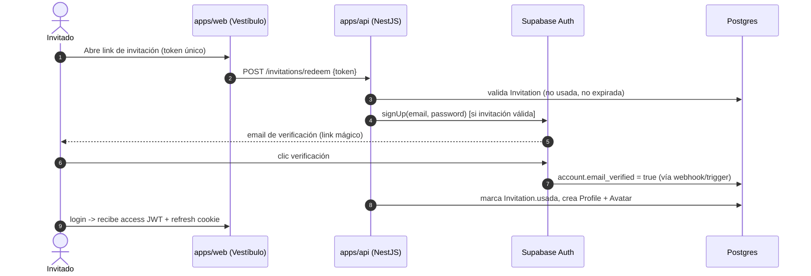
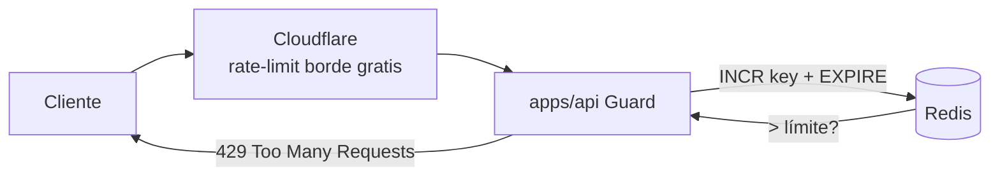
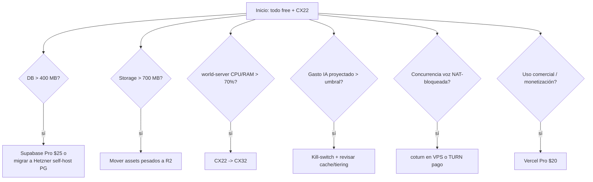
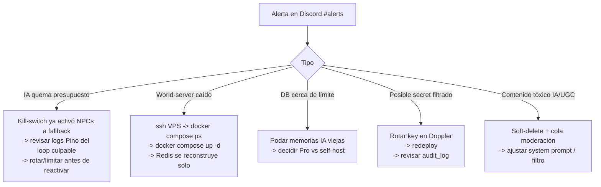

# 09 · Seguridad, Infraestructura y Costos de OSIA

> Propósito: definir el modelo de **seguridad** (auth/sesiones, autorización, rate-limiting, validación, anti-cheat, moderación, privacidad, hardening), la **infraestructura** (sizing concreto de Hetzner, límites del free tier de Supabase, Cloudflare, Vercel) y los **GUARDRAILES DE COSTO** que mantienen vivo a OSIA con ~250 USD y un dev solo. Incluye la **matemática del runway**, costo mensual estimado por fase, triggers de escalado, backups/DR, observabilidad y un runbook de incidentes mínimo. Pragmático, no aspiracional. | Estado: Borrador v1 | Fecha: 2026-06-19 | Parte del paquete de diseño OSIA.

---

## 0 · Principios rectores (por qué este documento existe)

OSIA se construye bajo tres restricciones reales y simultáneas, declaradas en la constitución de diseño:

1. **Capital ~250 USD**, runway de servidores ~2 meses.
2. **Un solo dev** (Carlos), con foco fragmentado (busca empleo).
3. **Invite-only, 2-3 personas en v1.** No hay tráfico que defender todavía, pero sí hay **secretos, costo de IA y reputación de marca** que proteger desde el día 1.

De ahí salen los principios que gobiernan todo este doc:

| Principio | Qué significa en la práctica |
|---|---|
| **Costo correcto, no costo cero** | El gasto que escala con el *engagement* (IA, voz, storage) es bienvenido; el gasto fijo que corre sin usuarios (VPS sobredimensionado, servicios pagos prematuros) es el enemigo. |
| **Free tier hasta que duela** | Supabase free, Vercel free, Cloudflare free, voz P2P. Se paga solo Hetzner (el world server *necesita* un proceso 24/7 con estado). |
| **Seguridad barata primero** | RLS de Postgres, Cloudflare WAF gratis, validación con `zod`, autoridad de servidor. Nada de WAF pago, ni pentests, ni SOC. La superficie de ataque real con 3 usuarios es chica. |
| **El gasto que más rápido se descontrola es la IA** | Por eso los guardrailes de IA (cache, presupuesto de tokens, tiering Haiku/Opus) son la sección más estricta. Un bug puede quemar el runway en una tarde. |
| **Diferir, no negar** | Casi nada se "descarta": se aplaza con un *trigger* explícito ("cuando pase X, paga Y"). Esto evita over-engineering sin perder el plan de escalado. |

Cross-links: la arquitectura general y la topología de despliegue están en [`./03-arquitectura-sistema.md`](./03-arquitectura-sistema.md); el modelo de datos y entidades (Account, AuditLog, RateLimitBucket, etc.) en [`./04-modelo-datos-er.md`](./04-modelo-datos-er.md); el networking autoritativo del Mundo (anti-cheat de movimiento) en [`./05-realtime-mundo-networking.md`](./05-realtime-mundo-networking.md). Las decisiones abiertas viven en `./adr/ADR-000-decisiones-abiertas.md`.

---

## 1 · Autenticación y sesiones

### 1.1 Decisión: Supabase Auth como proveedor de identidad

**Usamos Supabase Auth** (GoTrue) como IdP, no un auth propio. Justificación:

- Ya está en el stack bloqueado (Supabase free tier: Auth + Postgres + Storage + Realtime + pgvector).
- Resuelve gratis lo aburrido y peligroso: hashing de contraseñas (bcrypt), verificación de email, emisión/rotación de JWT, recuperación de cuenta. Escribir esto a mano siendo un dev solo es regalar superficie de bugs de seguridad.
- Emite **JWT firmados (HS256 con el JWT secret del proyecto)** que `apps/api` (NestJS) y las **políticas RLS de Postgres** pueden verificar con la misma clave. Esto es clave: el mismo token sirve para el backend hexagonal y para la base de datos.

> Nota de coherencia con el modelo de producto: el pasaporte/SSO compartido vive en `packages/identity` (cliente) + `apps/api` (servidor). Supabase Auth es el **motor** de ese pasaporte; `packages/identity` es la capa que hace que la sesión "viaje" entre apps (El Vestíbulo, El Mundo, futuras). Ver [`./03-arquitectura-sistema.md`](./03-arquitectura-sistema.md).

### 1.2 Modelo de tokens: access + refresh con rotación

| Token | Vida | Dónde vive | Para qué |
|---|---|---|---|
| **Access JWT** | 1 hora (default Supabase) | En memoria del cliente (Zustand store de `packages/identity`); **nunca** en `localStorage` para el access | Autenticar requests a `apps/api`, al `world-server` (handshake WS) y a Postgres vía RLS |
| **Refresh token** | Larga (rotativo, single-use) | Cookie **`HttpOnly` + `Secure` + `SameSite=Lax`** emitida por un endpoint propio de `apps/web`, no accesible a JS | Renovar el access JWT sin re-login |

**Rotación de refresh:** Supabase emite refresh tokens de un solo uso. Cada refresh invalida el anterior y emite uno nuevo. Activamos **detección de reuso**: si un refresh token ya usado vuelve a aparecer, se asume robo y se revoca toda la familia de sesiones de esa cuenta (Supabase: *refresh token reuse detection*). Esto mitiga robo de token sin que tengamos que construir nada.

**Por qué refresh en cookie HttpOnly y no en `localStorage`:** `localStorage` es legible por cualquier XSS. Un refresh de larga vida en `localStorage` = cuenta comprometida de forma persistente. El access en memoria muere al cerrar pestaña (poco daño) y el refresh en cookie HttpOnly no es robable por JS. El costo: necesitamos un thin endpoint en `apps/web` (`/api/auth/refresh`) que reenvíe la cookie a Supabase. Vale la pena.

### 1.3 Verificación de email (gate del invite-only)

El flujo está atado al modelo **invite-only / waitlist** de la constitución (entidades `Invitation`, `WaitlistEntry`, `EmailVerification` en [`./04-modelo-datos-er.md`](./04-modelo-datos-er.md)).



Reglas duras:

- **Sin invitación válida no hay `signUp`.** El gate es server-side en `apps/api`, no en el cliente. La UI puede ocultar el botón, pero la autoridad es el endpoint.
- **Sin email verificado, la cuenta existe pero no puede entrar al Mundo ni postear.** RLS y el handshake del world-server exigen `email_verified = true`.
- **Las invitaciones son escasas por diseño** (FOMO de marca): cada `Account` recibe un cupo pequeño de invitaciones (p.ej. 3). Esto además es un anti-abuso natural: limita el crecimiento de bots aunque se filtre un link.

### 1.4 Handshake del world-server

El `world-server` (uWebSockets.js, sin Supabase SDK pesado) valida el JWT en el `upgrade` del WebSocket:

1. Cliente abre WS con `?token=<access_jwt>` (o header en el upgrade).
2. World-server verifica firma HS256 con el **JWT secret de Supabase** (compartido como env var, ver §6.4) y comprueba `exp`, `email_verified`, `sub` (account id).
3. Si el token expira mid-sesión, el cliente refresca vía `apps/web` y re-autentica el canal con un mensaje `RE_AUTH` (sin tirar la conexión). Si falla, se cierra el socket.

No metemos el SDK de Supabase en el world-server: solo necesita verificar una firma JWT (librería `jose` ~ trivial). Mantiene el proceso liviano (importa para el sizing de RAM, §7.2).

---

## 2 · Autorización (RLS, roles, scopes)

### 2.1 RLS de Postgres como primera línea (defense in depth)

**Toda tabla con datos de usuario tiene Row Level Security activado.** Esto es lo más barato y robusto que tenemos: aunque `apps/api` tenga un bug de autorización, Postgres no devuelve filas que no le tocan al `auth.uid()` del JWT. El default es **deny-all**; cada acceso es una política explícita.

Patrón base de ownership (ejemplo `profile` y `post`):

```sql
-- Lectura de perfil propio + perfiles de gente que sigo (social)
alter table profile enable row level security;

create policy "perfil_propio_rw" on profile
  for all
  using  (account_id = auth.uid())
  with check (account_id = auth.uid());

-- Posts: dueño edita/borra; verificados leen el feed (invite-only, comunidad cerrada)
alter table post enable row level security;

create policy "post_owner_write" on post
  for insert with check (author_id = auth.uid());
create policy "post_owner_update" on post
  for update using (author_id = auth.uid());
create policy "post_read_verificados" on post
  for select using (
    exists (select 1 from account a
            where a.id = auth.uid() and a.email_verified)
  );
```

| Recurso | Política de autorización |
|---|---|
| `profile`, `avatar`, `inventory_item` | Owner-only RW por `account_id = auth.uid()` |
| `plot` (terreno) | RW del owner; lectura pública de metadatos (quién es dueño) |
| `post`, `comment`, `reaction` | Insert/Update/Delete del autor; Select para cuentas verificadas |
| `conversation`, `conversation_turn` (IA) | Owner-only: solo ves tus charlas con habitantes IA |
| `inhabitant_memory` (pgvector) | Solo accesible por el **service role** del backend (nunca por cliente directo) |
| `atmosphere_state`, `atmosphere_event` | Lectura pública (es el mismo cielo para todos); **escritura solo service role** (server-authoritative) |
| `audit_log`, `rate_limit_bucket`, `feature_flag` | Solo service role |

### 2.2 Roles

Modelo minimalista (somos 3 personas, no una org):

| Rol | Cómo se representa | Capacidades |
|---|---|---|
| `anon` | Sin sesión | Solo landing del Vestíbulo + waitlist |
| `authenticated` (verificado) | JWT con `email_verified=true` | Todo el ecosistema según ownership/RLS |
| `moderator` | Claim custom `role: moderator` en el JWT (o tabla `account_role`) | Ocultar/borrar UGC ajeno, banear, ver cola de moderación |
| `service_role` | Key secreta de Supabase, **solo server-side** | Bypassa RLS; usado por `apps/api` y `world-server` para escrituras autoritativas |

> El `service_role` key **jamás** llega al cliente. Vive solo en env de servidor (Hetzner / Vercel server functions). Una filtración de esa key = juego terminado. Ver §6.4.

### 2.3 Scopes y autorización de aplicación

RLS cubre el "puedo leer/escribir esta fila". Las reglas de negocio más finas (¿puedo redimir esta invitación? ¿puedo entrar a este plot privado?) viven en el **dominio hexagonal de `apps/api`** (puertos de aplicación), no en la DB. Patrón:

- **RLS = autorización de datos** (ownership de filas).
- **Casos de uso de aplicación = autorización de negocio** (reglas, cupos, estados).
- El `world-server` = **autorización espacial/temporal** (¿este avatar puede estar en esta room? ¿la posición que reporta es físicamente posible?). Ver §4.2.

---

## 3 · Rate limiting y anti-abuso con Redis

### 3.1 Por qué Redis y por qué importa con 3 usuarios

Con 3 usuarios el rate-limit **no es contra una horda**, es contra:

- **Bugs propios** (un loop de cliente que spamea la API de IA y quema tokens).
- **Una cuenta comprometida** o un amigo curioso probando los límites.
- **El día que abramos** (escalar por FOMO): el rate-limit ya debe estar puesto, no improvisado bajo carga.

Redis (ya en el stack, corre junto al world-server en Hetzner) es el lugar natural: contadores atómicos con TTL, sin tocar Postgres. Algoritmo: **token bucket / sliding window** con `INCR` + `EXPIRE` o un script Lua atómico.



Dos capas: **Cloudflare** absorbe floods crudos en el borde (gratis, antes de gastar CPU del VPS); **Redis** hace el rate-limit con semántica de negocio (por cuenta, por acción).

### 3.2 Tabla de límites (punto de partida; afinable vía `feature_flag`)

| Acción | Límite | Ventana | Clave Redis | Por qué |
|---|---|---|---|---|
| Login / signup intentos | 5 fallidos | 15 min por IP+email | `rl:auth:{ip}:{email}` | Anti fuerza bruta / credential stuffing |
| Redención de invitación | 10 intentos | 1 h por IP | `rl:invite:{ip}` | Anti enumeración de tokens |
| **Mensaje a habitante IA (Claude)** | **20 turnos** | **1 h por cuenta** | `rl:ai:turn:{account}` | **Guardrail de costo #1** (ver §7.4) |
| **STT Whisper (segundos de audio)** | **120 s** | **1 h por cuenta** | `rl:ai:stt:{account}` | Whisper cobra por minuto |
| **TTS (caracteres)** | **5 000 chars** | **1 h por cuenta** | `rl:ai:tts:{account}` | TTS cobra por carácter |
| Crear post | 30 | 1 h por cuenta | `rl:post:{account}` | Anti spam de feed |
| Comentarios / reacciones | 120 | 1 h por cuenta | `rl:react:{account}` | Anti spam social |
| Mensajes de chat (world) | 10 | 10 s por cuenta | `rl:chat:{account}` | Anti flood en la plaza |
| Subida de assets/avatar | 20 | 1 día por cuenta | `rl:upload:{account}` | Protege Storage (free tier, §7.1) |

Implementación como **NestJS Guard** (`@RateLimit('ai:turn', 20, '1h')`) que consulta Redis antes de ejecutar el caso de uso. El world-server tiene su propio limitador in-process para chat/movimiento (más caliente, no quiere round-trip a Redis por cada paquete).

### 3.3 Anti-abuso adicional

- **Presupuesto de IA por cuenta y global** (no solo rate): contador mensual de tokens en Redis (`budget:ai:{account}:{yyyymm}` y `budget:ai:global:{yyyymm}`). Si se excede el global, los habitantes IA caen a respuestas pre-cacheadas/scriptadas en vez de llamar a Claude. **Kill-switch de costo** (ver §7.4) — esto es lo que evita que un bug queme el runway.
- **`RateLimitBucket` persistido** (entidad de [`./04-modelo-datos-er.md`](./04-modelo-datos-er.md)) solo para límites de larga vida (cupo de invitaciones), no para los efímeros (esos viven solo en Redis).
- **Cuentas nuevas en "cuarentena suave":** las primeras 24 h una cuenta verificada tiene límites a la mitad. Barato, frena abuso de cuentas recién creadas.

---

## 4 · Validación de input y anti-cheat

### 4.1 Validación con `zod` en los bordes (cliente y servidor)

**Regla:** ningún dato externo entra al dominio sin pasar por un schema `zod`. Los schemas viven en `packages/shared` (contratos) y se usan en **ambos lados**:

- En `apps/web` / clientes: valida formularios antes de enviar (UX rápida).
- En `apps/api` (NestJS): valida de nuevo en el adaptador HTTP (**nunca confíes en el cliente**). Pipe global de validación.
- En el `world-server`: cada mensaje binario entrante se decodifica y valida contra su schema (tipo de mensaje, rangos, longitudes) antes de tocar la simulación.

```ts
// packages/shared/contracts/post.ts
export const CreatePostInput = z.object({
  body: z.string().min(1).max(2000),
  attachments: z.array(z.string().url()).max(4).default([]),
});
export type CreatePostInput = z.infer<typeof CreatePostInput>;
```

Por qué en los dos lados: la validación de cliente es para experiencia; la de servidor es para seguridad. Un atacante no usa nuestro cliente. La doble fuente de verdad la evitamos compartiendo el schema en `packages/shared`.

### 4.2 Anti-cheat = autoridad del servidor (no validación cosmética)

El anti-cheat de OSIA **no** es ofuscación de cliente; es que **el cliente nunca tiene autoridad** sobre estado que importa. Esto está alineado con el world-server autoritativo de [`./05-realtime-mundo-networking.md`](./05-realtime-mundo-networking.md).

| Estado | Autoridad | Defensa anti-cheat |
|---|---|---|
| Posición/movimiento del avatar | **World-server** | El server simula con `rapier`; rechaza posiciones imposibles (velocidad > máx, teleport, atravesar colisiones). Client prediction + server reconciliation: el server corrige al cliente, no al revés |
| Entrar a un plot privado / portal | **World-server + apps/api** | Verifica ownership/permisos antes del cambio de room |
| Estado de atmósfera | **Server (compartido)** | El atardecer/tormenta es server-authoritative; el cliente solo lo renderiza. No se puede "hackear el clima" |
| Score de minijuego (Fase 4) | **apps/api / server de juego** | El ranking global se calcula server-side. El cliente reporta *inputs/eventos*, no el score final. Replays/validación de scores sospechosos |
| Popularidad / cosméticos | **apps/api** | Transacciones virtuales son server-authoritative; el inventario vive en DB con RLS |

Principio: **el cliente propone, el servidor dispone.** Para 3 amigos no habrá cheaters serios, pero el modelo autoritativo es el mismo que necesitaremos al abrir, así que se construye bien desde Fase 0 (sale gratis hacerlo bien temprano, carísimo retrofitearlo).

---

## 5 · Moderación de contenido y privacidad (voz/IA)

### 5.1 Superficies de contenido a moderar

| Superficie | Riesgo | Estrategia (depth-first por fase) |
|---|---|---|
| Chat del Mundo (texto) | Insultos, spam, links maliciosos | Fase 0-2: rate-limit + lista de bloqueo + reporte manual (somos 3). Fase 3+: filtro de toxicidad |
| Posts/Comments UGC (Fase 3) | Contenido ofensivo, ilegal, NSFW | Filtro automático en `apps/api` antes de persistir + cola de moderación para el rol `moderator` + soft-delete |
| **Salidas de IA (NPCs)** | El NPC dice algo tóxico/peligroso/off-brand | **Lo más importante:** system prompts con guardrailes, validación de la salida antes de mostrarla, y *moderation pass* sobre input y output |

### 5.2 Moderación de salidas de IA (habitantes)

Los habitantes IA son el diferenciador central de OSIA. Si un NPC dice algo horrible, daña la **marca de lujo** directamente. Capas:

1. **System prompt blindado** por persona (`InhabitantPersona`): tono, límites, "nunca rompas personaje, nunca des consejo médico/legal/financiero, nunca contenido NSFW/odio".
2. **Moderación de input del usuario** antes de mandarlo a Claude (filtro barato local + el propio rechazo del modelo).
3. **Moderación de output** antes de renderizar: si la respuesta cruza un umbral, se reemplaza por un fallback elegante en personaje ("el habitante guarda silencio y mira el horizonte…"). Falla con gracia, en marca.
4. **Tiering Claude (Haiku/Opus)** no solo es costo: Opus para momentos clave también significa mejor adherencia a guardrailes en lo que importa.

### 5.3 Privacidad de voz e IA (consentimiento y retención)

Aunque seamos 3 amigos, esto fija el estándar para cuando abramos y evita deuda legal/ética.

| Dato | Captura | Retención | Consentimiento |
|---|---|---|---|
| **Voz P2P entre humanos (WebRTC)** | Mesh P2P, **no pasa por nuestros servidores** | **No se graba. Cero retención.** Es efímera por diseño | Implícito al unirse a la sala de voz; UI muestra "voz activa" |
| **Audio para STT (Whisper, hablarle a un NPC)** | Se envía a Whisper para transcribir | Audio crudo **se descarta tras transcribir** (no se persiste el WAV); solo se guarda el texto si el usuario sigue la conversación | **Opt-in explícito**: para hablarle a un NPC con voz, toggle "usar micrófono". Push-to-talk, no siempre escuchando |
| **Transcripciones y turnos de IA** (`Conversation`, `ConversationTurn`) | Texto persistido para memoria del NPC | Retenido mientras exista la cuenta; **borrable** (derecho a olvido) | Parte de los Términos; el usuario puede borrar su historial con un NPC |
| **Memoria vectorial** (`inhabitant_memory`, pgvector) | Embeddings de interacciones | Vinculada a cuenta; se purga al borrar cuenta | Igual que arriba |

Reglas duras de privacidad:

- **La voz humana nunca toca nuestros servidores** (es P2P/mesh, costo ~0 y privacidad por arquitectura). Ese es un beneficio doble del diseño de voz bloqueado.
- **Push-to-talk para STT**, nunca micrófono siempre abierto. El usuario controla cuándo se captura audio.
- **Borrado de cuenta = purga real**: account → cascade a profile, posts, conversaciones, memorias, embeddings. Implementado como caso de uso en `apps/api`.
- **`AuditLog`** registra accesos del `service_role` y acciones de moderación (quién borró qué), para trazabilidad.

---

## 6 · Hardening de infraestructura

### 6.1 Cloudflare (WAF/DDoS básico, gratis)

Todo el tráfico web entra por **Cloudflare (plan free)**:

- **DDoS L3/L4 mitigado** sin configuración (incluido en free).
- **Managed ruleset / WAF básico** gratis: bloquea patrones comunes (SQLi, XSS, scanners).
- **Rate-limit de borde** (regla gratuita): p.ej. limitar `/api/auth/*` por IP antes de tocar el VPS.
- **Bot Fight Mode** (free): frena bots crudos.
- **R2 + CDN** para assets 3D (GLTF/KTX2/HDRIs) — egress gratis vía CDN, alineado con el pipeline de `packages/assets`.
- **Proxy naranja** oculta la IP de origen de Hetzner (el world-server WS también detrás de Cloudflare o con su propio subdominio + allowlist).

### 6.2 CORS

- `apps/api` permite **solo** los orígenes conocidos: `https://osia.<dominio>` (Vercel) y previews controlados. **No `*`.**
- El world-server (WS) valida el `Origin` en el upgrade y rechaza orígenes no permitidos.
- Cookies de auth con `SameSite=Lax` + `Secure`. El refresh nunca cross-site.

### 6.3 Security headers

`apps/web` (Next.js) y `apps/api` setean:

| Header | Valor | Para |
|---|---|---|
| `Strict-Transport-Security` | `max-age=63072000; includeSubDomains; preload` | Forzar HTTPS |
| `Content-Security-Policy` | allowlist estricta (self + Supabase + R2/CDN + WS origin) | Mitigar XSS / exfiltración |
| `X-Content-Type-Options` | `nosniff` | Anti MIME-sniff |
| `X-Frame-Options` / `frame-ancestors` | `DENY` | Anti clickjacking |
| `Referrer-Policy` | `strict-origin-when-cross-origin` | Privacidad |
| `Permissions-Policy` | `microphone=(self)`, resto off | El mic solo bajo opt-in |

### 6.4 Secrets

| Secreto | Dónde vive | Nunca en |
|---|---|---|
| `SUPABASE_SERVICE_ROLE_KEY` | Env de servidor (Hetzner, Vercel server) | Cliente, repo, logs |
| `SUPABASE_JWT_SECRET` | Env de `apps/api` y `world-server` | Cliente |
| `ANTHROPIC_API_KEY` | Env de `apps/api` (única salida a Claude) | Cliente, world-client |
| `OPENAI_API_KEY` (Whisper/TTS) | Env de `apps/api` | Cliente |
| `REDIS_URL` | Env de servidor | Cliente |

- **Gestión:** `.env` local (gitignored) + **Doppler** (free tier para 1 dev) como fuente de verdad de secrets, que inyecta a Vercel y al deploy de Hetzner. Alternativa $0 total: GitHub Actions Secrets + variables de entorno del VPS. Doppler vale la pena por rotación y por no copiar/pegar keys.
- **Toda llamada a IA pasa por `apps/api`** (proxy). El cliente jamás tiene la API key de Anthropic/OpenAI. Esto centraliza rate-limit, presupuesto y moderación en un solo punto controlable.
- **Rotación:** si una key se sospecha filtrada, rotación inmediata vía Doppler + redeploy. JWT secret de Supabase rotable desde el dashboard (invalida sesiones, aceptable).
- **Sin secrets en logs:** Pino con redacción de campos sensibles (`authorization`, `token`, `key`).

---

## 7 · Guardrailes de costo (concretos)

### 7.1 Límites del free tier de Supabase (y qué los rompe)

| Recurso (free tier) | Límite aprox. | Qué lo consume en OSIA | Trigger de upgrade |
|---|---|---|---|
| **Database** | 500 MB | Posts, conversaciones IA, memorias, audit | Acercarse a 400 MB → plan Pro ($25/mes) o pgvector pesado → considerar Hetzner self-host |
| **Storage** | 1 GB | Avatares, assets subidos por usuario | >700 MB → mover assets pesados a R2 (ya planeado) |
| **Egress** | ~5 GB/mes | Descargas desde Storage/DB | Servir assets desde **R2+CDN, no Supabase** (ya en diseño) |
| **Auth MAU** | 50 000 | Usuarios activos/mes | Irrelevante en invite-only; trigger lejano |
| **Realtime** | 200 conexiones concurrentes / 2M msgs | Presencia (quién está online) | Usar Realtime con moderación; el tiempo real pesado va por el world-server propio, no Supabase |
| **Edge/API requests** | generosos | Auth, queries | No es el cuello de botella |
| **Pausa por inactividad** | proyecto free se pausa a los ~7 días sin actividad | — | Irrelevante en uso activo; un cron de health-check lo mantiene vivo si hace falta |

**Estrategia:** Supabase free aguanta cómodamente Fases 0-3 con 2-3 usuarios. El primer recurso que apretará es **DB size** (por las memorias de IA con pgvector). Mitigación: poda/resumen de memorias viejas, y embeddings dimensionalmente sobrios.

### 7.2 Sizing de Hetzner (el único gasto fijo)

El world-server **necesita** un proceso 24/7 con estado en RAM (rooms, AOI, simulación a 15-20 Hz). No cabe en serverless. Vive en Hetzner Cloud (mejor precio/RAM del mercado).

| Plan Hetzner (Cloud) | vCPU / RAM | Precio aprox./mes | Para qué fase | Qué corre |
|---|---|---|---|---|
| **CX22** | 2 vCPU / 4 GB | ~€4.5 (~$5) | **Fases 0-3** | world-server (uWS) + Redis, mismo VPS, en Docker |
| **CX32** | 4 vCPU / 8 GB | ~€7 (~$8) | Fase 4-5 (más rooms, juego) | world-server + Redis + server de juego |
| **CPX31/dedicado** | dedicado | ~$15-30 | Apertura / muchas instancias | world-server escalado, Redis separado |

**Por qué CX22 para empezar:** el world-server uWS es eficiente (C++ bajo el capó), y con 2-3 usuarios la simulación usa poquísimo. 4 GB cubre world-server + Redis + headroom. Redis en el **mismo VPS** al inicio (sin red entre ellos = latencia mínima + un solo costo). Se separa Redis solo cuando duela.

**Disco:** el VPS trae ~40 GB SSD, sobra. Backups de Hetzner (+20% del costo del server, ~$1/mes) — barato y vale la pena (§9.1).

### 7.3 Vercel, Cloudflare, voz

| Servicio | Plan | Costo | Nota |
|---|---|---|---|
| **Vercel** (apps/web) | Hobby (free) | $0 | Suficiente para landing + Vestíbulo. Hobby prohíbe uso comercial estricto; al monetizar → Pro ($20). Diferible |
| **Cloudflare** (CDN, R2, WAF) | Free | $0 | R2: 10 GB storage gratis + egress gratis. Suficiente para Fases 0-2 |
| **Voz** | WebRTC P2P (mesh) | $0 | Sin servidor TURN propio al inicio; si NAT bloquea, TURN gratis de prueba o un coturn chico en el mismo VPS. SFU (mediasoup) es escala futura |
| **Dominio** | — | ~$10-15/año | Único costo "de marca" inevitable |

### 7.4 Presupuesto de IA (el gasto más peligroso)

La IA es el costo que **escala con engagement** (correcto) pero también el que **un bug puede disparar** (peligroso). Guardrailes en capas:

1. **Tiering de modelo** (bloqueado en constitución):
   - **Claude Haiku** para charla casual/ambiental de NPCs (barato, la mayoría de turnos).
   - **Claude Opus** solo para *momentos clave* (revelaciones, eventos narrativos raros). Ver `claude-api` para ids/precios actuales antes de fijar números.
2. **Cache de respuestas** (Redis + semántico vía pgvector): saludos, smalltalk y respuestas frecuentes se cachean. Un NPC saluda igual a todos → 1 sola llamada real.
3. **Presupuesto de tokens por turno**: `max_tokens` acotado por persona. Un NPC no escribe ensayos.
4. **Rate-limit por cuenta** (§3.2): 20 turnos/hora.
5. **Presupuesto mensual global con kill-switch** (§3.3): contador en Redis; si el gasto proyectado del mes cruza un umbral (p.ej. $15), los NPCs degradan a respuestas scriptadas/cacheadas y se alerta (§9.2). **Esto es lo que protege el runway de un bug.**
6. **STT/TTS acotados**: Whisper por segundos, TTS por caracteres (§3.2). Push-to-talk evita transcribir silencio.

**Estimación de costo de IA por usuario activo (orden de magnitud, a validar con `claude-api`):**

| Concepto | Supuesto | Costo aprox. |
|---|---|---|
| Turnos Haiku | ~15 turnos/día × 30 días, prompts cortos + cache 50% | unos pocos $ /mes por usuario activo intenso |
| Turnos Opus (momentos clave) | ~1-2/día | el grueso del costo de IA, pero acotado |
| Whisper STT | uso ligero opt-in | centavos/mes |
| TTS | respuestas cortas | centavos a $1/mes |

Con 2-3 usuarios y estos guardrailes, **la IA cabe holgada en el presupuesto** (objetivo: < $15/mes total en Fases 2-3). El kill-switch garantiza que nunca explote.

### 7.5 Triggers de escalado (cuándo dejar de ser gratis)



Cada upgrade es **reactivo y barato**, disparado por una métrica observada (§9.2), no por anticipación.

---

## 8 · Matemática del runway (~250 USD)

### 8.1 Reparto inicial de los 250 USD

| Rubro | Asignación | Nota |
|---|---|---|
| **Hetzner CX22 + backups** (~$6/mes) | ~$36 (6 meses) | El único gasto fijo. Pre-pagar/reservar runway de servidor |
| **Dominio** (1 año) | ~$15 | Inevitable, de marca |
| **Buffer de IA** (Claude/Whisper/TTS) | ~$60 | Cubre Fases 2-3 con guardrailes; kill-switch lo protege |
| **Imprevistos / TURN / overage** | ~$40 | Colchón |
| **Reserva (sin tocar)** | ~$99 | Extiende runway más allá de los "2 meses" nominales |

Con esto, el runway **real** se estira bastante más allá de los 2 meses del worst-case, porque casi todo corre en free tier y el gasto de IA está acotado por diseño.

### 8.2 Costo mensual estimado por fase

| Fase | Qué se enciende | Costo fijo/mes | Costo variable/mes (2-3 users) | Total aprox./mes |
|---|---|---|---|---|
| **Fase 0 — El Sentimiento** | CX22 (world+Redis), voz P2P, Vercel free, sin IA | ~$6 | ~$0 | **~$6** |
| **Fase 1 — Identidad+Vestíbulo** | + Supabase Auth (free), dominio | ~$6 | ~$0 | **~$6** |
| **Fase 2 — Mundo Vivo (IA)** | + Claude/Whisper/TTS con guardrailes | ~$6 | ~$5-12 (IA) | **~$11-18** |
| **Fase 3 — Tejido Social** | + feed/notif (DB crece) | ~$6 | ~$8-15 (IA + DB acercándose a límites) | **~$14-21** |
| **Fase 4 — Juego y Estatus** | quizá CX32, server de juego | ~$8 | ~$10-18 | **~$18-26** |
| **Fase 5+ — Hacia Gigante** | Supabase Pro / Hetzner self-host, más users | $25-60+ | escala con engagement | **$40+** (ya con economía cosmética pagando servidores) |

**Lectura:** Fases 0-1 cuestan **~$6/mes** (casi gratis). El costo solo empieza a moverse en **Fase 2 con la IA**, que es exactamente cuando hay un producto que respira y vale la pena. En **Fase 5** se activa la economía cosmética que **paga los servidores** (constitución), cerrando el loop.

### 8.3 Cuándo algo empieza a costar y cómo diferirlo

| El gasto aparece cuando… | Se difiere así |
|---|---|
| Enciendes IA (Fase 2) | Tiering Haiku, cache agresivo, rate-limit, kill-switch. No enciendas IA antes de Fase 2 |
| La DB pasa 400 MB (memorias IA) | Poda/resumen de memorias viejas; embeddings sobrios; self-host PG en el mismo Hetzner antes que pagar Pro |
| Storage pasa 700 MB | Assets a R2 (egress gratis) desde el inicio |
| Necesitas TURN para voz | coturn en el VPS que ya pagas, no servicio aparte |
| Quieres monetizar | Vercel Pro solo en ese momento |
| Más concurrencia | CX22→CX32 (un click), Redis separado solo si duele |

**Regla de oro del runway:** nada se enciende "por si acaso". Cada servicio pago entra atado a una métrica que cruzó un umbral (§7.5) y a un producto que ya da feedback (cada fase es lanzable sola).

---

## 9 · Backups, DR, observabilidad y runbook

### 9.1 Backups y Disaster Recovery

| Qué | Estrategia | Frecuencia | Costo |
|---|---|---|---|
| **Postgres (Supabase)** | Backups automáticos del free tier (PITR limitado) + **dump manual semanal** (`pg_dump`) a R2 vía cron | Diario auto + semanal manual | $0 |
| **Redis** | Es **efímero por diseño** (presencia, rate-limit, cache). No se respalda; se reconstruye. Solo `RateLimitBucket` de larga vida vive en Postgres | — | $0 |
| **VPS Hetzner** | Snapshots de Hetzner (~+20%, ~$1/mes) + **infra como código** en `infra/` (Docker compose, scripts) → el server es reconstruible desde cero en minutos | Snapshot semanal | ~$1/mes |
| **Assets (R2)** | Versionado de R2 + fuente original de assets en repo/`packages/assets` | — | $0 |
| **Secrets** | Doppler como fuente de verdad (no en repo) | — | $0 |

**DR mínimo viable:** si el VPS muere, `docker compose up` desde `infra/` + restaurar Redis vacío (se reconstruye) = world-server arriba en minutos. Si Postgres se corrompe, restaurar último `pg_dump` desde R2. El RPO aceptable para 3 amigos es de ~1 semana de datos sociales (Fase 3) — más que suficiente.

### 9.2 Observabilidad

| Capa | Herramienta | Plan | Qué captura |
|---|---|---|---|
| **Logs** | **Pino** (structured JSON) | $0 | Logs de `apps/api` y `world-server`, con redacción de secrets. A stdout → recolectados por Docker; rotación local |
| **Errores** | **Sentry** | Free tier (5k errores/mes) | Excepciones de cliente (web/world-client) y servidor; source maps |
| **Métricas** | Contadores en Redis + endpoint `/metrics` | $0 | Gasto IA del mes, conexiones WS, tick rate, rate-limit hits |
| **Alertas** | Webhook a **Discord** (ya en el GTM) | $0 | Kill-switch IA disparado, error rate alto, VPS caído, DB cerca de límite |
| **Futuro** | Prometheus + Grafana (en el VPS) | $0 self-host | Cuando haya métricas que valga la pena graficar (Fase 4+) |

**Alertas que importan desde el día 1** (todas a un canal `#alerts` de Discord):

1. **Gasto de IA cruzó el umbral** (kill-switch activado) — la más crítica para el runway.
2. **World-server caído / no responde health-check.**
3. **Error rate de Sentry > N en 5 min.**
4. **DB Supabase > 400 MB** (acercándose al límite free).

### 9.3 Runbook de incidentes mínimo



| Incidente | Detección | Acción inmediata | Prevención |
|---|---|---|---|
| **IA quemando presupuesto** | Alerta de gasto (§9.2) | Kill-switch (auto) → NPCs a fallback; encontrar el loop en logs | Rate-limit + presupuesto global (§3.3, §7.4) |
| **World-server caído** | Health-check falla | `docker compose up -d` en el VPS; Redis se autorreconstruye | Restart policy en Docker (`unless-stopped`); snapshot |
| **DB llena (free tier)** | Alerta >400 MB | Podar memorias; planear Pro/self-host | Poda periódica; embeddings sobrios |
| **Secret filtrado** | Sentry/audit/sospecha | Rotar en Doppler + redeploy + revisar `audit_log` | Secrets solo server-side, redacción en logs |
| **Contenido tóxico (IA/UGC)** | Reporte / filtro | Soft-delete + ajustar prompt/filtro | Moderación de output IA (§5.2), filtro UGC (§5.1) |
| **Abuso de auth (fuerza bruta)** | Spike de 429 en `rl:auth` | Cloudflare rate-limit + bloqueo IP temporal | Rate-limit de login (§3.2) |

**Filosofía del runbook:** somos un dev solo. El runbook está hecho para que la **mayoría de incidentes se auto-mitiguen** (kill-switch automático, restart policy, Redis reconstruible) y el humano solo intervenga para la causa raíz, no para apagar el fuego. El sistema falla con gracia, no con pánico.

---

## 10 · Resumen de decisiones (TL;DR)

| Área | Decisión | Por qué |
|---|---|---|
| **Auth** | Supabase Auth, JWT access (1h, memoria) + refresh (cookie HttpOnly, rotativo single-use con reuse detection) | No reinventar auth; pasaporte SSO compartido; robo de token mitigado gratis |
| **Autorización** | RLS de Postgres (deny-all + ownership) + reglas de negocio en `apps/api` hexagonal + autoridad espacial en world-server | Defense in depth; la DB protege aunque la app falle |
| **Rate-limit** | Cloudflare (borde) + Redis (negocio), con presupuesto global de IA + kill-switch | Protege CPU, runway y marca; lo más estricto es la IA |
| **Validación** | `zod` en `packages/shared`, validado en cliente Y servidor | Nunca confiar en el cliente; un solo contrato |
| **Anti-cheat** | Autoridad de servidor (movimiento, atmósfera, score), no ofuscación de cliente | El cliente propone, el servidor dispone |
| **Moderación/Privacidad** | Guardrailes de output IA + voz P2P sin grabar + STT push-to-talk + borrado real de cuenta | Protege la marca de lujo y la privacidad por arquitectura |
| **Hardening** | Cloudflare WAF/DDoS free, CORS allowlist, security headers, secrets en Doppler/env (nunca cliente) | Seguridad barata y efectiva para la superficie real |
| **Costo** | Free tier en todo menos Hetzner CX22 (~$6/mes); IA acotada con tiering/cache/kill-switch | Costo correcto, no costo cero; el runway se estira |
| **Runway** | ~$6/mes Fases 0-1; ~$11-21/mes con IA (Fases 2-3); economía cosmética paga servidores en Fase 5 | Nada se enciende por si acaso; cada gasto atado a un trigger |
| **DR/Obs** | Backups a R2, snapshots Hetzner, infra-as-code, Pino+Sentry, alertas a Discord, runbook auto-mitigante | Un dev solo no apaga fuegos a mano |

---

> Cross-links: [`./00-vision-alcance.md`](./00-vision-alcance.md) · [`./03-arquitectura-sistema.md`](./03-arquitectura-sistema.md) (topología, entornos) · [`./04-modelo-datos-er.md`](./04-modelo-datos-er.md) (AuditLog, RateLimitBucket, FeatureFlag, entidades de IA/social) · [`./05-realtime-mundo-networking.md`](./05-realtime-mundo-networking.md) (autoridad de servidor / anti-cheat de movimiento) · `./adr/ADR-000-decisiones-abiertas.md`.
