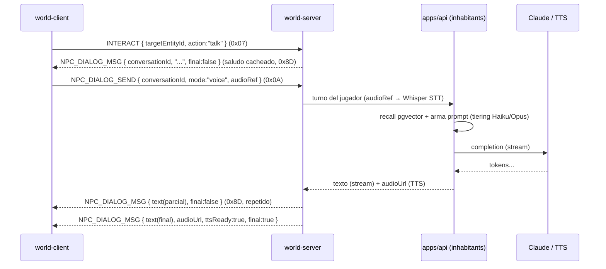
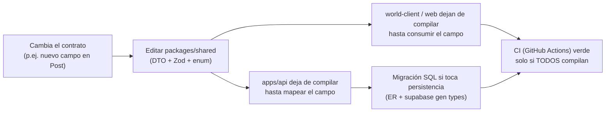

# Contratos de API y Eventos — OSIA

> Propósito: definir la **única fuente de verdad** de los contratos del ecosistema (`packages/shared`): convenciones REST, versionado, formato de error, paginación y auth; el catálogo completo de **endpoints REST** por dominio; el catálogo de **eventos WebSocket** (cliente↔servidor) con sus payloads y notas de binario; la **API de diálogo IA**; el modelo de errores/reintentos; y cómo viven y se generan los tipos compartidos. Es el documento que cliente y servidor compilan en común para no diverger jamás. | Estado: Borrador v1 | Fecha: 2026-06-19 | Parte del paquete de diseño OSIA.

---

## 0. Cómo leer este documento

Este es el **documento fundacional del área de contratos**. No describe cómo se implementa un servicio (eso es arquitectura), ni qué se guarda (eso es el modelo de datos), ni cómo viaja el estado de tick por la red (eso es realtime). Describe **la forma exacta de cada mensaje que cruza una frontera de proceso en OSIA**: la petición REST que el Vestíbulo le manda a `apps/api`, el evento WebSocket que el `world-client` intercambia con el `world-server`, el JSON de error que devuelve cualquiera de los dos. Si dos partes de OSIA se hablan, su gramática vive aquí.

Principio rector, alineado con la marca ("El arte de lo esencial"): **un contrato es un compromiso, no una sugerencia**. Definimos pocos endpoints y pocos eventos, pero cada uno con su forma exacta, su versión y su código de error. La amplitud (más endpoints, más dominios) **emerge** por fase; lo que está definido está definido al milímetro. Y vive **una sola vez**, en `packages/shared`, de modo que cliente (TypeScript) y servidor (TypeScript) importan el mismo tipo: si el contrato cambia, ambos lados dejan de compilar a la vez. Esa es la garantía estructural de que un dev solo no rompa la integración entre apps sin darse cuenta.

Cross-links:
- Visión y alcance: ver [./00-vision-alcance.md](./00-vision-alcance.md)
- Pilares de experiencia: ver [./01-pilares-experiencia.md](./01-pilares-experiencia.md)
- Marca y design system: ver [./02-marca-design-system.md](./02-marca-design-system.md)
- Arquitectura del sistema (hexagonal, SSO, subdominios): ver [./03-arquitectura-sistema.md](./03-arquitectura-sistema.md)
- Modelo de datos / ER (entidades, RLS): ver [./04-modelo-datos-er.md](./04-modelo-datos-er.md)
- Tiempo real, mundo y networking (protocolo binario, AOI, voz): ver [./05-realtime-mundo-networking.md](./05-realtime-mundo-networking.md)
- Decisiones abiertas: ver [./adr/ADR-000-decisiones-abiertas.md](./adr/ADR-000-decisiones-abiertas.md)

> **Estado real del proyecto:** esto es DISEÑO. La carpeta `apps/api`, `apps/world-server` y `packages/shared` aún **no existen**; solo hay `/brand` y `/docs`. Las rutas, opcodes y schemas son contratos de diseño justificados, no código en producción. Lo que aquí se fija es exactamente lo que se va a implementar.

---

## 1. Convenciones REST (transversales a todos los dominios)

Estas reglas aplican a **todos** los endpoints de `apps/api`. Son load-bearing: cada cliente nuevo (Vestíbulo, world-client, futura Social/Juegos) las asume.

### 1.1. Base URL, host y subdominios

- Todo el REST del ecosistema vive en **`apps/api`**, expuesto en **`https://auth.osia.com`** (el host de identidad/SSO; el nombre `auth` es histórico — sirve a todo el backend del ecosistema, no solo a auth). Ver [./03-arquitectura-sistema.md](./03-arquitectura-sistema.md) §SSO.
- El `world-server` **no** expone REST de dominio: solo WebSocket (§3). El único REST que lo toca es indirecto (el cliente pide un *world ticket* a `apps/api`, §1.6).
- Todas las rutas REST cuelgan de **`/v1`** (versionado, §1.2).

### 1.2. Versionado: `/v1` en la ruta

- **Decisión:** versión **mayor en la ruta** (`/v1/...`), no en header ni en subdominio.
- **Por qué en la ruta y no en header (`Accept: application/vnd.osia.v1+json`):** es trivial de ver en logs, en el navegador, en `curl`; un dev solo lo lee de un vistazo. El versionado por header es más "puro" REST pero invisible y propenso a olvidos. La marca premia la claridad, no la pureza académica.
- **Cuándo sube la mayor:** solo ante un cambio **incompatible** (quitar campo, cambiar tipo, cambiar semántica). Añadir un campo **opcional** o un endpoint nuevo **no** sube la versión (cambio compatible hacia adelante). `v1` puede vivir años.
- **Convivencia:** si algún día existe `/v2`, `/v1` se mantiene en paralelo durante una ventana de deprecación. El cliente declara qué versión espera; el servidor responde el header `X-OSIA-API-Version`.

### 1.3. Nombrado de recursos (resource naming)

| Regla | Ejemplo correcto | Evitar |
| --- | --- | --- |
| Recursos en **plural, kebab no necesario** (una sola palabra) | `/v1/profiles`, `/v1/invitations` | `/v1/getProfile` (no verbos en ruta) |
| Recurso anidado solo cuando hay pertenencia real | `/v1/posts/{postId}/comments` | anidar más de 2 niveles |
| El verbo lo da el **método HTTP**, no la ruta | `POST /v1/posts` | `POST /v1/createPost` |
| Acciones no-CRUD como **sub-recurso de acción** | `POST /v1/posts/{id}/reactions`, `POST /v1/follows` | `POST /v1/post/like` |
| Identificadores siempre **UUID v7** (ver ER §1.1) | `/v1/profiles/{profileId}` | IDs secuenciales (filtran volumen) |
| `me` como alias del sujeto autenticado | `GET /v1/profiles/me` | pasar el propio id en la URL |

- **kebab-case** para rutas de varias palabras (`/v1/waitlist-entries`); **camelCase** para campos JSON (porque el consumidor es TypeScript y así no hay mapeo). Internamente Postgres usa snake_case (ver ER §1.3); **el mapeo snake↔camel ocurre en la capa `infrastructure/web` de `apps/api`**, nunca se filtra snake_case al cliente.

### 1.4. Formato de error estándar (RFC 7807-inspired, simplificado)

Todo error — de cualquier dominio — devuelve **el mismo sobre JSON**. Un solo tipo en `packages/shared` (`ApiError`), un solo manejador en el cliente.

```jsonc
{
  "error": {
    "code": "INVITATION_EXPIRED",        // string estable, SCREAMING_SNAKE, enum en shared
    "message": "Esta invitación ya expiró.", // legible es-CO, mostrable al usuario
    "status": 410,                         // espejo del HTTP status
    "requestId": "req_01J9Z8...",         // correlación con logs (Pino) y Sentry
    "details": [                            // opcional: errores de validación campo a campo
      { "field": "email", "code": "INVALID_FORMAT", "message": "Email inválido." }
    ],
    "retryable": false                      // pista para el cliente (ver §5)
  }
}
```

Reglas:
- **`code` es la fuente de verdad para la lógica**, nunca el `message` (el mensaje puede cambiar de copy/idioma sin romper clientes). Los códigos viven como `enum`/union en `packages/shared` (§6).
- **`message` es es-CO, mostrable** tal cual al usuario en el peor caso; pero el cliente puede mapear `code` a copy de marca.
- **`requestId`** lo genera `apps/api` (o se propaga desde un header `X-Request-Id`) y aparece en Pino + Sentry → soporte trivial.
- **`details`** solo en errores de validación (`422`).
- **`retryable`** le dice al cliente si tiene sentido reintentar (§5.2).

Mapa de **HTTP status → uso en OSIA**:

| Status | Uso | Ejemplo de `code` |
| --- | --- | --- |
| `200 OK` | Lectura / acción exitosa con cuerpo | — |
| `201 Created` | Recurso creado | — |
| `202 Accepted` | Aceptado para proceso async (fan-out de feed, embedding) | — |
| `204 No Content` | Acción exitosa sin cuerpo (unfollow, marcar leído) | — |
| `400 Bad Request` | Petición malformada (JSON inválido, parámetro absurdo) | `BAD_REQUEST` |
| `401 Unauthorized` | Sin sesión / token expirado | `UNAUTHENTICATED`, `TOKEN_EXPIRED` |
| `403 Forbidden` | Autenticado pero sin permiso (RLS, no es el dueño) | `FORBIDDEN`, `NOT_INVITED` |
| `404 Not Found` | Recurso inexistente o no visible para el solicitante | `NOT_FOUND` |
| `409 Conflict` | Choque de estado (handle ya existe, ya sigues a alguien) | `HANDLE_TAKEN`, `ALREADY_FOLLOWING` |
| `410 Gone` | Recurso que existió y caducó | `INVITATION_EXPIRED` |
| `422 Unprocessable` | Validación de negocio falla (con `details`) | `VALIDATION_FAILED` |
| `429 Too Many Requests` | Rate-limit superado (lleva `Retry-After`) | `RATE_LIMITED` |
| `500 Internal` | Error no controlado (nunca filtra stack al cliente) | `INTERNAL_ERROR` |
| `503 Service Unavailable` | Dependencia caída (Claude, Supabase) o mantenimiento | `UPSTREAM_UNAVAILABLE` |

### 1.5. Paginación: cursor-based (keyset), no offset

- **Decisión:** paginación **por cursor (keyset)**, no `offset/limit`.
- **Por qué cursor y no offset:** el offset (`LIMIT 50 OFFSET 1000`) se degrada (Postgres escanea y descarta) y **salta o duplica filas** cuando llegan inserciones nuevas (un feed cambia mientras paginas). El cursor (keyset) es O(1) por página y estable ante inserciones — clave para feeds, leaderboards y listas que cambian en vivo.
- **Forma del request:** `?limit=50&cursor=<opaco>`. `limit` por defecto `20`, máximo `100`.
- **Forma de la respuesta** (envoltura estándar de lista, tipo `Page<T>` en shared):

```jsonc
{
  "data": [ /* ...items... */ ],
  "page": {
    "nextCursor": "eyJjcmVhdGVkQXQiOiIyMDI2..." , // null si no hay más
    "hasMore": true,
    "limit": 50
  }
}
```

- El **cursor es opaco** (base64 de `{ sortKey, id }`); el cliente nunca lo construye, solo lo reenvía. Esto permite cambiar el criterio de orden internamente sin romper clientes.
- Listas pequeñas y acotadas (p. ej. "mis avatares", "mis plots") pueden devolver el array completo sin `page` — la paginación se reserva para lo que crece.

### 1.6. Autenticación y header

El SSO está descrito en [./03-arquitectura-sistema.md](./03-arquitectura-sistema.md); aquí su **contrato de transporte**:

- **Sesión (cookie):** cookie `HttpOnly; Secure; SameSite=Lax; Domain=.osia.com` que transporta un **refresh token opaco** rotatorio. La pone/quita `apps/api`. Sirve a todos los subdominios. El cliente **nunca** la lee (es `HttpOnly`).
- **Access token (header):** cada llamada de API a un endpoint protegido lleva:
  ```
  Authorization: Bearer <access JWT, vida ~10 min>
  ```
  El JWT lo obtiene el cliente de `GET /v1/auth/session` (que valida la cookie de refresh). Claims OSIA: `sub` (accountId = `auth.uid()`), `profileId`, `role`, `osia.scopes`, `exp`.
- **World ticket (caso especial):** para conectarse al `world-server` el cliente pide `POST /v1/world/tickets` y recibe un **JWT de un solo uso, vida ~60 s**, que presenta en el `HELLO` del WebSocket (§3.2). El world-server lo valida por firma sin tocar la DB. Ver realtime [./05-realtime-mundo-networking.md](./05-realtime-mundo-networking.md) §2.1.
- **Headers transversales** que `apps/api` reconoce/emite:

| Header | Dirección | Uso |
| --- | --- | --- |
| `Authorization: Bearer <jwt>` | request | access token |
| `X-Request-Id` | request/response | correlación (se genera si no viene) |
| `X-OSIA-Client` | request | `web`, `world-client`, `social`, `games` + versión (telemetría/feature gating) |
| `X-OSIA-API-Version` | response | versión efectiva del API |
| `Idempotency-Key` | request | en `POST` no idempotentes (compras, §2.6) |
| `Retry-After` | response | en `429`/`503` (segundos) |

### 1.7. Convenciones de cuerpo

- **Content-Type:** `application/json; charset=utf-8` para todo (subidas de media van por **Storage/R2 con URL prefirmada**, no por el API; `apps/api` solo guarda la URL resultante — ver ER `posts.media`).
- **Fechas:** ISO-8601 UTC con `Z` (`2026-06-19T14:03:00Z`). Nunca epoch crudo en REST (sí en el protocolo binario de red).
- **Dinero/puntos:** enteros (puntos virtuales), nunca float.
- **Campos nulos:** se omiten o van `null`; el cliente trata ambos igual. No se envían strings vacíos como "sin valor".

---

## 2. Endpoints REST por dominio

Notación de las tablas: **🔒** = requiere `Authorization: Bearer`; **👑** = requiere `role=admin`; **🌐** = público (member autenticado, lectura curada). Todos los `code` de error son ilustrativos del caso principal; el sobre completo es el de §1.4.

> Cobertura por fase (depth-first, ver constitución): **Fase 1** habilita Auth/Invitaciones/Perfil; **Fase 3** habilita Social/Feed/Follows; **Fase 4** habilita Leaderboard y Cosméticos/Inventario; **Fase 5** habilita Plots. Se documentan todos ahora (contrato listo), se implementan por fase.

### 2.1. Auth, sesión, invitaciones y waitlist  *(dominio `identity` — Fase 1)*

| Método | Ruta | Auth | Request (body / query) | Response (200/2xx) | Errores típicos |
| --- | --- | --- | --- | --- | --- |
| `POST` | `/v1/auth/signup` | 🌐 | `{ code, email, password?, handle, displayName }` (requiere `code` de invitación válido) | `201 { account, profile, session }` | `409 HANDLE_TAKEN`, `410 INVITATION_EXPIRED`, `403 NOT_INVITED` |
| `POST` | `/v1/auth/login` | 🌐 | `{ email, password }` (o flujo OTP/magic-link de Supabase) | `200 { session }` + set-cookie | `401 INVALID_CREDENTIALS`, `403 EMAIL_NOT_VERIFIED` |
| `POST` | `/v1/auth/verify-email` | 🌐 | `{ token }` | `204` | `410 TOKEN_EXPIRED`, `409 ALREADY_VERIFIED` |
| `POST` | `/v1/auth/resend-verification` | 🔒 | — | `204` | `429 RATE_LIMITED` |
| `GET` | `/v1/auth/session` | cookie | — (usa cookie de refresh) | `200 { accessToken, expiresIn, passport }` | `401 UNAUTHENTICATED` |
| `POST` | `/v1/auth/refresh` | cookie | — | `200 { accessToken, expiresIn }` (rota refresh) | `401 SESSION_EXPIRED` |
| `POST` | `/v1/auth/logout` | 🔒 | — | `204` (revoca refresh, limpia cookie) | — |
| `POST` | `/v1/world/tickets` | 🔒 | `{ worldId, desiredRoom?, desiredInstance? }` | `200 { ticket, expiresIn, wsUrl }` | `403 FORBIDDEN`, `404 WORLD_NOT_FOUND` |
| `POST` | `/v1/waitlist` | 🌐 (sin auth) | `{ email, source, meta? }` | `201 { id, status:"queued" }` | `409 ALREADY_QUEUED` |
| `GET` | `/v1/invitations` | 🔒 | `?status=&limit=&cursor=` | `200 Page<Invitation>` (las que YO emití) | — |
| `POST` | `/v1/invitations` | 🔒 | `{ email }` (gasta cupo de invitaciones del invitador) | `201 { invitation }` | `403 NO_INVITE_QUOTA`, `409 ALREADY_INVITED` |
| `POST` | `/v1/invitations/{id}/revoke` | 🔒 (emisor) | — | `204` | `403 FORBIDDEN`, `409 ALREADY_ACCEPTED` |
| `GET` | `/v1/admin/waitlist` | 👑 | `?status=&limit=&cursor=` | `200 Page<WaitlistEntry>` | `403 FORBIDDEN` |
| `POST` | `/v1/admin/waitlist/{id}/promote` | 👑 | `{ expiresInDays? }` | `201 { invitation }` (promueve a invitación) | `409 ALREADY_PROMOTED` |

Ejemplo — `GET /v1/auth/session` (response):

```jsonc
{
  "accessToken": "eyJhbGciOiJF...",
  "expiresIn": 600,
  "passport": {
    "accountId": "01J9...",
    "profile": {
      "profileId": "01J9...",
      "handle": "carlos",
      "displayName": "Carlos",
      "avatarUrl": "https://cdn.osia.com/av/01J9.glb",
      "accentColor": "#CBB89A",
      "popularityPoints": 0,
      "reputation": 0
    },
    "role": "member",
    "scopes": ["world:join", "social:read"],
    "featureFlags": { "world": true, "social": false, "games": false }
  }
}
```

El objeto `passport` es **el pasaporte compartido** de la constitución: lo consumen el Vestíbulo y, por SSO, cualquier app. Vive como tipo `Passport` en `packages/identity` + `packages/shared`.

### 2.2. Perfil y avatar  *(dominio `identity` — Fase 1)*

| Método | Ruta | Auth | Request | Response | Errores |
| --- | --- | --- | --- | --- | --- |
| `GET` | `/v1/profiles/me` | 🔒 | — | `200 { profile }` (incluye campos privados) | — |
| `GET` | `/v1/profiles/{handle}` | 🌐 | — | `200 { profile }` (respeta `privacy`/RLS) | `404 NOT_FOUND` |
| `PATCH` | `/v1/profiles/me` | 🔒 | `{ displayName?, bio?, accentColor?, privacy? }` (parcial) | `200 { profile }` | `422 VALIDATION_FAILED`, `409 HANDLE_TAKEN` |
| `GET` | `/v1/avatars` | 🔒 | — | `200 { items: Avatar[] }` (los míos) | — |
| `POST` | `/v1/avatars` | 🔒 | `{ kind:"lowpoly"\|"rpm", config, gltfUrl? }` | `201 { avatar }` | `422 VALIDATION_FAILED` |
| `PATCH` | `/v1/avatars/{id}` | 🔒 (dueño) | `{ config?, isActive? }` | `200 { avatar }` | `403 FORBIDDEN` |
| `POST` | `/v1/avatars/{id}/activate` | 🔒 (dueño) | — | `200 { avatar }` (desactiva los demás) | `403 FORBIDDEN` |

> **`PATCH` parcial** (semántica merge): solo los campos presentes se actualizan. `handle` **no** se cambia por `PATCH` casual (es identidad); si se permite, va por endpoint dedicado con cooldown. `accentColor` valida hex de marca (default champán `#CBB89A`, ver ER §3.3).

### 2.3. Social: posts, reacciones, comentarios, follows, feed  *(dominio `social` — Fase 3)*

| Método | Ruta | Auth | Request | Response | Errores |
| --- | --- | --- | --- | --- | --- |
| `GET` | `/v1/feed` | 🔒 | `?limit=&cursor=` | `200 Page<FeedItem>` (materializado, ER §7.3) | — |
| `GET` | `/v1/posts/{id}` | 🌐 | — | `200 { post }` (respeta `visibility`) | `404 NOT_FOUND` |
| `POST` | `/v1/posts` | 🔒 | `{ kind, body?, media?, visibility }` | `201 { post }` (fan-out async → `202` aspectos) | `422 VALIDATION_FAILED` |
| `DELETE` | `/v1/posts/{id}` | 🔒 (autor) | — | `204` (soft-delete) | `403 FORBIDDEN` |
| `GET` | `/v1/posts/{id}/comments` | 🌐 | `?limit=&cursor=` | `200 Page<Comment>` (hilos) | `404 NOT_FOUND` |
| `POST` | `/v1/posts/{id}/comments` | 🔒 | `{ body, parentCommentId? }` | `201 { comment }` | `422 VALIDATION_FAILED` |
| `DELETE` | `/v1/comments/{id}` | 🔒 (autor) | — | `204` | `403 FORBIDDEN` |
| `PUT` | `/v1/posts/{id}/reactions` | 🔒 | `{ kind:"star"\|"moon"\|"sun" }` | `200 { reaction, counts }` (idempotente por par) | `409 ALREADY_REACTED` |
| `DELETE` | `/v1/posts/{id}/reactions` | 🔒 | `?kind=` | `204` | `404 NOT_FOUND` |
| `POST` | `/v1/follows` | 🔒 | `{ followeeAccountId }` | `201 { follow }` | `409 ALREADY_FOLLOWING`, `422 CANNOT_FOLLOW_SELF` |
| `DELETE` | `/v1/follows/{followeeAccountId}` | 🔒 | — | `204` | `404 NOT_FOUND` |
| `GET` | `/v1/profiles/{handle}/followers` | 🌐 | `?limit=&cursor=` | `200 Page<ProfileBrief>` | — |
| `GET` | `/v1/profiles/{handle}/following` | 🌐 | `?limit=&cursor=` | `200 Page<ProfileBrief>` | — |
| `GET` | `/v1/notifications` | 🔒 | `?unread=&limit=&cursor=` | `200 Page<Notification>` | — |
| `POST` | `/v1/notifications/read` | 🔒 | `{ ids?: string[] }` (vacío = todas) | `204` | — |
| `GET` | `/v1/presence` | 🔒 | `?accountIds=a,b,c` | `200 { presence: PresenceEntry[] }` (de Redis) | — |

> **`PUT` para reacción** (no `POST`): reaccionar es **idempotente** (reaccionar dos veces con el mismo `kind` deja un estado, no dos filas — ver ER `uq_reactions`). `PUT` expresa esa idempotencia mejor que `POST`. La **presencia** se lee de Redis vía `apps/api` (ER §11), no del world-server, para que la Social no se acople al protocolo de tiempo real.

Ejemplo — `POST /v1/posts` (request → response):

```jsonc
// request
{ "kind": "moment", "body": "La aurora de anoche.", "media": ["https://cdn.osia.com/m/01J9.webp"], "visibility": "followers" }
// response 201
{
  "post": {
    "id": "01J9...", "authorAccountId": "01J9...", "kind": "moment",
    "body": "La aurora de anoche.", "media": ["https://cdn.osia.com/m/01J9.webp"],
    "visibility": "followers", "reactionCount": 0, "commentCount": 0,
    "createdAt": "2026-06-19T03:12:00Z"
  }
}
```

### 2.4. Leaderboard, juegos y logros  *(dominio `game` — Fase 4)*

| Método | Ruta | Auth | Request | Response | Errores |
| --- | --- | --- | --- | --- | --- |
| `GET` | `/v1/games` | 🌐 | — | `200 { items: Game[] }` (los `live`) | — |
| `GET` | `/v1/games/{slug}/leaderboard` | 🌐 | `?period=all_time\|season\|weekly&scope=global\|friends&limit=&cursor=` | `200 Page<RankingEntry>` (de Redis ZSET / snapshot) | `404 GAME_NOT_FOUND` |
| `GET` | `/v1/games/{slug}/leaderboard/me` | 🔒 | `?period=&scope=` | `200 { rank, value, percentile }` | `404 NO_SCORE` |
| `GET` | `/v1/games/{slug}/scores/me` | 🔒 | `?limit=&cursor=` | `200 Page<Score>` (mis scores) | — |
| `GET` | `/v1/games/{slug}/achievements` | 🌐 | — | `200 { items: Achievement[] }` | — |
| `GET` | `/v1/profiles/me/achievements` | 🔒 | — | `200 { items: AccountAchievement[] }` | — |

> **No hay `POST /scores` desde el cliente.** El score lo reporta el **world-server / `apps/api`** tras validar la partida (`is_verified`, ER §8.2). El cliente **nunca** se acredita su propio puntaje por REST: lo lee, no lo escribe. Esto es anti-cheat por contrato. El leaderboard "en vivo" sale de un ZSET de Redis; los rangos congelados de `ranking_snapshots`.

### 2.5. Plots  *(dominio `world` — Fase 5)*

| Método | Ruta | Auth | Request | Response | Errores |
| --- | --- | --- | --- | --- | --- |
| `GET` | `/v1/plots/me` | 🔒 | — | `200 { items: PlotOwnership[] }` | — |
| `GET` | `/v1/plots/{id}` | 🌐 | — | `200 { plot, owners }` | `404 NOT_FOUND` |
| `GET` | `/v1/zones/{zoneId}/plots` | 🌐 | `?status=vacant&limit=&cursor=` | `200 Page<Plot>` | — |
| `POST` | `/v1/plots/{id}/claim` | 🔒 | `{ idempotencyKey }` (gasta puntos/escasez) | `200 { ownership }` | `409 PLOT_TAKEN`, `403 INSUFFICIENT_POINTS` |
| `POST` | `/v1/plots/{id}/invites` | 🔒 (owner) | `{ accountId, role:"co_owner"\|"guest_builder" }` | `201 { ownership }` | `403 FORBIDDEN`, `409 MAX_OWNERS` |
| `DELETE` | `/v1/plots/{id}/owners/{accountId}` | 🔒 (owner) | — | `204` (revoca, no borra histórico) | `403 FORBIDDEN` |

> El **acceso a un plot en vivo** (entrar a la instancia privada) se resuelve por **portal en el world-server** (ER §4, realtime §1.4), no por REST. El REST solo gestiona **ownership y lista de acceso**; el world-server valida esa lista al conceder el portal.

### 2.6. Cosméticos, inventario, economía  *(dominio `economy` — Fase 4)*

| Método | Ruta | Auth | Request | Response | Errores |
| --- | --- | --- | --- | --- | --- |
| `GET` | `/v1/cosmetics` | 🌐 | `?category=&rarity=&limit=&cursor=` | `200 Page<Cosmetic>` (los `isListed`) | — |
| `GET` | `/v1/cosmetics/{slug}` | 🌐 | — | `200 { cosmetic }` | `404 NOT_FOUND` |
| `GET` | `/v1/inventory/me` | 🔒 | `?equipped=&limit=&cursor=` | `200 Page<InventoryItem>` | — |
| `POST` | `/v1/cosmetics/{slug}/purchase` | 🔒 | `{ idempotencyKey }` (header `Idempotency-Key` también) | `200 { transaction, item }` | `403 INSUFFICIENT_POINTS`, `409 ALREADY_OWNED` |
| `POST` | `/v1/inventory/{itemId}/equip` | 🔒 (dueño) | — | `200 { item }` (refleja en `avatars.config`) | `403 FORBIDDEN` |
| `POST` | `/v1/inventory/{itemId}/unequip` | 🔒 (dueño) | — | `200 { item }` | `403 FORBIDDEN` |
| `GET` | `/v1/economy/balance` | 🔒 | — | `200 { popularityPoints, reputation }` | — |
| `GET` | `/v1/economy/ledger` | 🔒 | `?limit=&cursor=` | `200 Page<LedgerEntry>` | — |

> **Idempotencia obligatoria en `purchase` y `claim`** (header `Idempotency-Key` + campo en body, ER `transactions.idempotency_key UNIQUE`): un reintento de red **nunca** doble-cobra. El servidor, ante una clave ya vista, devuelve **la misma respuesta** del primer intento (no un error). Es moneda virtual, pero se trata con rigor contable (ledger append-only, ER §9).

---

## 3. Catálogo de eventos WebSocket (world-client ↔ world-server)

El detalle de **transporte, tick, AOI, predicción/reconciliación, voz y binario** vive en [./05-realtime-mundo-networking.md](./05-realtime-mundo-networking.md). Aquí se fija el **contrato de cada mensaje**: opcode, dirección, si es "caliente" (alta frecuencia), su payload con campos y tipos, y la nota de serialización binaria. Esta sección **es** el `packages/shared/net` (`./10-contratos-api-eventos.md` referido en realtime).

### 3.1. Encuadre y reglas de binario

- Cada mensaje WS = **1 byte de opcode** + payload binario. Ver realtime §6.2.
- **Mensajes calientes** (`INPUT 0x02`, `ACK 0x03`, `DELTA 0x83`, `PING/PONG`) usan **layout cuantizado bit-packed** (no msgpack) por banda/CPU. Detalle de cuantización: realtime §5.2.
- **Mensajes fríos** (handshake, chat, portales, atmósfera, voz-signaling, presencia) usan **msgpack** del payload (legibilidad y velocidad de iteración en Fase 0).
- Los tipos de payload aquí descritos son los **schemas de `packages/shared`**; el encoder/decoder binario se genera/escribe contra ellos para que cliente y servidor nunca diverjan (§6.3).
- Tipos abreviados: `u8/u16/u32` enteros sin signo, `i16` con signo, `f16/f32` flotante, `q16` posición fixed-point 16-bit por eje (cm dentro del bound de instancia), `vlq` longitud variable.

### 3.2. Cliente → Servidor

| Opcode | Evento | Caliente | Payload (campo: tipo) | Notas binario |
| --- | --- | --- | --- | --- |
| `0x01` | `HELLO` | no | `{ token: string(JWT), clientVersion: u16, protocolVersion: u16, desiredRoom: string, desiredInstance?: string, resumeToken?: string }` | msgpack. Primer y obligatorio mensaje; `HELLO_TIMEOUT 5s`. |
| `0x02` | `INPUT` | **sí** | `{ seq: u32, dtMs: u16, move: {x: i16, z: i16}, yaw: u8, buttons: u16(bitflags) }` | bit-packed. `move` normalizado a `[-1,1]`→`i16`; `yaw` a 256 dir; `buttons` = saltar/interactuar/gesto/sprint. |
| `0x03` | `ACK` | sí | `{ lastTick: u32 }` | bit-packed. Confirma el último DELTA aplicado (delta confiable). |
| `0x04` | `PING` | sí | `{ clientTime: u32 }` | bit-packed. Time-sync + RTT. |
| `0x05` | `CHAT_SEND` | no | `{ channel: "local"\|"party"\|"system", text: string(<=280) }` | msgpack. Server valida/rate-limita. |
| `0x06` | `PORTAL_ENTER` | no | `{ portalId: string }` | msgpack. Server valida cercanía+acceso (anti-cheat). |
| `0x07` | `INTERACT` | no | `{ targetEntityId: u32, action: string }` | msgpack. Recoger cosmético, activar trigger, iniciar diálogo NPC. |
| `0x08` | `VOICE_SIGNAL` | no | `{ to: u32(peerEntityId), kind: "offer"\|"answer"\|"ice", payload: object(SDP/ICE) }` | msgpack. Solo señalización; el audio va P2P (realtime §8). |
| `0x09` | `BYE` | no | `{ reason?: string }` | msgpack. Cierre limpio. |
| `0x0A` | `NPC_DIALOG_SEND` | no | `{ conversationId?: string, inhabitantEntityId: u32, mode: "text"\|"voice", text?: string, audioRef?: string }` | msgpack. Turno del jugador hacia un habitante IA (§4). |

### 3.3. Servidor → Cliente

| Opcode | Evento | Caliente | Payload (campo: tipo) | Notas binario |
| --- | --- | --- | --- | --- |
| `0x81` | `WELCOME` | no | `{ playerEntityId: u32, instanceId: string, room: string, tickRate: u8, serverTime: u32, protocolVersion: u16 }` | msgpack. Tras HELLO válido. |
| `0x82` | `SNAPSHOT` | no | `{ baseTick: u32, entities: EntityState[], atmosphere: AtmosphereState }` | msgpack (full state de AOI). Al join y al reaparecer entidad. |
| `0x83` | `DELTA` | **sí** | `{ baseTick: u32, self: {pos: {x:q16,y:q16,z:q16}, yaw: u8, lastProcessedSeq: u32}, entities: EntityDelta[] }` | bit-packed + bitmask por entidad (campos cambiados). Camino caliente, 20 Hz. |
| `0x84` | `ENTITY_JOIN` | no | `{ entityId: u32, kind: "player"\|"inhabitant"\|"prop", profile?: ProfileBrief, persona?: PersonaBrief, spawn: {pos,yaw} }` | msgpack. Broadcast a vecinos AOI. |
| `0x85` | `ENTITY_LEAVE` | no | `{ entityId: u32, reason: "left"\|"portal"\|"timeout"\|"aoi" }` | msgpack. |
| `0x86` | `PONG` | sí | `{ clientTime: u32, serverTime: u32 }` | bit-packed. |
| `0x87` | `CHAT_MSG` | no | `{ from: u32, fromHandle: string, channel: string, text: string, ts: u32 }` | msgpack. |
| `0x88` | `ATMOSPHERE_UPDATE` | no | `{ presetId?: string, axes: object, transitionMs: u32, baseTime: u32, seed: u32 }` | msgpack. **Raro** (transiciones, cada varios min). Realtime §10. |
| `0x89` | `ATMOSPHERE_EVENT` | no | `{ eventId: string, kind: string, rarity: string, startsAt: u32, durationSeconds: u32 }` | msgpack. **Muy raro** (FOMO). Acompaña `CHAT_MSG system`. |
| `0x8A` | `PORTAL_GRANT` | no | `{ targetInstance: string, targetRoom: string, spawnPoint: {pos,yaw}, sessionTicket: string }` | msgpack. Resultado de `PORTAL_ENTER`. |
| `0x8B` | `VOICE_SIGNAL` | no | `{ from: u32, kind: "offer"\|"answer"\|"ice", payload: object }` | msgpack. |
| `0x8C` | `PRESENCE` | no | `{ changes: { entityId: u32, accountId: string, event: "join"\|"leave"\|"move_instance" }[] }` | msgpack. Para lista social del HUD. |
| `0x8D` | `NPC_DIALOG_MSG` | no | `{ conversationId: string, inhabitantEntityId: u32, role: "assistant", text: string, audioUrl?: string, final: bool, ttsReady: bool }` | msgpack. Respuesta del habitante IA, posiblemente en streaming (§4). |
| `0x8E` | `ERROR` | no | `{ code: string, message: string, fatal: bool }` | msgpack. Cierra el socket si `fatal`. |

### 3.4. Tipos compartidos referenciados arriba

```ts
// packages/shared/net/entities.ts (resumen)
interface EntityState {
  entityId: number;
  kind: 'player' | 'inhabitant' | 'prop';
  pos: { x: number; y: number; z: number };
  yaw: number;
  velocity?: { x: number; z: number };
  animState?: number;        // enum compacto de animación
  cosmetics?: number[];      // ids cuantizados de cosméticos equipados visibles
}
type EntityDelta = { entityId: number; changed: number /*bitmask*/ } & Partial<EntityState>;

interface AtmosphereState {  // espejo del estado autoritativo (ER §5, realtime §10)
  baseTime: number; presetId?: string;
  axes: { daylight: number; fog: number; wind: number; cloud: number; tint: number };
  transitionMs: number; seed: number;
}
interface ProfileBrief { accountId: string; handle: string; displayName: string; accentColor: string; }
interface PersonaBrief { inhabitantId: string; name: string; slug: string; }
```

### 3.5. Secuencia — un turno de diálogo con un habitante IA (sobre WS)



---

## 4. API de diálogo IA

El diálogo con habitantes IA es el diferenciador central (constitución). Tiene **dos superficies**: la **diegética en el Mundo** (sobre WebSocket, §3, baja latencia, voz) y una **REST de soporte** (en `apps/api`, para historial y orquestación fuera del mundo). El detalle de memoria/persona vive en el ER (`ai.*`, §6) y en el doc de habitantes IA.

### 4.1. Superficie diegética (WS) — el camino caliente

- El jugador inicia diálogo con `INTERACT {action:"talk"}` (`0x07`) o directamente `NPC_DIALOG_SEND` (`0x0A`).
- El world-server **no** llama a Claude directo: delega en `apps/api` (contexto `inhabitants`), que aplica **guardrails de costo** (cache, rate-limit, presupuesto de tokens, tiering Haiku/Opus — constitución y ER §6.2) y hace el **recall pgvector**.
- La respuesta vuelve por `NPC_DIALOG_MSG` (`0x8D`) **en streaming** (`final:false` parciales → `final:true`), con `audioUrl` cuando el TTS está listo (`ttsReady`).
- **STT (Whisper):** el audio del jugador se sube a Storage/R2 (URL prefirmada) y se pasa por `audioRef`; `apps/api` lo transcribe. En Fase 0/1 puede ser texto puro (`mode:"text"`).

### 4.2. Superficie REST de soporte  *(dominio `ai`/`inhabitants` — Fase 2)*

| Método | Ruta | Auth | Request | Response | Errores |
| --- | --- | --- | --- | --- | --- |
| `GET` | `/v1/inhabitants` | 🌐 | `?zoneId=` | `200 { items: InhabitantBrief[] }` (NPCs activos) | — |
| `GET` | `/v1/inhabitants/{id}` | 🌐 | — | `200 { inhabitant }` (sin `systemPrompt`) | `404 NOT_FOUND` |
| `GET` | `/v1/conversations/me` | 🔒 | `?limit=&cursor=` | `200 Page<ConversationBrief>` (mis charlas) | — |
| `GET` | `/v1/conversations/{id}` | 🔒 (dueño) | `?limit=&cursor=` | `200 { conversation, turns: Page<Turn> }` | `403 FORBIDDEN` |
| `POST` | `/v1/inhabitants/{id}/messages` | 🔒 | `{ conversationId?, text, mode:"text" }` | `200 { conversationId, reply: { text, audioUrl? } }` | `429 AI_BUDGET_EXCEEDED`, `503 UPSTREAM_UNAVAILABLE` |

Reglas del contrato IA (todas reflejan guardrails):

| Garantía del contrato | Cómo se expresa |
| --- | --- |
| Presupuesto de tokens por conversación | `429 AI_BUDGET_EXCEEDED` con `Retry-After`; `conversations.total_tokens` (ER §6) |
| Rate-limit de turnos por cuenta | `429 RATE_LIMITED` (token bucket Redis) |
| Tiering de modelo | el servidor decide Haiku/Opus; el cliente **no** elige modelo (sin fuga de costo) |
| Nunca exponer prompts internos | `systemPrompt`, `traits` y `inhabitant_memories` **jamás** en response (RLS service-only, ER §6.3) |
| Degradación elegante | si Claude/TTS caen: `503 UPSTREAM_UNAVAILABLE`; el NPC responde un fallback cacheado (no se rompe la inmersión) |
| Idempotencia de turno | `conversationId` + `seq` evitan duplicar un turno por reintento |

> **Por qué el cliente no llama a Claude/Whisper directo:** la clave de Anthropic y el presupuesto viven **solo** en `apps/api`/`world-server` (server-side, ver arquitectura §frontera). Exponerlas al cliente sería fuga de costo y de secreto. El contrato obliga a pasar por el orquestador con guardrails.

---

## 5. Modelo de errores y reintentos (cliente)

### 5.1. Taxonomía de errores (códigos estables en `packages/shared`)

```ts
// packages/shared/errors.ts
export const ErrorCode = {
  // auth / identidad
  UNAUTHENTICATED: 'UNAUTHENTICATED', TOKEN_EXPIRED: 'TOKEN_EXPIRED',
  SESSION_EXPIRED: 'SESSION_EXPIRED', INVALID_CREDENTIALS: 'INVALID_CREDENTIALS',
  EMAIL_NOT_VERIFIED: 'EMAIL_NOT_VERIFIED', NOT_INVITED: 'NOT_INVITED',
  INVITATION_EXPIRED: 'INVITATION_EXPIRED', HANDLE_TAKEN: 'HANDLE_TAKEN',
  // genéricos
  BAD_REQUEST: 'BAD_REQUEST', FORBIDDEN: 'FORBIDDEN', NOT_FOUND: 'NOT_FOUND',
  VALIDATION_FAILED: 'VALIDATION_FAILED', RATE_LIMITED: 'RATE_LIMITED',
  CONFLICT: 'CONFLICT', INTERNAL_ERROR: 'INTERNAL_ERROR',
  UPSTREAM_UNAVAILABLE: 'UPSTREAM_UNAVAILABLE',
  // dominio
  ALREADY_FOLLOWING: 'ALREADY_FOLLOWING', CANNOT_FOLLOW_SELF: 'CANNOT_FOLLOW_SELF',
  INSUFFICIENT_POINTS: 'INSUFFICIENT_POINTS', ALREADY_OWNED: 'ALREADY_OWNED',
  PLOT_TAKEN: 'PLOT_TAKEN', MAX_OWNERS: 'MAX_OWNERS',
  AI_BUDGET_EXCEEDED: 'AI_BUDGET_EXCEEDED',
  // realtime (vienen por ERROR 0x8E)
  VERSION_MISMATCH: 'VERSION_MISMATCH', TICKET_INVALID: 'TICKET_INVALID',
  INSTANCE_FULL: 'INSTANCE_FULL', PORTAL_DENIED: 'PORTAL_DENIED',
} as const;
export type ErrorCode = typeof ErrorCode[keyof typeof ErrorCode];
```

### 5.2. Política de reintentos

| Situación | ¿Reintentar? | Estrategia |
| --- | --- | --- |
| `401 TOKEN_EXPIRED` | Sí, una vez | refrescar vía `POST /v1/auth/refresh` y reintentar la llamada original (interceptor de TanStack Query). Si el refresh falla → `SESSION_EXPIRED` → al Vestíbulo a re-loguear. |
| `429 RATE_LIMITED` | Sí | respetar `Retry-After`; backoff exponencial con jitter; tope de intentos. |
| `503 UPSTREAM_UNAVAILABLE` | Sí | backoff exponencial (0.5s→1s→2s→5s) + jitter; mostrar estado degradado. |
| `5xx INTERNAL_ERROR` | Sí, limitado | reintento idempotente solamente (GET, o POST con `Idempotency-Key`). |
| `4xx` de validación/negocio (`409/410/422/403`) | **No** | son determinísticos; reintentar repite el error. Mostrar copy de marca y corregir. |
| WS `ERROR fatal` (`VERSION_MISMATCH`) | **No** (reconectar no ayuda) | el Vestíbulo invita a recargar (cliente desactualizado). |
| WS caída de socket | Sí | reconexión con `resumeToken` y backoff (realtime §9.1); gracia de 30 s conserva la sesión. |

- **Idempotencia como prerrequisito de reintento:** solo se reintenta automáticamente lo seguro. `GET`/`PUT`/`DELETE` son idempotentes por diseño; los `POST` con efecto económico llevan `Idempotency-Key` (§2.6) para poder reintentarse sin daño.
- **El campo `retryable` del sobre de error** (§1.4) es la pista canónica: el cliente lo respeta sin tener que mantener su propia tabla de qué código reintentar.
- **Circuit breaker suave:** ante `503` repetidos de un upstream (Claude), `apps/api` abre el breaker y responde fallback cacheado, evitando tormenta de reintentos.

### 5.3. Validación de entrada

- `apps/api` valida todo body/query con **Zod** (esquemas que viven en `packages/shared`, §6) en la capa `infrastructure/web` antes de tocar el dominio. Un fallo → `422 VALIDATION_FAILED` con `details[]` campo a campo.
- Los **mismos esquemas Zod** se usan en el cliente para validar formularios antes de enviar (fail-fast sin round-trip). Un solo esquema, dos usos.

---

## 6. Cómo viven los tipos compartidos en `packages/shared`

Esta es la decisión estructural del documento: **una sola fuente de verdad de tipos, importada por todos.**

### 6.1. Por qué `packages/shared` y no copiar tipos

OSIA es un monorepo TypeScript de punta a punta: clientes (Next.js, R3F), `apps/api` (NestJS) y `world-server` (Node) **hablan el mismo lenguaje**. Eso permite el lujo que un stack políglota no tiene: **el contrato es código compilable compartido, no un PDF ni un OpenAPI que alguien tiene que mantener sincronizado a mano.** Si el contrato cambia y un consumidor no se adapta, **deja de compilar**. El error aparece en build/CI, no en producción con dos amigos mirando.

### 6.2. Anatomía de `packages/shared`

```
packages/shared/
  src/
    rest/
      dto/            # DTOs request/response por dominio (auth, profile, social, game, economy, plots)
      pagination.ts   # Page<T>, Cursor
      errors.ts       # ApiError, ErrorCode (§5.1)
    net/              # contrato WebSocket (= ./10-contratos-api-eventos.md de realtime)
      opcodes.ts      # enum de opcodes (§3.2-3.3)
      messages.ts     # tipos de cada mensaje C2S / S2C
      entities.ts     # EntityState, EntityDelta, AtmosphereState (§3.4)
      codec.ts        # encode/decode binario (bit-pack calientes, msgpack fríos)
    domain/
      enums.ts        # uniones string: visibility, reactionKind, rarity, season... (espejo de los CHECK del ER)
      ids.ts          # tipos branded: AccountId, ProfileId, EntityId
    schemas/          # esquemas Zod (validación REST + formularios cliente)
    catalog/
      events.ts       # catálogo de AtmosphereEvent kinds
      experiences.ts  # catálogo de experiencias del Vestíbulo (Mundo, Social, Juegos)
    index.ts
  package.json        # name: "@osia/shared"
```

- **`net/` es el mismo artefacto** que el doc de realtime referencia como `./10-contratos-api-eventos.md`: opcodes, layouts, versión de protocolo. Vive aquí para que `world-client` y `world-server` compilen contra él.
- **`domain/enums.ts` es el espejo en código de los `CHECK (... in (...))` del ER** (§1.4). Una sola lista de valores válidos; si se agrega un `reactionKind`, se toca aquí y en la migración — y el `CHECK` y el tipo no pueden divergir sin que alguien lo note.
- **IDs branded** (`type AccountId = string & {__brand:'AccountId'}`): evita pasar un `profileId` donde se espera `accountId` (error común y silencioso con strings planos).

### 6.3. Generación de tipos y dirección de la verdad

Tres fuentes de verdad coexisten; la regla es **quién manda sobre qué**:

| Artefacto | Fuente de verdad | Cómo se mantiene sincronizado |
| --- | --- | --- |
| **DTOs REST** (`rest/dto`) | escritos a mano en `packages/shared` | `apps/api` los **importa** como tipos de sus controllers (la capa `web` los expone); el cliente los importa para TanStack Query. Mismo tipo en ambos lados. |
| **Validación REST** (`schemas/`) | Zod en `packages/shared`; el **tipo** se **infiere** del esquema (`z.infer`) | un esquema → tipo + validador. Sin duplicar. |
| **Contrato WS** (`net/`) | escrito a mano en `packages/shared` | `codec.ts` codifica/decodifica contra estos tipos; `protocolVersion` versiona el conjunto (realtime §6.4). |
| **Tipos de fila de Postgres** | el **schema SQL** (migraciones, ER) | `supabase gen types typescript` genera `database.types.ts` en `apps/api`; **NO** se exponen al cliente — son internos. Los DTOs (curados, camelCase) son lo público. |
| **Catálogo de errores** | `errors.ts` en shared | `apps/api` lanza con estos códigos; el cliente los matchea. |

- **Decisión: contrato escrito a mano > generado desde OpenAPI/DB.** Para un dev solo, escribir el DTO público a mano (curado, sin filtrar columnas internas, camelCase) y compartirlo es más simple y más seguro que generar OpenAPI desde Nest y luego generar cliente desde OpenAPI (cadena frágil de dos generadores). Lo **generado** se limita a lo de bajo nivel y privado (tipos de fila de Supabase, internos de `apps/api`).
- **Frontera de exposición:** los tipos de fila de Postgres (snake_case, columnas internas como `password_hash`, `system_prompt`) **nunca** cruzan a `packages/shared` ni al cliente. La capa `infrastructure/web` de `apps/api` **mapea** fila → DTO público. El contrato compartido es deliberadamente **más pequeño** que el modelo de datos.
- **Versionado del paquete:** `@osia/shared` se versiona con el monorepo; un cambio incompatible de contrato es un solo commit que rompe la compilación de todos los consumidores a la vez — exactamente lo que queremos (atomicidad cliente↔servidor).

### 6.4. Flujo de un cambio de contrato (ejemplo)



> La belleza del monorepo TS: **no existe el estado intermedio "el servidor ya cambió pero el cliente no se enteró"** dentro de un mismo deploy. Si compila, los contratos coinciden.

---

## 7. Resumen de decisiones (para no contradecir otros docs)

1. **REST en `apps/api` bajo `auth.osia.com`**, versión **mayor en la ruta `/v1`**; el `world-server` no expone REST de dominio.
2. **Recursos en plural, verbo = método HTTP**, `me` como alias del sujeto; UUID v7 en rutas; camelCase en JSON, snake_case solo interno (mapeo en `web`).
3. **Un solo sobre de error** (`ApiError`: `code`/`message`/`status`/`requestId`/`details`/`retryable`); `code` es la verdad lógica, no el `message`.
4. **Paginación por cursor (keyset)**, no offset; envoltura `Page<T>` con `nextCursor`/`hasMore`.
5. **Auth: cookie de refresh `.osia.com` + access JWT corto en `Authorization: Bearer`**; world ticket de un solo uso para el WS.
6. **Catálogo WS con opcodes**: calientes bit-packed (`INPUT`, `DELTA`, `ACK`, `PING/PONG`), fríos msgpack; espejo exacto de realtime §6.
7. **IA: el cliente nunca llama a Claude/Whisper directo** — pasa por `apps/api`/`world-server` con guardrails; diálogo diegético por WS en streaming, REST de soporte para historial.
8. **Reintentos solo de lo idempotente/`retryable`**; `Idempotency-Key` obligatorio en compras/claims; refresh-y-reintenta en `401 TOKEN_EXPIRED`.
9. **Validación con Zod** compartido (un esquema → tipo + validador), usado en server y cliente.
10. **`packages/shared` es la única fuente de verdad de contratos** (DTOs, errores, schema de red, enums espejo de los `CHECK` del ER); contrato escrito a mano > cadena de generadores; lo generado se limita a tipos internos de Supabase. El contrato compartido es **más pequeño** que el modelo de datos por diseño (no filtra columnas internas).

---

## 8. Pendientes para el backlog (derivados de este doc)

- Crear `packages/shared` con `rest/`, `net/`, `domain/`, `schemas/`, `catalog/` y `@osia/shared` como paquete del workspace pnpm.
- Definir los **DTOs por dominio** + esquemas **Zod** (auth/perfil primero — Fase 1).
- Implementar el **sobre de error `ApiError`** + filtro de excepciones global en NestJS que lo emite (con `requestId` de Pino).
- Implementar **paginación por cursor** reutilizable (`Page<T>`, cursor opaco) en `apps/api`.
- Implementar **interceptor de auth** en el cliente (refresh-y-reintenta en `401`) sobre TanStack Query.
- Materializar `net/opcodes.ts` + `net/codec.ts` (bit-pack calientes + msgpack fríos) y versión de protocolo; alinear 1:1 con realtime `./10-contratos-api-eventos.md`.
- Endpoint `POST /v1/world/tickets` (emisión de world ticket firmado) + validación por firma en world-server.
- Endpoints **IA** (`/v1/inhabitants`, `/v1/conversations`) con guardrails de presupuesto y `429 AI_BUDGET_EXCEEDED`.
- `supabase gen types typescript` en CI para tipos internos de fila; verificar que **no** se filtren al cliente.
- Tabla de **idempotencia** (compras/claims) conectada a `economy.transactions.idempotency_key` (ER §9).
- Contract tests: un test que valide que cada `code` emitido por `apps/api` existe en `ErrorCode` de shared.
