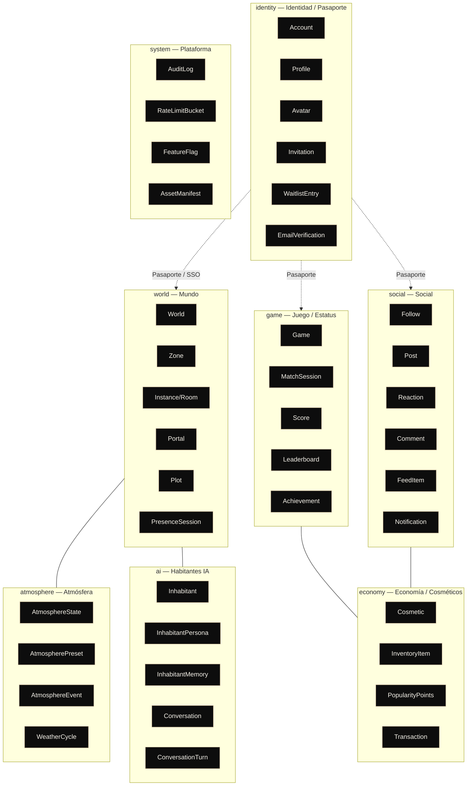

# Glosario y Lenguaje de Dominio — OSIA

> Propósito: Establecer el **LENGUAJE UBICUO** (Ubiquitous Language, es-CO) de OSIA — un único diccionario término→definición compartido por diseño, dominio, datos, red, IA y código. Fija también las **convenciones de nombres** (entidades, tablas, eventos, archivos, ramas, commits) y las **siglas**. Es la referencia de coherencia para todo el paquete de diseño y para el monorepo. | Estado: Borrador v1 | Fecha: 2026-06-19 | Parte del paquete de diseño OSIA.

---

## 0. Cómo leer y usar este documento

Este es el documento **fundacional del lenguaje**. Si dos documentos, dos servicios o dos personas usan una palabra distinta para la misma cosa (o la misma palabra para cosas distintas), el sistema se corrompe lentamente: aparecen tablas duplicadas, eventos ambiguos y bugs de traducción entre capas. La regla de OSIA es **un término, un significado, en todas partes** — desde el copy del Vestíbulo hasta el nombre de la columna en PostgreSQL y el `type` del mensaje binario en el world-server.

Principio rector, alineado con la marca ("El arte de lo esencial"): **nombramos poco y nombramos bien**. No inventamos sinónimos elegantes; elegimos UNA palabra por concepto y la repetimos con disciplina. El lujo aquí es la **consistencia**.

Convención de lectura:

- **Término** = la palabra canónica en es-CO (lo que decimos al hablar y escribir docs).
- **Entidad/Tipo** = cómo se llama en el código TypeScript (`PascalCase`).
- **Tabla** = cómo se llama en PostgreSQL (`snake_case`, plural).
- **Inglés** = el término técnico equivalente, cuando ayuda a no perder al lector dev.

Cross-links (este doc es transversal a todo el paquete):

- Visión y alcance: ver [./00-vision-alcance.md](./00-vision-alcance.md)
- Pilares de experiencia: ver [./01-pilares-experiencia.md](./01-pilares-experiencia.md)
- Marca y design system: ver [./02-marca-design-system.md](./02-marca-design-system.md)
- Arquitectura del sistema (hexagonal, bounded contexts): ver [./03-arquitectura-sistema.md](./03-arquitectura-sistema.md)
- Modelo de datos (ER, tablas, RLS): ver [./04-modelo-datos-er.md](./04-modelo-datos-er.md)
- Red en tiempo real (presencia, AOI, snapshots): ver [./05-realtime-mundo-networking.md](./05-realtime-mundo-networking.md)
- Motor de atmósfera: ver [./06-motor-atmosfera.md](./06-motor-atmosfera.md)
- Habitantes IA: ver [./07-habitantes-ia.md](./07-habitantes-ia.md)
- Estrategia de rendimiento: ver [./08-estrategia-rendimiento.md](./08-estrategia-rendimiento.md)
- Seguridad, infra y costos: ver [./09-seguridad-infra-costos.md](./09-seguridad-infra-costos.md)
- Decisiones abiertas: ver [./adr/ADR-000-decisiones-abiertas.md](./adr/ADR-000-decisiones-abiertas.md)

> Regla de oro: si necesitas una palabra nueva de dominio, **se agrega aquí primero**. Un PR que introduce un concepto sin entrada en este glosario está incompleto.

---

## 1. Glosario principal (término → definición)

Tabla ordenada alfabéticamente por término canónico. La columna **Contexto** indica el bounded context dueño del concepto (ver §3). La columna **Vive en** indica dónde se materializa el estado durable o efímero.

| Término (es-CO) | Entidad/Tipo (código) | Tabla / clave | Inglés | Contexto | Definición canónica | Vive en |
| --- | --- | --- | --- | --- | --- | --- |
| **Atmósfera** | `AtmosphereState` | `atmosphere_states` | Atmosphere | Atmósfera | Estado ambiental **server-authoritative y compartido** del Mundo en un instante: combinación de ejes (hora, clima, estación, luz) que todos los presentes viven igual. El atardecer es el mismo para todos. | Postgres (agregado) + Redis (estado vivo) |
| **Atmósfera, evento de** | `AtmosphereEvent` | `atmosphere_events` | Atmosphere event | Atmósfera | Fenómeno **efímero y raro** (p. ej. lluvia de meteoros 1×/semana a hora random) que altera la atmósfera por una ventana corta. Diseñado para FOMO y estatus ("estuviste en la aurora"). | Postgres + emisión por world-server |
| **AOI (Área de Interés)** | — | — | Area of Interest | Mundo | Conjunto de entidades cercanas a un jugador que el servidor le sincroniza. Fuera del AOI no se envían actualizaciones (ahorro de red). | world-server (en memoria) |
| **Avatar** | `Avatar` | `avatars` | Avatar | Identidad | Representación 3D low-poly del jugador en el Mundo, ligada a una Cuenta. Personalizable con Cosméticos. | Postgres + GLTF en CDN |
| **Cosmético** | `Cosmetic` | `cosmetics` | Cosmetic | Economía | Ítem decorativo (skin, accesorio, color) sin ventaja funcional. Se obtiene/equipa vía Inventario. Fuente de prestigio, no de poder. | Postgres (catálogo) |
| **Cuenta** | `Account` | `accounts` | Account | Identidad | La identidad raíz de una persona en OSIA: **una sola cuenta (SSO)** que viaja entre todas las apps del ecosistema. Es el Pasaporte. | Postgres + Supabase Auth |
| **Evento Efímero** | `AtmosphereEvent` | `atmosphere_events` | Ephemeral event | Atmósfera | Ver *Atmósfera, evento de*. Sinónimo coloquial; el término canónico en código es `AtmosphereEvent`. | — |
| **Feed** | `FeedItem` | `feed_items` | Feed | Social | Flujo personalizado de publicaciones y actividad que ve un usuario en La Red Social. | Postgres |
| **Habitante** | `Inhabitant` | `inhabitants` | Inhabitant (NPC) | Habitantes IA | Personaje **no humano habitado por IA** (Claude) que vive en el Mundo para que nunca se sienta vacío. Habla, recuerda y reacciona. Diferenciador central. NO lo llamamos "NPC" en producto. | Postgres |
| **Hub** | `Instance` (kind=`hub`) | `world_instances` | Hub | Mundo | Instancia **compartida y central** del Mundo: la plaza social principal a la que llegan los jugadores. Punto de reunión, no privado. | world-server (room) + Postgres |
| **Instancia (Room)** | `Instance` | `world_instances` | Instance / Room | Mundo | Una **sala** corriendo en el world-server: una copia activa de una Zona con su propio conjunto de jugadores, tick y estado. El Mundo es **instanciado** (estilo Meta Horizon), no continuo. | world-server (room) + Postgres |
| **Inventario, ítem de** | `InventoryItem` | `inventory_items` | Inventory item | Economía | Vínculo entre una Cuenta y un Cosmético que posee (equipado o no). | Postgres |
| **Invitación** | `Invitation` | `invitations` | Invitation | Identidad | Token/derecho que permite a una persona unirse a OSIA (modelo **invite-only**). Escasez por diseño; alimenta el FOMO. | Postgres |
| **Logro** | `Achievement` | `achievements` | Achievement | Juego/Estatus | Hito desbloqueable que reconoce una hazaña. Suma prestigio, visible en el Pasaporte. | Postgres (catálogo) |
| **Memoria (de Habitante)** | `InhabitantMemory` | `inhabitant_memories` | Memory (embeddings) | Habitantes IA | Recuerdos vectorizados (pgvector) que un Habitante guarda de conversaciones pasadas, para dar continuidad ("me acuerdo de ti"). | Postgres (pgvector) |
| **Motor de Atmósfera** | `AtmosphereEngine` | — (lógica pura) | Atmosphere engine | Atmósfera | Lógica **pura y compartida** cliente↔servidor (`packages/atmosphere`) que interpola ejes y resuelve la atmósfera. Server-authoritative: el servidor decide, el cliente reproduce. | `packages/atmosphere` |
| **Mundo** | `World` | `worlds` | World | Mundo | La app **insignia**: un mundo low-poly atmosférico que se recorre **a pie** con amigos, vivo por su Motor de Atmósfera y habitado por IA. Es UNA app independiente, deep-linkable. | apps/world-client + world-server |
| **Notificación** | `Notification` | `notifications` | Notification | Social | Aviso dirigido a una Cuenta (te siguió, te mencionó, evento por empezar). Viaja en el Pasaporte entre apps. | Postgres + Redis (fan-out) |
| **Partida** | `MatchSession` | `match_sessions` | Match session | Juego/Estatus | Una sesión jugada de un Juego, con su resultado y puntaje. | Postgres |
| **Pasaporte** | `Profile` (+ `Account`) | `profiles` | Passport / Profile | Identidad | Metáfora de marca de la **identidad compartida**: perfil, estatus, amigos, presencia, cosméticos que **viajan entre apps**. Materializado por `packages/identity`. El Pasaporte NO es un launcher. | Postgres + `packages/identity` |
| **Perfil** | `Profile` | `profiles` | Profile | Identidad | Cara pública de una Cuenta: nombre visible, avatar, bio, estatus/popularidad. Es el contenido del Pasaporte. | Postgres |
| **Persona (de Habitante)** | `InhabitantPersona` | `inhabitant_personas` | Persona | Habitantes IA | Definición de personalidad/voz/rol de un Habitante (system prompt, tono, conocimientos, límites). Una Persona puede instanciarse en varios Habitantes. | Postgres |
| **Plot (Terreno)** | `Plot` | `plots` | Plot | Mundo | Parcela **privada** dentro de una Zona, con dueño (ownership). Espacio personalizable; futura mecánica de escasez/estatus. | world-server (room privada) + Postgres |
| **Popularidad** | `PopularityPoints` / `Reputation` | `popularity_points` | Popularity / Reputation | Economía | Capital social acumulado (reputación) que mide el estatus de una persona. Visible y comparable. El estatus es **el producto**. | Postgres |
| **Portal** | `Portal` | `portals` | Portal | Mundo | Conexión diegética entre dos Instancias/Zonas: al cruzarlo cambias de room. Mecanismo de un mundo **instanciado**, no continuo. A futuro, portales hacia otras apps. | world-server + Postgres |
| **Preset (de Atmósfera)** | `AtmospherePreset` | `atmosphere_presets` | Preset | Atmósfera | Receta nombrada y estable de una atmósfera ("Crepúsculo Champán"): valores base de los ejes que el Motor interpola. Pocos y brutales en Fase 0, decenas después. Clave natural `slug`. | Postgres (catálogo) |
| **Presencia** | `PresenceSession` | `presence_sessions` | Presence | Mundo | Hecho de **estar en línea y dónde** (en qué Instancia, con quién). Efímera y de alta frecuencia; el estado vivo está en Redis, el agregado durable en Postgres. | Redis (vivo) + Postgres (sesión) |
| **Publicación** | `Post` | `posts` | Post | Social | Contenido que una persona comparte en La Red Social. Recibe Reacciones y Comentarios. | Postgres |
| **Puerta** | — (UI del Vestíbulo) | — | Door | Identidad | Acceso elegante a una experiencia desde el Vestíbulo. **No es un icono de grilla**: es una "puerta" curada (estilo constelación). El Vestíbulo nace con 1 Puerta (El Mundo) y gana más. | apps/web |
| **Puntaje** | `Score` | `scores` | Score | Juego/Estatus | Resultado numérico de una Partida que alimenta el Ranking. | Postgres |
| **Ranking / Tabla de líderes** | `Leaderboard` / `RankingSnapshot` | `leaderboards` | Leaderboard | Juego/Estatus | Clasificación global comparativa de jugadores por puntaje. `RankingSnapshot` congela el estado para histórico. Prestigio y competencia. | Postgres + Redis (ranking vivo) |
| **Reacción** | `Reaction` | `reactions` | Reaction | Social | Respuesta ligera a una Publicación (like/equivalente). | Postgres |
| **Seguir (grafo)** | `Follow` | `follows` | Follow | Social | Relación dirigida "A sigue a B". Forma el grafo social y alimenta Feed y Popularidad. | Postgres |
| **Sesión de Conversación** | `Conversation` | `conversations` | Conversation | Habitantes IA | Diálogo en curso entre una persona y un Habitante, compuesto de Turnos. | Postgres |
| **Tick** | — | — | Tick | Mundo | Latido de simulación del world-server a frecuencia fija (15–20 Hz). Unidad temporal autoritativa del Mundo. | world-server |
| **Turno (de Conversación)** | `ConversationTurn` | `conversation_turns` | Turn | Habitantes IA | Un intercambio (entrada del usuario + respuesta del Habitante) dentro de una Conversación. | Postgres |
| **Verificación de Email** | `EmailVerification` | `email_verifications` | Email verification | Identidad | Prueba de que una persona controla su correo, requisito de Cuenta persistente (Fase 1). | Supabase Auth + Postgres |
| **Vestíbulo** | — (app `apps/web`) | — | Lobby / Vestibule | Identidad | Punto de entrada de lujo, minimal y cinematográfico (estilo vestíbulo de club privado / mapa de constelaciones) que presenta tu Pasaporte y unas pocas Puertas. **NO es un launcher de iconos.** | apps/web |
| **Waitlist (Lista de espera)** | `WaitlistEntry` | `waitlist_entries` | Waitlist | Identidad | Registro de alguien que quiere entrar antes de tener Invitación. Motor de comunidad y FOMO pre-lanzamiento. | Postgres |
| **Zona** | `Zone` | `zones` | Zone | Mundo | Región nombrada y diseñada del Mundo (un bioma, una plaza, un mirador). Una Zona se materializa en una o más Instancias. | world-server + Postgres |

> Términos que **evitamos** (anti-glosario): "NPC" (decimos **Habitante**), "home/launcher/pantalla de inicio" (decimos **Vestíbulo**), "nivel/mapa cargado" (decimos **Instancia/Room**), "perfil de juego" cuando nos referimos a la identidad global (decimos **Pasaporte**), "puntos de like" como métrica de estatus (decimos **Popularidad**).

---

## 2. Términos transversales y de marca

No son entidades, pero son lenguaje de dominio cargado de significado. Usarlos mal rompe la coherencia de marca.

| Término | Definición | Por qué importa |
| --- | --- | --- |
| **Ecosistema** | El todo: la **constelación de apps independientes** (Mundo, Social, Juegos, futuras) unidas por identidad y Vestíbulo. | No es "la plataforma" ni "el juego": es un ecosistema. |
| **Experiencia / Superficie** | Cada app independiente del ecosistema (El Mundo es una experiencia/superficie). | Reemplaza "módulo de launcher": son apps, no pestañas. |
| **Constelación** | Metáfora visual del Vestíbulo: cada experiencia es una constelación/Puerta. | Justifica que NO haya grilla de iconos. |
| **Identidad compartida / SSO** | Una sola Cuenta OSIA que da acceso a todas las apps. | El pegamento del ecosistema (junto al Vestíbulo). |
| **Invite-only (Por invitación)** | Solo se entra con Invitación. | Escasez y exclusividad por diseño. |
| **FOMO** | Miedo a perderse algo (eventos raros, invitaciones, estatus). | Mecánica de retención y marketing, no accidental. |
| **Depth-first (En profundidad)** | Se construye UNA experiencia a la vez, a fondo, antes de sumar amplitud. | Restricción #1 de un dev solo con poco runway. |
| **Server-authoritative** | El servidor decide la verdad (atmósfera, posición, puntaje); el cliente la reproduce/predice. | Anti-trampa y coherencia (mismo atardecer para todos). |
| **Low-poly + capa de atmósfera** | Estética bloqueada: geometría estilizada + post-procesado/luz que la hace sentir cara. | NO fotorrealismo. |
| **El arte de lo esencial** | Tagline. Lujo = contención, escasez, silencio, curaduría — no vastedad. | Filtro de toda decisión de diseño. |

---

## 3. Bounded contexts y su lenguaje

OSIA modela el dominio por **bounded contexts** (DDD), alineados 1:1 con los **schemas de PostgreSQL** (ver [./04-modelo-datos-er.md](./04-modelo-datos-er.md) §1.5) y con los módulos de `apps/api` (NestJS hexagonal). Cada contexto es **dueño** de sus términos: una palabra puede significar cosas distintas en contextos distintos, y eso está bien siempre que cada contexto sea explícito.



### 3.1. Tabla de contextos

| Bounded context | Schema PG | Pregunta que responde | Términos núcleo | App/owner |
| --- | --- | --- | --- | --- |
| **Identidad** | `identity` | ¿Quién eres y cómo viajas entre apps? | Cuenta, Perfil, Pasaporte, Avatar, Invitación, Waitlist, Verificación de Email | `apps/web` + `apps/api` + `packages/identity` |
| **Mundo** | `world` | ¿Dónde estás y con quién, a pie? | Mundo, Zona, Instancia, Portal, Plot, Presencia, Tick, Hub | `apps/world-client` + `apps/world-server` |
| **Atmósfera** | `atmosphere` | ¿Qué ambiente vive todo el mundo ahora? | Atmósfera, Preset, Evento Efímero, Motor de Atmósfera, Ciclo de Clima | `packages/atmosphere` + world-server |
| **Habitantes IA** | `ai` | ¿Quién habita el mundo para que no esté vacío? | Habitante, Persona, Memoria, Conversación, Turno | `apps/api` (+ Claude/Whisper/TTS) |
| **Social** | `social` | ¿Quién te sigue y qué pasa con tu gente? | Seguir, Publicación, Reacción, Comentario, Feed, Notificación | `apps/social` (fut.) + `apps/api` |
| **Juego / Estatus** | `game` | ¿Qué tan bueno eres y cómo se ve tu prestigio? | Juego, Partida, Puntaje, Ranking, Logro | `apps/games` (fut.) + `apps/api` |
| **Economía / Cosméticos** | `economy` | ¿Qué posees y cuánto estatus tienes? | Cosmético, Inventario, Popularidad, Transacción | `apps/api` |
| **Sistema / Plataforma** | `system` | ¿Cómo se opera y protege todo? | AuditLog, RateLimit, FeatureFlag, AssetManifest | `apps/api` + infra |

### 3.2. Términos homónimos (mismo nombre, contexto distinto)

| Palabra | En contexto… | Significa… |
| --- | --- | --- |
| **Sesión** | Identidad | Sesión de autenticación (login/JWT). |
| **Sesión** | Mundo | `PresenceSession`: estar conectado en una Instancia. |
| **Sesión** | Habitantes IA | `Conversation`: diálogo en curso con un Habitante. |
| **Sesión** | Juego | `MatchSession`: una partida jugada. |
| **Estado** | Atmósfera | `AtmosphereState`: el ambiente vivo. |
| **Estado** | Mundo (red) | Snapshot de entidades en un tick. |
| **Evento** | Atmósfera | `AtmosphereEvent`: fenómeno efímero (meteoros). |
| **Evento** | Plataforma | Evento de dominio en el bus (`dominio.accion`). |

> Por eso **siempre cualificamos** en el código y en los docs: `world.PresenceSession`, no solo `Session`. El schema PG y el namespace de TypeScript hacen explícito el contexto.

---

## 4. Convenciones de nombres

Estas reglas son **vinculantes** para el monorepo. Su justificación es alinear OSIA con las convenciones hexagonales que Carlos ya usa en sus microservicios Java (`d:/Workspace/FAC/umas-*-service`) y con la regla de "consistencia como lujo".

### 4.1. Entidades y código (TypeScript)

| Artefacto | Convención | Ejemplo |
| --- | --- | --- |
| Entidad / clase de dominio | `PascalCase`, **singular** | `AtmosphereState`, `Inhabitant`, `Plot` |
| Interfaz / tipo / contrato | `PascalCase` | `PresencePayload`, `AtmosphereSnapshot` |
| Enum (tipo) | `PascalCase`; valores `SCREAMING_SNAKE` o `kebab` string | `InstanceKind.HUB`, `'meteor-shower'` |
| Variable / función | `camelCase` | `interpolatePreset()`, `currentTick` |
| Constante de módulo | `SCREAMING_SNAKE_CASE` | `TICK_RATE_HZ`, `MAX_AOI_RADIUS` |
| Puerto (hexagonal, in) | `<Caso>UseCase` | `FollowUserUseCase` |
| Puerto (hexagonal, out) | `<Recurso>Port` / `<Recurso>Repository` | `AccountRepository`, `EmbeddingPort` |
| Adaptador | `<Tecnología><Puerto>Adapter` | `PostgresAccountRepository`, `ClaudeDialoguePort` |
| Componente React (UI) | `PascalCase` | `PassportCard`, `LobbyDoor` |
| Hook React | `use<Cosa>` | `usePresence`, `useAtmosphere` |
| Store Zustand | `use<Cosa>Store` | `useWorldStore` |

> **Singular en entidades, plural en colecciones/tablas.** Una entidad es `Account`; la tabla que guarda muchas es `accounts`.

### 4.2. Base de datos (PostgreSQL) — alineado con [./04-modelo-datos-er.md](./04-modelo-datos-er.md)

| Artefacto | Convención | Ejemplo |
| --- | --- | --- |
| Tabla | `snake_case`, **plural** | `world_instances`, `atmosphere_events` |
| Columna | `snake_case`, singular | `created_at`, `owner_account_id` |
| Schema (= bounded context) | `snake_case` | `identity`, `world`, `atmosphere`, `ai`, `social`, `game`, `economy`, `system` |
| Clave foránea (FK) | `<entidad_singular>_id` | `account_id`, `zone_id`, `instance_id` |
| Índice | `idx_<tabla>_<columnas>` | `idx_posts_author_id` |
| Índice único | `uq_<tabla>_<columnas>` | `uq_accounts_email` |
| Constraint FK | `fk_<tabla>_<ref>` | `fk_plots_zone` |
| Constraint CHECK | `ck_<tabla>_<regla>` | `ck_scores_non_negative` |
| Clave natural de catálogo | `slug` / `code` (text) | `preset.slug = 'crepusculo-champan'` |
| Función / trigger | `snake_case` (verbo) | `set_updated_at()`, `uuidv7()` |

### 4.3. Eventos de dominio (`dominio.accion`)

Los eventos del bus (Redis Pub/Sub para fan-out efímero; outbox para durables) se nombran **`<contexto>.<entidad>.<accion_en_pasado>`**, todo en `snake_case`, con `.` como separador. El verbo va en **pasado** porque un evento describe algo que **ya ocurrió**.

| Patrón | Ejemplo | Disparado por |
| --- | --- | --- |
| `<contexto>.<entidad>.created` | `identity.account.created` | Alta de cuenta |
| `<contexto>.<entidad>.<accion>` | `identity.invitation.redeemed` | Se canjea una invitación |
| Mundo / presencia | `world.presence.joined`, `world.presence.left` | Entrar/salir de una Instancia |
| Mundo / portal | `world.portal.crossed` | Cruzar un Portal |
| Atmósfera | `atmosphere.event.started`, `atmosphere.event.ended` | Evento efímero (meteoros) |
| Atmósfera | `atmosphere.state.transitioned` | Cambio de Preset/ejes |
| Habitantes IA | `ai.conversation.started`, `ai.turn.appended` | Diálogo con Habitante |
| Social | `social.follow.created`, `social.post.published`, `social.reaction.added` | Actividad social |
| Juego | `game.match.finished`, `game.leaderboard.updated` | Fin de partida / ranking |
| Economía | `economy.cosmetic.equipped`, `economy.popularity.granted` | Cosméticos / estatus |
| Sistema | `system.flag.changed`, `system.ratelimit.tripped` | Plataforma |

> **Mensajes de red en tiempo real** (world-server, protocolo **binario** msgpack/schema propio) usan un `type` corto en `SCREAMING_SNAKE` o un opcode numérico, NO el formato `dominio.accion` (que es para el bus de aplicación). Ejemplos de red: `MOVE`, `SNAPSHOT`, `JOIN_ACK`, `ATMO_UPDATE`. Ver [./05-realtime-mundo-networking.md](./05-realtime-mundo-networking.md).

### 4.4. Archivos y carpetas

| Tipo | Convención | Ejemplo |
| --- | --- | --- |
| Archivo TS de clase/entidad | `PascalCase.ts` | `AtmosphereState.ts` |
| Archivo TS utilitario | `kebab-case.ts` | `interpolate-axes.ts` |
| Componente React | `PascalCase.tsx` | `PassportCard.tsx` |
| Test | `<archivo>.spec.ts` / `.test.ts` | `atmosphere-engine.spec.ts` |
| Migración SQL | `YYYYMMDD__NNNN_<contexto>_<desc>.sql` | `20260619__0001_identity_core.sql` |
| Documento de diseño | `NN-kebab-case.md` | `11-glosario-dominio.md` |
| ADR | `ADR-NNN-kebab-case.md` | `ADR-000-decisiones-abiertas.md` |
| Asset GLTF | `kebab-case[.lodN].glb` | `oak-tree.lod2.glb` |
| Manifiesto de assets | `kebab-case.manifest.json` | `forest-zone.manifest.json` |

### 4.5. Paquetes y apps del monorepo

Siguen el layout bloqueado: `apps/web`, `apps/world-client`, `apps/world-server`, `apps/api`, `apps/social`, `apps/games`; `packages/identity`, `packages/shared`, `packages/atmosphere`, `packages/ui`, `packages/assets`. Nombres npm con scope: **`@osia/<paquete>`** (`@osia/shared`, `@osia/atmosphere`, `@osia/ui`).

### 4.6. Ramas Git

Trabajo de un dev solo, pero con disciplina para no perder el hilo (foco fragmentado). Formato: **`<tipo>/<contexto-corto>-<descripcion-kebab>`**.

| Tipo | Uso | Ejemplo |
| --- | --- | --- |
| `feat/` | Funcionalidad nueva | `feat/atmosphere-preset-interpolation` |
| `fix/` | Corrección | `fix/world-presence-leak` |
| `chore/` | Tooling, deps, infra | `chore/turbo-cache-setup` |
| `docs/` | Documentación | `docs/11-glosario` |
| `refactor/` | Reestructura sin cambio de comportamiento | `refactor/hexagonal-ports-api` |
| `perf/` | Rendimiento | `perf/instanced-trees-lod` |
| `spike/` | Exploración descartable | `spike/uwebsockets-bench` |

Rama base: **`main`** (siempre desplegable). Sin `develop` (overhead innecesario para un dev solo).

### 4.7. Commits (Conventional Commits)

Formato: **`<tipo>(<alcance>): <resumen imperativo en es-CO>`**. El `alcance` es el contexto o paquete.

```
feat(atmosphere): interpolar ejes entre presets en el motor puro
fix(world-server): liberar presencia al desconectar el socket
perf(world-client): instanciar árboles con InstancedMesh + LOD
docs(glosario): agregar términos de habitantes IA
chore(infra): dockerizar world-server para Hetzner
```

Tipos válidos: `feat`, `fix`, `perf`, `refactor`, `docs`, `chore`, `test`, `spike`. Alcances típicos: `web`, `world-client`, `world-server`, `api`, `identity`, `atmosphere`, `ui`, `assets`, `infra`, `glosario`. El resumen va en **minúscula, imperativo, sin punto final**.

---

## 5. Abreviaturas y siglas

| Sigla | Expansión | Significado en OSIA |
| --- | --- | --- |
| **ADR** | Architecture Decision Record | Registro de decisión de arquitectura (ver `docs/adr/`). |
| **AOI** | Area of Interest | Área de interés: entidades cercanas que el world-server sincroniza a un jugador. |
| **AOI/Interest mgmt** | Interest management | Política de qué se sincroniza según cercanía (ahorro de red). |
| **CDN** | Content Delivery Network | Red de distribución de assets (Cloudflare R2 + CDN). |
| **DDD** | Domain-Driven Design | Diseño guiado por el dominio (de aquí salen los bounded contexts). |
| **DTO** | Data Transfer Object | Objeto de transporte entre capas (hexagonal). |
| **FK / PK** | Foreign/Primary Key | Clave foránea / primaria en PostgreSQL. |
| **FOMO** | Fear Of Missing Out | Miedo a perderse algo; mecánica de eventos raros e invitaciones. |
| **GLTF / GLB** | GL Transmission Format | Formato de modelos 3D (GLB = binario). Comprimido con Draco/Meshopt. |
| **HDRI** | High Dynamic Range Image | Imagen de iluminación ambiental (Poly Haven). |
| **JWT** | JSON Web Token | Token de sesión SSO del Pasaporte. |
| **KTX2** | Khronos Texture 2 | Formato de textura GPU comprimida (Basis) con mipmaps. |
| **LOD** | Level Of Detail | Nivel de detalle por distancia (geometría + textura). "Distant Horizons". |
| **NPC** | Non-Player Character | Término que **evitamos**; en OSIA decimos **Habitante**. |
| **P2P** | Peer-to-Peer | Voz WebRTC en malla (mesh) para grupos chicos, costo ~0. |
| **RLS** | Row-Level Security | Seguridad a nivel de fila en PostgreSQL/Supabase (quién ve qué fila). |
| **R3F** | React Three Fiber | Renderer 3D declarativo sobre Three.js (cliente del Mundo). |
| **SFU** | Selective Forwarding Unit | Servidor de voz (mediasoup) para escala futura, alternativa al mesh P2P. |
| **SSO** | Single Sign-On | Inicio de sesión único: una Cuenta OSIA para todas las apps. |
| **STT** | Speech-To-Text | Voz→texto (Whisper) para hablarle a los Habitantes. |
| **TTS** | Text-To-Speech | Texto→voz para la voz de los Habitantes. |
| **TPS / Tick rate** | Ticks Per Second | Frecuencia del Tick del world-server (15–20 Hz). |
| **UUID v7** | Universally Unique Id v7 | Identificador time-ordered, PK por defecto (ver ER §1.1). |
| **VPS** | Virtual Private Server | Servidor de Hetzner para world-server + Redis. |
| **WS** | WebSocket | Transporte autoritativo del Mundo (sobre uWebSockets.js). |

---

## 6. Mantenimiento de este glosario

- **Fuente única de verdad del lenguaje.** Si un término aparece en otro doc, debe coincidir con su entrada aquí.
- **Sincronía con código:** los nombres de entidad/tabla/evento de este doc DEBEN coincidir con `packages/shared` (tipos y catálogo de eventos) y con las migraciones SQL. Ante divergencia, gana lo que esté en `packages/shared` + este glosario, y se corrige el código.
- **Cómo agregar un término:** PR que (1) añade la fila a §1 (o §2/§5), (2) actualiza `packages/shared` si introduce entidad/evento, (3) enlaza el doc de detalle dueño del concepto.
- **Anti-glosario vivo:** cuando se descarta una palabra (como "NPC" o "launcher"), se documenta en §1 (nota) para que nadie la reintroduzca.
- **Idioma:** términos de producto y dominio en **es-CO**; se permiten anglicismos técnicos consolidados (tick, snapshot, preset, feed) cuando son el término real de la industria, registrados en este glosario.

---

> Este documento es transversal: aliméntalo en cada fase. Un ecosistema "por invitación, de lujo" se delata por sus detalles, y el lenguaje es el primer detalle que el equipo (hoy, Carlos) ve mil veces al día. Nombrar bien es parte de "el arte de lo esencial".
