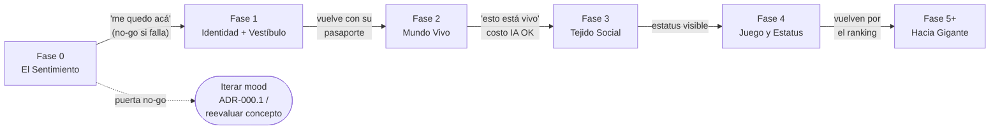

# Roadmap — Visión General de Fases y Sprints — OSIA

> Propósito: Dar la vista de pájaro del roadmap de OSIA: timeline de las 6 fases, índice de TODOS los sprints (id · nombre · fase), los gates "lanzable" y criterios para pasar de fase, y la secuencia recomendada para un dev solo con foco fragmentado. Es el mapa que conecta la visión con los backlogs ejecutables. | Estado: Borrador v1 | Fecha: 2026-06-19 | Parte del paquete de diseño OSIA.

---

## 0. Cómo leer este documento

Este es el **índice del backlog**. No detalla historias ni tareas (eso vive en cada `fase-N-*.md`); detalla **el orden, los gates y el porqué de la secuencia**. La filosofía es la de la constitución:

- **Depth-first:** se construye **una superficie a la vez, en profundidad**, empezando por El Mundo (Fases 0-2). La amplitud del ecosistema (Social, Juegos) **emerge** después, enchufándose al pasaporte y al Vestíbulo ya existentes.
- **Cada fase es LANZABLE sola** y produce un loop de feedback real (alguien la prueba, dice "wow" o no). Si una fase no pasa su gate, no se avanza.
- **Modular desde el día 1, pero barato:** el shell (monorepo + contratos + identidad) se diseña desde Fase 0/1; las apps hermanas se añaden sin tocar lo construido.

Backlogs por fase (detalle ejecutable):

| Fase | Backlog |
|---|---|
| 0 — El Sentimiento | [./fase-0-el-sentimiento.md](./fase-0-el-sentimiento.md) |
| 1 — Identidad + Vestíbulo | [./fase-1-identidad.md](./fase-1-identidad.md) |
| 2 — Mundo Vivo *(IA diferida)* | **Activo:** [./fase-2-atmosfera-viva.md](./fase-2-atmosfera-viva.md) · **Diferido (IA/eventos):** [./fase-2-mundo-vivo.md](./fase-2-mundo-vivo.md) |
| 3 — Tejido Social | [./fase-3-tejido-social.md](./fase-3-tejido-social.md) |
| 4 — Juego y Estatus | [./fase-4-juego-estatus.md](./fase-4-juego-estatus.md) |
| 5+ — Hacia Gigante | [./fase-5-hacia-gigante.md](./fase-5-hacia-gigante.md) |

Docs fundacionales: [visión](../00-vision-alcance.md) · [pilares](../01-pilares-experiencia.md) · [arquitectura](../03-arquitectura-sistema.md) · [decisiones abiertas (ADR-000)](../adr/ADR-000-decisiones-abiertas.md).

> **Estado real del proyecto:** esto es DISEÑO. La carpeta `OSIA/` solo contiene `/brand` y `/docs`. Las duraciones son **estimaciones de diseño** para un dev solo (~20-25 h/semana, foco fragmentado por búsqueda de empleo), no compromisos. El "tiempo de calendario" será mayor que el "tiempo efectivo" por el foco fragmentado.

---

## 1. Las 6 fases de un vistazo

| Fase | Nombre | Pilar(es) que enciende | Pregunta que responde | Gate de salida (resumen) |
|---|---|---|---|---|
| **0** | El Sentimiento | Atmósfera Viva (1), Presencia (2), Escasez (6) | ¿Da ganas de quedarse? | 2 de 3 amigos dicen "me quedo acá" (`F0-DoD-10`). |
| **1** | Identidad + Vestíbulo | (habilita pasaporte para 4/5/6) | ¿Vuelven con su identidad? | Pasaporte SSO + Vestíbulo delgado + entrada a El Mundo como uno mismo. |
| **2** | Mundo Vivo | Habitantes IA (3), Atmósfera completa (1) | ¿El mundo respira con 2 personas? | Hablan con la IA por gusto; el mundo se siente "vivo"; costo IA bajo presupuesto. |
| **3** | Tejido Social | Tejido Social (4) | ¿El estatus se vuelve visible? | Feed + seguidores + presencia + notificaciones, como app independiente. |
| **4** | Juego y Estatus | Estatus y Juego (5) | ¿Compiten y vuelven por el ranking? | Minijuego con ranking global + cosméticos; estatus viaja en el pasaporte. |
| **5+** | Hacia Gigante | Escasez (6) intensificada + sostenibilidad | ¿Se sostiene y crece sin romperse? | Plots, economía que paga servidores, apertura controlada, self-host. |

> El **orden de los pilares** no es casual: primero lo que **se siente** (0), luego lo que te hace **volver** (1-2), luego lo que te hace **competir y presumir** (3-4), y la **escasez** como capa transversal desde el día 1 que se intensifica al final. Ver [../01-pilares-experiencia.md](../01-pilares-experiencia.md) §2.

---

## 2. Timeline

Estimación en **semanas de trabajo efectivo** (no calendario). Las fases son secuenciales en su gate, pero los cimientos de una fase pueden solaparse con el pulido de la anterior.

```mermaid
gantt
    title OSIA — Timeline de fases (semanas de trabajo efectivo, estimación de diseño)
    dateFormat  X
    axisFormat  %s
    section Mundo (insignia, depth-first)
    Fase 0 · El Sentimiento        :f0, 0, 13
    Fase 1 · Identidad + Vestíbulo :f1, 13, 28
    Fase 2 · Mundo Vivo            :f2, 28, 45
    section Superficies hermanas
    Fase 3 · Tejido Social         :f3, 45, 55
    Fase 4 · Juego y Estatus       :f4, 55, 70
    section Escala
    Fase 5+ · Hacia Gigante        :f5, 70, 95
```

| Fase | Sprints | Estimación (trabajo efectivo) | Lanzable como |
|---|---|---|---|
| 0 | 8 (`S0.1`–`S0.8`) | ~12.5 semanas | Demo pública: caminar + voz + atmósfera viva. |
| 1 | 9 (`S1.1`–`S1.9`) | ~12-15 semanas | Producto con cuentas, pasaporte y Vestíbulo. |
| 2 | 9 (`S2.1`–`S2.9`) | ~13-17 semanas | El Mundo que respira (IA + clima + eventos). |
| 3 | 6 (`S3.1`–`S3.6`) | ~9-10 semanas | La Red Social (`apps/social`). |
| 4 | 9 (`S4.1`–`S4.9`) | ~14-17 semanas | Los Juegos (`apps/games`) con ranking + cosméticos. |
| 5+ | 11 (`S5.1`–`S5.11`) | ~18-22 semanas | Plots, economía, apertura, self-host. |

> **Total del paquete:** 52 sprints. No es un compromiso de fecha; es un mapa de profundidad. La regla manda: **cada fase debe pasar su gate antes de la siguiente.**

---

## 3. Índice de TODOS los sprints

Tabla maestra: id · nombre · fase. El id es estable y se referencia desde commits/ramas (ver [../11-glosario-dominio.md](../11-glosario-dominio.md) §4.6-4.7).

### Fase 0 — El Sentimiento

| Sprint | Nombre | Fase |
|---|---|---|
| `OSIA-S0.1` | Cimientos del Monorepo y CI | 0 |
| `OSIA-S0.2` | Primera Luz: escena R3F bella estática | 0 |
| `OSIA-S0.3` | El Cuerpo: avatar + locomoción a pie | 0 |
| `OSIA-S0.4` | El Latido: world-server uWS + tick + rooms | 0 |
| `OSIA-S0.5` | Estar Juntos: sincronización de presencia | 0 |
| `OSIA-S0.6` | Hablar: chat de texto + voz WebRTC P2P | 0 |
| `OSIA-S0.7` | El Cielo Vivo: Motor de Atmósfera v1 | 0 |
| `OSIA-S0.8` | Pulido, Rendimiento y Lanzamiento | 0 |

### Fase 1 — Identidad + Vestíbulo

| Sprint | Nombre | Fase |
|---|---|---|
| `OSIA-S1.1` | Cimientos: monorepo, `packages/shared`, `packages/ui` (tokens + tipografías) | 1 |
| `OSIA-S1.2` | Datos de Identidad: migraciones Supabase + RLS + sync auth | 1 |
| `OSIA-S1.3` | Auth & SSO: `apps/api` (contexto identity) + `packages/identity` | 1 |
| `OSIA-S1.4` | GTM: Landing de lujo + Waitlist + Invitaciones (gate invite-only) | 1 |
| `OSIA-S1.5` | Verificación de email + onboarding (≤3 pasos) + creación de Perfil/Avatar | 1 |
| `OSIA-S1.6` | Pasaporte: Perfil (ver/editar) + Editor de Avatar low-poly + Settings | 1 |
| `OSIA-S1.7` | EL VESTÍBULO delgado: PassportCard + 1 Puerta + ThresholdTransition + deep-link | 1 |
| `OSIA-S1.8` | Handoff a El Mundo: world ticket + identidad en `world-client` (nameplate/avatar) | 1 |
| `OSIA-S1.9` | Hardening, Observabilidad y CI/CD de cierre de fase | 1 |

### Fase 2 — Mundo Vivo

| Sprint | Nombre | Fase |
|---|---|---|
| `OSIA-S2.1` | Cimientos de datos y contratos (schema `ai` + atmósfera persistente + shared) | 2 |
| `OSIA-S2.2` | Motor de atmósfera completo (clima, estaciones, scheduler de eventos) | 2 |
| `OSIA-S2.3` | Difusión de atmósfera y eventos en el mundo (world-server + render R3F) | 2 |
| `OSIA-S2.4` | Habitantes server-authoritative + locomoción ambiental + reacción al clima | 2 |
| `OSIA-S2.5` | Pipeline de diálogo de texto (contexto → Claude streaming → difusión WS) | 2 |
| `OSIA-S2.6` | Voz: Whisper STT (push-to-talk) + TTS espacial + visemas | 2 |
| `OSIA-S2.7` | Memoria (pgvector): corto plazo, largo plazo, resumen y conciencia del mundo | 2 |
| `OSIA-S2.8` | Guardarrailes de costo, moderación, fallback offline y kill-switch | 2 |
| `OSIA-S2.9` | Integración Mundo Vivo, métricas, persistencia/reanudación y pulido de lanzamiento | 2 |

### Fase 3 — Tejido Social

| Sprint | Nombre | Fase |
|---|---|---|
| `OSIA-S3.1` | Cimientos de La Red Social (app, contexto, schema, contratos) | 3 |
| `OSIA-S3.2` | Grafo Social: seguidores y reputación derivada | 3 |
| `OSIA-S3.3` | Feed: publicar, reaccionar, comentar + fan-out-on-write | 3 |
| `OSIA-S3.4` | Presencia social y Notificaciones | 3 |
| `OSIA-S3.5` | Perfil público con estatus + Vestíbulo + Chisme IA | 3 |
| `OSIA-S3.6` | Endurecimiento, tiempo real, observabilidad y lanzamiento | 3 |

### Fase 4 — Juego y Estatus

| Sprint | Nombre | Fase |
|---|---|---|
| `OSIA-S4.1` | Fundaciones de dominio: schemas `game` + `economy`, contratos, `apps/games` y puerta del Vestíbulo | 4 |
| `OSIA-S4.2` | Framework de juego server-authoritative: Game / MatchSession / Score (anti-cheat por contrato) | 4 |
| `OSIA-S4.3` | Minijuego "Cosecha de Meteoros": loop jugable a pie en arena + scoring determinista | 4 |
| `OSIA-S4.4` | Leaderboard global (Redis ZSET) + RankingSnapshot durable + temporadas | 4 |
| `OSIA-S4.5` | Achievements (logros) con rareza `celestial`, otorgamiento y verificación server-side | 4 |
| `OSIA-S4.6` | Economía cosmética v1: Cosmetic / InventoryItem / Transaction / ReputationLedger; ganar y equipar | 4 |
| `OSIA-S4.7` | Vitrina de estatus en el Pasaporte + propagación cross-app del cosmético equipado | 4 |
| `OSIA-S4.8` | Rival de IA conectado al ranking (Haiku chisme / Opus cara a cara) + guardarraíles de costo | 4 |
| `OSIA-S4.9` | Endurecimiento, anti-cheat profundo, observabilidad, balance, pulido y demo de fase | 4 |

### Fase 5+ — Hacia Gigante

| Sprint | Nombre | Fase |
|---|---|---|
| `OSIA-S5.1` | Cimientos de Plots: dominio, claim y persistencia | 5 |
| `OSIA-S5.2` | Editor de Plots y visita por portal | 5 |
| `OSIA-S5.3` | Economía cosmética: moneda, ledger y transacciones | 5 |
| `OSIA-S5.4` | Tienda y cosméticos: catálogo, compra, inventario, equipar | 5 |
| `OSIA-S5.5` | Escasez avanzada: invitaciones, waitlist por oleadas, cuarentena | 5 |
| `OSIA-S5.6` | Apertura controlada más allá de amigos (k-factor, anti-abuso) | 5 |
| `OSIA-S5.7` | Biomas y zonas nuevas + pipeline de assets a escala | 5 |
| `OSIA-S5.8` | Voz a escala: SFU mediasoup + conmutación mesh↔SFU | 5 |
| `OSIA-S5.9` | Migración Supabase → Hetzner self-host (DB/Auth/Storage) | 5 |
| `OSIA-S5.10` | Hardening de producción + observabilidad (Sentry/Prometheus/Grafana) | 5 |
| `OSIA-S5.11` | Backups/DR, runbooks, sostenibilidad de runway y lanzamiento de fase | 5 |

---

## 4. Gates "lanzable" y criterios para pasar de fase

Cada fase tiene un **Definition of Done de fase** (detallado en su backlog) y un **gate humano**: la pregunta cualitativa que decide si se avanza. No se pasa de fase por completar tareas, sino por **pasar el gate**.

| De → a | Gate "lanzable" (resumen) | Criterio cualitativo (North Star de fase) | Fuente |
|---|---|---|---|
| **0 → 1** | Demo pública: 2 personas en la misma instancia se ven, se mueven suave (predicción/reconciliación), se oyen por voz P2P, comparten el mismo atardecer y un evento efímero; 60 fps; sin fuga de VRAM. | **2 de 3 amigos dicen, sin que se les pida, "me quiero quedar acá".** Si falla tras iterar el mood (ADR-000.1), **puerta no-go**: se detiene y se reevalúa el concepto. | `F0-DoD-1..10` |
| **1 → 2** | Cuentas persistentes con email verificado; pasaporte SSO (cookie `.osia.com` + access JWT) que viaja entre apps; perfil + avatar editables y persistentes; Vestíbulo delgado (pasaporte + 1 puerta); entrada a El Mundo "como uno mismo" vía world ticket. | El residente **vuelve mañana y su pasaporte lo recuerda**; cruza el umbral hacia El Mundo como suyo. | `F1-DoD-1..12` |
| **2 → 3** | Atmósfera completa autoritativa (clima/estaciones/eventos); 3-4 Habitantes con persona+memoria (pgvector) que hablan por voz; conciencia del mundo real; guardarrailes de costo activos (tiering, cache, presupuesto, kill-switch). | Dos amigos: les llueve, un Habitante comenta la tormenta con su voz, y uno dice **"esto está vivo"**. Costo IA/sesión bajo presupuesto. | `F2-DoD-1..10` |
| **3 → 4** | La Red Social como app independiente (`apps/social`): feed (fan-out-on-write), seguidores/reputación, presencia social, notificaciones; segunda puerta en el Vestíbulo; el feed se alimenta también de mundo+IA. | El estatus **se vuelve visible y deseado**; una notificación trae de vuelta al jugador. | DoD de Fase 3 |
| **4 → 5+** | Los Juegos como app independiente (`apps/games`): minijuego con ranking global (Redis ZSET + RankingSnapshot), logros, cosméticos; el estatus/cosmético **viaja en el pasaporte** a El Mundo y La Red Social; anti-cheat server-authoritative. | **Compiten y vuelven por el ranking**; el prestigio se luce en todo el ecosistema. | DoD de Fase 4 |
| **5+ → escala** | Plots persistentes + economía cosmética que **paga los servidores**; apertura controlada (k-factor, anti-abuso); voz SFU para grupos grandes; migración a self-host con rollback probado; observabilidad y DR. | El **boca a boca y la economía se sostienen**; la infra aguanta sin romper el runway. | DoD de Fase 5 |

> **Guardarraíl transversal (todas las fases):** **costo de IA por sesión** y **bytes/tick de red** dentro de presupuesto. Una métrica de éxito que quiebra el runway no es éxito. Ver [../09-seguridad-infra-costos.md](../09-seguridad-infra-costos.md) y [../08-estrategia-rendimiento.md](../08-estrategia-rendimiento.md).

---

## 5. Secuencia recomendada para un dev solo

El roadmap está **ordenado por dependencias técnicas y por entregar "algo que se ve" lo antes posible**. Reglas de ejecución para Carlos (foco fragmentado, ~250 USD, runway ~2 meses de servidores):

1. **Una fase a la vez, en profundidad.** No empezar Social (3) antes de cerrar el gate de Mundo Vivo (2). La amplitud emerge; no se construye de golpe.
2. **Dentro de una fase, respetar el orden de sprints** (las dependencias están en cada backlog). En Fase 0: cimientos → render → cuerpo → servidor → presencia → voz → atmósfera → lanzamiento. El sprint **`OSIA-S0.7` (atmósfera) es el que decide el go/no-go**: dale tiempo desproporcionado.
3. **Cada sprint deja "algo que se ve".** Si el foco se fragmenta (entrevistas, empleo), cada sprint cerrado es un loop de feedback completo, no trabajo a medias.
4. **Confirmar ADR-000 antes/durante Fase 0-1.** Las decisiones de mood (1), recorrido (2) y avatares (3) se ejecutan en Fase 0; la del Vestíbulo (4) en Fase 1. El diseño avanza con los *defaults* recomendados; confirmar evita re-trabajo. Ver [../adr/ADR-000-decisiones-abiertas.md](../adr/ADR-000-decisiones-abiertas.md).
5. **Comunidad en paralelo, no después.** El GTM comunidad-primero (landing + waitlist + Discord + "el ojo de OSIA") arranca con Fase 1 (`OSIA-S1.4`) y se alimenta del contenido de atmósfera que ya produce Fase 0. No esperar a tener todo para empezar a generar deseo.
6. **No sobre-optimizar ni sobre-construir.** El anti-alcance de cada fase es ley (terreno malla única en F0, sin SFU hasta F5, sin economía agresiva hasta F5). Cada "NO" es runway recuperado.
7. **Costo bajo control siempre.** IA apagada hasta Fase 2; voz P2P (≈0$); free tiers hasta que duela; solo Hetzner sangra dinero. Los guardarrailes de IA son la sección más estricta porque "un bug puede quemar el runway en una tarde".

### Solapamientos seguros (si hay momentum)

| Se puede adelantar | Mientras se cierra | Por qué es seguro |
|---|---|---|
| `OSIA-S0.4` (world-server) | `OSIA-S0.7` (atmósfera) | Dependen ambos de S0.5 para integrarse, pero su construcción es paralela. |
| Pulido de una fase | Cimientos de la siguiente (`SX.1`) | Los `SX.1` son scaffolding/datos que no requieren el gate anterior cerrado. |
| GTM/comunidad (Discord, contenido) | Cualquier fase de El Mundo | El material de marketing es subproducto de la atmósfera. |

> **No solapar gates.** Construir en paralelo está bien; **declarar una fase "hecha" sin pasar su gate, no.** El gate es el único juez.

---

## 6. Próximos pasos inmediatos

1. **Confirmar ADR-000** (las 4 decisiones abiertas) — o aceptar explícitamente los defaults recomendados.
2. **Arrancar `OSIA-S0.1`** (Cimientos del Monorepo y CI): `pnpm + Turborepo`, estructura bloqueada, CI verde en `main`. Ver [./fase-0-el-sentimiento.md](./fase-0-el-sentimiento.md).
3. **Mantener este roadmap vivo:** cuando un sprint cierra, marcarlo; cuando un gate se pasa, registrarlo (bitácora/ADR). La coherencia del paquete depende de que el mapa refleje el territorio.

> El roadmap es depth-first por una razón: **lo enorme siempre empieza diminuto y perfecto.** Una superficie profunda y bella a la vez, no cinco a medias. Ver [../00-vision-alcance.md](../00-vision-alcance.md) §12.
